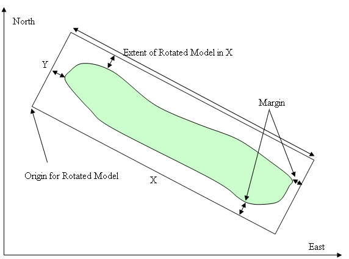

# ORIGIN Process

To access this process:

  * Model ribbon **> > Reposition >> Origin**.

  * Enter "ORIGIN" into the [Command Line](<../COMMON/Command_Toolbar.md>) and press <ENTER>.
  * Display the **[Find Command](<../COMMON/findcommand.md>)** screen, locate **ORIGIN** and click **Run**.

See this process in the [Command Table](<../command_help/COMMAND%20TABLE_O.md#ORIGIN>).

## Process Overview

**Note** : This is a _superprocess_ and running it may have an effect on other Datamine files in the project.

This process calculates the origin and extent of a rotated model. An optional rotated model prototype file may be created as well as a solid wireframe describing the model limits.

The Rotated Model option allows a block model to be defined, which is not orthogonal to the coordinate axes. The method is described in detail in the Rotated Model User Guide. The orientation of a rotated model is specified by the @**ANGLEn** and @**ROTAXISn** parameters, which are selected to coincide with the geological or structural controls of the orebody. These parameters allow three consecutive rotations around any of the coordinate axes, and are the same as those used in the [CDTRAN](<cdtran.md>) process.

;>)

Figure 1: Rotated Model & World Coordinate System.

If the rotated coordinate system can be defined by a single rotation from the world coordinate system, then calculating a suitable origin is relatively straightforward as illustrated in Figure 1. This shows the plan projection of a vertically dipping tabular orebody enclosed by a rectangular outline representing the limits of the rotated model. The origin of the model is the bottom left hand corner, as illustrated. However if two or three rotations are required to align the rotated axes to the orebody, then it is far more difficult to manually calculate the origin and the extent of the model, measured along the rotated axes.

In order to calculate the origin and extent of the rotated model prototype, the process requires a set of X,Y,Z data covering the area to be modeled. If a wireframe of the orebody has been created then the wireframe points file provides a suitable input. Alternatively a set of strings from a sectional interpretation could be used.

Using a wireframe points file or sectional strings would be suitable if the model were required to simply enclose the orebody. If the model is also required to enclose an open pit or underground mine design then a larger model would be required. In this case it would be necessary to provide a set of either points or strings representing the approximate limits of the design.

The optional MARGIN parameter describes the margin around the limits of the data as illustrated in Figure 1. The same MARGIN value is used in each of the three rotated directions. It is recommended that the margin is set to be greater than zero.

The process always calculates and displays the origin and extent of the rotated model. The extent of the rotated model in the X direction is illustrated in Figure 1. In the rotated model prototype the values of XINC (parent cell size) and NX (number of cells in X) must be set such that XINC x NX >= model extent in X; and similarly for Y and Z.

If an OUT file is specified and parameters XINC, YINC, ZINC are defined, then the process will create a rotated model prototype. In the prototype data definition the origin of the rotated system is set to 0, 0, 0, which is suitable for most circumstances.

The optional wireframe file is created around the limits of the prototype model. The purpose of it is simply to provide a visual aid to show the volume within which the actual rotated block model will be created. It is advisable to check the location of the model in this way before proceeding with creating the block model.

## Input Files

Name |  Description |  I/O Status |  Required |  Type  
---|---|---|---|---  
IN |  Input file of data covering the volume to be modelled. The data may be a wireframe points file, a string file or any file with X, Y and Z fields covering the model volume. |  Input |  Yes |  Undefined  
  
## Output Files

Name |  I/O Status |  Required |  Type |  Description  
---|---|---|---|---  
OUT |  Output |  No |  Block Model Prototype File |  Optional output rotated model prototype file.  
WIRETR |  Output |  No |  Wireframe Triangle File |  Optional output wireframe triangle file. The wireframe will be created to enclose the limits of the rotated model.  
WIREPT |  Output |  No |  Wireframe Points File. |  Optional output wireframe points file. The wireframe will be created to enclose the limits of the rotated model.  
  
## Fields

Name |  Description |  Source |  Required |  Type |  Default  
---|---|---|---|---|---  
X |  X coordinate field in IN file. |  IN |  Yes |  Numeric |  XP  
Y |  Y coordinate field in IN file. |  IN |  Yes |  Numeric |  YP  
Z |  Z coordinate field in IN file. |  IN |  Yes |  Numeric |  ZP  
  
## Parameters

Name |  Description |  Required |  Default |  Range |  Values  
---|---|---|---|---|---  
ANGLE1 |  First rotation angle clockwise in degrees, around axis ROTAXIS1 . It must lie between -360.0 and +360.0. A value of zero indicates no rotation. |  Yes |  0 |  -360,360 |  Undefined  
ANGLE2 |  Second rotation angle clockwise in degrees, around axis ROTAXIS2 . It must lie between 360.0 and +360.0. A value of zero indicates no rotation. |  No |  0 |  -360,360 |  Undefined  
ANGLE3 |  Third rotation angle clockwise in degrees, around axis ROTAXIS3 . It must lie between -360.0 and +360.0. A value of zero indicates no rotation. |  No |  0 |  -360,360 |  Undefined  
ROTAXIS1 |  Axis around which first rotation angle will occur. 0 for no rotation, 1 for X axis, 2 for Y axis, 3 for Z axis. |  No |  3 |  0,3 |  0,1,2,3  
ROTAXIS2 |  Axis around which second rotation angle will occur. 0 for no rotation, 1 for X axis, 2 for Y axis, 3 for Z axis. |  No |  1 |  0,3 |  0,1,2,3  
ROTAXIS3 |  Axis around which third rotation angle will occur. 0 for no rotation, 1 for X axis, 2 for Y axis, 3 for Z axis. |  No |  3 |  0,3 |  0,1,2,3  
MARGIN |  The margin, in units used in the IN file, to be created around the data volume described by the IN file |  No |  10 |  Undefined |  Undefined  
XINC |  Parent cell size in X to be created in the output prototype model. This is only required if an OUT file has been specified. |  No |  10 |  Undefined |  Undefined  
YINC |  Parent cell size in Y to be created in the output prototype model. This is only required if an OUT file has been specified. |  No |  10 |  Undefined |  Undefined  
ZINC |  Parent cell size in Z to be created in the output prototype model. This is only required if an OUT file has been specified. |  No |  10 |  0.000001,9999999 |  Undefined  
PRINT |  Print flag: =0 for minimum output. =1 for runtime information messages. |  No |  0 |  0,1 |  0,1  
  
## Example
    
    
    Further examples are given in the Rotated Models User Guide.  
  
---  
      
    
    !ORIGIN &IN(OREPT), &OUT(PROTOM1), &WIRETR(WTR1),   
      
    
    &WIREPT(WPT1), *X(XP), *Y(YP), *Z(ZP), @ANGLE1=30.0,   
      
    
    @ANGLE2= 40.0, @ANGLE3=0.0, @ROTAXIS1=3.0,   
      
    
    @ROTAXIS2=1.0, @ROTAXIS3=3.0, @XINC=10.0, @YINC=12.0,   
      
    
    @ZINC=15.0, @MARGIN=10.0, @PRINT=0.0  
  
## Error and Warning Messages

Message |  Description  
---|---  
ERROR: You have specified fields XX, YY, ZZ for file DATA. One or more of these fields does not exist. |  File DATA has been specified as the &IN file, but one or more of the fields XX, YY, ZZ does not exist in this file. Use the *X, *Y, *Z fields to specify the correct fields in the &IN file.  
ERROR: ANGLEn is specified as aaaa.aa.It must lie between -360 and +360. |  All rotation angles must lie between -360o and +360o  
ERROR: Rotation axis N has been specified as aaaaaa. Only values 0, 1, 2 or 3 are permitted. |  Rotation axes must be either 0 (no rotation), 1 (X), 2 (Y) or 3 (Z).  
ERROR: MARGIN has been specified as -aaaaaaa.It must be greater than or equal to zero. |  A negative MARGIN has been specified. It must be zero or positive.  
ERROR: OUT file fffffff has been specified, but parameter X[YZ]INCis missing or is less than zero. |  If an &OUT file is specified then the XINC, YINC and ZINC fields must also be specified and be greater than zero.  
ERROR in Process ORIGIN An error has occurred. >>> PRESS <RETURN> TO CONTINUE (OR ! TO TERMINATE) > |  An unidentifiable error has been encountered. Please contact your local Datamine office.  
  
Related topics and activities

  * [PROTOM Process](<protom.md>)