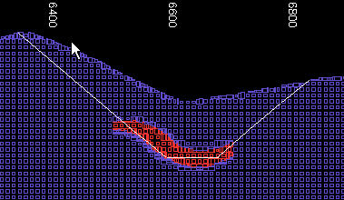
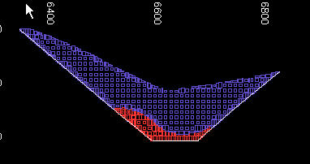
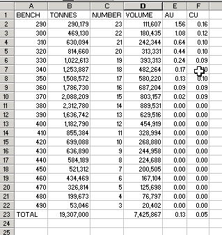

# PITMOD Process

To access this process:

  * **Report** ribbon **> > Report >> Pit Reserves**.

  * Enter "PITMOD" into the [Command Line](<../COMMON/Command_Toolbar.md>) and press ENTER.
  * Display the **[Find Command](<../COMMON/findcommand.md>)** screen, locate **PITMOD** and click **Run**.

See this process in the [Command Table](<../command_help/COMMAND%20TABLE_P.md#PITMOD>).

## Process Overview

**Note** : This is a _superprocess_ and running it may have an effect on other Datamine files in the project.

Create an in-pit model and evaluate the pit design.

An input DTM wireframe must be supplied, which represents the bottom surface of the ultimate pit design. An input geological block model must also be supplied. 

The results are automatically broken down by bench, taken from the block model cell height. An overall total evaluation is also determined and optionally the results can be reported by **KEY** field. The **BENCH** number reported refers to the 'base' of each bench.

Subcell splitting is controlled by the parameters @**XSUBCELL** , @**YSUBCELL** and @**RESOL**. At least one numeric grade field must be defined. No absent grade data is allowed. Blocks with absent grade data do not get processed.

  * The wireframe of the pit should be within the area of the block model prototype for the process to work correctly.

  * @**ZORIG** and @**BHEIGHT** parameters to be used to optionally define an alternative origin and bench height.

  * The advantage of using **PITMOD** over [SELWF](<selwf.md>) to select the blocks within a pit wireframe, is that the output model will have cell splitting where it meets the pit wireframe.

  * Absent grades are not allowed. If a grade is absent the default value is used. If the default value is absent zero is used.

  * The output results file contains the fields **TOP_B** , **BOTTOM_B** , **MID_B** which contain the elevations of the top, bottom and middle of each evaluated bench respectively.

## Input Files

Name |  Description |  I/O Status |  Required |  Type  
---|---|---|---|---  
WIRETR |  Triangle file of update wireframe surface (DTM). |  Input |  Yes |  Wireframe triangle  
WIREPT |  Point file of pit wireframe triangulated surface. |  Input |  Yes |   
MODELIN |  Block model for evaluation above wireframe. |  Input |  Yes |  Block model  
  
## Output Files

Name |  I/O Status |  Required |  Type |  Description  
---|---|---|---|---  
MODELOU |  Output |  No |  Block model |  Block model portion inside pit.  
RESULTS |  Output |  Yes |  Undefined |  Evaluation results data, by bench.  
  
## Fields

Name |  Description |  Source |  Required |  Type |  Default  
---|---|---|---|---|---  
F1 |  Numeric grade field 1. |  MODELIN |  Yes |  Any |  Undefined  
F2 |  Numeric grade field 2. |  MODELIN |  No |  Any |  Undefined  
F3 |  Numeric grade field 3. |  MODELIN |  No |  Any |  Undefined  
F4 |  Numeric grade field 4. |  MODELIN |  No |  Any |  Undefined  
F5 |  Numeric grade field 5. |  MODELIN |  No |  Any |  Undefined  
KEY |  Key field - numeric. |  MODELIN |  No |  Any |  Undefined  
DENSITY |  Density field. |  MODELIN |  No |  Any |  DENSITY  
  
## Parameters

Name |  Description |  Required |  Default |  Range |  Values  
---|---|---|---|---|---  
DENSITY |  Default DENSITY value. |  Yes |  1 |  0,9999 |   
XSUBCELL |  Cell division in X direction (1). Max 20. |  No |  1 |  1,20 |   
YSUBCELL |  Cell division in Y direction (1). Max 20. |  No |  1 |  1,20 |   
RESOL |  Defines boundary resolution in direction perpendicular to plane of filling. =(0) - precise boundary location. = N - boundary rounded to nearest 1/Nth of parent cell size. |  No |  0 |  Undefined |  Undefined  
ZORIG |  Specify an alternative bench origin. |  No |  0 |  Undefined |  Undefined  
BHEIGHT |  Specify an alternative bench height. |  No |  0 |  Undefined |  Undefined  
CHECKROT |  Set to 1 to automatically detect and correctly process rotated models. Using this parameter means that the input wireframe points file no longer needs to be transformed into the model space before using this process. |  No |  0 |  0, 1 |  Undefined  
  
## Example
    
    
    !PITMOD &WIRETR(pittr), &WIREPT(pitpt), &MODELIN(model),   
  
---  
      
    
    &MODELOU(pitmod), &RESULTS(pitres), *F1(AU), @DENSITY=2.6,   
      
    
    @XSUBCELL=3.0, @YSUBCELL=3.0, @RESOL=0.0  
  
Input: | ;>) | 

  * Pit wireframe
  * Resource model

  
---|---|---  
Output: | ;>) | 

  * Block model within pit

  
| ;>) | 

  * Bench-by-bench evaluation results output as Datamine format and as .csv files

  
  
## Error and Warning Messages

Message |  Description  
---|---  
>>> ERROR: Read error from file ffffffff |  Read error from file specified as &IN. Fatal; the process is exited.  
>>> ERROR: field aaaaaaaa is too long |  Fatal; the process is exited.  
>>> WARNING: Cannot append to file ffffffff. A new file will be created |  Cannot append fieldnames to the file specified as &OUT. Check the file name given. A new &OUT file will be created.  
>>> ERROR: Files have different DDs, cannot append |  File specified in pattern matching expression and the file specified as &OUT have different DDs. Fatal; the process is exited.  
>>> ERROR: Unexpected execution error |  Fatal; the process is exited.  
>>> ERROR: Illegal instruction found |  Fatal; the process is exited.  
>>> SYNTAX ERROR AT " " |  Syntax of pattern matching expression is incorrect. Fatal; the process is exited.  
>>> ERROR: Incompatible types for " " and " " |  Field types are incompatible in relational expression. Fatal; the process is exited.  
>>> ERROR: " " MATCHES ... |  Alphanumeric field required Alphanumeric field required for pattern matching expression. Fatal; the process is exited.  
>>> ERROR: Illegal pattern: |  Illegal pattern in pattern matching expression. Fatal; the process is exited.  
>>> ERROR: More than nnnnn instructions |  Maximum number of expressions is 100. Fatal; the process is exited.  
  
Related topics and activities

  * [SELWF Process](<selwf.md>)