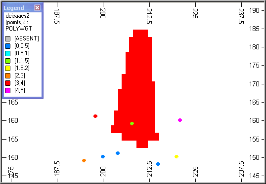
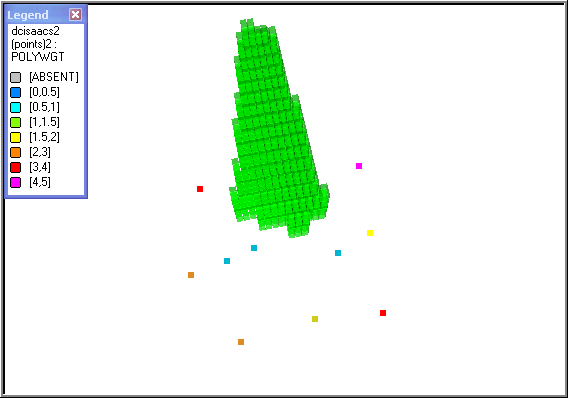
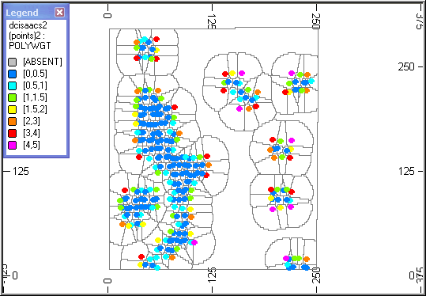
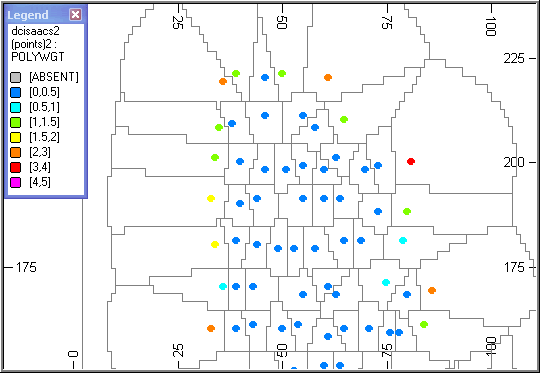

# POLYDC Process  
  
To access this process:

  * **Sample Analysis** ribbon **> > Decluster >> Polygonal**.

  * Enter "POLYDC" into the [Command Line](<../COMMON/Command_Toolbar.md>) and press ENTER.
  * Display the **[Find Command](<../COMMON/findcommand.md>)** screen, locate **POLYDC** and click **Run**.

See this process in the [Command Table](<../command_help/COMMAND%20TABLE_P.md#POLYDC>).

## Process Overview

**Note** : This is a _superprocess_ and running it may have an effect on other Datamine files in the project.

The POLYDC process calculates a set of declustered weights for a set of sample data using the polyhedra method. 

Note: This is the 3D equivalent of 2D polygonal declustering as described on page 247 of "An Introduction to Applied Geostatistics" by Isaaks and Srivastava (ISBN 0-19-505012-6).

It is common practice to take more samples in high grade areas in order to improve the level of confidence in the estimation. However when data are not on a regular grid then using the full data set with equal weights for all samples will give a biased estimate of the mean, variance and histogram. Also clustered data can affect an indicator variogram - for further details refer to "Non-parametric estimation of spatial distributions" by A.Journel published in Mathematical Geology, volume 15, number 3, 1983.

Studio includes an alternative declustering process [DECLUST](<declust.md>) which superimposes a 3D grid over the sample data and assigns weights dependent on the number of samples in each grid rectangle. However the weights calculated by POLYDC are more representative as individual weights are calculated for each sample rather than grouping samples within rectangular blocks and applying an average for the block. 

The main features of the POLYDC process are:

  * The input data file may be any file that includes X, Y and Z coordinates.
  * Individual declustered weights are assigned to each sample using the polyhedra method.
  * Structural anisotropy can be applied to define the volume of influence using a standard [search volume parameter file](<../STUDIO_RM/Grade%20Estimation%20Search%20Volume%20Parameter%20File.md>).

  * A solid (closed) wireframe model can be used to restrict the influence of each sample.
  * If the wireframe includes a zone field then declustered weights can be created independently for each zone.
  * If the input sample file is desurveyed data then the declustered weight can take account of the sample length.
  * The output sample file includes the declustered weight for each sample.
  * The unweighted and weighted mean grade are reported.
  * An optional output block model file may be created with each cell including an identifier of the nearest sample.
  * An optional output wireframe model may be created with individual wireframes showing the influence of each sample.

### Method

A regular grid of points with spacing defined by parameters XINC, YINC, ZINC is superimposed over the sample data and each grid point is assigned the identifier of the nearest sample. The number of grid points for each sample are then counted and the declustered weight is proportional to this total. The regular grid is in fact a 3D block model and the nearest sample is calculated using the Nearest Neighbour method. 

The main steps are:

  * A sample identifier (_**SAMPNUM**) is assigned to each sample in the sample IN file.

  * If the input sample file is a desurveyed file and parameter **COMPLENG** is defined then each sample is composited over interval **COMPLENG**. 

  * A block model prototype is defined to enclose the volume covered by the samples.

  * If an input wireframe is specified then model cells will be created within the wireframe; otherwise they will be created if a samples lies within the search volume.

  * The [ESTIMA](<estima.md>) process is used to assign each cell the identifier (_**SAMPNUM**) of the nearest sample using the Nearest Neighbour method.

  * The declustered weight is calculated from the number of cells for each value of _**SAMPNUM**.

  * The unweighted and weighted mean grade oare calculated for the **WTFIELD**.

### The Sample File

If the sample IN file is a standard desurveyed file containing fields **BHID, FROM, TO, LENGTH, X, Y, Z, A0, B0,** and the **COMPLENG** parameter has been defined then each sample is composited over the length **COMPLENG** using the [COMPDH](<compdh.md>) process with parameter **MODE** =1. This means that the total sample length is divided into an equal number of composites, while keeping the actual composite length as close as possible to **COMPLENG**. If the sample **IN** file does not include the standard desurveyed fields or **COMPLENG** is undefined then the sample will be considered as a point sample.

### Search Volume

The search volume to be used for selecting the nearest sample is defined in one of two ways:

  * parameter **RADIUS** defines a spherical search volume
  * an anisotropic search volume can be defined by specifying an input [search volume parameter file](<../STUDIO_RM/Grade%20Estimation%20Search%20Volume%20Parameter%20File.md>), **SRCPARM** , and parameter **SREFNUM**. 

If both are defined then values from the parameter file take precedence.

If a search volume parameter file is defined but the **SREFNUM** parameter is not defined then the first search volume in the file is used.

The second and third dynamic search volumes will be ignored. Only the first search volume is used.

### Creating the 3D Grid

The 3D grid is defined using a block model prototype where the cell size is defined by parameters **XINC, YINC, ZINC**. 

Although these parameters are optional it is strongly recommended that they are defined based on the sample spacing and the total volume covered by the samples. The smaller the cell size the longer the compute time, so appropriate values should be selected. If in doubt try and keep the number of cells less than 10 million. Parameter **MAXGRDPT** defines the maximum number of grid points (ie cells) to be created, in millions. It can take values up to 100 (100,000,000 points) but the default is set at 10 (10,000,000 points). If the number of points is calculated as being more than the maximum then the process terminates and the user is requested to increase the value of **MAXGRDPT**.

If the number of cells is less than 16,000,000 then parent cells of size `XINC*YINC*ZINC` will be created; otherwise subcells of size `XINC*YINC*ZINC` will be created to ensure the maximum IJK value is below 16,000,000 for both the single and extended precision versions. 

If an input wireframe is specified then regular model cells will be created within the wireframe. If a wireframe is not specified then the prototype model will include a margin around the outside that allows the influence of a sample to be extrapolated to the maximum distance defined by the search volume. Whichever method is used the cells or subcells will all be the same size, `XINC*YINC*ZINC`.

### Declustered Weights

The declustered weight is calculated by counting the number of subcells for each value of _SAMPNUM and adjusting it so that the sum of the weights is equal to the total number of samples. The ouput file OUT will includes all the fields from the input sample file IN plus the declustered weight field POLYWGT.

If the samples are regularly spaced then every sample will have a weight of 1. Clustered samples will have weights less than 1, and isolated samples weights greater than 1. Both the unweighted and weighted means of the DCFIELD values are reported in the **Command** window.

Processes that have an option to use declustered weights include:

  * [STATS](<stats.md>) \- weighted statistics
  * [CHART](<chart.md>) \- calculation and display of weighted histograms
  * [QUANTILE](<quantile.md>) \- weighted quantile analysis
  * [PPQQPLOT](<ppqqplot.md>) \- creation and display of weighted PP and QQ plots

### The ZONE Field

If a **ZONE** field is specified and it exists in the input wireframe triangle file, WIRETR, then declustered weights will be calculated independently for each zone. If the input sample file IN includes the ZONE field then it will be used to define which samples are associated with each wireframe; otherwise a zone field will be assigned by selecting samples the lie within each wireframe using the [SELWF](<selwf.md>) process.

### Sample Identifier

A numeric sample identifier,field _SAMPNUM, is assigned to all samples in the IN file. The first sample has the value 1 and subsequent values increment by 1. If an output model file, MODEL, is selected then the _SAMPNUM field is included in both the MODEL file and the sample OUT file. These two files can then be loaded into the graphics windows are the _SAMPNUM field formatted to show the influence of each sample.

### Output Wireframe

The optional output wireframe model (POLYTR, POLYPT) is created using the [BLKTRI](<estima.md>) process which forms a solid wireframe around the blocks for each value of _SAMPNUM. This can add very considerably to the processing time and should only be selected if there are less than a few hundred samples in the input sample IN file. It is not required for calculating the weights and its only purpose is to illustrate the influence of the each sample. If there are more than a few hundred samples it is best to select a small subset of the output model, MODEL, and run [BLKTRI](<estima.md>) interactively.

## Input Files

Name |  I/O Status |  Required |  Type |  Description  
---|---|---|---|---  
IN |  Input |  Yes |  Undefined |  Input sample data file. This must contain a set of 3D coordinates (eg X,Y,Z) and at least one other field.  
SRCPARM |  Input |  No |  Undefined |  Search volume parameter file. The 2nd and 3rd dynamic search volumes are not used.  
WIRETR |  Input |  No |  Wireframe Triangle |  Input wireframe triangle file.  
WIREPT |  Input |  No |  Wireframe Points |  Input wireframe points file.  
  
### Output Files

Name |  I/O Status |  Required |  Type |  Description  
---|---|---|---|---  
OUT |  Output |  Yes |  Undefined |  Output file containing declustered weights. This will be a copy of the IN file, but will also include the field **DCWEIGHT**.  
MODEL |  Output |  No |  Undefined |  Output model file containing sample identifier for each grid point.  
POLYTR |  Output |  No |  Wireframe Triangle |  Output wireframe triangle file describing polyhedra.  Warning: Using this option can increase processing time. Do not use if more than a few hundred samples in the IN file.  
POLYPT |  Output |  No |  Wireframe Points |  Output wireframe points file describing polyhedra.  Warning: Using this option can increase processing time. Do not use if more than a few hundred samples in the IN file.  
  
### Fields

Name |  Description |  Source |  Required |  Type |  Default  
---|---|---|---|---|---  
X |  X coordinate of sample data. |  IN |  Yes |  Numeric |  X  
Y |  Y coordinate of sample data. |  IN |  Yes |  Numeric |  Y  
Z |  Z coordinate of sample data. |  IN |  Yes |  Numeric |  Z  
WTFIELD |  Field to be used for calculating declustered weights. This ensures that records containing absent data values for that field will be ignored. If a WTFIELD field is not specified then the Z field is used. |  IN |  No |  Numeric |  Undefined  
ZONE |  Field in wireframe triangle file identifying different zones. If selected then a set of weights will be calculated for each zone. |  WIRETR |  No |  Undefined |  Undefined  
  
## Parameters

Name |  Description |  Required |  Default |  Range |  Values  
---|---|---|---|---|---  
COMPLENG |  Composite length for discretising samples. |  No |  0 |  0,+ |  Undefined  
XINC |  Grid increment size in X. If not specified a default is calculated with XINC, YINC, ZINC being equal. |  No |  Undefined |  0.0001,+ |  Undefined  
YINC |  Grid increment size in Y. If not specified a default is calculated with XINC, YINC, ZINC being equal. |  No |  Undefined |  0.0001,+ |  Undefined  
ZINC |  Grid increment size in Z. If not specified a default is calculated with XINC, YINC, ZINC being equal. |  No |  Undefined |  0.0001,+ |  Undefined  
SREFNUM |  Search volume reference number. Only used if a search volume file has been selected. |  No |  Undefined |  Undefined |  Undefined  
RADIUS |  Search radius for calculating weights. Only used if a search volume file has not been selected. |  No |  100 |  0.0001,+ |  Undefined  
MAXGRDPT |  Maximum number of grid points (* 1,000,000). The process will terminate if more than the maximum will be created. |  No |  10 |  1,100 |  Undefined  
  
## Example
    
    
    !POLYDC &IN(ISAACS), &OUT(DECLUST2), *X(X),   
  
---  
      
    
     *Y(Y), *Z(Z), *WTFIELD(U),&WIRETR(WTR1),   
      
    
     &WIREPT(WPT1), &MODEL(MOD2),&POLYTR(POLYTR1),  
      
    
     &POLYPT(POLYPT1),@XINC=1,@YINC=2,@ZINC=2,@RADIUS=25   
  
### Example Images

#### Slice Through a Block Model

;>)

The block model has been filtered on _**SAMPNUM** so that only blocks corresponding to a single sample are displayed. The red blocks describe the volume of influence of the single sample (green) located inside the blocks. The samples are coloured according to the value of POLYWGT as shown in the legend.

#### Volume of Influence

;>)

This is similar to the initial example, except that the volume of influence and the samples are displayed in the 3D window.

#### A Slice Through the Output Wireframe

;>)

;>)

The output wireframe (**POLYTR1** , **POLYPT1**) has been sliced in plan, showing the limits of the influence of each sample. In many places the boundary is an arc with a radius of 25m corresponding to the radius of the search volume. The lower image is a magnified section.