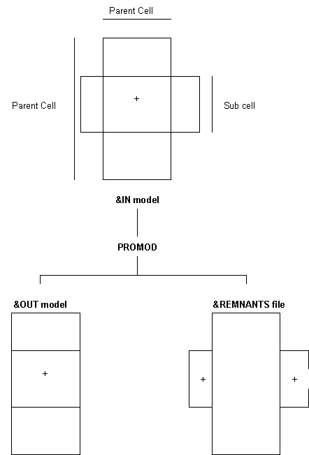
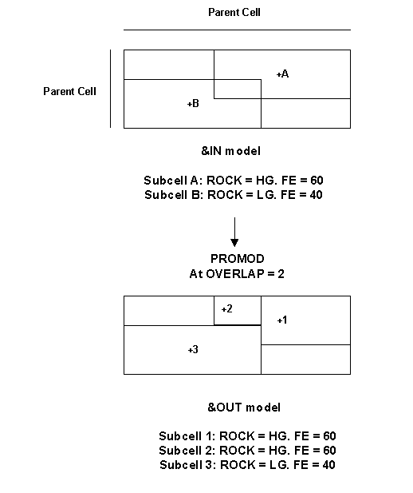
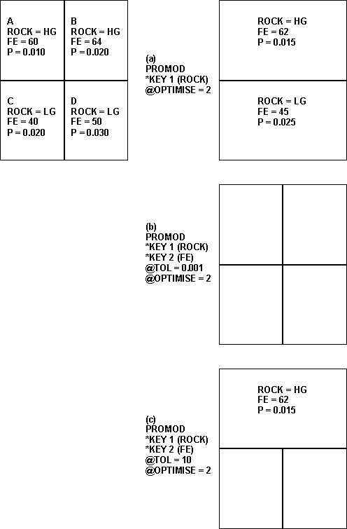
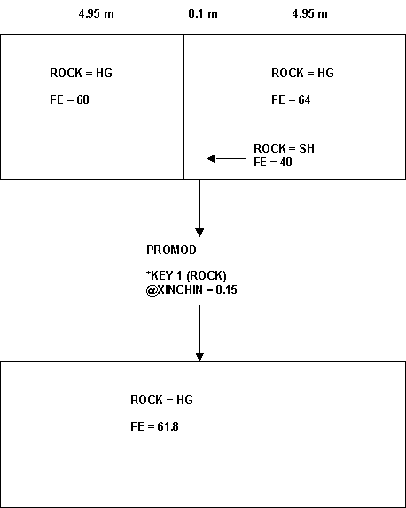

# PROMOD Process  
  
To access this process:

  * **Model** ribbon **> > Manipulate >> Optimize**.

  * Enter "PROMOD" into the [Command Line](<../COMMON/Command_Toolbar.md>) and press <ENTER>.
  * View the **[Find Command](<../COMMON/findcommand.md>)** screen, select **PROMOD** and click **Run**.

See this process in the [[Command Table](<../command_help/COMMAND%20TABLE_P.md#PROMOD>)](<../command_help/COMMAND%20TABLE_E.md#EXPNDMOD>).

## Process Overview

Optimize a block model so that the minimum number of subcells is used, without losing accuracy.

The optimization is achieved by combining adjacent subcells within the same cell. The user controls this operation by defining fields that must be the same (or within a specified tolerance) before two subcells may be combined.

**PROMOD** also checks the input block model for "errors". These "errors" include a subcell extending outside the co-ordinate limits of its cell and two subcells overlapping each other.

The process requires a block model file as input. It produces the optimized block model and optionally a remnants file.

### Methodology

The overall logic flow for the PROMOD process is as follows:

1\. Check subcell for extension outside its cell co-ordinate limits (see below).  
2\. Check whether any two subcells in a cell overlap each other (see below).  
3\. Optimize the subcells within a cell (see below).

### Extension of Subcell Outside its Cell

In a Datamine block model it is invalid to have a subcell extending outside its cell. However, this error may occur where a model has been altered "manually" (e.g. using [EXTRA](<extra.md>)). **PROMOD** handles such errors in the manner detailed below.

Every subcell has its X co-ordinate minimum and maximum calculated. If either of these limits is found to exceed that of the cell, the subcell is truncated to the cell edge (see Figure 1). The portion(s) of the original subcell outside the cell will be written to the optional &**REMNANTS** file.

This process is then repeated for the Y and the Z co-ordinates. Thus if the original subcell exceeded the cell in all six directions, six records will be output to the &REMNANTS file.

A single warning message is given if one or more subcells extend outside their cells. Details of every occurrence of a subcell extending outside its cell may be listed by setting @PRINT=3.

### Overlapping subcells

In a Datamine block model it is invalid to have any two subcells overlapping each other. However, this error may occur where a model has been altered "manually" (e.g. using [EXTRA](<extra.md>)). **PROMOD** handles such errors in the manner described below, dependent on the @**OVERLAP** parameter.

Details of every overlap of subcells may be obtained by setting @**PRINT** =1 and @**OVERLAP** = 1 or 2

#### @OVERLAP=0

If **PROMOD** encounters any two subcells t in any one or more of X, Y and Z, it will stop processing. Note that the first overlap will terminate **PROMOD** ; there may be others in the &IN model.

#### @OVERLAP=1

Any overlap of subcells encountered in the &**IN** model will be ignored. The subcells will be unaltered and will be processed by the rest of **PROMOD** and written to the &**OUT** model. Thus the output model will still contain these errors and will, for instance, give misleading volumes, tones and grades.

#### @OVERLAP=2

Any overlapping subcells will be resolved by splitting into more subcells as appropriate (see Figure 2). This is the same logic used by the [ADDMOD](<addmod.md>) process when combining two overlapping subcells from two separate models. Where the two overlapping subcells in **PROMOD** have a different value for the same field, the one which occurs second in the &IN model file takes precedence.

### Optimization

Within any cell, **PROMOD** may "optimize" the use of subcells so that the number is minimized without loss of geometrical or numerical accuracy. The degree of optimization that **PROMOD** performs is defined by the @**OPTIMISE** parameter. To obtain a list of subcell combinations performed set @**PRINT** =2.

#### @OPTIMISE=2

Subcells will be combined with each other, to form one larger cell, if it is possible geometrically (e.g. they must at least touch each other) and if the values of the key field(s) in each of are consistent. The key fields are specified by the ten parameters * **KEY1** to * **KEY10**. For instance, consider four equally sized subcells making up one cell (see Figure 3).

Specifying * **KEY1**(**ROCK**) will allow subcell A to be combined with subcell B, but not with C or D since they have a different value for **ROCK** (see Figure 3(a)). The values of the fields in the output subcells are volume or tonnage weighted averages for numerical fields. For alphanumerical fields they are the dominant value; that is the value with the greatest volume or tonnage. If **PROMOD** is re-run on the same input model, but with two key fields (**ROCK** and **FE**), no subcells are combined because none have the same value for FE (see Figure 3(b)). However, if the @**TOL** parameter is set to 10 then subcells A and B are combined, but not C and D (see Figure 3(c)). This is because subcells are combined if their numerical key field values are within @TOL of each other. @**TOL** is defined as a percentage of the total range of each key field. For instance (as in Figure 3(c)), an @**TOL** of 10 for a model where the total range of FE values is 50 (max=70, min= 20) means the tolerance in FE is 5. Subcells will be combined if:
    
    
    ROCK (subcell A) = ROCK (subcell B) AND
    
    
    FE (subcell A) = FE (subcell B)+/-5

Note that the tolerance for different numerical fields will vary if their total ranges differ. For example, if P was also defined as a key field the criteria for subcell combination might become:
    
    
    ROCK (subcell A) = ROCK (subcell B) AND
    
    
    FE (subcell A) = FE (subcell B)+/-5 AND
    
    
    P (subcell A) = P (subcell B)+/-0.047

The three parameters called @**XINCMIN** , @**YINCMIN** and @**ZINCMIN** also may have an effect on whether two subcells are combined. If either of the subcells has an X dimension (**XINC**) less than @**XINCMIN** , or **YINC** <@**YINCMIN** , or **ZINC** <@**ZINCMIN** then the key field value(s) will not be examined. In other words, the two subcells will be combined if geometrically possible, regardless of their values of key field(s) (see Figure 4). In effect, this allows the user to remove what are considered to be insignificantly small subcells. However, rather than just deleting them, which would produce gaps in the model, they are combined and volume/tonnage weighted averages calculated. Thus, the total volume of the model and the overall average grades etc. are unchanged.

#### @OPTIMISE=1

Subcells will be combined if they result in a single cell in the cell. For the majority of cases, this means they will be combined only if they form a complete cell.

However, at the edges of the model, cells may not be totally filled with subcells. In this case, with @**OPTIMISE** =1, subcells will be combined if they create one subcell, even though it will not occupy all of the parent cell.

The logic used in the combination algorithm is the same as that used for @**OPTIMISE** =2.

#### @OPTIMISE=0

No combination of subcells is performed at all. All subcells present in the input model, plus any created by overlap resolution, will be written to the output model.

### File Handling

#### &IN - Input Model

The input model must contain the standard 13 model fields and be sorted by IJK. If it has a field called DENSITY, it will be used to tonnage weight the calculated average and dominant values.

#### &OUT - Output Model

This is a standard model file with the same field names and defaults as the &IN input model. It will be sorted by IJK.

#### &REMNANTS - Remnants file

The output &**REMNANTS** file is a model file with the same field names and defaults as the &IN input model. It contains any portions of subcells lying outside their cell (see above).

**PROMOD** calculates the correct dimensions (i.e. **XINC** , **YINC** and **ZINC** field values) for these subcell remnants, but their IJK value remains unaltered. This follows their source parent cell to be identified. To assist in determining whether any remnants produced are "significant", their total volume can be simply calculated using **GENTRA** (with **MUL VOL XINC YINC;** **MUL VOL VOL ZINC** commands) and **STATS** (with * **F1(VOL)**). Note that the &**REMNANTS** file is not a valid model since all the IJK values are incorrect. Thus standard model processes, such as **MODLED** and **MODRES** , may give misleading results.

### Detailed Features

#### Density

If the &**IN** input model contains a field called **DENSITY** then it is used in calculations of average and dominant values when combining subcells. In other words, tonnage weighting is used. If a field name is specified as the * **DENSITY** field then it is used as the density.

If no * **DENSITY** field is specified and no field called **DENSITY** exists, the calculated average and dominant values are volume weighted.

Values calculated when combining subcells

It is often the case that several subcells are combined to form one subcell. For example, if no key fields were specified for the data shown in Figure 3, all four subcells would be combined into one. In such a case, the final calculated averages and dominant values are derived from all four contributing subcells at once.

In other words, the final single subcell's values are derived from all contributing subcells and not from any intermediary subcells (e.f. subcell A and B combined) resulting from previous combinations. This ensures that the final dominant value for an alphanumerical field is always correct.

### Displayed Output

The amount of information displayed by **PROMOD** during its processing is controlled by the @PRINT parameter.

#### @PRINT=1

Details of every occurrence of overlapping subcells will be shown as here:

>>> Overlap in parent cell IJK 110 

X,Y,Z limits:  |  105.000 |  110.000 |  105.000 |  110.000 |  100.000 |  110.000  
---|---|---|---|---|---|---  
X,Y,Z limits: |  100.000  |  107.000  |  105.000  |  110.000  |  100.000  |  110.000  
  
#### @PRINT=2

Details of every combination of subcells will be given as here:
    
    
    >>> Combine cells in IJK=         110

Output: |  105.000 |  105.000  |  105.000  |  10.000  |  10.000  |  10.000  
---|---|---|---|---|---|---  
Input 1:  |  102.500  |  102.500  |  105.000  |  5.000  |  5.000  |  5.000  
Input 2:  |  107.500  |  102.500  |  105.000  |  5.000  |  5.000  |  10.000  
Input 3:  |  102.500  |  107.500  |  105.000  |  5.000  |  5.000  |  10.000  
Input 4:  |  107.500  |  107.500  |  105.000  |  5.000  |  5.000  |  10.000  
  
#### @PRINT=3

Details of every occurrence of a subcell extending outside its parent cell will be shown as here:
    
    
    >>>Subcell extends outside cell IJK 110 by 2.000
    
    
    Cell limits: 100.000 110.000 Subcell limits: 105.000 112.000  
    Subcell XC,XINC,YC,YINC,ZC,ZINC: 108.500 7.000 107.500 5.000 105.000 10.000

#### @PRINT=4

Details listed will be as for @**PRINT** =1 plus @**PRINT** = 2

#### @PRINT=5

Details listed will be as for @**PRINT** =1 plus @**PRINT** = 2 plus @**PRINT** = 3

Combining Different Geological Codes

It is easy to get **PROMOD** to combine codes of the same value. For example, combination of **GEOZONE** values of 50 with 50, 51 with 51, 60 with 60 etc. is achieved by defining * **KEY1**(GEOZONE).

However, if it is desired to combine **GEOZONE** values of 50 with anything from 50-59, 60 with 60-69 etc a new category field must be set up prior to **PROMOD**. This is simple achieved in **GENTRA** with:

SETC GEOCAT |  0  
---|---  
GEC GEOZONE |  50  
LEC GEOZONE |  59  
SETC GEOCAT |  50  
GEC GEOZONE |  60  
LEC GEOZONE |  69  
SETC GEOCAT |  60  
  
...and so on

**PROMOD** would then be run with * **KEY1**(GEOCAT). A similar approach would be used for alphanumerical codes (e.g. to combine SH with WST).

## Input Files

Name| Description| I/O Status| Required| Type  
---|---|---|---|---  
IN| Input model. Must contain at least the fields **XC, YC, ZC, XINC, YINC, ZINC, XMORIG, YMORIG, ZMORIG, NX, NY, NZ** , and **IJK**. May also contain value fields. It must be sorted by **IJK**.| Input| Yes| Block Model  
  
## Output Files

Name| I/O Status| Required| Type| Description  
---|---|---|---|---  
OUT| Output| Yes| Block Model| Output model. Will contain all the fields held in the IN file. It will be sorted by IJK.  
REMNANTS| Output| No| Block Model| Optional output model file holding remnants of any subcell outside its parent cell.  
  
## Fields

Name| Description| Source| Required| Type| Default  
---|---|---|---|---|---  
KEY1-20| Field from the IN file which must be the same for two or more subcells to be combined if **OPTIMISE** =1 or 2.**Note** : 20 keyfields are supported if **PROMOD** is run interactively. 50 can be provided if run from a macro.| IN| No| Undefined| Undefined  
DENSITY| Field to weight values in OUT when combining subcells if **OPTIMISE** =1 or 2. If a field called **DENSITY** exists in the IN file it will be used.| IN| No| Undefined| Undefined  
  
## Parameters

Name| Description| Required| Default| Range| Values  
---|---|---|---|---|---  
DENSITY| Density value used if **DENSITY** field value in a sub-cell is absent. Default (1.0).| No| 1.0| Undefined| Undefined  
XINCMIN| Defines minimum subcell dimension in X. Any subcell with a dimension less than this will be combined (if **OPTIMISE** =1 or 2, and if possible) with an adjacent subcell regardless of key field{s} values. Default is parent cell X size / 1000.| No| Undefined| Undefined| Undefined  
YINCMIN| Defines minimum subcell dimension in Y. Any subcell with a dimension less than this will be combined (if **OPTIMISE** =1 or 2, and if possible) with an adjacent subcell regardless of key field{s} values. Default is parent cell Y size / 1000.| No| Undefined| Undefined| Undefined  
ZINCMIN| Defines minimum subcell dimension in Z. Any subcell with a dimension less than this will be combined (if **OPTIMISE** =1 or 2, and if possible) with an adjacent subcell regardless of key field{s} values. Default is parent cell Z size / 1000.| No| Undefined| Undefined| Undefined  
OVERLAP| Overlap checking and resolution. Default (0).| Option| Description  
---|---  
0| \- Existence of an overlap in the IN model will be reported and **PROMOD** will terminate.  
1| \- Existence of an overlap in the model will be reported. No attempt will be made to resolve the overlaps. They will be copied into the **OUT** file.  
2| \- Overlaps will be resolved according to **ADDMOD** logic. 2nd subcell will have priority  
No| 0| 0,2| 0,1,2  
OPTIMISE| Optimise combination of subcells to minimise number. Default (2).| Option| Description  
---|---  
0| \- No combination of subcells.  
1| \- Combination of subcells only if they form a complete parent cell.  
2| \- Combination of subcells to form minimum number of subcells.  
No| 2| 0,2| 0,1,2  
TOL| Tolerance on numerical key field{s} comparison. Subcells with key numeric fields within **TOL** of each other may be combined if **OPTIMISE** =1 or 2. TOL is specified as a percentage of the range of values for each field. Default (0.001).| No| 0.001| Undefined| Undefined  
ACCURACY| Accuracy indicates the size below which a cell is deemed to be invisible. Default (0.001). Note that these cells are ignored by the **PROMOD** process.| No| 0.001| Undefined| Undefined  
PRINT| Print flag. Default (0).| Option| Description  
---|---  
0| \- minimum output.  
1| \- details of every overlap in the model.  
2| \- details of each combination of subcells.  
3| \- details of all subcells extending outside the parent cell limits.  
4| \- as 1 plus 2.  
5| \- as 1 plus 2 plus 3.  
No| 0| 0,5| 0,1,2,3,4,5  
  
## Example
    
    
    !PROMOD &IN(MODEL), &OUT(OPTMODEL), &REMNANTS(REMAIN), *KEY1(Ni),  
  
---  
      
    
    @OVERLAP=2, @OPTIMISE= 2,@TOL=0.2,@PRINT=20  
  
;>)

Truncation of sub-cell to cell edge

  
;>)

Resolution of sub-cells by splitting into more sub-cells

;>)

Result of using @OPTIMISE=2

;>)

Combination of sub-cells when XINC < @XINCMIN

## Error and Warning Messages

Message| Description  
---|---  
>>> Fatal error: &IN model file error <<<| The program found an error trying to access the file specified as &**IN**. Check that the file name exists.  
>>> Fatal error: &IN model field error <<<| The program found an error on trying to access one of the fields in the file specified as &**IN**. Check that the file contains the 13 compulsory model fields and that they are of the correct type (Alpha/Numeric, Implicit, Explicit).  
>>> Fatal error: &IN has IJK=mmmmmmmmm. Must be between 0 and nnnnnnnn <<<| The IJK values for sub-cells in a model range from 0 to a maximum calculated from (NX*NY*NZ)-1. The &IN model specified has an IJK of mmmmmmmmm which is outside this range. Check how the model was created and that there are no sub-cells which lie outside the model limits. Perhaps run **IJKGEN** in-place to recalculate the IJK values.  
>>> Fatal error: &IN must be sorted by IJK <<<| Use **MGSORT** or **SORTX** to sort the &**IN** model by ascending IJK prior to use by **PROMOD**.  
>>> Fatal error: Overlap terminated PROMOD <<<| Two sub-cells were found, in the same cell in the &**IN** model, that overlap each other. Check how the model was created. Perhaps set @**OVERLAP** =1 and @**PRINT** =1 to list the overlaps, or set @**OVERLAP** =2 to resolve the overlaps in the same way as **ADDMOD** treats sub-cells from two different models.  
>>> Warning: nnnnn extensions of a sub-cell outside its parent cell <<<| A number (nnnnn) of cases were found where one of a sub-cell's edges were outside those of its cell. The sub-cell was truncated at the cell edge and processing continued. If an &**REMNANTS** file was specified the portion of the sub-cell outside the cell was written to it. Note that the remnants will have correct dimensions (**XC, XINC** etc), but that their IJK will be unchanged. Perhaps run **EXTRA** and **STATS** to find the total volume of the remnants.  
>>> Warning: nnnnn overlaps of subcells were found in &IN model <<<| A number (nnnnn) of cases were found where two sub-cells, in the same cell in the &**IN** model, overlap each other. Check how the model was created. Perhaps set @**PRINT** =1 to list the overlaps, or @**OVERLAP** =2 to resolve the overlaps in the same way as **ADDMOD** treats sub-cells from two different models.  
>>> Fatal error: xx1: max IJK is too big <<<| This is caused by the sum of **NX** x **NY** x **NZ** exceeding the maximum permissible IJK value (2147748647). Reduce the number of cells in each direction or consider segmenting the model.