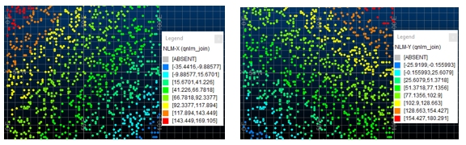

# QNLM Process  
  
To access this process:

  * **Sample Analysis** ribbon **> > Statistics >> Geochemical Processes >> Q Mode Non Linear Mapping**.

  * Enter "QNLM" into the [Command Line](<../COMMON/Command_Toolbar.md>) and press ENTER.
  * Display the **[Find Command](<../COMMON/findcommand.md>)** screen, locate **QNLM** and click **Run**.

See this process in the [Command Table](<../command_help/COMMAND%20TABLE_Q.md#QNLM>).

## Process Overview

Q - mode non linear mapping groups together samples using the euclidian distance to calculate a dissimilarity matrix.

As such, it groups samples on the basis of distance (element dissimilarity) between all pairs of samples in multi-dimensional space. These distances are recalculated into two dimensional space for graphical output.

;>)

Note the difference with R mode non linear mapping analysis which clusters elements or parameters.

A two dimensional view of the sample clusters, or scores **NLM-X** versus **NLM-Y** , is calculated to represent them as they would appear in multi- dimensional space on the basis of their dissimilarity calculated from each other for every pair of samples (see Figure 4). All input data can be standardized (default) prior to calculation of the matrix. Similarly, the output scores can also be normalized prior to plotting (default).

Q - mode non linear mapping, when compared with Q - mode factor analysis, is more sophisticated and tends not to distort or sub-divide the clustering of samples. Experience has shown that non - linear mapping will give more separable clusters than hierarchical techniques such as Q - mode cluster analysis.

### File Handling

The input file &(**IN**) must have a separate identifier field (* **SAMPID**). The output file &(**SCORES**) contains three parameters, **FIELD** the sample identifier, **NLM-X** and **NLM-Y** the output scores for plotting the sample distances in multi-dimensional space. Results can be displayed using **QUIG** , **PLOTAN** or **PLOTDA**.

### Iteration Procedure

In order to present a two dimensional view of multi-dimensional space with minimum distortion of the sample clusters, the calculated mapping error has to be minimized by an iterative method (steepest descent). This is controlled by the @CONVLIM parameter, that is the minimum difference allowed in the mapping error between iterations, @MAXIT, the maximum number of iterations permitted and the @MAGIC parameter which specifies the stepping function used for each iteration. If the stepping function @MAGIC is decreased, the number of iterations is increased with an obvious time penalty on the length of the calculation. The value used must be taken into account when there are a large number of samples or when using a PC. However the results can be more stable.

## Input Files

Name |  Description |  I/O Status |  Required |  Type  
---|---|---|---|---  
IN |  Input file. |  Input |  Yes |  Undefined  
  
## Output Files

Name |  I/O Status |  Required |  Type |  Description  
---|---|---|---|---  
SCORES |  Output |  No |  Undefined |  Optional output file for non linear mapping scores.  
  
## Fields

Name |  Description |  Source |  Required |  Type |  Default  
---|---|---|---|---|---  
SAMPID |  Sample identifier field in input file. |  IN |  Yes |  Any |  Undefined  
F1 |  First field to be used. No fields specified means all. |  IN |  No |  Numeric |  Undefined  
F2 |  Second field to be used. |  IN |  No |  Numeric |  Undefined  
F3 |  Third field to be used. |  IN |  No |  Numeric |  Undefined  
F4 |  Fourth field to be used. |  IN |  No |  Numeric |  Undefined  
F5 |  Fifth field to be used. |  IN |  No |  Numeric |  Undefined  
F6 |  Sixth field to be used. |  IN |  No |  Numeric |  Undefined  
F7 |  Seventh field to be used. |  IN |  No |  Numeric |  Undefined  
F8 |  Eighth field to be used. |  IN |  No |  Numeric |  Undefined  
F9 |  Ninth field to be used. |  IN |  No |  Numeric |  Undefined  
F10 |  Tenth field to be used. |  IN |  No |  Numeric |  Undefined  
  
## Parameters

Name |  Description |  Required |  Default |  Range |  Values  
---|---|---|---|---|---  
CONVLIM |  Convergence limit (0.0001) |  No |  0.0001 |  Undefined |  Undefined  
MAGIC |  Convergence [magic] factor (0.35) |  No |  0.35 |  Undefined |  Undefined  
MAXIT |  Maximum number of iterations (100) |  No |  100 |  Undefined |  Undefined  
STANDARD |  >0 Input data to be standardised (0) |  No |  0 |  0,1 |  0,1  
ZNORM |  >0 NLM scores in output file SCORES to be Z normalised (0). |  No |  0 |  0,1 |  0,1  
PRINT |  >0 Display two dimensional x - y coordinates to the screen (0). |  No |  0 |  0,1 |  0,1  
  
## Example
    
    
    !QNLM &IN(AEG2),&SCORES(QSCORES),  
  
---  
      
    
    @SAMPID='ID',@CONVLIM=0.0001,@MAGIC=0.35,@STANDARD=1,  
      
    
    @ZNORM=1,@PRINT=1