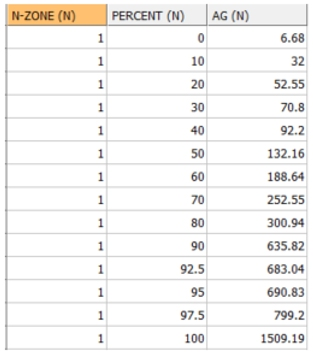
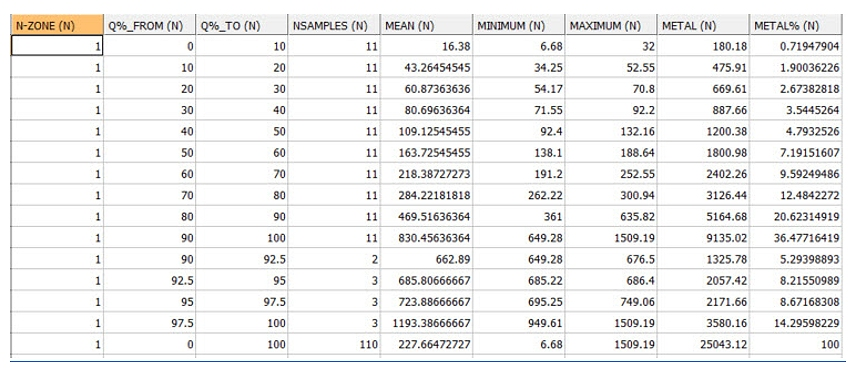

# QUANTILE Process  
  
To access this process:

  * **Sample Analysis** ribbon **> > Statistics >> Geochemical Processes >> Calculate Quantiles**.

  * Enter "QUANTILE" into the [Command Line](<../COMMON/Command_Toolbar.md>) and press ENTER.
  * Display the **[Find Command](<../COMMON/findcommand.md>)** screen, locate **QUANTILE** and click **Run**.

See this process in the [Command Table](<../command_help/COMMAND%20TABLE_Q.md#QUANTILE>).

## Process Overview

**Note** : This is a _superprocess_ and running it may have an effect on other Datamine files in the project.

Collectively quartiles, deciles, percentiles and other values obtained by equal subdivision of data are called quantiles. Quantiles give information about the shape of a distribution; in particular whether a distribution is skewed or not. Quantiles can be used for comparing two distributions.

The **QUANTILE** process carries out two types of analysis on a set of sample data:

  * Quantile Point Analysis: a table showing the grades corresponding to user defined percentile values.
  * Quantile Group Analysis: a set of tables showing the statistics of the grades lying between consecutive pairs of user defined percentile values

The first stage of the **QUANTILE** process is to apply the cutoff grade as specified by parameter **CUTOFF**. Any sample below the cutoff grade is removed from the analysis. Using the default cutoff grade of 0 in effect means that no cutoff is used.

The second stage is to apply a topcut grade. If the parameter **TOPCUT** has been set to 1, then any sample which is greater than parameter **TOPGRADE** will be replaced by a sample of **TOPGRADE**. If **TOPCUT** is set to 0, then the topcut will not be used.

The sample file is sorted in ascending order and divided into equal numbers of samples as defined by parameter **QUANTIL1**. For example, if there are 120 samples in total and **QUANTIL1** =10, then each subdivision or bin will include 12 samples. If the total number of samples does not divide equally by **QUANTIL1** , then some bins will contain one more sample than others. 

If **QUANTIL1** =8 then the first bin will contain the lowest grade 12.5% of samples, bin 2 will contain the samples between 12.5% and 25%, and so on, with the top bin, bin 8, contain the highest 12.5% of samples. The split using the **QUANTIL1** parameter is called the primary subdivision.

The top bin can be further divided, as controlled by parameter **QUANTIL2**. For example if **QUANTIL2** =5, then 5 additional bins from 87.5% - 90%, 90% - 92.5%, etc will be calculated. This is the secondary subdivision. If you do not want a secondary subdivision then QUANTIL2 should be set to zero.

An example of a Quantile Point table, file **QUANT_PT** , is shown below. This has been created using **QUANTIL1** =10 and **QUANTILE2** =4. A set of results is shown for each zone if the KEY field has been selected:  
  

The Group Analysis tables show statistics between each pair of Percentiles; 0% - 10%, 10% - 20%, and so on. The following statistics are calculated for each bin: 

  * the number of samples

  * minimum grade

  * maximum grade

  * mean grade

  * metal content (the sum of the individual grade values)

  * % metal in bin (the metal content as a percentage of total metal)

Two Group Analysis output files can be created. The RESULTS file includes both the primary and secondary divisions and the PRIMARY file includes just the primary divisions. The Results table can be saved to a system text file if file PRINT is specified. The table will also be displayed in the Command Window. An example of the RESULTS file is shown below: 

;>)

If a **WEIGHT** field has been specified then the mean grade is a weighted mean and the metal content is the sum of weight*grade. Also the values in the **NSAMPLES** (Number of Samples) column are not necessarily equal because the weights, not the number of samples, are equally distributed between the quantiles. The **WEIGHT** field applies to both the Point and Group analysis tables.

If a **KEY** field has been specified, then the quantile analysis is done separately for each value of the **KEY** field. 

## Input Files

Name |  Description |  I/O Status |  Required |  Type  
---|---|---|---|---  
IN |  Input sample file |  Input |  Yes |  Undefined  
  
## Output Files

Name |  I/O Status |  Required |  Type |  Description  
---|---|---|---|---  
QUANT_PT |  Output |  No |  Table File |  Output file containing the * **VALUE** value for each Quantile Point defined by parameters **QUANTIL1** and **QUANTIL2**. Although optional one of the two files **QUANT_PT** or **RESULTS** must be selected.  
RESULTS |  Output |  Yes |  Table File |  Output file containing quantile group information for primary and secondary subdivisions. Although optional one of the two files **QUANT_PT** or **RESULTS** must be selected.  
PRIMARY |  Output |  No |  Table File |  Output file containing quantile group information for the primary subdivision only.  
PRINT |  Output |  No |  Table File |  System print file, containing quantile group information. This is a copy of the contents of the **RESULTS** file, but to a system file. The extension .pri will be added automatically to the file name.  
  
## Fields

Name |  Description |  Source |  Required |  Type |  Default  
---|---|---|---|---|---  
VALUE |  Name of the field containing the grade to be analysed. |  IN |  Yes |  Numeric |  Undefined  
KEY |  Key field for grouping the data. A separate quantile analysis is carried out for each unique value of the key field. |  IN |  No |  Numeric |  Undefined  
WEIGHT |  Field containing the weight used when calculating quantile means and accumulating the grade values. For example if the input data is a desurveyed data file then **LENGTH** could be used. If no field is specified then all samples have an equal weight. |  IN |  No |  Numeric |  Undefined  
  
## Parameters

Name |  Description |  Required |  Default |  Range |  Values  
---|---|---|---|---|---  
QUANTIL1 |  The primary quantile. The number of primary subdivisions or bins for grouping the samples. For example setting **QUANTIL1** =10 will divide the samples into deciles; **QUANTIL1** =4 will give quartiles. |  No |  10 |  2,+ |  Undefined  
QUANTIL2 |  The secondary quantile. The top bin of the primary subdivision can be further split into equal groupings. For example if **QUANTIL1** =10 and **QUANTIL2** =4, then the top 10% will be split into 4 equal groups of 2.5%. If set to 0 then the top bin is not resplit. |  No |  0 |  0,+ |  Undefined  
CUTOFF |  Cutoff grade. Only samples greater than or equal to the cutoff grade are selected for analysis. |  No |  0 |  Undefined |  Undefined  
TOPCUT |  Flag to specify whether or not a topcut grade should be applied: 0 = No topcut applied. 1 = Topcut applied at grade defined in **TOPGRADE** |  No |  0 |  0,1 |  0,1  
TOPGRADE |  Grade to be applied as a topcut, if **TOPCUT** is set to 1. Any value greater than **TOPGRADE** will be reset to equal to **TOPGRADE**. |  No |  Undefined |  Undefined |  Undefined  
NDP |  Maximum number of decimal places for field **VALUE** in output file **QUANT_PT**. |  No |  2 |  0,6 |  0,1,2,3,4,5,6  
  
## Example
    
    
    !QUANTILE &IN(Data_Test_1), &QUANT_PT(Q_Points),   
  
---  
      
    
     &RESULTS(Q_Results),&PRIMARY(Q_Primary),&PRINT(Q_Print),  
      
    
     *VALUE(AG), *KEY(N_ZONE),*WEIGHT(LENGTH), @QUANTIL1=10,   
      
    
     @QUANTIL2=4, @CUTOFF=0, @TOPCUT=0, @TOPGRADE=0,   
      
    
     @NDP=2