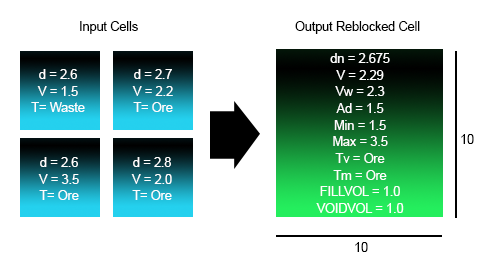
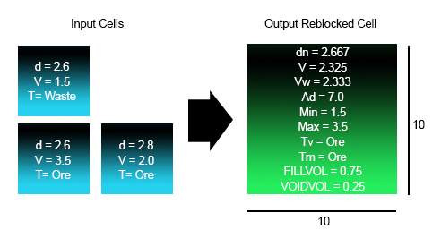

# REBLOCK Process  
  
To access this command:

  * **Model** ribbon **> >Mining >> Reblock**.
  * View the **[Find Command](<../COMMON/findcommand.md>)** screen, select **REBLOCK** and click **Run**.
  * Enter "REBLOCK" into the [Command Line](<../COMMON/Command_Toolbar.md>) and press <ENTER>.

See this process in the [Command Table](<../command_help/COMMAND%20TABLE_R.md#REBLOCK>).

## Process Overview

**Note** : This is a _superprocess_ and running it may have an effect on other Datamine files in the project.

**Note** : This process supports **[retrieval criteria](<../COMMON/Retrieval_Criteria_Overview.md>)**.

This command re-blocks a block model by user specification of new X, Y and Z parent cell sizes. The origin of the model remains unchanged.

Reblocking can be useful prior to carrying out strategic planning because it can be used to set the model's parent cell size to be representative of the selective mining unit (SMU) size that is being considered.

The user must specify new X, Y and Z parent cell sizes. The number of cells in X, Y and Z (The NX, NY and NZ values) will change if the specified output size is different from the size in the input model. If either the X, Y or Z parent cell sizes are set to zero or are undefined the size in the input model will be retained.

By default, when calculating values in the new output cells, values for all fields are weighted by mass using either the specified **DENSITY** field or **DENSITY** parameter value. Alternative field treatments can be used by specifying fields to be 1) Volume Weighted 2) Dominant 3) Additive 4) Selected according to minimum value and 5) Selected according to maximum value.

The new cells sizes can be any size and do not have to be an integer multiple of the input model parent cell size. Care should be taken if re-blocking to a smaller cells size because very large models can be specified. An error message is displayed if the selected cell sizes would cause the output model to exceed the system limits .

All numeric fields in the input model are copied to the output file. Alpha fields defined as Dominant will also be copied to the output file. However any undefined alpha fields will not be copied.

The REBLOCK process can be considered to be an enhanced REGMOD process. To regularize a block model (i.e. remove sub cells) the @FULLCELL parameter can be set to 1, the X, Y and Z sizes do not need to be defined.

### Input Model File

The input MODEL file is a normal or rotated block model that can contain parent cells and subcells.

**Note** : By default, when calculating the output cell values, all numeric fields are weighted by mass using the DENSITY field and DENSITY parameter. Optionally fields can be treated using alternative methods: volume weighted, dominant, additive, minimum or maximum.

##### *DENSITY Field

The numeric *DENSITY field is used to identify the density values in the input block model file. If values are absent then the @**DENSITY** parameter value is used. The density values are used for weighting values by mass. The default field name is **DENSITY**.

##### FILLVOL and VOIDVOL Fields

When only parent cells are being created in the output model (by setting @**FULLCELL** =1) the output model will also contain a * **FILLVOL** field that contains the proportion of each parent cell that was filled by cells in the input model. The default name is **FILLVOL**. If the specified * **FILLVOL** field exists in the input model and only parent cells are being generated then the values for this field will be replaced in the output model.

The * **VOIDVOL** field contains the proportion of the cell in the output model that was not filled by cells in the input model. Therefore VOIDVOL + **FILLVOL** = 1. values for **VOIDVOL** and **FILLVOL** are between 0 and 1.

If @**FULLCELL** =1 and @**UNMODGRD** =1 or 2 then any unmodelled volume will be assigned default grades and will be combined with the modelled cells to make a full parent cell. In this case the **FILLVOL** field defines the proportion of the **OUT** parent cell that comes from cells and subcells in the IN model and the **VOIDVOL** field defines the proportion of the **OUT** parent cell that was unmodelled in the IN model.

##### Volume Weighted Fields

By default values in the output model are calculated by weighting them against mass. However up to fifteen fields can optionally be volume weighted by specifying their field names using * **VFWFLD1** to * **VFWFLD15**. Volume weighted fields must be numeric.

##### Dominant Fields

Up to ten fields can be specified to be dominant using * **DOMFLD1** to * **DOMFLD10**. Dominant fields can be numeric or alpha. By default the dominant value is determined by comparing the volume of each value in the new output reblocked cells, the value with the maximum volume will be selected. Dominant fields are useful for attributes such as rock types or fields where the value needs to be copied from the input to the output model. To set the dominant value by mass set the @**DBYMASS** parameter to 1.

##### Additive Fields

Up to ten fields can be specified to be additive using * **ADDFLD1** to * **ADDFLD10**. When input model cells are split the value per unit volume is used to calculate the total in the new output parent cells. For example, if two input cells each with an additive value of 50 are being combined into a new reblocked cell, the new cell will have a value of 100. Additive fields must be numeric. Additive fields are useful for fields such as revenue and cost.

If a field with absent data values is defined as additive and @**ABSGRADE** =2 then the absent values will be replaced by the default value defined in the Data Definition of the **IN** file. This must be expressed in terms of value per unit volume.

Also if a field is additive and @**FULLCELL** =1 and @**UNMODGRD** =1 or 2 then any unmodeled volume will be assigned default grades from the Data Definition. This must be expressed in terms of value per unit volume.

##### Minimum and Maximum Fields

Up to five fields each can be specified to be minimum or maximum using * **MINFLD1** to * **MINFLD5** or * **MAXFLD1** to * **MAXFLD5** respectively. No volume or mass comparisons are done. The minimum (or maximum) value contained in the collection of cells that comprise the output parent cell is copied to the output cell.

### Parameter Specifications

##### XINC, YINC and ZINC Parameters

The @**XINC** , @**YINC** and @**ZINC** parameters are used to specify the parent cell size in the output model. They can be any size and do not have to be an integer multiple of the input model parent cell size dimensions. The values can be smaller or larger than the input models sizes. The origin of the output model is the same as the input model. The number of cells in X, Y and Z is adjusted in the output model to make the extents of the output model approximately the same as the input model.

##### FULLCELL Parameter

If the @**FULLCELL** parameter is set to one then every cell in the output model is a parent cell and the model will contain the extra fields *FILLVOL and * **VOIDVOL**. These fields contain the proportion, between zero and 1, of the output parent cell that is completely filled by cells in the input model.

=0: the output model will only include cells and subcells that existed in the input model

=1: the output model will contain just parent cells. **FILLVOL** and **VOIDVOL** fields will be created to show the proportion of modelled and unmodelled cells

##### DBYMASS Parameter

Set to 1 to determine all dominant field values by mass rather than volume. The default is zero, to determine dominant values by volume.

=0 : Determine dominant values by volume. This is the default

=1 : Determine dominant values by mass.

##### DENSITY Parameter

The @**DENSITY** parameter specifies the density value to be used for mass calculations if no **DENSITY** field exist in the input model or if the **DENSITY** values in the input model are absent. The @**DENSITY** parameter is only applied if the @**SETABSNT** parameter is set to 1\. The default value is 1.

##### SETABSNT Parameter

Set to 1 in order to set absent data density values to the default value defined by the @DENSITY parameter.

=0: do not reset absent density values and report an error

=1: set absent density values to @**DENSITY**. This is the default

##### ABSGRADE Parameter

The **ABSGRADE** parameter controls what action is taken if there are absent data grade values in the input model.

=0: numeric fields with absent data values ( - ) or alpha fields with absent data values (blank) will be reported and the process will terminate. This is the default.

=1: absent data numeric values will be set to zero and absent data alpha values will be set to _ABS

=2: numeric and alpha absent data values will be set to their default values defined in the Data Description of the input model. If the numeric default is absent data then zero will be used. If the alpha default is absent data then _ABS will be used.

##### UNMODGRD Parameter

The **UNMODGRD** parameter controls the method used to assign the grade if @**FULLCELL** =1 but the parent cell includes unmodelled volume ie if **FILLVOL** <1.

=0: assign the modelled grade values to the full parent cell. This means the unmodelled grades are assumed to be the same as the modelled grades with the parent cell. This is the default.

=1: set all numeric grades of unmodelled volumes to zero and alpha fields to _UNM.

=2: set all grades of unmodelled volumes to their default values defined in the Data Definition of the input model. If the numeric default is absent (-) then a value of zero is used. If the alpha default is absent (blank) then _UNM is used.

In all cases the **FILLVOL** and **VOIDVOL** fields are based on the modelled cells only. If the default value of an additive field is applied to the unmodelled volume then it must be defined per unit volume.

The density of unmodelled volumes is defined using the @**UNMODDEN** parameter

##### UNMODDEN Parameter

The **UNMODDEN** parameter defines the density of unmodelled volumes. It is only used if @**FULLCELL** =1 and @**UNMODGRD** =1 or 2. The default value is 1.

## Input Files

Name |  Description |  I/O Status |  Required |  Type  
---|---|---|---|---  
MODIN |  Input block model file |  Input |  Yes |  Block Model  
  
## Output Files

Name |  I/O Status |  Required |  Type |  Description  
---|---|---|---|---  
MODOUT |  Output |  Yes |  Block Model |  Reblocked output model file  
  
## Fields

Name |  Description |  Source |  Required |  Type |  Default  
---|---|---|---|---|---  
DENSITY |  Density field. If the model does not include a **DENSITY** field then the density can be set with parameter @**DENSITY**. The output file will always contain a **DENSITY** field. |  IN |  Yes |  Numeric |  Undefined  
FILLVOL |  The proportion of each full cell in the output model that was filled with cells in the input model. Only output if @**FULLCELL** =1. |  IN |  No |  Numeric |  Undefined  
VOIDVOL |  The proportion of each full cell in the output model that was filled with cells in the input model. Calculated as 1 - **FILLVOL**. Only output if @**FULLCELL** =1. |  IN |  No |  Numeric |  Undefined  
VWFLD1-15 |  Field(s) to be volume weighted |  IN |  No |  Numeric |  Undefined  
DOMFLD1-10 |  Field(s) to be treated as dominant. |  IN |  No |  Numeric |  Undefined  
ADDFLD1-10 |  Field(s) to be treated as additive |  IN |  No |  Numeric |  Undefined  
MINFLD1-5 |  Field(s) to be set using minimum value |  IN |  No |  Numeric |  Undefined  
MAXFLD1-5 |  Field(s) to be set using maximum value |  IN |  No |  Numeric |  Undefined  
  
## Parameters

Name |  Description |  Required |  Default |  Range |  Values  
---|---|---|---|---|---  
XINC |  New X parent cell size |  No |  20 |  2,+ |  Undefined  
YINC |  New Y parent cell size |  No |  20 |  0,+ |  Undefined  
ZINC |  New Z parent cell size |  No |  20 |  Undefined |  Undefined  
FULLCELL |  Set to 1 to output a model containing only parent cells |  No |  0 |  0,1 |  0,1  
DBYMASS |  Set to 1 to determine dominant values by mass rather than volume. The default is zero, to determine dominant values by volume. |  No |  0 |  0,1 |  0,1  
DENSITY |  Density value to be used if DENSITY field does not exist or if @SETABSNT=1 and density values are absent. |  No |  1 |  0,1 |  0,1  
SETABSNT |  Set to 1 to set any absent density values to the default density using the @**DENSITY** value. |  No |  0 |  0,1 |  0,1  
ABSGRADE |  The **ABSGRADE** parameter controls what action is taken if there are absent data grade values in the input model. |  No |  0 |  0,2 |  0,1,2  
UNMODGRD |  The **UNMODGRD** parameter controls the method used to assign the grade if @**FULLCELL** =1 but the parent cell in the **OUT** model includes unmodelled volume ie if **FILLVOL** is less than 1. The default is (0).  |  No |  0 |  0,2 |  0,1,2  
UNMODDEN |  The **UNMODDEN** parameter defines the density of unmodelled volumes. It is only used if @**FULLCELL** =1 and @**UNMODGRD** =1 or 2. The default value is 1. |  No |  1 |  Undefined |  Undefined  
  
## Examples

#### Reblocking Example 1

In the following example, the input model is 5*5*1 and the output model is 10*10*1. FULLCELL =1.

;>)

Density (Vol Weight): |  dn=(2.6*25+2.7*25+2.6*25+2.8*25)/(25+25+25+25) = 2.675  
---|---  
Mass Weighted V: |  V = (2.6*1.5*25+2.7*2.2*25+2.6*3.5*25+2.8*2.0*25)/(2.6*25+2.7*25+2.6*25+2.8*25) = 2.29  
Volume Weighted V: |  Vw = (1.5*2+2.2*25+3.5*25+2.0*25)/(25+25+25+25) = 2.3  
Additive V: |  Ad = 25*(1.5/25)+25*(2.2/25)+25*(3.5/25)*2.0/25)=9.2  
Minimum V: |  Min=1.5  
Maximum V: |  Max=3.5  
Dominant Tv: |  T = max(25*waste,25*2.7*Ore+25*2.6*Ore+25*2.8*Ore) = Ore  
Dominant Tm: |  T = max(25*2.6*Waste,25*2.7+Ore+25*2.6*Ore+25*2.8*Ore) = Ore  
  
#### Reblocking Example 2

In the following example, the input model is 5*5*1 and the output model is 10*10*1. FULLCELL =1.

Density (Vol Weight): | 
    
    
    dn = (2.6*25 + 2.6*25 + 
    		 2.8*25) / (25+25+25) = 2.667  
  
---|---  
Mass Weighted V: | 
    
    
    V = (2.6*1.5*25 + 2.6*3.5*25 
    		 + 2.8*2.0*25) / (2.6*25 + 2.6*25 + 2.8*25) = 2.325  
  
Volume Weighted V: | 
    
    
    Vw = (1.5*25 + 3.5*25 + 
    		 2.0*25) / (25 + 25 + 25) = 2.333  
  
Additive V: | 
    
    
    Ad = 25*(1.5/25) + 25*(3.5/25) 
    		 + 25*(2.0/25) = 7.0  
  
Minimum V: | 
    
    
    Min=1.5  
  
Maximum V: | 
    
    
    Max=3.5  
  
Dominant Tv: | 
    
    
    T = max (25*Waste, 25*Ore 
    		 + 25*Ore) = Ore  
  
Dominant Tm: | 
    
    
    T = max (2.6*25*Waste, 
    		 25*2.6*Ore + 25*2.8*Ore) = Ore  
  
##### Resource Reporting

Note that in these examples the grade values are for a volume of 10*10*1* **FILLVOL**. Therefore, if process [TONGRAD](<tongrad.md>) is used to report the resource of the output model then the **OREFRAC** field must be set to **FILLVOL**.