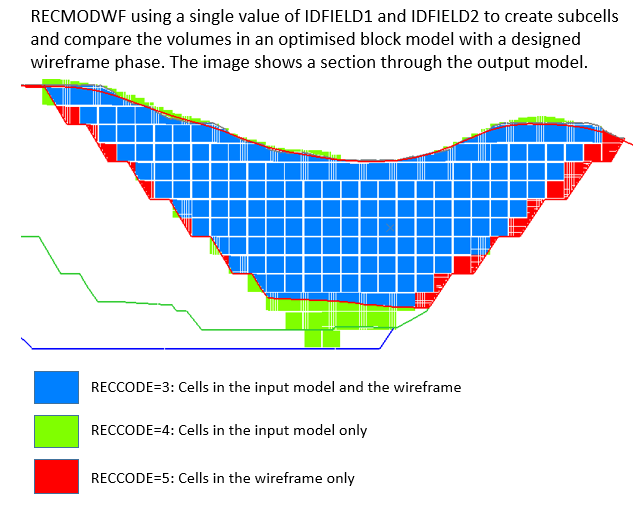

# RECMODWF Process

To access this command:

  * View the **[Find Command](<../COMMON/findcommand.md>)** screen, select **RECMODWF** and click **Run**.
  * Enter "RECMODWF" into the [Command Line](<../COMMON/Command_Toolbar.md>) and press <ENTER>.

See this process in the [Command Table](<../command_help/COMMAND%20TABLE_R.md#RECMODWF>).

## Process Overview

Compare the tonnes and grades of groups of cells in a block model with the tonnes and grades of volumes defined by wireframes. An example of how it might be used is to compare the optimised pushbacks defined in a block model against designed pushbacks defined by wireframes.

### MODEL File

The input model file for reconciliation. It must contain a field identifying the cells to be reconciled with the wireframe volumes.

For example, if the model has been created by Studio NPVS or Studio NPVS+, this field may be the optimally planned pushback identifier **PSB_PIT** or **PIT_NO**. The wireframe files could represent the planned pushbacks. The results would provide an indication of how close the designed pushbacks are to the optimised pushbacks.

### MODOUT

Optional output model file containing cell divisions defined by the input wireframes. This file will contain the **IDFIELD2** field with values derived from the input wireframe. If the input file already contains the **IDFIELD2** field its values are overwritten. 

Note: The previous values are saved in a field called **OldID2** _

If a single value of **IDFIELD1** and **IDFIELD2** is defined using the @**VALUE** parameter then the output model will contain a **RECCODE** field with values of either 3, 4 or 5. These values are:
    
    
    CODE=3, SOURCE=IDFIELD1 and IDFIELD2:

The total amount of material in the model with the same specified value of **IDFIELD1** AND **IDFIELD2**
    
    
    CODE=4, SOURCE=IDFIELD1 Only:

The total amount of material in the model with a specified value of **IDFIELD1** and NOT with the specified value of **IDFIELD2**
    
    
    CODE=5, SOURCE=IDFIELD2 Only:

The total amount of material in the model with a specified value of **IDFIELD2** and NOT with the specified value of **IDFIELD1**

### Results

Output results file containing tonnes and grades for categories of each unique value of **IDFIELD2**. The categories, with value of **RECCODE** from 1 to 5, are as follows:
    
    
    CODE=1, SOURCE=IDFIELD1:

The total amount of material in the model with a specified value of **IDFIELD1**.
    
    
    CODE=2, SOURCE=IDFIELD2:

The total amount of material in the model with a specified value of **IDFIELD2**.
    
    
    CODE=3, SOURCE=IDFIELD1 and IDFIELD2:

The total amount of material in the model with the same specified value of **IDFIELD1** AND **IDFIELD2**.
    
    
    CODE=4, SOURCE=IDFIELD1 Only:

The total amount of material in the model with a specified value of **IDFIELD1** and NOT with the specified value of **IDFIELD2**.
    
    
    CODE=5, SOURCE=IDFIELD2 Only:

The total amount of material in the model with a specified value of **IDFIELD2** and NOT with the specified value of **IDFIELD1**.

;>)

## Input Files 

Name |  Description |  I/O Status |  Required |  Type  
---|---|---|---|---  
MODEL |  Input model file for reconciliation. It must contain a field identifying the planned cells to be reconciled with the wireframe volumes. If the model has been created by Studio NPVS or Studio NPVS+, this field may be the optimally planned pushback identifier **PSB_PIT**. |  Input |  Yes |  Block model  
WIRETR |  Input wireframe triangle file used to define the mined volume(s). This should contain a field identifying the design to be reconciled. |  Input |  Yes |  Wireframe triangles  
WIREPT |  Input wireframe point file used to to define the mine volume(s). |  Input |  Yes |  Wireframe points  
  
## Output Files

Name |  I/O Status |  Required |  Type |  Description  
---|---|---|---|---  
MODOUT |  Output |  No |  Block Model |  Output model file containing cell divisions defined by the input wireframes. This file will contain the **MINED** field with values derived from the input wireframe. If the input file already contains a MINED field its values are overwritten. The previous values are saved in a field called OldMined_  
RESULTS |  Output |  Yes |  Results |  Output results file containing the reserve comparisons. This contains up to 5 records for every separate reconciled volume: Total Planned, Total Mined, Planned and Mined, Planned Only and Mined Only. Volumes are defined by the **PLANNED** and **MINED** fields and can be further broken down by the **KEY1** field and **BENCH** parameter.  
  
## Fields

Name |  Description |  Source |  Required |  Type |  Default  
---|---|---|---|---|---  
PLANNED |  Field in **MODEL** file used to group the planned blocks. If comparing wireframe designs with pushback reserves in a Studio NPVS(+) model this field may be **PSB_PIT.** |  MODEL |  Yes |  Any |  Undefined  
MINED |  Field in the **WIRETR** file defining the volumes to be compared to the corresponding **PLANNED** block model cells. |  WIRETR, MODEL |  Yes |  Any |  Undefined  
KEY1 |  Optional key field in the **MODEL** file used to categorize results (e.g. a Rock type field). |  MODEL |  No |  Any |  Undefined  
DENSITY |  Density field in the **MODEL** file used to calculate tonnages. |  MODEL |  No |  Any |  DENSITY  
GRADE1-10 |  Grade field in the model file |  MODEL |  No |  Numeric |  Undefined  
  
## Parameters

Name |  Description |  Required |  Default |  Range |  Values  
---|---|---|---|---|---  
VALUE |  Value of **PLANNED** and **MINED** fields to compare. If undefined or zero then all values of **MINED** field will be compared. |  No |  Undefined |  Undefined |  Undefined  
MODLTYPE |  Type of wireframe model to be filled; one of the following options, with default of (1) :- |  1 | Solid 3d, interior to be filled with cells  
---|---  
2 | Solid 3d, exterior to be filled with cells  
3 | Surface, cells to be filled below (for XY), to south (for XZ), or to west (for YZ)  
4 | Surface, cells to be filled above (for XY), to north (for XZ), or to east (for YZ)  
5 | Fill between two surfaces with cells.  
6 | Two surfaces, cells to be filled above upper surface and below lower surface.  
Yes |  1 |  1, 6 |  1,2,3,4,5,6  
FACTOR |  Scaling factor to adjust the units of the Volume and Tonnage in the output files. Volume and Tonnage are divided by this factor. |  No |  1 |  Undefined |  Undefined  
SETABSNT |  Set to 1 to allow **[TONGRAD](<tongrad.md>)** to internally reset absent grade and Density values. If this is used, absent grade values are set to their default values. If the default value is absent grade values are set to zero. If Density values are absent the default DENSITY parameter value is used." |  No |  0 |  0, 1 |  0, 1  
BENCH |  Set to 1 to categorize the reserve comparisons by benches. |  0 |  Do not categorize by benches  
---|---  
1 |  Categorize the results by benches (as defined by the model **ZINC** default value)  
No |  0 |  0, 1 |  0, 1  
  
## Example
    
    
    !RECMODWF &MODEL(upmodel),&WIRETR(pb123soltr),&WIREPT(pb123solpt),  
  
---  
      
    
    &MODOUT(m33),&RESULTS(m3res3),*IDFIELD1(PSB_PIT),*IDFIELD2(PHASE),  
      
    
    *DENSITY(DENSITY),*GRADE1(AU),*GRADE2(CU),@MODLTYPE=1.0,  
      
    
    @FACTOR=1.0,@SETABSNT=0.0,@BENCH=0.0  
  
Related topics and activities

  * RECBLKST Process

  * [RECMODEL Process](<recmodel.md>)

  * [TONGRAD Process](<tongrad.md>)