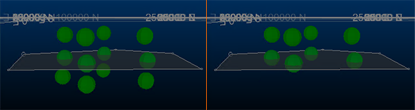
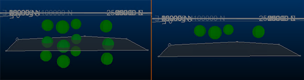

# SELWF Process

To access this process:

  * **Wireframe** ribbon **> > Process >> Select in Wireframe**.

See this process in the [Command Table](<../command_help/COMMAND%20TABLE_S.md#SELWF>).

## Process Overview

Select records lying inside/outside wireframe volumes or above/below wireframe surfaces or DTMs.

Records of a file which have X, Y and Z co-ordinates lying above/below wireframe surfaces or inside/outside a wireframe volume are copied to an output file. The wireframe model can contain multiple zones, but a point will only be selected once if it falls within more than one zone. The wireframe triangle file does not have to be sorted by the * **ZONE** field.

If the wireframe contains multiple zones, the order of selection is determined by the order of the zones in the wireframe triangle file. For example if 2 overlapping wireframe solids, zones A and B, exist in the wireframe file, and B occurs first in the wireframe triangle file, then points within B will be selected and flagged with the zone code of B. Points outside B, but within A, will then be selected and flagged with the zone code of A. In other words, if there is an overlap the first zone takes precedence.

Points that are regarded as coincident with a surface if they fall within the defined **TOLERANC** value. You can choose to either include or exclude these points from the selection. For example, if you are selecting points above a DTM using the XY **PLANE** option, and points are found to be coincident with the surface, selecting the points above the DTM (because **SELECT** =1), you can include the DTM-coincident points by ensuring **EXCLUDE** =0, or exclude them by settings **EXCLUDE** =1.

For example, in the image below on the left, a simple DTM (transparent) has 4 coincident points, 4 above and 4 below the surface. If **SELECT** =1, **TOLERANC** =0.001 and **EXCLUDE** = 0, the points on the right are in the **OUT** file when SELWF is run:

In the same scenario, where **EXCLUDE** =1:

By default, points falling on the wireframe surface are included in any selection. 

The **PLANE** parameter can be used with vertically oriented wireframe surfaces or DTMs to allow selection of points to the east, west, north, or south, instead of above or below. This parameter can also be used with steeply dipping tabular solid wireframes to speed up the point selection. In-place operations are not permitted. If no **PLANE** is set (the default setting), an XY plane will be used.

### Using @SELECT

1\.  |  SELECT = 1, 2, 5, 6, 7, 8  
---|---  
| Points which lie above or below the surface, but which are outside the surface boundary, will not be selected.  
|   
2\.  |  SELECT = 4  
| An outside point will be outside all wireframe volumes/solids. Attribute fields will not be copied. The zone field will be set to absent value.  
  
A wireframe surface or DTM is one which contains no vertical or overhanging portions when viewed from a position perpendicular to the plane specified by PLANE. A warning will be given if a DTM surface contains a vertical face, but overhangs will NOT be detected. Holes (missing triangles) in a solid wireframe will generate a warning, but so will duplicate triangles. Double duplicates will cancel out and thus not be detected. The parameter TOLERANC is applied in a direction perpendicular to PLANE , NOT perpendicular to the surface of the wireframe. If attribute fields are specified, their values are taken from the first record in the wireframe triangle file for each zone, or from the first record in the file if no zone field is specified.

## Input Files

Name |  I/O Status |  Required |  Type |  Description  
---|---|---|---|---  
IN |  Input |  Yes |  Undefined |  Input point file for selection. Must have explicit numeric fields X , Y and Z.  
WIRETR |  Input |  Yes |  Wireframe Triangle |  Input wireframe triangle file  
WIREPT |  Input |  Yes |  Wireframe Points |  Input wireframe point file  
  
## Output Files

Name |  I/O Status |  Required |  Type |  Description  
---|---|---|---|---  
OUT |  Output |  Yes |  Undefined |  Output file of selected records. File may contain additional fields, including the ZONE field.  
  
## Fields

Name |  Description |  Source |  Required |  Type |  Default  
---|---|---|---|---|---  
X |  Field in IN file defining the X co-ordinate. |  IN |  Yes |  Numeric |  Undefined  
Y |  Field in IN file defining the Y co-ordinate. |  IN |  Yes |  Numeric |  Undefined  
Z |  Field in IN file defining the Z co-ordinate. |  IN |  Yes |  Numeric |  Undefined  
ZONE |  Field in WIRETR file used to identify individual surfaces and solid models. The field can be numeric or alphanumeric up to 20 characters (5 words). WIRETR does NOT have to be sorted by ZONE. |  WIRETR |  No |  Any |  Undefined  
ATTRIB1 |  Field from the WIRETR file to be placed into the output file for all records which are selected. Up to 4 words may be entered, which may be 4 numeric fields or a mixture of alphanumeric and numeric fields totalling 4 words. |  WIRETR |  No |  Any |  Undefined  
ATTRIB2 |  Second field from the WIRETR file to be placed into the output file for all records selected. |  WIRETR |  No |  Any |  Undefined  
ATTRIB3 |  Third field from the WIRETR file to be placed into the output file for all records selected. |  WIRETR |  No |  Any |  Undefined  
ATTRIB4 |  Fourth field from the WIRETR file to be placed into the output file for all records selected. |  WIRETR |  No |  Any |  Undefined  
  
## Parameters

Name | Description | Required | Default | Range | Values  
---|---|---|---|---|---  
SELECT |  |  **Option** |  **Description**  
---|---  
**1** |  select points above a DTM surface  
**2** |  select points below a DTM surface  
**3** |  select points inside a solid  
**4** |  select points outside a solid  
**5** |  select points above a wireframe surface  
**6** |  select points below a wireframe surface  
**7** |  select points between two wireframe surfaces  
**8** |  select points outside two wireframe surfaces.  
Yes |  3 |  1,8 |  1,2,3,4,5,6,7,8  
PLANE |  Optional alpha parameter defining approximate orientation 'XY', 'XZ', or 'YZ' of DTM surface. If not specified, XY will be used.a |  No |  XY |  Undefined |  'XY', 'XZ', 'YZ'  
EXCLUDE |  |  **Option** |  **Description**  
---|---  
**1** |  exclude points that fall on, or within TOLERANC , of the wireframe surface (0).  
No |  0 |  0,1 |  0,1  
TOLERANC |  Tolerance used to determine whether a data point is 'on' a surface or not. |  No |  0 |  Undefined |  Undefined  
CHECKROT |  Set to 1 to automatically process rotated models =(0) : Do NOT automatically check for a rotated model prototype. Use this setting if the input model is rotated and the model cell centres are already transformed into the wireframe space using CDTRAN.  =1 : Automatically check for a rotated model prototype and internally transform the model cell centre points.  |  No |  1 |  0,1 |  0,1  
ALLPTS |  Set to 1 to copy across all input points =0 : Copy only the coded points to the output file.. =1 : Copy all the points to the output file. The coded points will be flagged with the ZONE field values and the attributes. |  No |  0 |  0,1 |  0,1  
**SETABSNT** |  Set the specified ZONE and attribute fields in the input points file to absent before processing.  =0 : Do not set the ZONE and attribute values to absent before processing (Default).  =1 : Set the ZONE and attribute values to absent before processing.  | No | 0 | 0,1 | 0,1  
**FIXNORM** |  Attempt to resolve any problems in the input wireframe before processing.  =0 : Do not attempt to resolve any problems in the input wireframe (Default).  =1 : Attempt to resolve any problems in the input wireframe.  | No | 0 | 0,1 | 0,1  
  
## Example
    
    
    !SELWF &IN(SAMPNTS),&WIRETR(ORETR),&WIREPT(OREPT),  
  
---  
      
    
    &OUT(SAMPSEL), *X(XP),*Y(YP),*Z(ZP),*ZONE(ZONEID),*ATTRIB1(ORENO),  
      
    
    @SELECT=3,EXCLUDE=0,TOLERANC=0.001