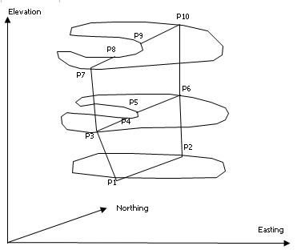
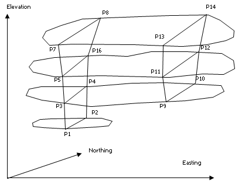

# SLIPER Process  
  
To access this process:

  * Enter "SLIPER" into the [Command Line](<../COMMON/Command_Toolbar.md>) and press <ENTER>.
  * View the **[Find Command](<../COMMON/findcommand.md>)** screen, select **SLIPER** and click **Run**.

See this process in the [Command Table](<../command_help/COMMAND%20TABLE_S.md#SLIPER>).

## Process Overview

Intersects a set of parallel perimeters by a set of orthogonal planes.

This process produces two optional output files:

  1. An intersection file, containing the co-ordinates of the end points of the line describing the intersection of each plane and the perimeters.

  2. A perimeter file, connecting the co-ordinates of the intersections in the form of a standard perimeter.

The input perimeters may be parallel to any one of the three co-ordinate axes, and the intersection plane will be perpendicular to the input perimeter.

For example, Figure 1 shows a set on input perimeters representing the plan outline of a particular rock type on 4 benches. These perimeters are intersected by 2 north-south planes. The output intersections file contains 7 fields - the X, Y and Z co-ordinates of the 2 end points (**X1, Y1, Z1** and **X2, Y2, Z2**) and a perimeter value field containing the **PVALUE** of the original perimeter. In the example of Figure 1 the file will contain 7 records, one for each of the intersection lines **P1P2** , **P3P4** , .... **P13P14**. The **X1** and **X2** values are northings, **Y1** and **Y2** the elevations, and **Z1** and **Z2** the easting of the intersection plane. The **PVALUE** for intersection line **P1P2** is 10.

The intersection lines for any intersection plane can be plotted by using the [PLOTLN](<plotln.md>) process under the retrieval criteria that **ZP** is equal to the section co-ordinate . In this example the retrieval criteria would be for the easting (ZP) value. Each intersection line can be annotated with the original **PVALUE** using the [PLOTAN](<plotan.md>) process. In this way it is possible for the input perimeter file to contain several perimeters for each bench, representing different rock types, with the PVALUE field containing a rocktype identifier. Using **PLOTLN** as described above it would be possible to distinguish between intersection lines for the different rock types.

The output perimeter file is a standard perimeter containing fields **XP, YP, ZP, PTN** and **PVALUE**. In the example of Figure 2, the output perimeter file would contain two perimeters. The first perimeter would have eight points ordered **P1, P3, P5, P7, P8, P6, P4, P2** and with both **ZP** and **PVALUE** equal to the section easting. If the input perimeter contains a re-entrant, or there are multiple perimeters on a single bench, then the output perimeter will describe the outermost points of the intersections of any line.

Note: There is a limit of 1200 points in any single input or output perimeter, and a limit of 20 intersection lines, for the intersection of a single perimeter plane and an intersection plane.

## Input Files

Name |  Description |  I/O Status |  Required |  Type  
---|---|---|---|---  
PERIMIN |  Input perimeter file containing at least 2 perimeters. This must contain the fields[**XP,YP,ZP,PTN,PVALUE** , all numeric and explicit] with **XP** and **YP** variable and **ZP** fixed for each perimeter. The file must contain at least two perimeters with different **ZP** values. |  Input |  Yes |  String  
  
## Output Files

Name |  I/O Status |  Required |  Type |  Description  
---|---|---|---|---  
INTERSEC |  Output |  No |  Undefined |  An optional output intersections file containing the coordinates **X1,Y1,Z1** of the end points of each intersection line, and the **PVALUE** of the intersected perimeter. At least 1 output file must be specified.  
PERIMOUT |  Output |  No |  String |  An optional output perimeter file containing the intersection perimeters. At least 1 output file must be specified.  
  
## Parameters

Name |  Description |  Required |  Default |  Range |  Values  
---|---|---|---|---|---  
MODE |  |  Option |  Description  
---|---  
1 |  FOR A PLAN TO NS CONVERSION.  
2 |  FOR A PLAN TO EW CONVERSION.  
3 |  FOR A NS TO EW CONVERSION.  
4 |  FOR A NS TO PLAN CONVERSION.  
5 |  FOR A EW TO NS CONVERSION.  
6 |  FOR A EW TO PLAN CONVERSION.  
Yes |  1 |  1,6 |  1,2,3,4,5,6  
STARTPOS |  Starting position for intersection planes. |  Yes |  Undefined |  Undefined |  Undefined  
STIZE |  Interval between intersection planes. |  Yes |  Undefined |  Undefined |  Undefined  
NUMST |  Number of intersection planes. |  Yes |  Undefined |  Undefined |  Undefined  
CLOSE |  Close perimeters, either 1 to close or 0 to not close. |  No |  1 |  0,1 |  0,1  
  
* * *

## Example
    
    
    !SLIPER    &PERIMIN(PERIMS), &INTERSEC(INTERS), @MODE=3,@STARTPOS=200,  
  
---  
      
    
    @STIZE=10, @NUMST=11.  
  

   

## Error and Warning Messages

Message |  Description  
---|---  
130,n,F,SLIPER |  Input &**PERIMIN** file not specified. Define an &**PERIMIN** file.  
131,n,F,SLIPER |  Neither output file specified.  
132,n,F,SLIPER |  Input &**PERIMIN** file does not exist. Check that the specified &**PERIMIN** file exists and has been added to the project..  
134,n,F,SLIPER |  One or more of the compulsory fields **XP, YP, ZP, PTN,** or **PVALUE** are missing from the &PERIMIN file. Check that the fields exist in the &**PERIMIN** file.  
138,n,F,SLIPER |  The number of points in one of the input perimeters exceeds the maximum of n. Condition the &**PERIMIN** file and reduce the number of points per string.  
139,n,F,SLIPER |  One of the input perimeters is not sorted on the **PTN** field. Sort the &**PERIMIN** file on the fields **PVALUE** and **PTN**  
140,n,F,SLIPER |  Error when reading &**PERIMIN** file. Check the contents of the &**PERIMIN** file.  
141,n,F,SLIPER |  @**MODE** parameter not specified. Select a @**MODE** parameter value.  
142,n,F,SLIPER |  @**MODE** parameter not in range of 1 to 6. Select a @**MODE** parameter value of 1, 2, 3, 4, 5, or 6.  
143,n,F,SLIPER |  @**STARTPOS** parameter not specified. Select a @**STARTPOS** parameter value.  
144,n,F,SLIPER |  @**STIZE** parameter not specified. Select a @**STIZE** parameter value.  
145,n,F,SLIPER |  @**NUMST** parameter not specified. Select a @**NUMST** parameter value.  
  
Related topics and activities

  * [PLOTLN Process](<plotln.md>)

  * [PLOTAN Process](<plotan.md>)