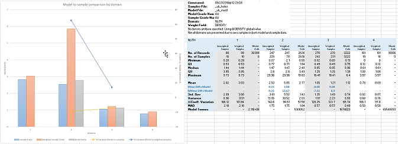
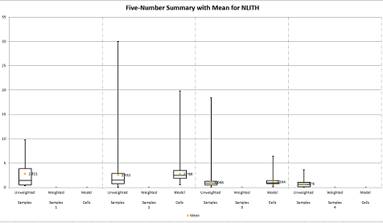

# STATCOM Process  
  
To access this process:

  * View the **[Find Command](<../COMMON/findcommand.md>)** screen, select **STATCOM** and click **Run**.
  * Enter "STATCOM" into the [Command Line](<../COMMON/Command_Toolbar.md>) and press <ENTER>.

See this process in the [Command Table](<../command_help/COMMAND%20TABLE_S.md#STATCOM>).

## Process Overview

**Note** : This is a _superprocess_ and running it may have an effect on other Datamine files in the project.

Compute comparison summary statistics for validating a model versus samples.

Optionally, output data to Excel to display a summary graph representing a comparison of model and sample statistics by domain.

A samples file and a corresponding model file must exist. Both must contain a numeric value for analysis. Typically, this would be a grade value, although any numeric value can be used. The attribute does not have to be of the same name between the two files, and either or both can contain absent or empty values.

Optionally, you can specify a domain field to segregate results per domain. If Excel output is selected (@**EXCEL** =1), comparison results between sample and model data for each domain will be reported and displayed. The designated * **DOMAIN** field should exist in both sample and model files if one is selected. It is not necessary for all domain keyfield values to exist in both sample and model files; they can exist solely in one file or the other, or one can contain a subset of the partner file values.

A decluster weighting field (* **DCWEIGHT**) can be specified. This attribute will be in the input samples file. It is used to weight sample values for comparison with model values per domain.

A density field (* **DENSITY**) can be specified to select the density values in the model. The grade statistics for the model will then weighted by the cell volume*density ie by tonnage. If a density field is not selected then the model grade statistics will be volume weighted.

The density field is also used in the calculation of the total tonnage for each domain. This statistic is reported in the output tables.

A density parameter (@**DENSITY**) is also available. If a density field has been selected but some of the values in the model are absent data then they will be replaced by the density parameter value. If a density field has not been selected then the density parameter will be used in the calculation of the total tonnage for each domain.  

### Excel Output

**Note** : Microsoft Excel 2010 or later is required on the local PC in order to view output from this command.

Excel output is controlled by the @**EXCEL** parameter, which is enabled (=1) by default. If set to 0, only &**OUT** is produced.

If enabled, two additional CSV format files are created in the project directory:

  * statcom_parameters.csv: a file that is used by the Excel macro to provide summary information.
  * statcom_table.csv: a comma-delimited version of &OUT. This is used for chart calculation

Excel will be launched. Security settings for Excel must be such that Excel macros can be launched. You may need to "Enable content" when Excel launches. If macros and automation are prohibited by your Excel Trust Center settings, you will not be able to view automated chart and summary data.

#### @EXCEL=1 Example

The selected samples file contains 5 lithology attributes, indicated by a numeric value in the **NLITH** column ranging from 0-4 inclusive. The corresponding model also contains an **NLITH** column, but only contains records relating to 2 of those domains. Both sample and model files contain absent grade data at various positions in their respective tables.

A weighted field (* **DCWEIGHT**) in the samples file, so has been specified. Absent values also exist for the weighting field, so only samples with a non-absent weighting value will be calculated.

In this example, **NLITH** =0 has already been coded using the [assign-lithology](<../COMMON/Assign_Sample_Lithologies.md>) command. It represents records where grade data is absent. This value does not occur in the model file.

The resulting Excel sheet includes a table on the "STATCOM_1" worksheet that shows the 5 lithology attribute as data rows.

The chart shows 4 clustered bars, not 5:

;>)

  * **NLITH** =0 is not displayed on the chart as the number of non-absent records in the sample file (SNSAMPS) and the model file (MNSAMPS) are both zero. As such, no output can be calculated.

  * **NLITH** =1 and **NLITH** =4 (far right and left clusters) show only two bars representing the sample mean grade (SMEAN) and the sample weighted mean grade (WMEAN). No Model mean grade (MMEAN) is shown because the model file contains no non-absent grade records for either domain.

  * **NLITH** =2 and **NLITH** =3 show the full set of 3 bars; both sample and model grade data for these domains exists, along with weighting information, so summary statistics have been calculated and can be compared.

Where sample, weighted sample and model mean grade data exists, two additional chart layers are applied, as line graphs;

  * The % Variance between model and samples
  * The % Variance between model and weighted samples

##### Box and Whisker Plots

The output workbook also includes a "Box & Whisker" worksheet. This includes, for each domain (or across the global data set if domain control is not exercised), a five-number summary for unweighted samples, weighted samples and model cells, for example:

;>)   

## Input Files

Name |  Description |  I/O Status |  Required |  Type  
---|---|---|---|---  
SAMPLES |  Input sample file. |  Input |  Yes |  Samples file  
MODEL |  Input model file. |  Input |  Yes |  Block model  
  
## Output Files

Name |  I/O Status |  Required |  Type |  Description  
---|---|---|---|---  
OUT |  Output |  No |  Table |  Output file. This will contain the fields:

  * SGRADE: selected grade name (Sample). Can be different to MGRADE
  * [DOMAIN]: the selected domain, which must exist in both sample and model files.
  * MGRADE: selected grade name (Model). Can be different to SGRADE.
  * SNRECS: number of records (Sample)
  * SNSAMPS: number of non-absent records (Sample)
  * SMINIMUM:min grade (Sample)
  * SMAXIMUM: max grade (Sample)
  * SMEAN: mean grade (Sample)
  * SVARIANC: variance (Sample)
  * SSTDDEV: standard deviation (Sample)
  * SCOVRTN%: coefficient of variation (Sample) : Standard Deviation / Mean
  * SPCTL25: the 25th percentile of unweighted samples.
  * SMEDIAN: the median value of unweighted samples.
  * SPCTL75: the 75th percentile value of unweighted samples.
  * SMAD: the Mean Absolute Difference of unweighted samples.
  * WNRECS: number of records (weighted samples)
  * WNSAMPS: number of included weighted samples (Sample). Sample excluded if absent data grade, absent data weight or Weight field is not specified.
  * WMINIMUM: minimum grade of weighted samples.
  * WMAXIMUM: maximum grade of weighted samples.
  * WMEAN: weighted mean grade (Sample)
  * WVARIANC: weighted variance grade (Sample)
  * WSTDDEV: weighted standard deviation grade (Sample)
  * WCOVRTN%: weighted coefficient of variation (Sample)
  * WPCTL25: the 25th percentile of weighted samples.
  * WMEDIAN: the median value of weighted samples.
  * WPCTL75: the 75th percentile value of weighted samples.
  * WMAD: the Mean Absolute Difference of weighted samples.
  * MNRECS: number of records (Model)
  * MNSAMPS: number of non-absent records (Model)
  * MMINIMUM: min grade (Model)
  * MMAXIMUM: max grade (Model)
  * MMEAN: mean grade (Model)
  * MVARIANC: variance (Model)
  * MSTDDEV: standard deviation (Model)
  * MCOVRTN%: coefficient of variation (Model)
  * MPCTL25: the 25th percentile of model values.
  * WMEDIAN: the median value of model values.
  * MPCTL75: the 75th percentile value of model values.
  * MMAD: the Mean Absolute Difference of model values.
  * MTONNES: model tonnes for each domain.
  * SMEAN%D: % difference between sample and model means.
  * SMMEAND: numeric difference between samples and model means.
  * WMEAN%D: % difference between weighted sample mean and model mean.
  * WMMEAND: numeric difference between weighted sample mean and model mean.
  * WGTFIELD: the weighting field used to calculated weighted sample values. Can be empty or containing absent values.
  * MFILE: the model file used to calculate statistics.
  * SFILE: the sample file used to calculate statistics.
  * DOMFIELD: the domain field (if specified) used to classify statistics.
  * DENSITY: the field (if specified) used to generate weighted grade statistics for the model by the cell volume*density. Also used in the calculation of the total tonnage for each domain. 

  
  
## Fields

Name |  Description |  Source |  Required |  Type |  Default  
---|---|---|---|---|---  
MGRADE |  Model field for statistics. |  MODEL |  Yes |  Alphanumeric |  Undefined  
SGRADE |  Sample field for statistics. |  SAMPLES |  Yes |  Alphanumeric |  Undefined  
DOMAIN |  Domain keyfield for statistics. Typically this would define an estimation domain. |  MODEL and SAMPLES |  No |  Alphanumeric |  Undefined  
DCWEIGHT |  Weighting field. Field used for weighting the samples. Typically this would be a declustered weight field derived from the **[GRIDDC](<griddc.md>)** or **[DECLUST](<declust.md>)** processes |  SAMPLES |  No |  Alphanumeric |  Undefined  
DENSITY |  Density field to enable calculation of tonnage weighted grade statistics for the model. If not selected a global density will be defined by the @DENSITY parameter. |  MODEL |  No |  Alphanumeric |  Undefined  
  
## Parameters

Name |  Description |  Required |  Default |  Range |  Values  
---|---|---|---|---|---  
Excel |  Set to 1 to automatically load the domain statistics data file into Excel and display a graph of the sample to model variances and mean grade comparisons. |  IN |  No |  Numeric |  Undefined  
  
## Example
    
    
    !STATCOM  &SAMPLES(_vb_holes),&MODEL(_vb_mod1),  
  
---  
      
    
              &OUT(OUT3),*MGRADE(AU),*SGRADE(AU),*DOMAIN(NLITH),*DCWEIGHT(DENSITY),  
      
    
              @EXCEL=1.0  
      
    
    !END  
  
Related topics and activities

  * [DECLUST Process](<declust.md>)

  * [GRIDDC Process](<griddc.md>)

  * [STATS Process](<stats.md>)

  * [STATNP Process](<statnp.md>)