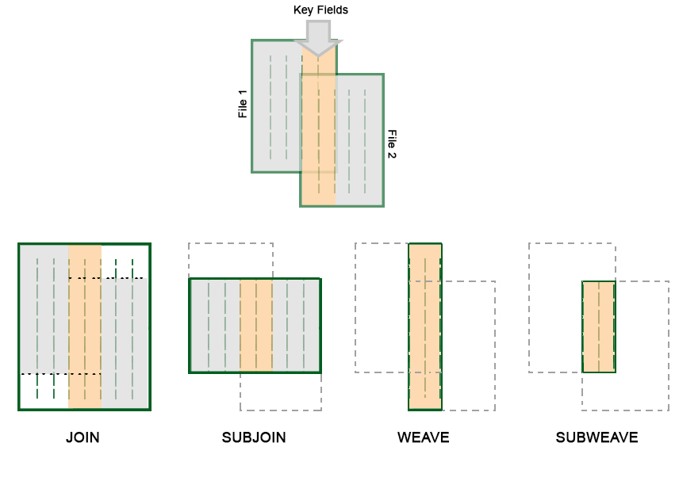

# SUBWVE Process

To access this process:

  * **Data** ribbon **> > Data Tools >> Relational >> Sub Weave**.

  * Enter "SUBWVE" into the [Command Line](<../COMMON/Command_Toolbar.md>) and press <ENTER>.
  * Display the **[Find Command](<../COMMON/findcommand.md>)** screen, locate **SUBWVE** and click **Run**.

See this process in the [Command Table](<../command_help/COMMAND%20TABLE_S.md#SUBWVE>).

## Process Overview

Performs a relational subset weave of two input files into an output file.

This process belongs to a group of four similar ones within the Datamine process collection; JOIN, SUBJOI, WEAVE and SUBWVE. Each provides a different outcome, as described by the following diagram:

  
;>)

SUBWVE writes out matching records and common fields from both input files. Records are compared on the specified keyfields, and if a match is found, all common fields are written to the output file. If both files have identical Data Definitions then the record from the second input file is the one written out. Thus, in this case the second file updates the first. If no match is found then no record is written out.

At least one keyfield must be specified and must appear in both input files as an explicit field. The keyfield may be up to 5 words long, and may be composed of up to 5 fields. If a field is specified which does not exist in both input files, it is ignored, providing at least one field matches.

Both input files must be sorted in the order of the keyfields before they can be joined. If this is not the case, the process will exit with an error message.

## Input Files

Name |  Description |  I/O Status |  Required |  Type  
---|---|---|---|---  
IN1 |  First file to be updated (sorted on required keyfields). |  Input |  Yes |  Table  
IN2 |  Second file (update file) (sorted on required keyfields). |  Input |  Yes |  Table  
  
## Output Files

Name |  I/O Status |  Required |  Type |  Description  
---|---|---|---|---  
OUT |  Output |  Yes |  Table |  Output file.  
  
## Fields

Name |  Description |  Source |  Required |  Type |  Default  
---|---|---|---|---|---  
KEY1 |  Keyfield 1 for matching on. |  IN1, IN2 |  Yes |  Any |  Undefined  
KEY2 |  Keyfield 2. |  IN1, IN2 |  No |  Any |  Undefined  
KEY3 |  Keyfield 3. |  IN1, IN2 |  No |  Any |  Undefined  
KEY4 |  Keyfield 4. |  IN1, IN2 |  No |  Any |  Undefined  
KEY5 |  Keyfield 5. |  IN1, IN2 |  No |  Any |  Undefined  
KEY6 |  Keyfield 6. |  IN1, IN2 |  No |  Any |  Undefined  
KEY7 |  Keyfield 7. |  IN1, IN2 |  No |  Any |  Undefined  
KEY8 |  Keyfield 8. |  IN1, IN2 |  No |  Any |  Undefined  
KEY9 |  Keyfield 9. |  IN1, IN2 |  No |  Any |  Undefined  
KEY10 |  Keyfield 10. |  IN1, IN2 |  No |  Any |  Undefined  
  
## Parameters

Name |  Description |  Required |  Default |  Range |  Values  
---|---|---|---|---|---  
KEYTOL |  **KEYTOL** is the tolerance value used to test whether numeric key values are equal. It must be greater than or equal to zero. It replaces the previous heuristic comparison method.  If **KEYTOL** is set to a negative value then zero is used.  In a macro **KEYTOL** can be set to absent using -. "@KEYTOL=-" This will revert to legacy behaviour and use a heuristic comparison in relational commands and zero in sort.  |  No |  0.00001 |  0,+ |  Undefined  
  
## Example
    
    
    !SUBWVE   &IN1(ASSAYS1),&IN2(ASSAYS2),  
  
---  
      
    
    &OUT(COMMON),*KEY1(FROM),*KEY2(TO),*KEY3(Cu)  
  
SUBWVE effectively shows the area of overlap between the files, based on the keyfields. The output file 'COMMON' will have fields FROM, TO and Cu selected from input files assays1 and assays2. It will contain only those records which have the same values of FROM, TO and Cu in the two files.

## Error and Warning Messages

Message |  Description |  Solution  
---|---|---  
>>> ERR 47 <<< ( 0) IN FNDKEY |  Warning; none of the specified key fields exist in the input files. The full Cartesian product is produced and written to the output file. Check that the specified keyfield(s) *KEYn exist in the &IN1 and &IN2 files. |   
>>> KEYFIELD aaaaaaaa MISSING FROM FILE ffffffff |  A warning message that is produced if @**PRINT** >=1. The keyfield is ignored and processing continues. Check that the specified keyfield(s) *KEYn exist in the &IN1 and &IN2 files. |   
>>> INPUT FILE NOT SORTED ON KEYFIELD <<< >>> ERR 122 <<< ( fileno) IN SUBWVE |  One (or both) of the input files is not sorted on the designated keyfield(s). Fatal; the process is exited. Sort the &IN1 and &IN2 files on the specified keyfield(s) *KEYn. |   
>>> FILE ffffffff CANNOT BE USED AS BOTH <<< >>> INPUT AND OUTPUT BY THIS PROCESS <<< >>> ERR 130 <<< ( fileno) IN SUBWVE |  Either the first or second input file has the same name as the output file. Fatal; the process is exited. Use different &IN* and &OUT files. |