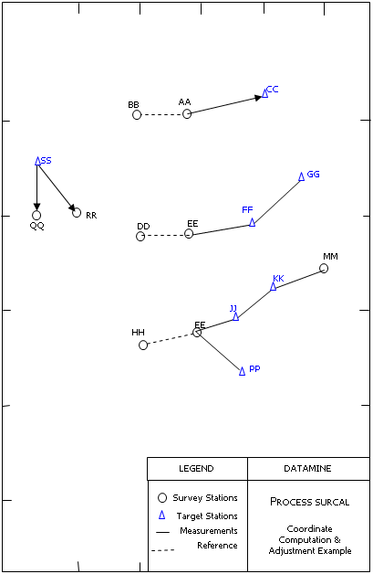
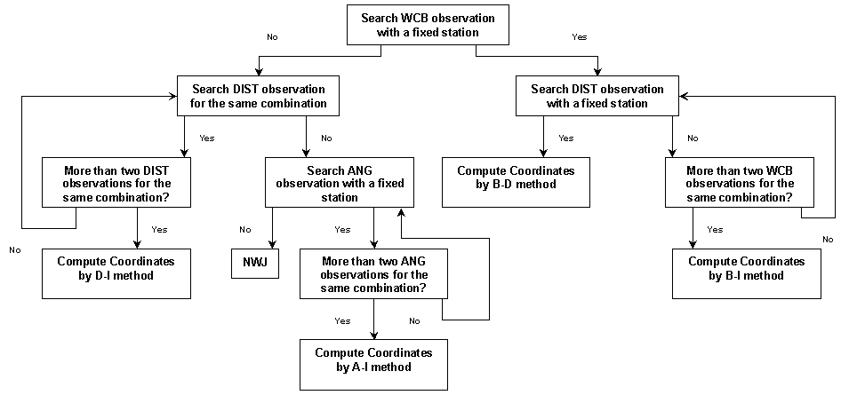
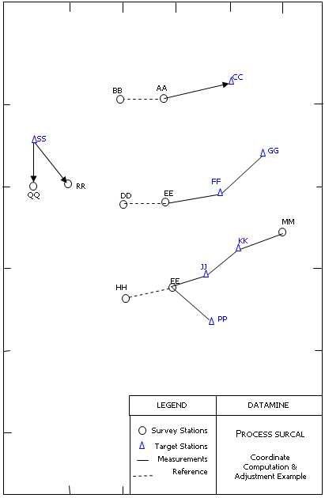

# SURCAL Process

To access this process:

  * Enter "SURCAL" into the [Command Line](<../COMMON/Command_Toolbar.md>) and press <ENTER>.
  * Display the **[Find Command](<../COMMON/findcommand.md>)** screen, locate **SURCAL** and click **Run**.

See this process in the [Command Table](<../command_help/COMMAND%20TABLE_S.md#SURCAL>).

## Process Overview

This process computes provisional and/or adjusted coordinates of all observed survey stations contained in an input file of reduced observations such as output from process [SUROBS](<surobs.md>).

The coordinate computation method can be selected automatically or you can choose one. Checks are made to ensure enough observations have been taken to complete coordinate computation. If adjustments are required **SURCAL** allows the computation of a rigorous solution for each coordinate including calculation of the standard error of unknown values.

If new stations exist in the input survey station file, a recalculation of coordinates can take place and the user may allow the process to trace and recalculate the survey base-lines that have been established from that point. Where observations have been taken between fixed points, the misclosures of coordinates, distances and bearing are reported to the screen, printer and optionally to the output file of new survey station coordinates.

The method of coordinate computation may be summarized as:

  * Automatic selection of computation method

  * Bearing and distance method

  * Angle and distance method

  * Resection by angles

  * Resection by distances

  * Distance intersection

  * Bearing intersection

  * Angle intersection

If a combination of angle and distance measurements has taken place to fix one or more new stations from two or more existing stations, **SURCAL** can be used to compute the provisional coordinates of the new stations by one of the method listed above. When automatic mode is selected the information available for a particular new station is processed and the best computation method is used. The automatic selection of a computation method obeys a hierarchical network which is explained below.

Coordinate adjustment is optionally carried out when redundant measurements are available. Weights corresponding to the error fields such as **HZERR** , **VAERR** , **HDERR** can be applied onto the computations. Adjustments are based on a rigorous least square error analysis. An error ellipse is also evaluated and reported. Reiteration of the adjustment procedure is possible by re-assessment of observation standard errors. When adjustments are required, the user is prompted to confirm further reiterations. If reiteration is confirmed, then the weights to be applied are multiplied by the standard error of unknown values.

  * When intersection methods are used, the measurements taken from fixed stations to the left of the fixed base-line, when looking towards the new station, must occur first in the input file.

  * When parameters @**WEIGHT** and @**ADJUST** are both set to one, coordinate adjustments are processed with weighting. Weights assigned to the elevation differences are computed according to the inverse of the slope distance error. Any standard error of the elevation difference is not used in this case.

  * Checks are made for inconsistent angle measurements (for example, vertical angles readings of more than 90 , WCB and horizontal angle readings of more than 360 or less than 0 ). For these cases the records are ignored. 

  * An important note refers to the precision of the coordinates handled in **SUROBS**. Although all variables are stored and handled by Double-Precision type variables and arrays, input and output measurements and coordinates are held in single precision type variables. In order to avoid output problems with values over 7 digits long, the use of parameters @**LOXORIG** , @**LOYORIG** and @**LOZORIG** is strongly recommended. Output display and report can be controlled by parameter @**NDEC**.

  * Iterative computation of 2 (standard error of unknown values) is processed by displaying the most recently 2 value computed and prompting the user for further iteration. A response of <enter> or any numerical value proceeds to a new computation with the default value or the input value respectively. A response of <!> terminates the iterative computation and the final adjusted values are displayed. When operating through a macro the termination response <!> must be replaced by a <-1> response. 

### File Handling

There are three compulsory files required by **SURCAL**. These may be summarized as:

  * &**IN** : an input file containing the reduced observations as output from process SUROBS (reduction of observed survey measurements to mean angles and bearings with distances optionally reduced to a grid reference plane). If observation errors are present, then these may be optionally used for weighting in the adjustment process.

  * &**CONTROL** : a file containing the coordinates and identification of established survey stations that will be used in the survey (compulsory).

  * &**OUT** : a file containing the coordinated survey stations with reduced base line data and coordinate adjustment.

### Field Handling

All fields of the input files are compulsory. If the input observations file &IN is an output from process **SUROBS** no modifications are needed. A summary of the required fields is:

&IN |  &CONTROL |  &OUT  
---|---|---  
*INSTSTN *INSTHT *RO *TARGET *HZA *WCB *QB *WCBERR *VA *HDIST *HDERR *RDIST *VDIFF *VDERR *PLANE *FACTOR *REFRACT *ERRFLAG |  *STATION *X *Y *Z *RO *WCB *QB *HDIST *VDIFF *PLANE *FACTOR *REFRACT *HDERR *WCBERR *VAERR *ERRFLAG *LOXORIG *LOYORIG *LOZORIG |  *STATION *X *Y *Z *RO *WCB *QB *HDIST *VDIFF *PLANE *FACTOR *REFRACT *HDERR *WCBERR *VAERR *ERRFLAG *LOXORIG *LOYORIG *LOZORIG  
  
Stations are identified by field * **STATION** in input file &**CONTROL** and fields * **INSTSTN** , * **TARGET** and * **RO** in input file &**IN** and output field &**OUT**. These must be alphanumeric and eight characters in length. Field QB refers to the quadrant bearing and must be twelve characters in length. All the remaining fields are numeric.

### Adjustments

The adjustment process is incorporated in **SURCAL** and may use weights as defined in the measurement error fields. This is achieved by the use of both **SUROBS** and **SURCAL** processes**. SUROBS** reduces repetitive survey observations into a mean value and an error (which could be the standard error of the mean or the range of the observations). The reduced observations are then fed into **SURCAL** to compute new survey station coordinates. **SURCAL** includes two stages of coordinate computation, a provisional computation and an adjustment process. A summary of the adjustment procedure is shown in Figure 1.

The provisional coordinate computation stage mentioned in Figure 1 refers to a network of hierarchical procedures to compute the coordinates when parameter @**CALCTYPE** is set to 0 (automatic mode). The preference in the network is given to coordinate computations methods in which a lower error level can be normally assumed. Therefore, bearing and distance method is preferred over bearing intersection, which in turn is preferred over distance intersection and so on. A summary of the hierarchical network is shown in Figure 2.

Computation by the hierarchical network gives one set of coordinates to each new station, flagging the results as "unique" or "non-unique" solution. The stations with non-unique solutions are those where adjustments are necessary; however, the adjustment process includes all new stations in one set of algebraic equations where the residuals (errors) are minimised and the most probable coordinates of each new station are computed. The solution of the algebraic equations includes inverse matrix computation. Due to the precision required by the adjustment process the L.U. decomposition method is used for inverse matrix computation (L.U. stands for lower and upper triangular decomposition) . This method uses Crout's algorithm.

It is important to note that **SURCAL** computes 3-D adjustments, therefore processing X, Y and Z coordinates. Details of the basic theory, variance analysis and weighting of physically dissimilar quantities used in **SURCAL** can be found in the article "Adjustment of Control Networks" published in the Chartered Surveyor magazine, of January, 1970.

### Error Ellipse and Reiterations of 2

The standard error of unknown values ( 2) for the coordinate calculation of each new station is computed from the coordinate adjustment procedure. After computing the adjusted coordinates, the error ellipse values are also calculated in SURCAL so that an assessment of the reliability of the newly-computed coordinates. At the same time, the computed value of 2 is displayed and the user is prompted for further iterations. Each iteration consists of applying the computed 2 to the algebraic equations, so that an improved new value of 2 can be computed. Any departure from the unity may imply in gross estimation errors and the user is warned about it. The most recently computed 2 value is displayed at the end of each iteration. To terminate the iterations, enter <!>. Refer to the Example section for more details on error ellipse reporting and iterative computation of 2.

## Input Files

Name |  Description |  I/O Status |  Required |  Type  
---|---|---|---|---  
IN |  Input file of reduced survey observations. This file will contain the following fields ((N) denotes Numeric, (A,8) denotes Alphanumeric field type and length):-  **INSTSTN** (A,8) Survey station identifier for the instrument location.  **INSTHT** (N) Instrument height. (Negative for instruments set below the survey station).  **RO** (A,8) Survey station identifier for the reference object survey station.  **TARGET** (A,8) Identifier of the survey station located.  **HZA** (N) Mean horizontal angle measurement made to the target station.  **WCB** (N) Whole Circle Bearing from **INSTSTN** to **TARGET**.  **QB** (A,12)Quadrant Bearing **INSTSTN** to **TARGET**.  **WCBERR** (N) Mean standard error or range of the measurements taken to establish the Whole Circle Bearing **INSTSTN** \- **TARGET**.  **VA** (N) Mean vertical angle measurement made to the target station.  **HDIST** (N) Mean horizontal distance from INSTSTN to TARGET. **HDERR** (N) Mean standard error or range of horizontal distances from slope distances and vertical angles.  **RDIST** (N) Reference plane distance from **INSTSTN** to **TARGET** as computed from the horizontal distance **HDIST**.  **VDIFF** (N) Mean difference in elevation from **INSTSTN** to **TARGET**.  **VDERR** (N) Mean standard error or range of computed height differences from **INSTSTN** to **TARGET**.  **PLANE** (N) Reference plane used to compute **RDIST** from **HDIST**. If absent, **RDIST** = **HDIST**.  **FACTOR** (N) Scale factor used to compute **RDIST** after reduction to **PLANE**. The default must be 1.  **REFRACT** (N) Coefficient of refraction used to adjust vertical angles where single measurements are made.  **ERRFLAG** (N) Error flag field. Four digits may be set as follows:- ABCD for example 

  * 1001 A Horizontal angle tolerance was/was not exceeded. 
  * 1/0 B Vertical angle or vertical difference tolerances were /were not exceeded. 
  * 1/0 C Horizontal distance tolerance was/was not exceeded. 
  * 1/0 D The previous base-line (**INSTSTN** to **RO**) carried/ did not carry errors. 
    * >1/0 This file file may have been created as output from the **SUROBS** process.

|  Input |  Yes |  Undefined  
  
## Output Files

Name |  I/O Status |  Required |  Type |  Description  
---|---|---|---|---  
OUT |  Output |  Yes |  Undefined |  Output file of newly coordinated survey stations. This file will contain the following fields:-  **STATION** (A,8) Survey station identifier.  **X** (N) X coordinate value.  **Y** (N) Y coordinate value.  **Z** (N) Z coordinate value.  **RO** (A,8) Identity of station used to locate **STATION**.  **WCB** (N) Whole Circle Bearing from **STATION** to **RO**. Referred to as azimuth elsewhere in your application.  **QB** (A,12)Quadrant Bearing **STATION** to **RO**. (such as N 45.0000 E).  **HDIST** (N) Horizontal distance from **STATION** to **RO**.  **RDIST** (N) Reduced distance from **STATION** to **RO** , as computed at **PLANE** elevation.  **VDIFF** (N) Vertical difference in height from **STATION** to **RO**.  **PLANE** (N) Elevation to which **HDIST** has reduced to compute **RDIST**. If absent (-), no further reduction has been computed.  **FACTOR** (N) Scale factor used to compute RDIST.  **REFRACT** (N) Coefficient of refraction used to compute **VDIFF** where only a single forward vertical angle is used.  **HDERR** (N) Mean standard error or range horizontal distances from **RO** to **STATION**.  **WCBERR** (N) Mean standard error or range of horizontal angles used in computing the bearing from **RO** to **STATION**.  **VAERR** (N) Mean standard error or range of vertical angles used in computing **VDIFF** from **RO** to **STATION**.  **ERRFLAG** (N) Flag to identify when a measurement tolerance is exceeded.  **LOXORIG** (N) Implicit local X origin field.  **LOYORIG** (N) Implicit local Y origin field.  **LOZORIG** (N) Implicit local Z origin field.  **ADJUST** (N) Numeric field to identify final or temporary coordinates.  
  
## Parameters

Name |  Description |  Required |  Default |  Range |  Values  
---|---|---|---|---|---  
CALCTYPE |  Numeric flag to identify the method of coordinate computation to be used:  0 = Automatic.  1 = Bearing and distance method.  2 = Angle and distance method.  3 = Resection by angles.  4 = Distance intersection.  5 = Bearing intersection.  6 = Angle intersection.  7 = Resection by distances.  The default is the automatic method (0). |  Yes |  0 |  0,7 |  0,1,2,3,4,5,6,7  
ANGLE |  Units of angle measurements : 1 = Degrees, minutes and seconds. [0-360] in the form DDD.MMSS 2 = Gradians. [0-400]  The default angle unit is degrees, minutes and seconds (1). |  No |  1 |  1,2 |  1,2  
RECALC |  Optional numeric flag to allow recalculation of stations established from a resurveyed base line. The default is not to have recalculation (0). |  No |  0 |  0,1 |  0,1  
WEIGHT |  Optional flag numeric to allow assignment of weights proportional to the error values in the input file. The default is not to have weights assignment (0). |  No |  0 |  0,1 |  0,1  
ADJUST |  Optional numeric flag to allow coordinate adjustment where redundant measurements occur. The adjustment is done by the least square error method. The default is to have coordinates computed from a single set of measurements (0). |  No |  0 |  0,1 |  0,1  
NDEC |  Number of decimals in the output results summary. Only used if parameter PRINT is set to one (2). |  No |  2 |  Undefined |  Undefined  
PRINT |  Set to one to display a summary of results to the screen and print file. The default is not to print summary results (0). |  No |  0 |  0,1 |  0,1  
  
## Example

An example to run SURCAL with automatic coordinate computation method, coordinate adjustment and weighting is shown below:
    
    
    !SURCAL    &IN(FILEIN),&CONTROL(CONTROL),&OUT(FILEOUT),          
  
---  
      
    
    @CALCTYPE=0.0,@ANGLE=1.0,@RECALC=0.0,@WEIGHT=1.0,          
      
    
    @ADJUST=1.0,@NDEC=2.0,@PRINT=1.0  
  
Sample session: If file FILEIN contains the following data:

INSTSTN |  TARGET |  WCB |  RDIST |  HZA  
---|---|---|---|---  
AA |  CC |  80.0 |  62.0 |  171.0  
EE |  FF |  82.0 |  52.5 |  173.0  
FF  |  GG  |  \-  |  49.5  |  158.0  
II  |  PP  |  118.0  |  40.0  |  215.0  
II |  JJ  |  77.0  |  36.5  |  172.0  
JJ  |  KK  |  \-  |  32.0  |  184.0  
KK  |  MM  |  \-  |  42.5  |  164.0  
SS  |  QQ  |  \-  |  26.0  |  48.0  
SS  |  RR  |  \-  |  40.0  |  312.0  
XX  |  ZZ  |  5.0  |  25.0  |  300.0  
YY  |  ZZ  |  286.0  |  33.0  |  40.0  
  
And if file CONTROL contains the following data:

STATION  |  X  |  Y  |  Z  
---|---|---|---  
BB |  99.5  |  153.0  |  140.0  
DD |  100.5  |  89.0  |  145.0  
EE |  141.0  |  89.0  |  115.0  
HH |  101.0  |  32.0  |  150.0  
II |  146.0  |  38.0  |  120.0  
MM |  251.0  |  71.0  |  125.0  
QQ |  16.0  |  102.0  |  130.0  
RR |  46.0  |  102.0  |  155.0  
XX |  14.0  |  27.0  |  135.0  
YY |  48.0  |  42.0  |  160.0  
  
The output produced by **SURCAL** in this case is presented below. Figure 3 shows the location of fixed stations, the computed location of new stations and a summary of the measurements taken. The report is then:
    
    
    PROCESS SURCAL  
      
    Summary of parameters to be used:-  
      
    Coordinate computation method is : Automatic   
    Angle units are : degrees   
    Recalculation from resurvey base line is : off   
    Coordinate adjustments where redundant measurements occur   
      
    PROVISIONAL COORDINATES

STATION |  X COORDINATE |  Y COORDINATE |  Z COORDINATE |  TYPE |  METHOD  
---|---|---|---|---|---  
|  |  |  |  |   
BB  |  99.50  |  153.00  |  140.00  |  1  |  FIX  
AA  |  138.50  |  153.00  |  110.00  |  1 |  FIX  
CC  |  199.56  |  163.77  |  113.00  |  2  |  B-D  
DD  |  100.50  |  89.00  |  145.00  |  1 |  FIX  
EE  |  141.00  |  89.00  |  115.00 |  1 |  FIX  
FF  |  192.99  |  96.31  |  110.00  |  3 |  B-D  
GG |  235.86  |  121.06  |  114.00 |  2 |  D-A  
HH |  101.00  |  32.00  |  150.00 |  1 |  FIX  
II |  146.00  |  38.00  |  120.00 |  1 |  FIX  
PP |  181.32  |  19.22  |  118.00 |  2 |  B-D  
JJ |  181.56  |  46.21  |  123.00 |  3 |  B-D  
KK |  209.51  |  61.81  |  122.01 |  3 |  D-I  
MM |  251.00  |  71.00  |  125.00 |  1 |  FIX  
RR |  46.00  |  102.00  |  155.00 |  1 |  FIX  
SS |  15.60  |  128.00  |  132.79 |  3 |  D-I  
QQ |  16.00  |  102.00  |  130.00 |  1 |  FIX  
YY |  48.00  |  42.00  |  160.00 |  1 |  FIX  
XX |  14.00  |  27.00  |  135.00 |  1 |  FIX  
ZZ |  16.51  |  51.87  |  134.43 |  3 |  D-I  
  
Note that field TYPE in the output table above as the following meanings:

TYPE = 1 :  |  Fixed station  
---|---  
TYPE = 2 :  |  Provisional computation with redundant observations (adjustment possible)  
TYPE = 3 :  |  Provisional computation only (no adjustment possible).  
  
ERROR ELLIPSE PARAMETERS

|  Standard Errors |  BEARING OF THE MAJOR AXIS  
---|---|---  
STATION  |  X  |  Y  |  MAX  |  MIN   
|  |  |  |  |   
CC  |  0.44326  |  0.07816  |  0.45010  |  0.00014  |  260.0000  
FF  |  0.44571  |  0.06264  |  0.45010  |  0.00011  |  262.0000  
GG  |  0.46431  |  0.31779  |  0.46729  |  0.31338  |  261.1445  
PP  |  0.39741  |  0.21131  |  0.45010  |  0.00009  |  118.0000  
JJ  |  0.31225  |  0.07209  |  0.32046  |  0.00008  |  257.0000  
KK  |  0.44735  |  0.15297  |  0.47278  |  0.00007  |  108.5242  
SS  |  0.00005  |  0.00003  |  0.00005  |  0.00003  |  90.0801  
ZZ  |  0.00005  |  0.00008  |  0.00008  |  0.00005  |  172.5657  
ADJUSTMENTS COMPUTED  
---  
STATION  |  X ADJUSTMENT  |  Y ADJUSTMENT  |  Z ADJUSTMENT  
|  |  |   
CC  |  0.00001  |  -0.00003  |  0.00000  
FF  |  0.00000  |  0.00000  |  0.00000  
GG  |  0.00000  |  0.00000  |  0.00000  
PP  |  -0.00001  |  -0.00002  |  0.00000  
JJ  |  0.00001  |  -0.00002  |  -1.10421  
KK  |  0.00002  |  -0.00002  |  -1.90250  
SS  |  0.00000  |  0.00000  |  -6.24999  
ZZ  |  -0.40894  |  -0.72248  |  8.04765  
ADJUSTED COORDINATES  
---  
STATION  |  X COORDINATE  |  Y COORDINATE  |  Z COORDINATE  
|  |  |   
CC  |  199.56  |  163.77  |  113.00  
FF  |  192.99  |  96.31  |  110.00  
GG  |  235.86  |  121.06  |  114.00  
PP  |  181.32  |  19.22  |  118.00  
JJ  |  181.56  |  46.21  |  121.90  
KK  |  209.51  |  61.81  |  120.10  
SS  |  15.60  |  128.00  |  126.54  
ZZ  |  16.10  |  51.15  |  142.48  
  
;>)

Figure 1: Provisional and adjusted coordinate computation in SURCAL

  
;>)

Figure 2: Hierarchical Network for provisional coordinate computation.

Key:|   
---|---  
B-I| denotes Bearing Intersection method.B-D denotes Bearing + Distance method  
D-I| denotes Distance Intersection MethodA-I denotes Angle Intersection Method  
WCB| denotes whole-circle bearing observation.ANG denotes angle observation.  
DIST| denotes distance observation.NWJ denotes insufficient number of observations  
  
;>)

Figure 3: Example of coordinate computation

## Error and Warning Messages

Message| Description  
---|---  
*** Error - File &IN is missing essential field FFFFFFFF.| A compulsory field FFFFFFFF is missing from the input &**IN** file and must be added to the file (for example using process **ADDDD**). Fatal; the process is exited.  
*** Error - File &CONTROL is missing essential field FFFFFFFF.| A compulsory field FFFFFFFF is missing from the input &**CONTROL** file and must be added to the file (for example using process **ADDDD**). Fatal; the process is exited.  
*** Error - Field FFFFFFFF of &IN file has to be nn characters long.| The alphanumeric field FFFFFFFF is defined in the input &**IN** file with an incorrect length. Fatal; the process is exited.  
*** Error - Field FFFFFFFF of &CONTROL file has to be nn characters long.| The alphanumeric field FFFFFFFF is defined in the input &**CONTROL** file with an incorrect length. Fatal; the process is exited.  
*** Error - Field FFFFFFFF has to be nn characters long in both input files &IN and &CONTROL.| A mismatch of field lengths or types was found for field FFFFFFFF in input files &**IN** and &**CONTROL**. Fatal; the process is exited.  
*** Error - Maximum number of stations exceeded.| The maximum number of station to be processed at the same time is currently 500. There is also a limit on redundant measurements to the same station, which is currently set to 20.  
  
Related topics and activities

  * [SURFIP Process](<surfip.md>)

  * [SURLOG Process](<surlog.md>)

  * SURCAL Process

  * [SURPOI Process](<surpoi.md>)

  * [SURTAC Process](<surtac.md>)

  * [SURTRI Process](<surtri.md>)

  * [SURVIG Process](<survig.md>)

  * [SURVIN Process](<survin.md>)

  * [SURVOU Process](<survou.md>)