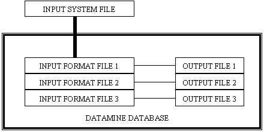

# SURLOG Process

To access this process:

  * Enter "SURLOG" into the [Command Line](<../COMMON/Command_Toolbar.md>) and press <ENTER>.
  * Display the **[Find Command](<../COMMON/findcommand.md>)** screen, locate **SURLOG** and click **Run**.

See this process in the [Command Table](<../command_help/COMMAND%20TABLE_S.md#SURLOG>).

## Command Overview

**SURLOG** is a data input process which will read a character format system file containing records of survey information and measurements as recorded on a digital data recorder by electronic survey equipment.

This process constitutes the first step in survey data processing, creating a Datamine file of the survey measurements. The file stored on the data logger containing the measurements will have to be transferred to the computer, as an ASCII format file, prior to running this process.

The process will create up to three output files of data containing general survey job information, coordinates of the survey stations occupied and referenced during the survey and angle and/or distance measurements taken to fix the position of survey stations or mining excavations. The output files can then be input to suitable survey measurement reduction processes:

  * [SURTAC](<surtac.md>)

Reduction of survey tacheometry measurements.

  * [SUROBS](<surobs.md>)

Reduction of measurements to survey stations.

It is suitable for the input of survey data, where job header information records are followed by measured angles and distances to surface or underground features. It can also be used for the input of borehole logs where header records containing borehole identifier and collar coordinates are followed by down-the-hole measurements to lithological contacts and mineral assay samples. The data needs to be processed further to compute sample positions in space for geological interpretation work:

  * [DESURV](<desurv.md>)

Drillhole survey data is used to produce a file of samples independently located in space.

  * SURLOG

Combines the data input capabilities of existing processes and provides extended flexibility in allowing the output to multiple files and also the re-formatting of data. The following processes allow the user to input fixed or free format data interactively or from an ASCII system file:

  * [INDATA](<indata.md>)

Free format data input (maximum of 80 character line width).

  * [INPUTW](<inputw.md>)

Fixed format data input (maximum of 240 character line width).

The format supplied by the user in these processes are fixed for every record read from the system file, and records not matching the prescribed format are rejected.

The reading of the input system file in **SURLOG** is controlled by user-defined input format files.

## File Handling

### Input system file of survey measurements.

The **SURLOG** process requires an ASCII system file of, typically, survey measurements, that have been transferred from a digital data recording device. Transmission of the data will normally be achieved through a serial communications cable. The data format is usually selected on the data recorder. If in doubt, the data must be transmitted as if sending to a printer device. A very basic way of achieving this, once the correct cable has been connected, would be to follow the following steps:
    
    
    type COM1>obs.dat

On the data recorder, send the data through command or menu selection. Once the transmission is complete:

On the PC press <CTRL> and Break keys to terminate the process. This example assumes the cable from the recorder is connected to COM1 serial port.

### Format Files

The system file that has been transferred from the data recorder, needs to be input to the Datamine database for reduction and analysis. SURLOG requires format files to have been created, in order to decode the information in the system file and create Datamine files of the survey measurements.

The process AED (Full-screen editor) can be used to set up the format files required for data to be input to your application. 

As a Datamine format file can be easily created or edited, formats that do not match those supplied can be easily supported, without the need to provide dedicated programs.

The following fields must be created in order to describe the field names and type in a new format file:

FIELD |  TYPE |  LENGTH |  STORED |  VALUES  
---|---|---|---|---  
FIELD |  A |  8 |  Y |   
TYPE |  A |  4 |  Y |  A,N  
LENGTH |  N |  4 |  Y |   
STORED |  A |  4 |  Y |  Y,N  
  
The following fields must be created in order to describe the position and format of the field values in the input system file:

FIELD |  TYPE |  LENGTH |  STORED |  VALUES  
---|---|---|---|---  
CODE |  A |  8 |  Y |   
FORMAT |  A |  4 |  Y |  FIX,FREE  
START |  A |  8 |  Y |   
END |  A |  8 |  Y |   
INFORMAT |  N |  4 |  Y |   
  
The following fields must be created in order to describe the output format and sequence of the field values in the output file to be created:

FIELD |  TYPE |  LENGTH |  STORED |  VALUES  
---|---|---|---|---  
OUFORMAT |  N |  4 |  Y |   
UNIT |  A |  4 |  Y |  ' ', DMS, GONS  
WRITE |  N |  4 |  Y |  0, 1, -1  
  
The interpretation of the input data is controlled by user defined format files. Each format file controls the data flow to one output file, and therefore, different categories of data can be stored in separate files.

## Examples

Input of data from a TOPCON FC-5 data recorder  
  
The following represents the command syntax required to run the SURLOG process to input the data described below and would be the required entry in a macro of commands to process survey data.  
  

    
    
    !SURLOG     &FORMAT1(TOPCF),&OUT1(TOPCD)  
  
---  
      
    
    TOPCON1.DAT  
  
## Error and Warning Messages

### Process entry

The following messages may appear as a result of the incorrect input supplied by the user, when running the process. These errors can be split into the following categories:-

### Files

The following messages relate to errors in the file names supplied by the user, when running the process.

*** Error |  \- One or both of the required files not specified:  
XXXXXXXX  
YYYYYYYY One or more of the required files, &**FORMAT1** , &**OUT1** has not been provided by the user. Fatal; the process will be exited.  
---|---  
*** Error |  \- Opening format file **FORMATX**  
File XXXXXXXX does not exist.  
  
The process can not open the input format file XXXXXXXX, as it does not exist. The file name may have been mis-typed, previously deleted or renamed. Re-enter the process and provide the correct file names. Fatal; the process will be exited.  
---|---  
*** Error |  \- Unable to write data definition to output file XXXXXXXX  
  
The process has been unable to create the output file XXXXXXXX. Check that there is sufficient hard-disk storage space available.  
---|---  
*** Error |  \- System file does not exist.  
  
The ASCII character system file specified does not exist. Check the file name supplied has not been mis-spelled. The process will be exited.  
---|---  
*** Error |  \- Both files &XXXXXXXX and &YYYYYYYY must be specified  
  
Input and output files must be specified in pairs. For each input format file, there must be a corresponding output file supplied.  
---|---  
  
### Fields

The following messages relate to errors in the field names supplied by the user, when running the process.

*** Error |  \- Symbolic field *XXXXXXXX not defined in the input FORMAT files.  
  
The user supplied field *XXXXXXXX does not exist in any of the input format files. Check the input format files specified with the **ADEDITOR** process. The process will be exited.  
---|---  
  
### Parameters

The following messages relate to errors in the parameters supplied by the user, when running the process.

*** Error |  \- Parameter XXXXXXXX value must be specified with coordinate field *XXXXXXXX   
  
One or more fields *X, *Y and *Z have been specified but the corresponding local origin parameters @**LOXORIG** , @**LOYORIG** , @**LOZORIG** have been omitted, or vice-versa. Re- enter the process and enter fields and parameters in pairs:  
*X \+ @**LOXORIG**  
*Y \+ @**LOYORIG**  
*Z \+ @**LOZORIG**  
Fatal; the process will be exited.  
---|---  
*** Error |  \- Unable to add local origin field to output file XXXXXXXX   
  
The process is unable to add an implicit local origin field specified by the parameters @**LOXORIG** , @**LOYORIG** , @**LOZORIG** to the output file indicated by XXXXXXXX. This file may already contain too many fields. Reduce the fields to the maximum required and re-enter the process. Fatal; the process will be exited.  
---|---  
  
### Processing

The following messages may appear as a result of errors encountered during the execution of the process. These errors can be split into the following categories:-

### Files

The following messages relate errors in reading and/or writing of data. 

*** Error |  \- Reading System file.  
  
The process failed while reading the supplied system file.  
---|---  
*** Error |  \- Writing to output file XXXXXXXX  
  
This file may be write protected or there may be insufficient disk space available.  
The output file XXXXXXXX has been created but the process is unable to write further records to it. The process will be exited.  
---|---  
  
### Input format file field contents

The following messages relate to errors encountered during the decoding of input data. They may be caused by inconsistencies in the field values within a &**FORMAT**? file, or mismatches in &**FORMAT**? file entries and the actual data being read from the system file.

*** Error |  \- Fixed format decode of field XXXXXXXX  
START field contains value YYYYYYYY   
Fixed format decode requires numeric column position only.  
---|---  
  
The field XXXXXXXX has been specified as **FIX** ed format in the input format file, but the START field column position contains a non-ascii character. Edit the input format file containing format data for field XXXXXXXX and provide the correct numeric column **START** position. Then re-run the process. Fatal; the process will be exited. 

*** Error |  \- Fixed format decode of field XXXXXXXX  
INFORMAT field contains value YYYYYYYY  
Fixed format decode requires numeric value only.  
---|---  
  
The **INFORMAT** value for field XXXXXXXX contains an alpha numeric entry. **INFORMAT** must be in the form n.m :  
  
ntotal number of digits in input (including decimal point).  
mnumber of digits after decimal point.

**START** and **INFORMAT** values in the input format file for field XXXXXXXX do not match the input data. Study the displayed input record to ensure the correct values are supplied. Fatal; the process will exited.

*** Error |  \- Fixed format decode of field XXXXXXXX  
START and INFORMAT field values construct format:   
FFFFFFFFFFFFFFFFFFFFFF   
This causes an error in decoding input record:  
RRRRRRRRRRRRRRRRRRRRRRRRRRRRRRRRRRRRRRRRRRRRRR  
---|---  
*** Error |  \- Free format decode of field XXXXXXXX  
START and END string value search starting beyond input record length.  
This process will process a maximum record length of YYYY  
---|---  
  
A FREE format decode of field XXXXXXXX has a START or END column value for search beyond the maximum acceptable record length.

*** Error |  \- Length of field XXXXXXXX in  
Format file defined by INFORMAT value does not match START and END positions  
---|---  
  
The field XXXXXXXX START and END values represent the columns of the first and last digit of the value in the system file respectively. The integer value of INFORMAT in the input format file represents the total length of this value. 
    
    
    END - START + 1 = Integer part of INFORMAT value.

The process will be exited.   
  
Input system file contents

The following message relates to errors encountered during the decoding of input data.

*** Error | \- Free format decode of numeric field  
XXXXXXXX non-numeric value found in input record  
RRRRRRRRRRRRRRRRRRRRRRRRRRRRRRRRRRRRRRRRRRRRRR   
---|---  
  
The value found for field XXXXXXXX in the input system file record displayed does not match the field type defined in the input format file. #12;Notes

### Limitations

Your application stores all numeric variables in **REAL** form. This puts a limitation on the number of digits that can be stored to 8, including a decimal point.

Angles in degrees, minutes and seconds, in the form DDD.MMSS, may be stored to single second precision. Any additional digits, representing tenths of seconds, will be ignored. As most Mine surveying does not require this level of precision in angle measurement, this will not cause problems to the user. The electronic total station should be set up to enable storage of angles to one second precision, so that rounding errors are not experienced.

Coordinate systems that require storage of more than seven digits, must have a local origin defined by one or all of the parameters @**LOXORIG** , @**LOYORIG** , and @**LOZORIG** required. The origin will then be stored as an implicit field in the data file. For example, a point with the following coordinates, could be stored directly into a Datamine database file:

X 1000.001  
Y 4000.001  
Z 1000.001

However, the following point would require a local origin for the X coordinate field:

Measured LOXORIG X value (stored)  
X 43000.001 40000.0 3000.001  
Y 4000.001 4000.001  
Z 1000.001 1000.001

This need only be considered for the computation of survey station coordinates, in most cases, as millimetre precision for general surface features is unnecessary.  
  
When **FREE** format input is specified, only one field may be allocated a value read between **START** and **END** separators. This is not the case with **FIXED** format input, where the same column locations (**START** and **END** values) may be assigned to more than one field.

**Caveats**

  * The system file must contain records with a maximum record length of 240 characters.

  * One input format file must be defined for each output file name supplied.

  * When FREE format input is being decoded, the user must ensure that the order of fields in the format file corresponds to the sequence found in the input system file. This is especially important where field values are separated by a single character (e.g. , ). 

  * Care must be taken in the use of wild card characters (?*) in the **CODE** values, as this may result in values being read from positions containing incorrect data.

Related topics and activities

  * [SURCAL Process](<surcal.md>)

  * [SURFIP Process](<surfip.md>)

  * SURLOG Process

  * [SURPOI Process](<surpoi.md>)

  * [SURTAC Process](<surtac.md>)

  * [SURTRI Process](<surtri.md>)

  * [SURVIG Process](<survig.md>)

  * [SURVIN Process](<survin.md>)

  * [SURVOU Process](<survou.md>)