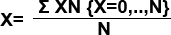

# SUROBS Process

To access this process:

  * Enter "SUROBS" into the [Command Line](<../COMMON/Command_Toolbar.md>) and press <ENTER>.
  * Display the **[Find Command](<../COMMON/findcommand.md>)** screen, locate **SUROBS** and click **Run**.

See this process in the [Command Table](<../command_help/COMMAND%20TABLE_S.md#SUROBS>).

## Command Overview

**SUROBS** is a process which reduces survey angle and distance measurements.

Angle and distance measurements are processed to output average values and associated mean standard errors. This represents an advanced alternative to process [SURTAC](<surtac.md>), in which no reduction is performed and no standard errors are computed. **SUROBS** also allows tolerances to flag unacceptable input measurements. Base-line bearing computations, reference plan distance and difference in elevation may also be computed.

There are three compulsory and one optional input files required by **SUROBS**. These may be summarized as:

  * &**HEADER** : a file containing survey job and location information (compulsory).

  * &**OBSERV** : a file containing the survey measurements to be reduced (compulsory).

  * &**CONTROL** : a file containing the coordinates and identification of established survey stations that will be used in the survey (compulsory).

  * &**TOL** : a file containing measurements tolerances for flagging errors in the input measurement file (optional).

There is one compulsory and one optional output file in **SUROBS**. These are:

  * &OUT: output file containing reduced survey observations (compulsory).

  * &ERROR: output file containing measurements that do not meet specifications defined in &**TOL** input file (optional).

Also consider the following:

  1. When only one record is available for a particular measurement then the output error fields referring to range or standard error are set to absent value.

  2. A maximum of twenty redundant observations for each pair **INSTSTN** -**TARGET** are allowed. If this limit is exceeded the process is exited with an error message.

  3. Checks are made for inconsistent angle measurements (for example, vertical angles readings of more than 90 , **WCB** and horizontal angle readings of more than 360 or less than 0 ). For these cases the records are ignored. In case of absent data for the horizontal angle to the reference station (field * **HZRO**), then a value of 0 is assumed.

  4. An important note refers to the precision of the coordinates handled in **SUROBS**. Although all variables are stored and handled by Double-Precision type variables and arrays, input and output measurements and coordinates are held in single precision type variables. In order to avoid output problems with values over 7 digits long, the use of parameters @**LOXORIG** , @**LOYORIG** and @**LOZORIG** is strongly recommended.

### Fields

All fields of the input files are compulsory. Therefore if any of these files are output from another process such as **[SURLOG](<surlog.md>)** or [SURTAC](<surtac.md>) the remaining compulsory fields should be added using for example process **ADDDDD**. The summary of compulsory fields required in the input files is:

&HEADER |  &OBSERV |  &CONTROL |  &TOL |  &OUT |  &ERROR  
---|---|---|---|---|---  
*JOBNUM *SURVEYOR *LEVEL *SECTION *INSTTYPE |  *JOBNUM *INSTSTN *INSTHT *RO *TARGET *HZTARG *VATARG *SDTARG *TARGHT *HZRO *VARO *SDRO *ROHT |  *STATION *X *Y *Z *RO *WCB *QB *HDIST *VDIFF *PLANE *FACTOR *REFRACT *HDERR *WCBERR *VAERR *ERRFLAG *LOXORIG *LOYORIG *LOZORIG |  *INSTTYPE *STNTYPE *HDTOL *HZTOL *VATOL *VDTOL |  *INSTSTN *INSTHT *RO *TARGET *HZA *WCB *QB *WCBERR *VA *HDIST *HDERR *RDIST *VDIFF *VDERR *PLANE *FACTOR *REFRACT *ERRFLAG |  *INSTSTN *INSTHT *RO *TARGET *HZA *WCB *QB *WCBERR *VA *HDIST *HDERR *RDIST *VDIFF *VDERR *PLANE *FACTOR *REFRACT *ERRFLAG  
  
Stations are identified by field * **STATION** in input file &**CONTROL** and fields * **INSTSTN** , * **TARGET** and * **RO** in input file &**OBSERV**. These must be alphanumeric and eight characters in length. A particular survey instrument or method used may be specified in a four-character alphanumeric field * **INSTTYPE** of files &**HEADER** and &**TOL**. Alphanumeric fields * **SURVEYOR** , * **LEVEL** and * **SECTION** of file &**HEADER** refer to descriptive information of the surveyor and region of the survey and must be eight characters in length. 

Field * **STNTYPE** in file &**TOL** refers to the station type (**RO** or **TARGET**) for tolerances specification and must be four characters in length. Field **QB** refers to the quadrant bearing and must be twelve characters in length. All the remaining fields are numeric.

### Mathematical Algorithms

Means are computed by the standard algebraic method:

Where:

  * X = Compute mean value

  * N = Number of observations

  * XN = Value of the Nth observation

Ranges are computed from the observations available (excluding those containing absent data) as: 

R = XMX \- XMN

Where: 

  * XMX = Maximum measurement value

  * XMN = Minimum measurement value

  * R = Computed range

Standard errors of the mean are computed as:

Where: 

  * X = Mean value of the observations

  * N = Number of observations

  * XN = Value of the Nth observation

  * SE = Standard error of the mean

When parameter @PLANE is not absent data, computed horizontal distances have to be adjusted as:

RDIST = HDRO - {HDRO * [(INSTHT + 0.5 * VDIFF) - PLANE]} / WRAD

Where: 

  * RDIST = Adjusted plane distance 

  * HDRO = Computed horizontal distance

  * INSTHT = Elevation of the instrument station  

  * VDIFF = Computed difference in height between station and target

  * PLANE = Elevation to which the distance is to be adjusted (@PLANE)  

  * WRAD = Radius of the world (6,384,100 metres)

When parameter @REFRACT is not absent value, vertical angles are adjusted as: 

Where: 

  * VAadj = Adjusted vertical angle

  * VA = Measured vertical angle

  * HDIST = Computed horizontal distance  

  * WRAD = Radius of the world (6,384,100 metres)  

  * K = Supplied coefficient of refraction (@REFRACT[SURTRI Process](<surtri.md>)

  

## Input Files

  
Name| Description| I/O Status| Required| Type  
---|---|---|---|---  
HEADER| Input header information, containing survey job and location information. This file may have been created by the **[SURLOG](<surlog.md>)** process (input of field recorder data) or the screen editor process **AED**. This file must contain the following fields ((N) denotes Numeric, (A,8) denotes Alphanumeric field type and length):- **JOBNUM** (N) Survey job number. **SURVEYOR** (A,8) Surveyor's name. **LEVEL** (A,8) Region of survey. **SECTION** (A,8) Area of survey. **INSTTYPE** (A,4) Survey instrument or methods used.| Input| Yes| Undefined  
OBSERV| Input file of survey measurements. This file must contain the following fields ((N) denotes Numeric, (A,8) denotes Alphanumeric field type and length):- **JOBNUM** (N) Survey job number.**INSTSTN** (A,8) Survey station identifier for the instrument location.**INSTHT** (N) Instrument height. (Negative for instruments set below the survey station). **RO** (A,8) Survey station identifier for the reference object survey station.**TARGET** (A,8) Identifier of the survey station located. **HZTARG** (N) Horizontal direction measured to the target. **VATARG** (N) Vertical direction measured to the target. **SDTARG** (N) Slope distance measured to the target. **TARGHT** (N) Target height. (Negative for target set below the target point). **HZRO** (N) Horizontal direction measured to the reference object. **VARO** (N) Vertical direction measured to the reference object. **SDRO** (N) Slope distance measured to the referenec object. **ROHT** (N) Target height at the reference object. (Negative for target set below the target point). This file file may have been created as output from the **SURLOG** process.| Input| Yes| Undefined  
CONTROL| Input file of survey control stations. This file must contain the following fields ((N) denotes Numeric, (A,8) denotes Alphanumeric field type and length):- **STATION** (A,8) Survey station identifier. **X** (N) X coordinate value. **Y** (N) Y coordinate value. Z (N) **Z** coordinate value. **RO** (A,8) Identity of station used to locate STATION. **WCB** (N) Whole Circle Bearing from STATION to RO. Referred to as azimuth elsewhere in your application. **QB** (A,12)Quadrant Bearing STATION to RO. (e.g. N 45.0000 E). **HDIST** (N) Horizontal distance from STATION to RO. **RDIST** (N) Reduced distance from STATION to RO, as computed at PLANE elevation. **VDIFF** (N) Vertical difference in height from STATION to RO. **PLANE** (N) Elevation to which HDIST has reduced to compute RDIST. If absent (-), no further reduction has been computed. **FACTOR** (N) Scale factor used to compute RDIST. **REFRACT** (N) Coefficient of refraction used to compute VDIFF where only a single forward vertical angle is used. **HDERR** (N) Mean standard error or range of horizontal distances from RO to STATION. **WCBERR** (N) Mean standard error or range of horizontal angles used in computing the bearing from RO to STATION. **VAERR** (N) Mean standard error or range of vertical angles used in computing VDIFF from RO to STATION. **VDERR** (N) Mean standard error or range of computed VDIFF from RO to STATION. ERRFLAG (N) Flag to identify when a measurement tolerance is exceeded. **ADJUST** (N) Flag to identify if the station coordinates are adjusted. **LOXORIG** (N) Implicit local X origin field. **LOYORIG** (N) Implicit local Y origin field. **LOZORIG** (N) Implicit local Z origin field.| Input| Yes| Undefined  
TOL| Optional file of measurement tolerances for the flagging of errors in measurements processed from the input **OBSERV** file, and written to the output **ERROR** file, if supplied. This file must contain the following fields:- **INSTTYPE** (A,4) Survey instrument or methods used. **STNTYPE** (A,4) Must contain a value RO or TARGET, to allow different tolerances to be specified for checks onto existing base-lines (RO) and the establishment of new base- lines (TARGET). **HDTOL** (N) Maximum mean standard error of observed horizontal distance measurements. **HZTOL** (N) Maximum mean standard error of observed horizontal angle measurements. **VATOL** (N) Maximum mean standard error of observed vertical angle measurements. **VDTOL** (N) Maximum mean standard error of computed differences in elevation.| Input| No| Undefined  
  
## Output Files

Name| I/O Status| Required| Type| Description  
---|---|---|---|---  
OUT| Output| Yes| Undefined| Output file of reduced survey observations. This file may be used as input to the **[SURCAL](<surcal.md>)** process, in order to compute survey station coordinates. This file will contain the following fields:- **INSTSTN** (A,8) Survey station identifier for the instrument location. **INSTHT** (N) Instrument height. (Negative for instruments set below the survey station). RO (A,8) Survey station identifier for the reference object survey station. **TARGET** (A,8) Identifier of the survey station located. HZA (N) Mean horizontal angle measurement made to the target station. **WCB** (N) Whole Circle Bearing from INSTSTN to TARGET. **QB** (A,12)Quadrant Bearing INSTSTN to TARGET. **WCBERR** (N) Mean standard error or range of measurements taken to establish the Whole Circle Bearing INSTSTN \- TARGET. **VA** (N) Mean vertical angle measurement made to the target station. **HDIST** (N) Mean horizontal distance from INSTSTN to TARGET. **HDERR** (N) Mean standard error or range of horizontal distances from slope distances and vertical angles. **RDIST** (N) Reference plane distance from INSTSTN to TARGET as computed from the horizontal distance HDIST. **VDIFF** (N) Mean difference in elevation from INSTSTN to TARGET. **VDERR** (N) Mean standard error or range of computed height differences from INSTSTN to TARGET. **PLANE** (N) Reference plane used to compute RDIST from HDIST. If absent, RDIST = HDIST. **FACTOR** (N) Scale factor used to compute RDIST after reduction to PLANE. The default must be 1. **REFRACT** (N) Coefficient of refraction used to adjust vertical angles where single measurements are made. **ERRFLAG** (N) Error flag field. Four digits may be set as follows:- ABCD e.g. 

  * 1001 A Horizontal angle tolerance was/was not exceeded. 
  * 1/0 B Vertical angle or vertical difference tolerances were /were not exceeded. 
  * 1/0 C Horizontal distance tolerance was/was not exceeded. 
  * 1/0 D The previous base-line (INSTSTN to RO) carried/ did not carry errors. >1/0

  
ERROR| Output| No| Undefined| Optional output file of measurements that do not meet the tolerances specified in the input tolerance file ( **TOL**). If this file is not defined, all measurements will be sent to the output file . This file will contain the same fields as the output file of reduced survey measurements ( **OUT**).  
  
## Parameters

Name| Description| Required| Default| Range| Values  
---|---|---|---|---|---  
ANGLE| Units of angle measurements : 1 = Degrees, minutes and seconds. [0-360] in the form DDD.MMSS 2 = Gradians. [0-400] The default angle unit is degrees, minutes and seconds (1).| No| 1| 1,2| 1,2  
VADMEAN| Compute the mean of both forward and reverse angle and measurements if available. This will obviate the need to adjust for curvature and refract, defined in parameter REFRACT. The default is (1), to use forward and reverse measurements.| No| 1| Undefined| Undefined  
ERRTYPE| Sets the error fields to report the mean standard error [1] or the range [2] of measurements. The default is to report mean standard errors (1).| No| 1| 1,2| 1,2  
PLANE| Optional reference plane elevation to which horizontal distances will be computed. The default is not to reduce horizontal distances to reference plane (-).| No| -| Undefined| Undefined  
FACTOR| Optional scale factor that may be applied to the reduced distance RDIST. The default setting is (1).| No| 1| Undefined| Undefined  
REFRACT| Optional coeficient of refraction used for adjustment of vertical angles. The default is not to apply correction to vertical angle (-).| No| -| Undefined| Undefined  
PRINT| Set to one to display a summary of results to the screen. The default is not to print summary results (0).| No| 0| 0,1| 0,1  
  
Example
    
    
    !SUROBS  &HEADER(HEADER),&OBSERV(OBSERV),&CONTROL(CONTRALL),  
  
---  
      
    
    &OUT(OUT),@ANGLE=1.0,@VADMEAN=1.0,@ERRTYPE=1.0,  
      
    
    @FACTOR=1.0,@PRINT=1.0  
  
## Error and Warning Messages

Message| Description  
---|---  
*** Error - File &HEADER is missing essential field FFFFFFFF. | A compulsory field FFFFFFFF is missing from the input &**HEADER** file and must be added to the file (for example using process **ADDDD**). Fatal; the process is exited.  
*** Error - File &OBSERV is missing essential field FFFFFFFF. | A compulsory field FFFFFFFF is missing from the input &**OBSERV** file and must be added to the file (for example using process **ADDDD**). Fatal; the process is exited.  
*** Error - File &CONTROL is missing essential field FFFFFFFF.| A compulsory field FFFFFFFF is missing from the input &**CONTROL** file and must be added to the file (for example using process **ADDDD**). Fatal; the process is exited.  
*** Error - File &TOL is missing essential field FFFFFFFF. | A compulsory field FFFFFFFF is missing from the &**TOL** optional input file and must be added to the file (for example using process **ADDDD**). Fatal; the process is exited.  
*** Error - Both files &TOL and &ERROR have to be specified.| The optional input file &**TOL** and the optional output file &**ERROR** must be both specified when tolerances are to be used. Fatal; the process is exited.  
*** Error - Field FFFFFFFF of &HEADER file has to be nn characters long.| The alphanumeric field FFFFFFFF is defined in the input &**HEADER** file with an incorrect length. Fatal; the process is exited.   
*** Error - Field FFFFFFFF of &OBSERV file has to be nn characters long.| The alphanumeric field FFFFFFFF is defined in the input &**OBSERV** file with an incorrect length. Fatal; the process is exited.  
*** Error - Field FFFFFFFF of &CONTROL file has to be nn characters long.| The alphanumeric field FFFFFFFF is defined in the input &**CONTROL** file with an incorrect length. Fatal; the process is exited.   
*** Error - Field FFFFFFFF of &TOL file has to be nn characters long. | The alphanumeric field FFFFFFFF is defined in the input &**TOL** file with an incorrect length. Fatal; the process is exited.  
*** Error - Field FFFFFFFF has to be nn characters long in both inpu t file s &OBS ERV and &TOL . | A mismatch of field lengths or types was found for field FFFFFFFF in input files &**OBSERV** and &**TOL**. Fatal; the process is exited.  
*** Error - Field FFFFFFFF has to be nn characters long in both inpu t file s &HEA DER and &TOL .| A mismatch of field lengths or types was found for field FFFFFFFF in input files &**HEADER** and &**TOL**. Fatal; the process is exited.  
  
Related topics and activities

  * [SURCAL Process](<surcal.md>)

  * [SURFIP Process](<surfip.md>)

  * [SURLOG Process](<surlog.md>)

  * [SURPOI Process](<surpoi.md>)

  * [SURTAC Process](<surtac.md>)

  * [SURTRI Process](<surtri.md>)

  * [SURVIG Process](<survig.md>)

  * [SURVIN Process](<survin.md>)

  * [SURVOU Process](<survou.md>)