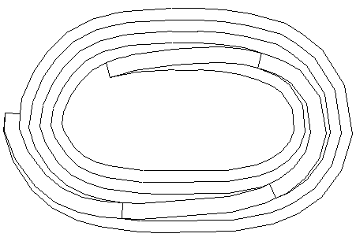
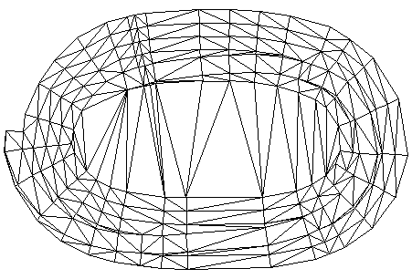

# SURTRI Process

To access this process:

  * **Explicit** ribbon **> > DTM >> Make >> DTM from Files**.

  * Enter "SURTRI" into the [Command Line](<../COMMON/Command_Toolbar.md>) and press <ENTER>.
  * Display the **[Find Command](<../COMMON/findcommand.md>)** screen, locate **SURTRI** and click **Run**.

See this process in the [Command Table](<../command_help/COMMAND%20TABLE_S.md#SURTRI>).

## Command Overview

Generate a triangulated digital terrain model from perimeter, string and/or point data subject to optional boundary and string edge constraints. 

Points, strings, perimeters and boundaries may be input to the process. Additional points may be added into strings. Crossing strings are automatically resolved. Points duplicated within a tolerance are removed. Maximum separation of points to be joined may be specified. Boundaries may be 2D or 3D internal or external. The centre of gravity of each triangle may be output. An error trace file containing a dump of data may be produced to help locate bad data.

**Note** : Input files for **SURTRI** must not exceed 60,000 strings.

The points used in the tessellation are output into a wireframe points file &**WIREPT** with fields **XP, YP, ZP** and an additional field PID which is the point number allocated by **SURTRI**. The triangle definitions are output into a wireframe triangle file &**WIRETR** with fields **PID1, PID2** and **PID3** which identify the points at each vertex. Additional fields **XBAR, YBAR** and **ZBAR** defining the centre of gravity of each triangle may optionally be added to the triangle file. These output files may be used as input to other wireframing processes such as [ADDTRI](<addtri.md>), [TRIFIL](<trifil.md>), [PLOTWS](<plotws.md>), [ISOTRI](<isotri.md>), [PLOTTR](<plottr.md>), [TRICON](<tricon.md>), [TRIVOL](<trivol.md>), [WIREPE](<wirepe.md>).

### Boundaries

The tessellation may be constrained by a number of bounding perimeters. These perimeters are input via the &PERIMIN file. Bounding perimeters may form either internal or external boundaries. External boundaries will restrict tessellation to within the perimeter while internal boundaries will restrict tessellation to outside the perimeter.

A combination of internal and external boundaries may be used at one time subject to the following rules:

  * Boundaries must not cross each other.
  * If internal and external boundaries are both present then each internal boundary must be fully contained within an external boundary.

Boundary perimeters may be treated as 2D cookie cutters (@**SYSTEM** =2) or as 3D edges to be included in the tessellation (@**SYSTEM** =3). If 2D boundaries are used then the tessellation will be confined to points within the perimeter. If no external boundaries are used then the tessellation will be confined outside any internal boundaries and within the convex hull of all points.

Perimeters boundary type may be set using an optional * **BOUNDARY** field on the &**PERIMIN** file or via the @**BOUNDARY** parameter.

The **BOUNDARY** parameter may have the values:

- |  missing (use @BOUNDARY),  
---|---  
0 |  edge constraint only,  
1 |  external boundary or  
2 |  internal boundary.  
  
All perimeters in the &**PERIMIN** file are treated as closed polygons. They may or may not be explicitly closed with the first and last points being the same.

### Edges

Edge constraints may be input to the tessellation as open or closed strings via the &**STRING** file or as closed perimeters from the &**PERIMIN** file. All strings should be 3D as they are included in the tessellation as points. Perimeters from &**PERIMIN** are included as edges if @**SYSTEM** = 3.

The resultant tessellation will honor all string and perimeter edges provided edges do not cross. Where an edge crosses another edge priority will be given arbitrarily to one edge. Where an edge crosses a bounding edge an additional point will be inserted into the string just inside the boundary. The distance from this point to the boundary is determined by the height to base ratio of the triangle formed by the 2 boundary edge points and the new point. This ratio may be controlled using the @**HBRATIO** parameter. In the vast majority of cases the default value (0.05) should suffice.

Strings and perimeters therefore may cross over each other and any boundaries.

Additional points may be inserted into strings to improve the tessellation. The maximum separation of points inserted is defined by the @DMAX parameter.

### Points

All points input to the tessellation including those from &**POINTIN** as well as string points, 3D boundary points and additional points created using @**DMAX** are filtered for duplicates using a finite tolerance. The default value for this (0.001) may be overwritten using the @**TOL** parameter however the actual tolerance used may be increased by the program. The minimum accepted tolerance is set to the maximum range of the data (**XMAX-XMIN** or **YMAX-YMIN**) divided by 500000. The tolerance used is written to the screen.

### Partitions

The maximum number of points in total that may be passed to the Delaunay algorithm is limited by the size of the real array compiled into your application. Typically this is 500000 bytes on a workstation or 100000 bytes on a PC. The maximum number of points is ( bytes/20 -3 ). For 500000 bytes this equates to 24297 points. If this value is exceeded **SURTRI** will automatically partition the data into multiple passes. The maximum number of points per pass may be reduced using the @**MAXPTS** parameter (this should only be required for testing the process).

**SURTRI** partitions according to sub-ranges of X or Y depending on which has the largest overall range. Each partition will have a Delaunay optimum tessellation, however the process of knitting together partitions may not be optimum. Strings crossing partitions will be honored. If **SURTRI** goes into partitioning some points may be duplicated in the output points file although this will not cause any problems with the model.

### Trace file

**SURTRI** has the option of outputting a file, **SURTRI.TRC** containing a dump of the point and edge data passed to the tessellation algorithm for each pass. This file may also contain a set of plot commands that may be interpreted by the **MINSURV** program. The amount of trace output is controlled by the @**ERRTRACE** parameter.

The tessellation program will return an error status for each pass, = 0 no error = 1 warning = 2 for a serious error. Normally if a serious error is encountered the process will stop and no points or triangles will be output. Setting @**ERRTRACE** will force the output of data despite a serious error. Triangles produced in this way should not be used in subsequent processing.

The SURTRI.TRC file may be used to interpret error messages from the tessellation program. It contains a list of points and edges with their co-ordinates. Error messages from the routines **DELAUN, EDGE, BCLIP** and **TCHECK** may refer to point numbers and edges in this file.

### Errors in triangulation

During a triangulation pass a number of error messages may appear from the following routines.
    
    
    ***ERROR IN DELAUN***  
    ***ERROR IN BCLIP***  
    ***ERROR IN EDGE***  
    ***ERROR IN TCHECK***

At the end of each triangulation pass an error status flag will be reported. This flag has the values:

  * 0 no error.

  * 1 warning.

  * 2 serious.  

The error messages will usually give a reference to point or edge numbers. The coordinates of these may be checked by running **SURTRI** with @**ERRTRACE** =1 and reading the output SURTRI.TRC file.

Errors with a status of 1 usually refer to crossing strings and may be ignored.

Serious errors are likely caused by duplicate points that have not been filtered. try increasing the tolerance using the @TOL parameter.

## Input Files

Name |  Description |  I/O Status |  Required |  Type  
---|---|---|---|---  
PERIMIN |  Input perimeter file containing **XP,YP,ZP,PTN, PVALUE** and optional **BOUNDARY** fields. Perimeters may be included in the triangulation and/or used as boundaries.ALL are assumed closed. The **BOUNDARY** field may have the values : - missing (use **BOUNDARY**) , 0 edge constraint, 1 external boundary or 2 internal boundary. |  Input |  No |  String  
STRING |  Input string file containing **XP,YP,ZP,PTN** and **PVALUE** fields. String segments are included in the triangulation as 3D edge constraints, breaklines. Strings may be open or closed. |  Input |  No |  String  
POINTIN |  Input point file containing **XPT,YPT,ZPT** fields. |  Input |  No |  Point Data  
  
## Output Files

Name |  I/O Status |  Required |  Type |  Description  
---|---|---|---|---  
WIRETR |  Output |  Yes |  Wireframe Triangle |  Output wireframe triangle file. May include additional **XBAR,YBAR** and **ZBAR** fields.  
WIREPT |  Output |  Yes |  Wireframe Points |  Output wireframe point file.  
  
## Fields

Name |  Description |  Source |  Required |  Type |  Default  
---|---|---|---|---|---  
XPT |  X field in input point file. |  POINTIN |  No |  Numeric |  Undefined  
YPT |  Y field in input point file. |  POINTIN |  No |  Numeric |  Undefined  
ZPT |  Z field in input point file. |  POINTIN |  No |  Numeric |  Undefined  
  
## Parameters

Name |  Description |  Required |  Default |  Range |  Values  
---|---|---|---|---|---  
SURFACE |  Optional surface identifier, +1 for upper surface, -1 for lower (1). |  No |  1 |  -1, 1 |  -1,1  
BOUNDARY |  Default boundary specifier for perimeters. Used if the **BOUNDARY** field does not exist in **PERIMIN** or has a missing value (0). 0 edge constraints, must be 3D, 1 external boundary or 2 internal boundary. |  No |  0 |  0,2 |  0,1,2  
SYSTEM |  Defines the treatment of boundary perimeters **BOUNDARY** = 1 or 2 from **PERIMIN** (3). 2 perimeters are 2D and used only as constraints. 3 perimeters are 3D and are included in the triangulation. |  No |  3 |  2,3 |  2,3  
DMAX |  The maximum separation of additional points interpolated into long string segments to improve the triangulation. |  No |  Undefined |  Undefined |  Undefined  
MAXLINK |  Maximum separation of points that will be joined by a triangle. |  No |  Undefined |  Undefined |  Undefined  
TOL |  Tolerance distance below which points are considered to be duplicated. If too small this value may automatically be increased by the program. |  No |  Undefined |  Undefined |  Undefined  
COG |  Used to include extra fields containing the coordinates of the centre of gravity of each triangle in output triangle file (0): |  Option |  Description  
---|---  
0 |  \- do not include **XBAR,YBAR** or **ZBAR** .  
1 |  \- include **ZBAR** only.  
2 |  \- include **XBAR,YBAR**  
No |  0 |  0,2 |  0,1,2  
ERRTRACE |  Used to control the amount of error messages and the creation of a system file SURTRI.TRC containing a dump of points and edges for tracing errors. Also may be used to force the creation of output points and triangle records despite a serious error(0). |  Option |  Description  
---|---  
0 |  \- no error trace, reduced error messages.  
1 |  \- create **SURTRI.TRC** , force output, full error reporting.  
2 |  \- as 1 plus include **MINSURV** plot records.  
No |  0 |  0,2 |  0,1,2  
HBRATIO |  Height to base ratio of triangles created to resolve crossing strings (0.05). |  No |  0.05 |  Undefined |  Undefined  
MAXPTS |  Overwrite the program limitation on maximum points per partition with a smaller value. May be used to force partitioning for testing (-). |  No |  - |  Undefined |  Undefined  
CHECK |  |  No |  1 |  0,1 |  0,1  
  
## Example

### Example 1:
    
    
    !SURTRI&WIREPT(PT),&WIRETR(TR),&PERIMIN(BOUND),          
  
---  
      
    
    &STRING(STRINGS),&POINTIN(POINTS),*XPT(X),*YPT(Y),  
      
    
    *ZPT(Z),@SURFACE=1,@BOUNDARY=1,@SYSTEM=3,@DMAX=40,  
      
    
    @MAXLINK=200.0,@COG=1,@ERRTRACE=1  
  
### Example 2:

This example demonstrates the honoring of strings in a DTM of a pit design. The input perimeters and resultant triangles are displayed using [PLOTPE](<plotpe.md>) and [PLOTTR](<plottr.md>) respectively.

Plot the design pit perimeters (Figure 1)
    
    
    !PLOTPE     &PROTO(PROTO),&IN(PITDESN),&PLOT(PLOT1)  
  
---  
  
Triangulate the perimeters:
    
    
    !SURTRI&WIREPT(PT),&WIRETR(TR),  
  
---  
      
    
    &PERIMIN(PITDESN),@SURFACE=1,          
      
    
    @BOUNDARY=1, @SYSTEM=3  
  
Plot the triangle (Figure 2)
    
    
    !PLOTTR   &PROTO(PROTO),&WIREPT(PT),&WIRETR(TR),&PLOT(PLOT2)  
  
---  
  
;>)

Pit design perimeters.

;>)

DTM Triangles.

## Error and Warning Messages

Message |  Description  
---|---  
>>> ERROR IN POINTIN FIELDS <<< |  Check field names in &POINTIN.  
>>> ERROR IN PERIMIN FIELDS <<< |  Check field names in &PERIMIN.  
>>> ERROR IN STRING FIELDS <<< |  Check field names in &STRING.  
>>> THERE ARE NO FILES OPEN <<< |  At least one of &POINTIN, &STRING or &PERIMIN must be specified.  
>>> ERROR IN WIREPT FIELDS <<< or >>> ERROR IN WIRETR FIELDS <<< |  Problem creating output files  
>>> Too many perimeters and strings |  Datamine string limit exceeded.  
>>> There are no points to be triangulated |  No points found on or in boundary. Check points file and boundaries.  
>>> Error - Points are collinear |  Check points.  
>>> Error - Further partitioning impossible <<< |  Cannot partition points within a boundary. There may be too many points in the boundary perimeter.  
>>> Error -There are not enough points. |  Less than 3 points to triangulate.  
  
Related topics and activities

  * [SURCAL Process](<surcal.md>)

  * [SURFIP Process](<surfip.md>)

  * [SURLOG Process](<surlog.md>)

  * SURTRI Process

  * [SURPOI Process](<surpoi.md>)

  * [SURTAC Process](<surtac.md>)

  * [SURVIG Process](<survig.md>)

  * [SURVIN Process](<survin.md>)

  * [SURVOU Process](<survou.md>)