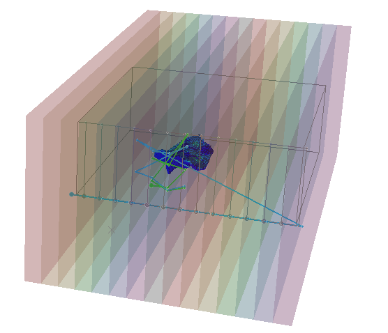
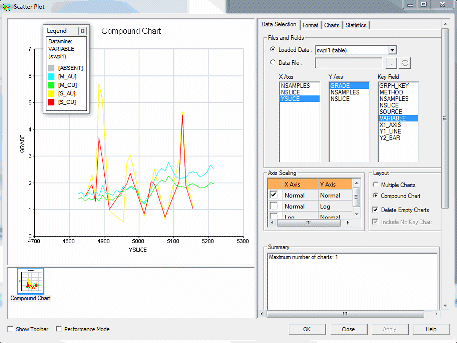
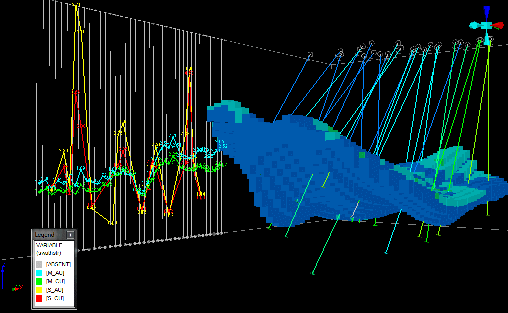
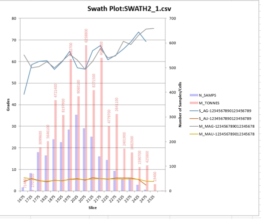
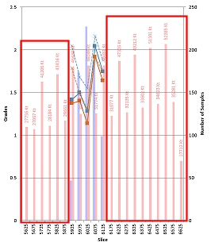

# SWATHPLT Process

To access this process:

  * **Estimate** ribbon **> > Validate >> Swath**.
  * Display the **[Find Command](<../COMMON/findcommand.md>)** screen, select **SWATHPLT** and click **Run**.
  * Enter "SWATHPLT" into the [Command Line](<../COMMON/Command_Toolbar.md>) and press <ENTER>.

See this process in the [Command Table](<../command_help/COMMAND%20TABLE_S.md#SWATHPLT>).

## Process Overview

**Note** : This is a _superprocess_ and running it may have an effect on other Datamine files in the project.

In the mineral industry, mineral resource estimators typically prepare moving window mean plots as part of the validation of block model grade estimates. This process involves dividing the block model and the data used to estimate the blocks into slices of appropriate width typically some multiple of the drill spacing with slices created along the northing, easting and elevation directions. These 'swaths' of data can be used to form a picture of estimates and their viability.

Retrieval criteria are not permitted. If you want to select just part of a model for evaluation you must first make a copy of the model using retrieval criteria, then process it via **SWATHPLT**.

The **SWATHPLT** process creates data files that are suitable for automatically creating swath plots. This data is generated as both output Datamine results and 3D data (strings and wireframes), and also as comma-separated data (.csv) for further investigation in other products, such as Microsoft Excel. In fact, **SWATHPLT** optionally outputs data directly to Excel, showing useful zone-specific grades and tonnes in model or sample (or both) inputs for comparison.

The process divides the model volume into slices (represented by distinct wireframe volumes within the same output object) in any direction (including off-axis orientations) and calculates the average model grade(s) and average sample grade(s) within each 'swath'. These swaths are defined as wireframe volumes that can be optionally output and visualized. String files are also output, representing the legacy data used to construct swath plots in older Studio products. Essentially, output strings are not used in volume calculations in modern Studio products.

**SWATHPLT** outputs summary data files that can be used to generate swath plots, either in your product or another application.

A swath plot is a graphical display of the grade distribution derived from a series of bands, or swaths, generated in several directions through the deposit. One example of their use is comparing Kriged grade variations to the distribution derived from the declustered input sample data. On a local scale, sample data does not provide reliable estimations of grade but, on a much larger scale, it represents an unbiased estimation of the grade distribution based on the underlying data. Therefore, if the Kriged model is unbiased, the grade trends may show local fluctuations on a swath plot but the overall trend should be similar to the sample distribution of grade.

_SWATHPLT output wireframe, strings and model file_

Swaths can either be unrotated or rotated. **SWATHPLT** provides **ANGLE** and **ROTAXIS** fields to define multi-stage rotations.

## Field Names and Prefixing

**SWATHPLT** needs to distinguish between model and sample grades in the output files. This is done by prefixing the grade field name by S_ for sample grades and M_ for model grades. To achieve this the number of characters in the input grade field names is restricted to to 22 characters. If the grade field names have more than the maximum number of characters then the process terminates with an error message.

## Grade Weighting

An optional input field **DCWEIGHT** can be used to weight the sample grades in the calculation of mean values. This would be appropriate for a declustering weight. There is also an optional **DENSITY** field for the model file. If the model includes a density field and it is selected then each cell will be weighted by tonnes (volume * density) for calculating the mean grades. Absent data density values will be replaced by the value of the @**DENSITY** parameter. If a * **DENSITY** field is not selected then the model grades will be weighted by volume.

### Defining Fields for Graphing

Up to 10 fields from the model file can be specified for graphing. The fields * **GRADE1** to * **GRADE10** must occur in the input model file. If a specified model field also exists in the input sample file that will also automatically be used for graphing. The fields * **SGRADE1** to *SGRADE10 can be used to specify numeric fields that exist in the input sample file but not the model file. If a field exists in both the input model and sample files it only needs to be specified once.

A field in the input sample file can be specified to be used as a declustered weight field. If the declustered weight field is specified but does not exist in the input sample file it is ignored.

The Slice width is specified in either the X, Y or Z direction using the parameters @**WIDTH** and @**DIRECTN**. Optionally, you can also orient the swaths in any direction using the @**ANGLE1/2/3** and @**ROTAXIS1/2/3** parameters. 

For rotated models the X, Y and Z slices are oriented in relation to the rotated model, i.e. if no rotation angles or axes are specified, swaths are oriented in a direction orthogonal to the rotated model, not the world easting, northing and elevation. Similarly, if swaths are rotated in any direction, the orientation is in relation to the coordinate system adopted by the rotated model.

The reference coordinate for the start of the swath plot is taken from the model origin. The minimum coordinate value in the (optional) sample file is checked to create slices outside the model if necessary.

## About Output Files

The two output plot data tables have the same content but it is stored in a different structure in each file. SWATH1 is suitable for graphing in Studio's plot window, as in the image below. The X Axis should be the X, Y or Z Slice, the Y axis should be GRADE and the Key Field to use is VARIABLE.

The output table **SWATH2** is more suitable for generating a graph in Excel, as in the example image below. The output strings can be loaded to check the orientation of the Swath slices and to see the relative grade values. Use a legend based on the VARIABLE field to colour the strings appropriately.

The CSV parameters are optional. If a value of 1 is supplied, then comma separated (csv) files will be written for the output files. Setting @**CSVOUT1** to 1 rather than zero will output a .csv file for the file specified by &**SWATH1**

;>)

_Example of a swath plot in Studio RM based on the contents of the_**SWATH1** _output file_

The output strings can be loaded to check the orientation of the swath slices and to see the relative grade values. Use a legend based on the **VARIABLE** field to colour the strings appropriately.

;>)

As mentioned above, you can also output the wireframes used to calculate grades and tonnages, and visualize them in relation to the input model and (optionally) samples after processing.

## Excel Output (@EXCEL=1)

**Note** : Microsoft Excel 2010 or later is required on the local PC in order to view output from this command.

The output table **SWATH2** is more suitable for generating a graph in Excel, as in the example image below. In fact, if you set the @**EXCEL** parameter to 1, and Excel is installed on your system, your output @**SWATH2** data will be loaded automatically into Excel.

;>)

The results shown in the output files and the Excel spreadsheet include the number of sample records for each slice and a histogram on the plots. The sample record value includes records for any absent data grades. There may be different numbers of absent data values for the different grades. The number of sample records is shown in the results (**NRECORDS**).

The CSV parameters are optional. If a value of 1 is supplied, then comma separated (csv) files will be written for the output files. Setting @**CSVOUT1** to 1 rather than zero will output a csv file for the file specified by &**SWATH1**

  * Excel output can be generated with or without a specified &**SAMPLES** file. If no sample grade information exists, model tonnes and grade will be reported per slice.
  * If slices possess a zero value for model or sample grades (but not absent values), slices will still be displayed for those zero grade swaths. For example, the image below represents output from a model where only a subset of swaths contain model and sample grade information. Whilst the surrounding slices have a non-zero model tonnage (**M_TONNES**), the grade for those slices is zero:  
  

## SWATHPLT Zone Support

**SWATHPLT** can optionally output CSV data containing per-zone information, or summary information can be output representing all zones within the data set. 

How data is created (and interpreted in Excel, if @**EXCEL** =1) is dependent on how or if the *ZONEFLD field and &ZONEVAL parameter are used.

  * If *ZONEFLD is specified and @ZONEVAL contains a valid value, data will be generated for the nominated zone value only. For example, to report against a single rock type.
  * If *ZONEFLD is specified and @ZONEVAL is absent, data will be generated for all zones (but segregated by zone). If @EXCEL = 1, a separate worksheet will be generated for each unique value in *ZONEFLD.
  * If *ZONEFLD is not specified, regardless of the @ZONEVAL setting, no zonal control will be applied and only summary (all zones) information will be generated.

If a *ZONEFLD is selected but a @ZONEVAL is not selected then two additional parameters can be applied:

  * @ALLZONES: this parameter defines whether the average results over all ZONEVALs should be calculated as well as results for individual ZONEVALs:

    * **=0** : Only calculate results for individual ZONEVALs; do not calculate average results over all ZONEVALs. 

    * **=1** : Calculate results for individual ZONEVALs and average results over all ZONEVALs. 

  * @ALLZNVAL: this defines the ZONEFLD value to be assigned to the results for the average over all ZONEFLDs. This must be chosen so that it is not the same as any of the individual ZONEVAL values; if it does match then the process will terminate with an error message. The default is 9999999. 

## Input Files

An input model file must be specified. A sample file can optionally be specified. The grade fields to be reviewed do not have to occur in both the model and the sample file. Typically, a model and a sample file may be specified to compare the interpolated model values with the sample values. If a sample file is not specified it may be to compare alternative estimation methods of the same element in the model file.

Name |  Description |  I/O Status |  Required |  Type  
---|---|---|---|---  
MODEL |  Input block model file |  Input |  Yes |  Block Model  
SAMPLE |  Optional Input sample data file. This must be a set of samples with X, Y and Z locations, it may a desurveyed drillhole file. |  Input |  No |  Undefined  
  
## Output Files

Name |  I/O Status |  Required |  Type |  Description  
---|---|---|---|---  
SWATH1 |  Output |  Yes |  Plot File |  Output swath plot data file. This file contains the Swath Plot data in a structure that is suitable for creating a plot using Studio's scatter/line plot function in the Plots views.  
SWATH2 |  Output |  Yes |  Plot File |  Alternative output swath plot data file. This file contains the Swath Plot data in a structure that is suitable for graphing in Excel. This is the output that will be used to generate a chart if @EXCEL=1  
SWATHSTR |  Output |  No |  String File |  Optional output string file showing the location of the Swath slices and the relative grade values.  
SWATH_TR | Output | No | Wireframe Triangles File |  Optional output wireframe triangle file containing wireframe triangles for each swath slice.   
SWATH_PT | Output | No | Wireframe Points File | Optional output wireframe points file containing wireframe points for each swath slice.   
  
## Fields

Name |  Description |  Source |  Required |  Type |  Default  
---|---|---|---|---|---  
ZONEFLD |  Numeric field used to congregate the input model and sample data by zone. This can either be used in conjunction with the @ZONEVAL parameter to output data for a single zone, or can be used without @ZONEVAL to produce a multiple-zone and summary report (if @EXCEL=1).  This field is optional. If it does not exist in the input sample or model file it is ignored. An example of using this is to create plot data for just a single rock type. |  Undefined |  No |  Undefined |   
SAMPLEX |  X coordinate field in sample input file |  Undefined |  No |  Undefined |   
SAMPLEY |  Y coordinate field in sample input file |  Undefined |  No |  Undefined |   
SAMPLEZ |  Z coordinate field in sample input file |  Undefined |  No |  Undefined |   
GRADE1 |  First or only model grade field for graphing. |  Undefined |  Yes |  Undefined |   
GRADE2-10 |  Optional model grade fields for graphing. |  Undefined |  No |  Undefined |   
SGRADE1 - 10 |  Optional sample grade fields for graphing. |  Undefined |  No |  Undefined |   
DENSITY |  Density field to enable calculation of tonnage weighted grade statistics for the model. If not selected a global density will be defined by the @DENSITY parameter. |  Undefined |  No |  Undefined |   
DCWEIGHT |  Declustered sample weight field. |  Undefined |  No |  Undefined |   
  
## Parameters

Name |  Description |  Required |  Default |  Range |  Values  
---|---|---|---|---|---  
DIRECTN |  Direction in which swath plot should be calculated \- X, Y or Z. =1: X Direction. =2: Y Direction. =3: Z Direction. |  Yes |  1 |  1,3 |  1,2,3  
WIDTH |  Slice thickness for Swath plot. |  No |  50 |  |   
ZONEVAL |  Value in the ZONFLD field used to filter the input sample and model value. If specified, only data for the nominated zone value will be exported.  |  No |  Undefined | Undefined | Undefined  
ALLZONES |  Parameter to show whether the average results over all ZONEVALs should be calculated as well as results for individual ZONEVALs:

  * =0: Only calculate results for individual ZONEVALs; do not calculate average results over all ZONEVALs. 
  * =1: Calculate results for individual ZONEVALs and average results over all ZONEVALs.

|  No |  0 | Undefined | Undefined  
ALLZNVAL |  The ZONEFLD value to be assigned to the results for the average over all ZONEFLDs |  No |  9999999 | Undefined | Undefined  
DENSITY |  Default model density. Used if *DENSITY field has not been selected. Also used to replace absent density values in the model if a *DENSITY field has been selected |  No |  1 | Undefined | Undefined  
CSVOUT1 |  Set to 1 to create a CSV output file of the plot data file specified in SWATH1. |  No |  0 |  0,1 |  0,1  
CSVOUT2 |  Set to 1 to create a CSV output file of the alternative plot data file specified in SWATH2. Note that this setting is not required if @EXCEL=1 (as a CSV file will be generated regardless of this setting |  No |  0 |  0,1 |  0,1  
EXCEL |  Set to 1 to automatically load data into Excel and display the calculated swath plot. If 0 and CSVOUT2=1, a csv file will be generated, but not loaded into Excel. |  No |  0 |  0,1 |  0,1  
ANGLE1/2/3 |  First swath rotation angle clockwise in degrees, around axis ROTAXIS1, 2 or 3. It must lie between -360.0 and +360.0. A value of zero indicates no rotation.  | No | 0 | Undefined | Undefined  
ROTAXIS1 |  Axis around which first rotation angle will occur. 0 for no rotation, 1 for X axis, 2 for Y axis, 3 for Z axis.  | No | 3 | Undefined | Undefined  
ROTAXIS2 |  Axis around which second rotation angle will occur. 0 for no rotation, 1 for X axis, 2 for Y axis, 3 for Z axis. | No | 1 | Undefined | Undefined  
ROTAXIS3 |  Axis around which third rotation angle will occur. 0 for no rotation, 1 for X axis, 2 for Y axis, 3 for Z axis. | No | 3 | Undefined | Undefined  
  
## Example
    
    
    !START SWATH_00  
  
---  
      
    
    !SWATHPLT &MODEL(_vb_mod1),  
      
    
    &SAMPLE(_vb_holes),  
      
    
    &SWATH1(SW1),  
      
    
    &SWATH2(SW2),  
      
    
    &SWATHSTR(SWStr),*ZONEFLD(ZONE),*SAMPLEX(X),*SAMPLEY(Y),*SAMPLEZ(Z),  
      
    
    *GRADE1(AU),*DENSITY(DENSITY),@DIRECTN=1.0,@WIDTH=75.0,  
      
    
    @ALLZONES=0.0,@ALLZNVAL=9999999.0,@DENSITY=1.0,  
      
    
    @CSVOUT1=0.0,@CSVOUT2=0.0,@EXCEL=0.0,@ANGLE1=0.0,  
      
    
    @ANGLE2=0.0,@ANGLE3=0.0,@ROTAXIS1=3.0,@ROTAXIS2=1.0,  
      
    
    @ROTAXIS3=3.0  
      
    
    !END