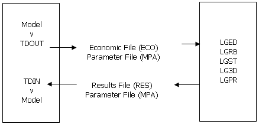

# TDOUT Process

To access this process:

  * Display the **[Find Command](<../COMMON/findcommand.md>)** screen, select **TDOUT** and click **Run**.
  * Enter "TDOUT" into the [Command Line](<../COMMON/Command_Toolbar.md>) and press <ENTER>.

See this process in the [Command Table](<../command_help/COMMAND%20TABLE_T.md#TDOUT>).

## Process Overview

Processes **TDOUT** and [TDIN](<tdin.md>) provide the interface between your application and the standalone Whittle THREE-D program for pit Optimization.

Process **TDOUT** takes a Datamine model and creates two ascii output files, which can be read by THREE-D. When THREE-D is run an output results file is created. Process [TDIN](<tdin.md>) reads this results file, and the associated parameter file, and creates a Datamine model:

In ther words, Studio generates external economic and parameter files, and reads external result and parameter files.

The THREE-D economic file has a record per block with the following information:

  * Block index

  * Block value

  * Ore-body identification

The block dimensions are defined by the Datamine model cell structure. If the model has subcells the economic value for the block is found by accumulating all the subcell values. Where the accumulated subcell volume is less than the cell volume, the remainder will be estimated with the default parameter VDEFAULT.

The ore-body identification is defined by a numeric field. If a subcell model is supplied, the dominant field value is output. The information is used when printing plans and sections of results files, or to display the position of the orebody for checking purposes. Ore-body identification numbers can be in the range 0-61 to be printed with values 0-9,A-Z,a-z.

If a subcell model is supplied, it must be in sorted (IJK) order.

## Input Files

Name |  Description |  I/O Status |  Required |  Type  
---|---|---|---|---  
IN |  Input model file. |  Input |  Yes |  Block Model  
  
## Fields

Name |  Description |  Source |  Required |  Type |  Default  
---|---|---|---|---|---  
VALUE |  Economic value field. |  IN |  Yes |  Numeric |  Undefined  
ZONE |  Ore-body identification field. |  IN |  No |  Any |  Undefined  
  
## Parameters

Name |  Description |  Required |  Default |  Range |  Values  
---|---|---|---|---|---  
VDEFAULT |  Default block value per unit volume (0.0). |  No |  0.0 |  Undefined |  Undefined  
FORMAT |  Output format for economic file (0). 0 - fixed format 1 \- comma separated |  No |  0 |  0,1 |  0,1  
  
## Example
    
    
    !TDOUT &IN(MODEL1),*VALUE(DOLLARS)Enter THREE-D parameter file name:  
  
---  
      
    
    SYSFILE>run1.mpa  
      
    
    Enter THREE-D economic file name:  
      
    
    SYSFILE>model1.eco  
      
    
    >>> 6000 RECORDS WRITTEN : TIME 15:16:21 <<<6250 blocks read from model file  
      
    
    6250 records written to economic file.