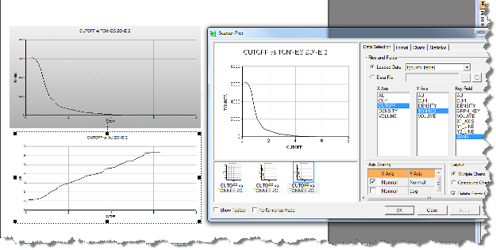
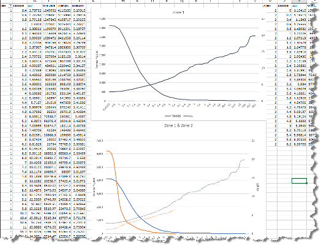

# TONGRAD Process  
  
To access this command:

  * **Report** ribbon **> > Report >> Tonnes and Grades**.
  * View the **[Find Command](<../COMMON/findcommand.md>)** screen, select **TONGRAD** and click **Run**.
  * Enter "TONGRAD" into the [Command Line](<../COMMON/Command_Toolbar.md>) and press <ENTER>.

See this process in the [Command Table](<../command_help/COMMAND%20TABLE_T.md#TONGRAD>).

## Process Overview

This process calculates the volume, tonnage and grade for up to 20 specified grade fields if run interactively although up to 60 fields can be selected using * **F21** etc if run from a macro or script. The results may be classified by up to five levels of keyfield.

Up to twenty additive fields can be specified. Rather than being weighted by mass these are accumulated. Examples of this type of field are revenue or cost.

All the grade and additive fields are optional. If no grade fields are specified then only tonnes and volume will be calculated.

The output results files are written to Datamine files and may optionally be saved in a system file in Comma Separated Variable (CSV) format. The CSV files contain the same results as the Datamine **OUT** and **TGCUMTIV** files, but are suitable for direct input to a spreadsheet.

#### Density Field (DENSITY)

If a density field is specified it will be used in the calculation of tonnes. If there is no density field you may assign a value to the **DENSITY** parameter. If both a density field and a density parameter are specified, the density field will be used in preference.

#### Absent Values

Absent density values are allowed in the input model file. If a record has an absent density value and the @**SETABSNT** parameter is set to 1 the parameter value for @**DENSITY** is used. The file's default value for density is never used.

Absent grades and ore fractions are allowed in the input file. The @**SETABSNT** parameter can be set to 1 to reset absent values. If a field has an absent value the default value from the data definition is used. If the default value is absent then a value of zero is used. If the @**SETABSNT** parameter is not set or has a value of zero absent grade, ore fraction and density values are detected and **TONGRAD** exits with an error.

In summary, If a grade or ore fraction field has an absent record the default value is used. If the default value is absent then a value of zero is used.

Absent density values are now allowed in the input file. If a record has an absent density value the parameter value for @DENSITY is used.

#### Keyfields (KEY1 to KEY5)

If you are using keyfields to classify the reserves (for example by rock type), then you may find it useful to run the process twice - once with keyfields and the second time without any keyfields. The second run will give just a single record in the output file, which will be the total tonnes and volume, and the average grade over the whole model.

If multiple keyfields are specified, then each line of the output results will describe each potential combination of different key field values. The data can then subsequently be utilized to produce tables with the key entries cross- referenced in many different ways with external data manipulation packages such as Excel.

#### Key Tolerance (KEYTOL)

The output files report grades and tonnes for every combination of key field. Sometimes numeric key values may differ by a very small amount, for example 0.0000000001. So that they are treated as the same number all key values will be rounded to an integer multiple of @**KEYTOL**. The default is 0.00001.

#### Additive Fields (ADDF1-20)

Fields to be treated as additive can be specified (using * **ADDF1** to * **ADDF20** in a macro, with a maximum of 10 fields via the interactive dialog). This is useful to provide a summary of total costs or revenues by keyfields in addition to just grades.

#### Ore Fractions (OREFRAC)

The ore-fraction field is optional. It is intended to be used where the contained grade fields pertain only to a certain proportion of each block, as might be the case with an MIK model. The supplied ore-fraction field must contain values between 0 and 1. If it is utilized, the output results will contain the calculated field **OTONNES** , with grades which pertain just to these **OTONNES** quantities. There will still be **TONNES** and **VOLUME** fields produced, describing the total evaluated (ore+waste) contents.

The **BENCH** , **ROW** and **COLUMN** parameters are optional. If any of them are enabled (=0), then additional **BENCH** /**ROW** /**COLUMN** values will be used in the categorization of calculated results, based on the model blocks' positions, and the parent block dimensions. These additional fields can then subsequently be used for table generation from the calculated results.

If **OREFRAC** is used then default **OREFRAC** value is taken from the file default value. If file default values is absent then default **OREFRAC** is zero. Default is used if any **OREFRAC** values are absent. Otherwise they must be between zero and 1.

#### Cut-Off Grades

The **COGSTEP** parameter is optional. If a value (>0) is supplied, then results will be split for each **COGSTEP** increment in the main (**F1**) grade field. This will enable the results to be used directly for generation of grade-tonnage curves. If the **COGSTEP** parameter is specified a grade field in **F1** MUST be specified.

An output file (* **TGCUMTIV**) containing cumulative values for cutoffs can optionally be specified and used to draw grade-tonnage curves more directly. Examples of using this table in Studio and Excel are shown below:

;>)

;>)

The **FACTOR** parameter is optional. If a value is supplied, then the values for **VOLUME** , **TONNES** and **OTONNES** will be divided by this factor.

The **TRENAME** parameter can be set to 1 to automatically change the output **VOLUME** , **TONNES** and **ORETON** field names according to the value of the **FACTOR** parameter. For example, if **TRENAME** is 1 and **FACTOR** is 1000 then the output field names are **KVOLUME** , **KTONNES** and **KORETON**. For values other than 1000 the output field names are shown in the table below.

The default value for **TRENAME** is 0. This preserves the standard field names of VOLUME, TONNES and ORETON.

Field names in Output Files for TRENAME=1  
---  
FACTOR Value | Tonnes | Volume | Ore Tonnes  
FACTOR=1 | TONNES | VOLUME | ORETON  
FACTOR=1000 | KTONNES | KVOLUME | KORETON  
FACTOR=10000 | 10KTONNES | 10KVOL | 10KOTON  
FACTOR=100000 | 100KTONNES | 100KVOL | 100KOTON  
FACTOR=1000000 | 1MTONNES | 1MVOLUME | 1MORETON  
FACTOR<1000 | TxFACTOR | VxFACTOR | OxFACTOR  
FACTOR>1000<100000 | TNxFACTOR | VOxFACTOR | OTxFACTOR  
  
The @**SETABSNT** parameter can be set to 1 to set absent grade to their default or zero values automatically. Absent Density values are set to the default **DENSITY** parameter value. The number of records that contain reset values is written to the output window. If the @**SETABSNT** is undefined or set to zero then absent grade and density values are detected and **TONGRAD** exits with an error.

### Excel Output

**Note** : Microsoft Excel 2010 or later is required on the local PC in order to view output from this command.

If @**EXCEL** is set to 1 then and the cumulative output data file (**TGCUMTIV**) has been created then the results will automatically be loaded into **EXCEL** (if version 2016 or higher is installed) and a chart of tonnes and grade against cutoff will be displayed. However note that **EXCEL** will not be run if any of the **COLUMN** , **ROW** or **BENCH** options have been selected.

If two or more KEY fields have been specified they will be combined into a single numeric compound Key field (**COMP_KEY**). The chart will then include a line for each value of **COMP_KEY**.

Also note that the process will not complete until an automatically-launched instance of Excel is closed.

## Input Files

Name |  Description |  I/O Status |  Required |  Type  
---|---|---|---|---  
IN |  Input model file |  Input |  Yes |  Model file  
  
## Output Files

Name |  I/O Status |  Required |  Type |  Description  
---|---|---|---|---  
OUT |  Output |  Yes |  Table |  Output reserves file.  
CSVOUT |  Output |  No |  Table |  Optional CSV Output file. This is a system file, not a Datamine file. It contains the same results as the Datamine **OUT** file, but it is a Comma Separated Variable (CSV) file, suitable for input to a spreadsheet.  The extension .csvwill be added automatically to the file name.  
TGCUMTIV |  Output |  No |  Table |  Output tonnes grade curve cumulative data file. This can only be output if the @**COGSTEP** parameter is set to define cutoffs. This table can be used to create tonnage grade curves.  
  
## Fields

Name |  Description |  Source |  Required |  Type |  Default  
---|---|---|---|---|---  
KEY1-20 |  Key fields for reserve classification. |  IN |  No |  Alphanumeric or Numeric |  Undefined  
OREFRAC |  Ore fraction field \- containing values between 0 and 1. |  IN |  No |  Numeric |  Undefined  
DENSITY |  Field containing density values. If a field is not selected then the value specified by the **DENSITY** parameter will be used. |  IN |  No |  Numeric |  DENSITY  
F1-20 |  Grade fields for evaluation. **F1** is primary grade field. |  IN |  No |  Numeric |  Undefined  
ADDF1-10 |  1st to 10th fields to be treated as additive. |  IN |  No |  Numeric |  DENSITY  
  
## Parameters

Name |  Description |  Required |  Default |  Range |  Values  
---|---|---|---|---|---  
FACTOR |  Scaling factor to adjust the units of the Volume and Tonnage in the output files. Volume and Tonnage are divided by this factor. |  No |  1 |  Undefined |  Undefined  
TRENAME |  The @**TRENAME** parameter can be used to change the output field name of **TONNES** to reflect the use of the @**FACTOR** parameter. |  No |  0 |  Undefined |  Undefined  
SETABSNT |  Set to 1 to allow **TONGRAD** to reset absent grade, ore fraction and density values.  If this is used, absent grade values are set to their default values. If the default value is absent grade values are set to zero. If density values are absent the default **DENSITY** parameter value is used. |  No |  0 |  Undefined |  Undefined  
DENSITY |  Density value to be used for tonnage calculations if a **DENSITY** field is not used. |  No |  1 |  Undefined |  Undefined  
COLUMN |  Set to 1 for additional **COLUMN** (YZ slices by X) categorisation. |  No |  0 |  0,1 |  Undefined  
ROW |  Set to 1 for additional **ROW** (XZ slices by Y) categorisation. |  No |  0 |  0,1 |  Undefined  
BENCH |  Set to 1 for additional **BENCH** (XY slices by Z) categorisation. |  No |  0 |  0,1 |  Undefined  
COGSTEP |  Cut-off grade step, which applied to main F1 grade field, and then used for categorisation of results. |  No |  0 |  Undefined |  Undefined  
KEYTOL |  The tolerance used to test whether numeric key fields are equal. All key values are rounded to an integer multiple of this value. If set to zero then rounding will not be used. |  No |  0.00001 |  0,+ |  Undefined  
EXCEL |  Set to 1 to automatically load the cumulative data file into Excel (2010 or later version required) and display a graph of tonnes and grade against cutoff. |  No |  0 |  0,1 |  Undefined  
  
## Example
    
    
    !TONGRAD   
  
---  
      
    
     &IN(rotmodlf2),&OUT(rotmodLFTG),&CSVOUT(rotmodLFTG),  
      
    
     &TGCUMTIV(rotmodCT2),*KEY1(ZONE),*F1(AU12345678910),@FACTOR=1.0,  
      
    
     @TRENAME=0.0,@SETABSNT=0.0,@DENSITY=1.0,@COLUMN=0.0,  
      
    
     @ROW=0.0,@BENCH=0.0,@COGSTEP=1.0,@EXCEL=0.0