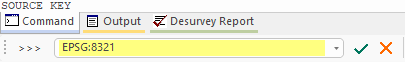

# TRANSCO Process  
  
To access this process:

  * **Data** ribbon **> > Transform >> Transform Coordinates**.

  * Enter "TRANSCO" into the [Command Line](<../COMMON/Command_Toolbar.md>) and press <ENTER>.
  * Display the **[Find Command](<../COMMON/findcommand.md>)** screen, locate **TRANSCO** and click **Run**.

See this process in the [Command Table](<../command_help/COMMAND%20TABLE_T.md#TRANSCO>).

## Process Overview

Transform coordinates from one coordinate system to another. This is similar to the **[transform-coordinates](<../COMMON/Transform_Coordinates_Dialog.md>)** command but instead works on data files, not loaded data objects.

Before coordinate transformation is performed, the input file and parameters are checked, and if the transformation cannot be completed with the specified inputs, a message displays indicating failure. 

Source and target Well Known Transformation (WKT) codes are entered via the command line (or as inputs in a macro) after initial process execution. 

;>)

These codes are listed on the **transform-coordinates** command screen and TRANSCO process references must match these codes precisely. For example, "G:8321" is fine but "8321" or "G 8321" will cause the process to abort.

## Input Files

Name |  Description |  I/O Status |  Required |  Type  
---|---|---|---|---  
IN |  Input file. Must contain at least X , Y and Z explicit numeric fields.  |  Input |  Yes |  Undefined  
  
## Output Files

Name |  I/O Status |  Required |  Type |  Description  
---|---|---|---|---  
OUT |  Output |  No |  Undefined |  Output file. Will contain updated coordinate fields.  
  
## Fields

Name |  Description |  Source |  Required |  Type |  Default  
---|---|---|---|---|---  
X/Y/Z |  X/Y/Z coordinate field in IN. |  IN |  Yes |  Undefined |  Undefined  
  
## Parameters

Name |  Description |  Required |  Default |  Range |  Values  
---|---|---|---|---|---  
NORMAL |  Normalise axis order: =0 : Do not normalise axis(0) =1 : Normalise axis order(1) | No | 1 | 0,1 | 0,1  
  
## Example
    
    
    !START TRAN1  
  
---  
      
    
    # - Use !LOCDBOFF to look for files outside the local folder  
      
    
    # - Use local files by deleting the next line or use !LOCDBON  
      
    
    !LOCDBOFF  
      
    
    !TRANSCO  &IN(_vb_holes),  
      
    
    &OUT(transformed_holes),*X(X),*Y(Y),*Z(Z),@NORMAL=1.0  
      
    
    G:27700  
      
    
    G:4326  
      
    
    !END  
  
Related topics and activities

  * [transform-coordinates ("tco")](<../command_help/transform-coordinates.md>) (command)
  * [Transform Coordinates](<../COMMON/Transform_Coordinates_Dialog.md>) (screen)
  * [CDTRAN](<cdtran.md>)