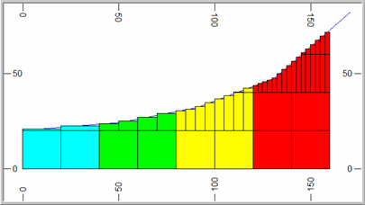
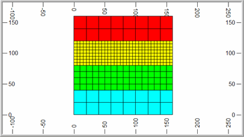
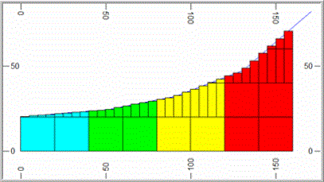
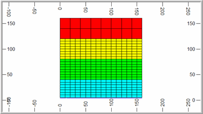

# TRIFIL Process  
  
To access this process:

  * **Model** ribbon **> > Create >> Fill Wireframes >> Fill Wireframe**.

  * Enter "TRIFIL" into the [Command Line](<../COMMON/Command_Toolbar.md>) and press <ENTER>.
  * Display the **[Find Command](<../COMMON/findcommand.md>)** screen, locate **TRIFIL** and click **Run**.

See this process in the [Command Table](<../command_help/COMMAND%20TABLE_T.md#TRIFIL>).

## Process Overview

Generates a Datamine cell or subcell model from a triangulated (wireframe) definition, either a solid model or a digital terrain model, with accurate preservation of enclosed volume.

If the input prototype model &**PROTO** is a Rotated Model, as defined using the [PROTOM](<protom.md>) process, then the coordinates of the input points in both the &WIREPT and PERIMIN files must be in the local (rotated) coordinate system. This can be achieved using the [CDTRAN](<cdtran.md>) process. The nine Rotated Model fields (**X0, Y0, Z0, ANGLE1, ANGLE2, ANGLE3, ROTAXIS1, ROTAXIS2, ROTAXIS3**) will be copied from the input &**PROTO** file to the output &**MODEL** file.

**Note** : TRIFIL can fill wireframe data that sits outside the Z range of the input block model.

## Cell Splitting

Splitting of cells into subcells is controlled by the parameters MAXDIP, SPLITS, PLANE, XSUBCELL, YSUBCELL, ZSUBCELL, and RESOL as described below. The examples are based on a topographic surface using a value of PLANE='XY' which means that splitting is regular in the XY plane but variable in Z. The principles are identical if splitting is in one of the other planes.

**Note** : only cells that are intersected by the wireframe are split into subcells. All others remain as parent cells.

### Splitting Based on Dip of Wireframe

Using parameter **MAXDIP** the degree of splitting can be made dependent on the dip of the wireframe. 

This means that there can be little or no splitting where the surface is approximately horizontal but increased splitting as the dip of the wireframe increases. This is achieved by setting **MAXDIP** to a reference dip, in degrees. Then for each parent cell that is intersected by a triangle, the maximum dip of all triangles intersecting or adjacent to the parent cell is calculated. The definition of adjacent is a rectangular area of dimensions 2* **XINC** by 2* **YINC** centred on the parent cell centre, where **XINC** and **YINC** are the parent cell dimensions in X and Y. The amount of splitting is then defined by the ratio of the maximum dip of intersecting or adjacent triangles to the **MAXDIP** parameter as shown in the table below.

Ratio | Number of splits | Number of  
(sub)cells  
---|---|---  
< 2 | 0 | 1  
>= 2 < 4 | 1 | 2  
>= 4 < 8 | 2 | 4  
>= 8 | 3 | 8  
  
The parameter SPLITS is used to define the maximum level of splitting. In the above table it is assumed that SPLITS=3. If **SPLITS** were set to 2 then the maximum number of subcells would be 4 even if the ratio exceeded 8. The same level of splitting is always applied in both the X and Y directions.

For example if **MAXDIP** =5 and the maximum dip of triangles intersecting or adjacent to the cell is 11 then the ratio is 2.2 so there will be just 1 split resulting in 2 subcells. If the maximum dip of triangles is 35 then the ratio is 7 so there will be 2 splits resulting in 4 subcells. This is illustrated in the South-North section below (left) where the slope of the wireframe increases from left to right. The surface for all East-West sections is totally horizontal. The plan (bottom image) shows the cell structure at an elevation of 21m where the parent cell size is 20x20x20m.

If **MAXDIP** is set to 0 then the ratio will be infinity and the cell will always be split. The degree of splitting will then be totally dependent on the **SPLITS** parameter. If **MAXDIP** =0 and **SPLITS** =2 then all parent cells that are intersected by the wireframe will be divided into 4 subcells in X and Y.

### Splitting Using SUBCELL

If **SPLITS** =0 then the degree of splitting is controlled by the **XSUBCELL** , **YSUBCELL** , **ZSUBCELL** parameters which specify the number of subcells to be created in the two directions defined by the **PLANE** parameter. For example if **SPLITS** =0, **XSUBCELL** =2, **YSUBCELL** =4 then 2 subcells will be created in X and 4 in Y and the value of **ZSUBCELL** will be ignored. This is illustrated in the graphics below.

If SPLITS=0 then the value of **MAXDIP** will be ignored.

### The RESOL Parameter

**RESOL** controls the size of the subcell in the direction perpendicular to the plane defined by the PLANE parameter. In the examples given above **PLANE** ='XY' and so **RESOL** controls the size in the Z direction. If **RESOL** =0 (the default) then the subcell size in Z is calculated exactly, from the elevation of the point where a wireframe triangle crosses the mid point of the subcell in X and Y. This is illustrated in the two examples above where it can be seen that the wireframe intersects the midpoint of each subcell. 

If **RESOL** is greater than zero then the cell size is rounded to the nearest **ZINC** /**RESOL** where **ZINC** is the parent cell size in Z. For example if **ZINC** =20 and **RESOL** =4 then the cell size in Z is rounded to the nearest 5m as illustrated in the image below.

**Note** : **RESOL** must be set to an integer value. It can be used with both the splitting methods described above.

**Note** : **TRIFIL** will terminate if there are more than 120 overlapping surfaces detected in a direction perpendicular to the plane of filling. 

## Input Files

Name |  Description |  I/O Status |  Required |  Type  
---|---|---|---|---  
PROTO |  Model prototype file. |  Input |  Yes |  Block Model Prototype  
WIRETR |  Input wireframe triangle file. |  Input |  Yes |  Wireframe Triangle  
WIREPT |  Input wireframe point file. |  Input |  Yes |  Wireframe Points  
PERIMIN |  Optional perimeter input file to control area over which model is generated. |  Input |  No |  String  
  
## Output Files

Name |  I/O Status |  Required |  Type |  Description  
---|---|---|---|---  
MODEL |  Output |  Yes |  Block Model |  Output model file to be created.  
  
## Fields

Name |  Description |  Source |  Required |  Type |  Default  
---|---|---|---|---|---  
ZONE |  Name of zone field for wireframe with multiple zones to be filled. The field can be either numeric or alpha. However if the field is an alpha field then it can contain a maximum of 24 characters. If not specified and a field ZONE exists in WIRETR then it will automatically be used. |  MODEL |  No |  Any |  Undefined  
  
## Parameters

Name |  Description |  Required |  Default |  Range |  Values  
---|---|---|---|---|---  
MODLTYPE |  Type of wireframe model to be filled; one of the following options, with default of (1) :- |  Option |  Description  
---|---  
1 |  solid 3d, interior to be filled with cells  
2 |  solid 3d, exterior to be filled with cells  
3 |  surface, cells to be filled below (for XY), to south (for XZ), or to west (for YZ)  
4 |  surface, cells to be filled above (for XY), to north (for XZ), or to east (for YZ)  
5 |  two surfaces, cells to be fill between.  
6 |  two surfaces, cells to be filled above upper surface and below lower surface.  
Yes |  1 |  1,6 |  1,2,3,4,5,6  
ZONE |  Zone code to be inserted into output model **ZONE** field. |  No |  Undefined |  Undefined |  Undefined  
MAXDIP |  Maximum gradient for any triangle intersecting a cell before splitting into subcells (0). |  No |  0 |  Undefined |  Undefined  
SPLITS |  Maximum amount of splitting to be allowed (3), within range 0 [for 1 x 1] to 3 [for 8 x 8]. |  No |  3 |  0,3 |  0,1,2,3  
PLANE |  Optional alpha parameter defining orientation 'XY', 'XZ', or 'YZ', of plane in which subcell splitting is to be performed. Please note that care must be taken in selection of the plane to be used if the ends of the wireframe have not been linked, as the wireframe model is then partially 'hollow' when viewed from certain directions. |  No |  'XY' |  Undefined |  'XY', 'XZ', 'YZ'  
XSUBCELL |  Cell division in X direction (1). Max 100. |  No |  1 |  1,100 |  Undefined  
YSUBCELL |  Cell division in Y direction (1). Max 100. |  No |  1 |  1,100 |  Undefined  
ZSUBCELL |  Cell division in Z direction (1). Max 100. |  No |  1 |  1,100 |  Undefined  
PVALUE |  PVALUE of single perimeter to be selected from the PERIMIN file. |  No |  Undefined |  Undefined |  Undefined  
RESOL |  Defines boundary resolution in direction perpendicular to plane of filling. =(0) - precise boundary location. = N - boundary rounded to nearest 1/Nth of parent cell size. |  No |  0 |  Undefined |  Undefined  
CHECKROT |  Set to 1 to automatically detect and correctly process rotated models. Using this parameter means that the input wireframe points file no longer needs to be transformed into the model space before using **TRIFIL**.  |  No |  0 |  0, 1 |  Undefined  
AUTOSORT |  Set to 1 to automatically sort the output model by IJK if necessary. Using this option removes the need to sort the model after running **TRIFIL**. Sorting is generally only required when using multiple **ZONE** fields or multiple perimeters, or when the direction of filling is not XY. An output message is given at then end of the process indicating if the output model may require sorting. =0 : Do not automatically sort the output model by IJK. =1 : Automatically sort the output model by IJK. |  No |  0 |  0, 1 |  Undefined  
  
## Example
    
    
    !TRIFIL    &PROTO(MODLPROT), &WIREPT(TOPOPT), &WIRETR(TOPOTR),          
  
---  
      
    
    &MODEL(MODEL1), *ZONE(ROCK), @MODLTYPE=3, @ZONE=2,          
      
    
    @MAXDIP=0, @SPLITS=2, @PLANE='XY'  
  
## Error and Warning Messages

Message |  Description  
---|---  
>>> WARNING - DATA ABOVE TOP OF MODEL <<< >>> ERR 132 <<< ( n) IN TRIFIL |  Data in the input wireframe point data file has been found to be above the top of the model. Warning; processing continues.  
>>> WARNING - DATA BELOW BOTTOM OF MODEL <<< >>> ERR 133 <<< ( n) IN TRIFIL |  Data in the input wireframe point data file has been found to be below the bottom of the model. Warning; processing continues.  
>>> WARNING - PERIMETER HAS LESS THAN 3 POINTS - IGNORED |  A perimeter in the optional perimeter input file has been found to have less than 3 points. It is ignored and processing continues with the next perimeter.  
>>> WARNING \- PERIMETER HAS TOO MANY POINTS - IGNORED |  A perimeter in the optional perimeter input file has been found to have more than 1200 points. It is ignored and processing continues with the next perimeter.  
>>> NO DATA IN INPUT FILE <<<>>> ERR 136 <<< ( n) IN TRIFIL |  The input wireframe point data file has no data. Fatal; the process is exited.  
>>> MISSING OR ALPHA FIELDS IN MODEL PROTOTYPE<<< >>> ERR 142 <<< ( n) IN TRIFIL |  Fatal; the process is exited.  
>>> MISSING OR ALPHA FIELDS IN PERIMETER FILE <<< >>> ERR 143 <<< ( n) IN TRIFIL |  Fatal; the process is exited.  
>>> MISSING OR ALPHA FIELDS IN WIREPT FILE <<< >>> ERR 145 <<< ( n) IN TRIFIL |  Fatal; the process is exited.  
>>> MISSING OR ALPHA FIELDS IN WIRETR FILE <<< >>> ERR 146 <<< ( n) IN TRIFIL |  Fatal; the process is exited.  
  
Related topics and activities

  * [Block Model Size Limits](<../COMMON/Block_Models_Size_Limits.md>)