# UNFOLD Process  
  
To access this process:

  * This process is accessed by the **[Unfold Wizard](<../STUDIO_RM/UnfoldWizard.md>)**.

  * Enter "UNFOLD" into the [Command Line](<../COMMON/Command_Toolbar.md>) and press <ENTER>.
  * Display the **[Find Command](<../COMMON/findcommand.md>)** screen, locate **UNFOLD** and click **Run**.

See this process in the [Command Table](<../command_help/COMMAND%20TABLE_U.md#UNFOLD>).

## Process Overview

Transforms a set of X,Y,Z data into an Unfolded Coordinate System [UCS] as defined by a stratified geological unit.

**UNFOLD** is the process for unfolding a stratified unit. The main purpose of unfolding strata is to calculate the stratigraphical distances between points - for example, Figure 1, below, shows 2 drillhole samples either side of an anticline. The standard geometrical distance between them is a straight line, however, from a geological point of view, the distance separating them is a line following the anticline structure (shown as dashed line). It is this distance, called the stratigraphical or natural or unfolded distance, that would then be used in variogram calculation and grade estimation.

This unfolding technique involves transforming the standard coordinates (orthogonal X,Y,Z axes) of every sample to an unfolded coordinate system (UCS). The UCS axes are not straight lines, and are not orthogonal to each other.

[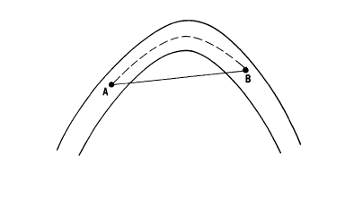](<javascript:void\(0\);>)

Figure 1: Geometrical and Stratigraphical Distances Between Two Points

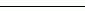 |  Standard geometrical distance between A and B. Calculated from standard orthogonal X, Y, Z axes.  
---|---  
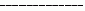 |  Stratigraphical distance between A and B. Calculated from unfolded coordinate system (UCS) axes.  
  
Figure 2, further below, shows a simple example of sections through a stratified deposit. A plan showing the strike of the orebody is also shown in this figure. The unfolded coordinate system (UCS) has 3 axes, A, B and C:

  * A - hangingwall-footwall direction (perpendicular to the orebody);

  * B - down-dip (along the centre line between hangingwall and footwall);

  * C - along strike.

The **UNFOLD** process is used to calculate the **UCS** coordinates of desurveyed drillhole data. Variogram analysis can then be undertaken based on the **UCS**. The parameters of the variogram model are therefore calculated in the UCS. A model with cells and subcells within the folded stratified unit is created using standard methods. This model is defined using the world coordinate system.

### Methodology

The following method is illustrated with structural interpretations on vertical sections. However the method can also be applied when the interpretations are in plan. Structural interpretations must be provided as digitized strings on vertical sections. At a minimum, two structural strings on two sections are required to define the UCS coordinates of samples in the stratified unit. The structural strings will often be the hangingwall and footwall as shown in Figure 2, below.

The method involves creating a series of hexahedrons modelling the stratified unit. Such a hexahedron is shown in Figure 3, below, where it is defined by 6 surfaces:

BH1 BF1 CF1 CH1 BH2 BF2 CF2 CH2  |  Surfaces between adjacent hangingwall and footwall points within a section. Because the sections themselves are planar, these surfaces are planar. All points on each of these surfaces have the same `along strike' (UCSC) coordinate.  
---|---  
BH1 BH2 CH2 CH1 BF1 BF2 CF2 CF1  |  Surfaces between sections and between adjacent points on the hangingwall or footwall respectively. All points on each of these surfaces have the same `across strike' (UCSA) coordinate.  
BH1 BH2 BF2 BF1 CH1 CH2 CF2 CF1  |  Surfaces between sections and between points on the hangingwall and footwall.  
  
Any point Q lying within the stratified unit will lie within one of these hexahedrons. The UCS coordinates of the point can then be calculated by interpolation within the hexahedron.

[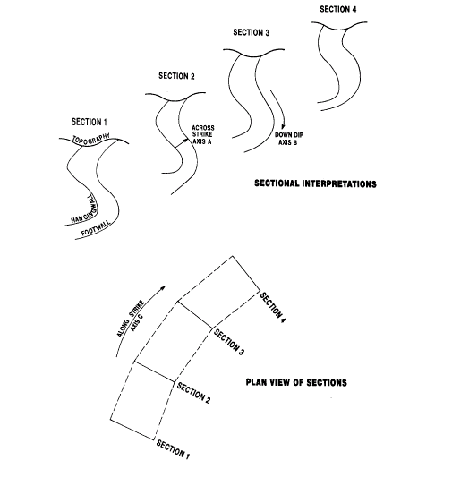](<javascript:void\(0\);>)

Figure 2: Coordinate Axes in the UCS

[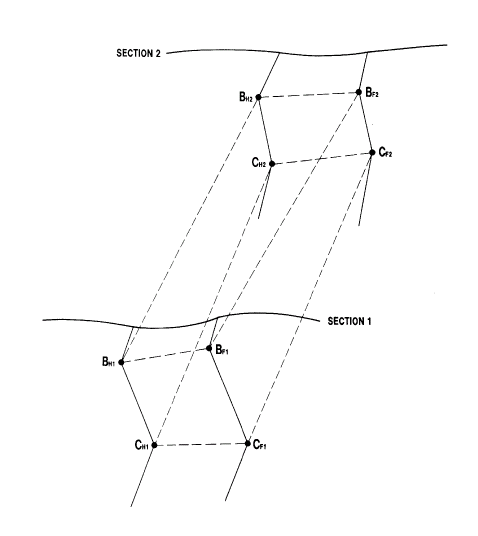](<javascript:void\(0\);>)

Figure 3: Hexahedron Defined by 6 Surfaces

### Unfolded Coordinate System (UCS)

The three reference axes are:

  * A - hangingwall-footwall direction (perpendicular to the orebody);

  * B - down-dip (along the centre line between hangingwall and footwall);

  * C - along strike.

UCS values may be scaled in one of four ways to define the relative position of data within and across the sections:

  1. Normalised. A normalised coordinate is a value between 0 and 1 describing the distance as a proportion of the total distance along the axis.

  2. Adjusted. An adjusted coordinate is the normalised coordinate value multiplied by the average length of the appropriate axis (see Section 1.2.6), based on the data from all sections.

  3. True Length. The true length coordinate is the distance from the UCS origin measured in standard units.

  4. World Coordinates. Where appropriate, a UCS value can correspond to one of the standard (orthogonal X,Y,Z) axes.

The true length coordinate approximates the distance from the origin of the UCS coordinate system of the selected axis, but is measured in the standard coordinate system units.

  * For UCSA, this provides a measure of width or true width.

  * For UCSB it is the distance along the dip-direction of the strata.

  * UCSC defaults to the `adjusted' units - this is generally satisfactory as UCSC should correspond to the direction of the fold axis.

### Creation of Links

The method of creating the hexahedrons involves linking footwall and hangingwall strings within a section. The user defines these links when digitizing the strings using a similar method to tagging in wireframing. Figure 4, below, shows an example where points AH to FH have been linked to AF to FF respectively.

Each of these links joins points on the hangingwall and footwall that the user considers have the same `down-dip' (UCSB) coordinate. It is not essential for the first and last points on each string to be linked. Any points on a string before the first linked point or after the last linked point will be ignored.

If you don't define any links between the hangingwall and footwall, the algorithm automatically creates one between the first points, and one between the last points of each string.

In order to calculate the A and B coordinates of any point Q, the process takes every digitized point on the hangingwall, and creates a corresponding point on the footwall with the same down-dip distance, taking into account the links defined by the user. This is illustrated in Figure 5, below, which is an enlargement of Figure 4. In this example points A, B, C, D, E and F have been defined as linked by the user.

For all other digitized points on the hangingwall (H1 , H2 , etc) and footwall (F1 , F2 , etc) strings, the linking is done automatically as follows:

[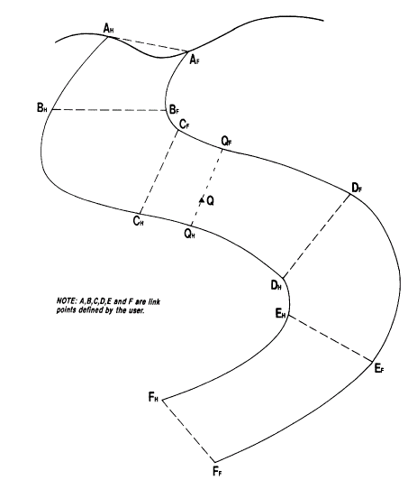](<javascript:void\(0\);>)

Figure 4: User Defined Links

The distance AH H1 is calculated as a fraction of the distance AH BH measured along the hangingwall. A new point I is then created on the footwall, where I has the same fractional distance measured from AF as H1 does from AH
    
    
    AH H1 /AH H1 H2 BH = AF I1 /AF F1 BF

and similarly:
    
    
    BH H3 H4 /BH H3 H4 H5 CH = BF I4 /BF CF

This process is repeated for each digitized point Hi on the hangingwall \- pairing it with a new point Ii on the footwall as illustrated in Figure 5, below. The reverse process is then undertaken, creating points on the hangingwall which correspond to digitized points Fi on the footwall. This reverse process is not shown in Figure 5. By joining up the pairs of points at the same fractional distances, a series of quadrilaterals are created. Point Q will lie within one of these quadrilaterals (CH CF I6 H6 ) as illustrated in Figure 5.

### Calculation of USCA and B Coordinates

Consider first the two dimensional problem of calculating the normalized A and B coordinates of point Q as illustrated in Figure 5. It is assumed for this calculation that Q lies on the sectional plane which includes the structural interpretations.

`Points AM , M1 , M2 , BM , M3 , ..., FM` are the midpoints of the link lines and provide a reference line for the down-dip axes.

Coordinate A of point Q is calculated by first identifying the quadrilateral within which the point lies i.e. CH CF I6 H6 . A straight line is the drawn through Q intersecting the hangingwall at QH , and the footwall at QF . The line is drawn such that the hangingwall and footwall intersections are at the same proportional distance in CH H6 and CF I6 respectively:
    
    
    CH QH /CH H6 = CF QF /CF I6 = CM QM /CM M6

The normalized value of coordinate A is calculated as:
    
    
    AN = QH Q/QH QF

The normalized value of coordinate B is calculated as:
    
    
    BN = AM BM CM QM /AM BM CM DM EM FM

### Points Between Sections

The method described so far assumed that point Q lies exactly on section. In order to calculate the A and B coordinates for a point lying between sections k and k+1 the above process must be extended to three dimensions. This involves linking points between sections in a similar manner to the linking within sections described previously. In the following description AH , BH etc are again used to denote points linked by the user, and Hi are intermediate points on the strings which are linked automatically. However it should be noted that although a point on the hangingwall may be linked by the user to a point on the footwall within a section, it is not necessary that the same point is linked by the user to a point on the next section.

Point AH on section k is linked to point AH on section k+1, point BH on section k is linked to point BH on section k+1, and similarly for C to H. Links are always from hangingwall to hangingwall. Each digitized point H on section k is linked to a point on section k+1. Linking is also applied from points on section k+1 back to section k.

Any point Q whose coordinates are to be estimated then lies within a wireframe hexahedron. Slicing this shape with a vertical plane through Q parallel to the sections will create a quadrilateral. This is then used to calculate coordinates A and B, as described previously.

You create links only between hangingwall and footwall points, within any sections. Links between footwalls on adjacent sections are always done within the process. The reason for this is that once three links have been defined, the fourth can be automatically determined from the other three. It is therefore unnecessary for the user to define footwall to footwall links, and could lead to inconsistency in the data if it were allowed.

The method described in this section assumes that the sectional interpretations are parallel. If this is not the case, then an intermediate plane through point Q is created using a similar method to that described previously.

Figure 6, below, shows a plan view of the sections. Each section line (eg SH SH ) represents the maximum extent of projection of the hangingwall and footwall onto plan. A line is drawn through Q such that the intersections TH and TF divide the hangingwall and footwall in the same proportions:
    
    
    SH TH /SH UH = SF TF /SF UF

[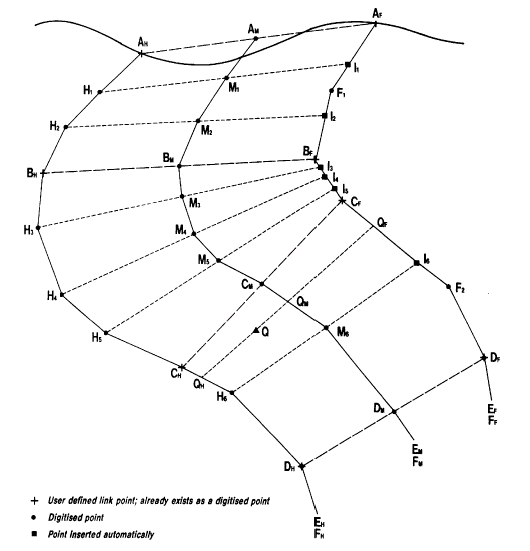](<javascript:void\(0\);>)

Figure 5: Automatic Links

### Calculation of UCSC Coordinate

In the majority of cases the sections on which the structures have been defined will be parallel. If this is not the case then it is assumed that the sections are perpendicular to the strike, as illustrated in the plan view in Figure 6, below - that is, all points on any given section have the same `along strike' (UCSC) coordinate.

The total distance along strike is estimated by creating a reference point on each section and calculating the length of the line joining these reference points. This reference vector therefore defines the average strike length and direction.

The reference point on each section is the origin (defined by @ORGTAG), or if this is not specified, it is 0.5 of the distance along the median line (axis B). The reference vector is calculated between each pair of sections. The actual length of the vector between sections i and i+1 is denoted by Vi . The length of the C axis is then the sum of all Vi 's. This is denoted as CLEN which is R1 R2 R3 R4 in Figure 6.

Figure 6 is a plan showing point Q lying between sections 3 and 4. The normalized along strike coordinate C of point Q is calculated as:
    
    
    CN = R1 R2 R3 RQ /CLEN

[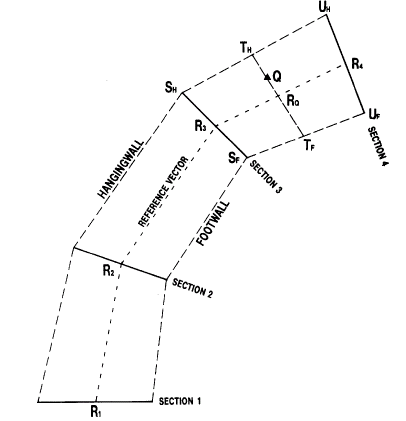](<javascript:void\(0\);>)

Figure 6: Calculation of Along Strike Coordinate C

### UCS Coordinate Units

When the UCS coordinates of point Q are calculated, an intermediate section plane will have been interpolated and a number of `normalized', `adjusted' and `true length' measures are available to generate the required UCS A, B and C coordinates.

The normalized coordinates (**AN** , **BN** , **CN**) of point Q as calculated previously all lie between 0 and 1. They represent a proportion of the total distance along each axis, and so it is not easy to relate these values to actual distances. The normalized coordinate space is equivalent to unfolding and stretching the stratified unit into a unit cube.

In the generation of the quadrilaterals, a number of average measures are calculated. The average length of axis C is **CLEN** as described previously. The average length of the across strike axis A (**ALEN**), and the down-dip axis B (**BLEN**) are calculated as follows.

Figure 5 shows the median line AM BM CM DM EM FM for section k. The length of this line is denoted **BLEN** . The average length of the down-dip axis is then calculated as the weighted average of the k **BLEN** values over all sections. The weights used are the distance of influence of each section ie k half way to the next section measured along the C axis.

For each section the area enclosed by the hangingwall, footwall, and the top and bottom links is calculated. This is then divided by the length of the median line **BLENK** for that section to calculate the average across strike width, denoted as **WK** for section k. The average length of axis A, **ALEN** , is then calculated as the weighted average of WK over all sections.

The relationship between the normal coordinates of point Q (AN , BN , CN ) and the adjusted coordinates (AA , BA , CA ) is then:
    
    
    AA = AN  * ALEN
    
    
    BA = BN  * BLEN
    
    
    CA  = CN * CLEN

For the intermediate section associated with point Qm, a local estimate of the length of the across strike width (axis A), and the down dip distance (axis B) is calculated. These distances define the `true length' coordinates for point Q. Where appropriate, any one of the original (X, Y, Z) world coordinate values can be assigned to be a UCS coordinate axis.

The selection of the most appropriate coordinate system for the UCS axes will be dictated by the fold structure, the available digitized strings, and the requirements of variogram modelling and kriging (or other interpolation methods). Several coordinate systems may be of interest - for example, to interpolate block grades by stratigraphic position, and also prepare contours of true thickness in long section.

The default parameters for **UNFOLD** are as follows:

  * @**UCSAMODE** = 2 to calculate the relative position in the stratified unit from the `adjusted' coordinate.

  * @**UCSBMODE** = 3 to calculate the unfolded position appropriate to each section.

  * @**UCSCMODE** = 2 to calculate the approximate position along the fold axis based on an `adjusted' coordinate.

The relative position of samples in the unfolded coordinate system is strongly influenced by the use of an origin, within section and between section strings, and the selection of `normalized', `adjusted' and `true length' coordinates. It is recommended that the position of samples in the unfolded coordinate system be plotted to verify the results of the unfolding process.

### File Handling

The following files are used by the UNFOLD process:

#### &IN - Input Data File

This file holds the standard X,Y,Z coordinate values which are to be transformed into the UCS. The values are held in the fields *X,*Y,*Z.

#### &STRING \- Input Boundary Strings

This file holds strings that define the hangingwall and footwall of each stratum on each section. It is a standard string file with the fields **PVALUE, PTN, XP,YP, ZP**. It must also include:

* **BOUNDARY** |  Boundary identifier. A numeric field identifying the boundary represented by each string. Obviously its value must be constant for all points in a string.  
---|---  
* **SECTION** |  Section identifier. A numeric field identifying the section number of each string. If sections are West-East then * **SECTION** could hold the Northing value.  
  
The file may contain some or all of the optional fields:

* **WSTAG** |  Within section tags. A numeric field holding tag values used to link between the hangingwall and footwall strings within sections. The values in this field will be ignored if @**LINKMODE** =1 or 3.  
---|---  
* **BSTAG** |  Between section tags. A numeric field holding tag values used to link between hangingwall strings on adjacent sections. The values in this field will be ignored if @**LINKMODE** =2 or 3.  
* **TAG** |  Tag. A numeric field holding tag values used to link strings either within or between sections. The precise usage of the values in this field is controlled by @**LINKMODE**. A tag value of 0 or - indicates that the point is not linked.  
  
The &STRING must be sorted by *SECTION, *BOUNDARY, PTN. It is assumed that the section numbering system is such that sorting by *SECTION will ensure that physically adjacent sections are adjacent in the &STRING file.

#### &UNITDEF \- Input Unit Definitions

This optional file must contain the fields:

* **UNITNAME** |  A numeric or alpha field holding the name of a stratigraphical unit defined by strings in the &**STRING** file.  
---|---  
* **FOOTWALL** |  A numeric field holding the value of the * **BOUNDARY** field for strings in the &**STRING** file that define the footwall of the stratigraphical unit.  
* **HANGWALL** |  A numeric field holding the value of the * **BOUNDARY** field for strings in the &**STRING** file that define the hangingwall of the stratigraphical unit.  
  
#### &OUT \- Output Data File

The output data file contains all the fields of the &IN file plus:

* **UNITNAME** |  Stratigraphical unit name. A numeric or alpha field defining the unit in which each data point lies.  
---|---  
* **UCSA** |  Unfolded Coordinate System (UCS) A coordinate. A numeric field holding the hangingwall-footwall direction coordinate.  
* **UCSB** |  Unfolded Coordinate System (UCS) B coordinate. A numeric field holding the down-dip coordinate.  
* **UCSC** |  Unfolded Coordinate System (UCS) C co -ordinate. A numeric field holding the along strike coordinate.  
  
The &**OUT** file may not be the same as the &**IN** file, ie, in-place operation is not allowed. The &**OUT** file will not necessarily be in the same order as the &**IN** file. The &**OUT** file will contain all data records from the &**IN** input file for which **UNFOLD** could calculate UCS coordinates. Any data points that are outside the unfolding quadrilaterals are not written to &**OUT** (unless @**TOLRNC** is used).

#### &QUADS \- Output Unfolding Quadrilaterals

The linkages between points effectively form a type of wireframe. The wireframing used in **UNFOLD** is based on quadrilaterals rather than triangles, and therefore uses non planar surfaces, as described previously.

The quadrilaterals can be output to an optional &**QUADS** file. This is a standard perimeter file (**PVALUE, PTN, XP, YP, ZP**) with additional fields **BLOCKTYP** , * **UNITNAME** and * **SECTION**. Field **BLOCKTYP** has the following values:

  1. Quadrilateral joining adjacent hangingwall and footwall points within the same section which have the same downdip coordinate (eg, BH1 BH2 CF1 CH1 in Figure 3);

  2. Quadrilateral joining hangingwall and footwall points on one section with points on the adjacent section (eg, BH1 BH2 CH2 CH1 in Figure 3);

  3. A special case of **BLOCKTYP** = 2, defining a downdip reference plane where UCSB=0. This is described further on.

### Detailed Features

#### Link Points

It should be noted that it is permissible for a single point on one string to be linked to two points on the other wall, or to two points on the next section.

User-defined link points between sections need not link continuously from a point on one string, to a point on the next string, to a point on the next string, and so on. Hence a point with tag value N may occur on the first three sections, but there may be no tag with value N on the fourth. A tag with the value N may then be reused on the fifth and subsequent sections.

#### Multiple Units

In all examples so far it has been assumed that there is just a single stratified structure with a hangingwall and a footwall. In practice there may be a series of stratified units as illustrated in Figure 7\. The footwall of the first unit becomes the hangingwall of the second unit, and so on. Each unit is treated independently, so that the UCS coordinates for unit i are based on the thickness, downdip distance and along strike distance for the individual unit number i.

Rather than run UNFOLD multiple times, once for each unit, the process has been designed to allow the definition of multiple units, which are all processed in a single run. The UCS coordinates are written to the output file together with a unit identifier.

It is possible for overlapping strata to be defined using the &UNITDEF file. If this does happen and a point to be transformed lies in two or more units then it will be shown in the output file as lying in the first unit, in the order in which they are defined in the &UNITDEF file.

#### Unit Definition

The definition of a stratified unit is controlled either by a unit definition file or by parameter, with the file taking priority if both methods are specified. The &**UNITDEF** file contains the three fields * **HANGWALL** , * **FOOTWALL** and * **UNITNAME**. * **HANGWALL** and * **FOOTWALL** are the values of the * **BOUNDARY** field from the &STRINGS file. The * **UNITNAME** field may be alpha or numeric, and is included in the &**OUT** file for each sample.

If the parameter method is used to select a single unit then @**HANGID** and @**FOOTID** must both be specified. The @**UNITID** parameter is optional. The unit name field in the &**OUT** file is created according to the following rules:

  * If a &**UNITDEF** file is specified, then: the * **UNITNAME** field will be copied from this file. It can therefore be either alpha or numeric depending on its type in the &**UNITDEF** file.

  * If a &**UNITDEF** file is not specified, then:

    * if a * **UNITNAME** field exists in the &IN file, then * **UNITNAME** field will be copied from the &IN file.

  * if a * **UNITNAME** field does not exist in the &IN file, then

    * if parameter @**UNITID** is - or is not specified, then a field **UNITNAME** is created as an 8 character alpha field, and all values set to WITHIN.

    * if parameter @**UNITID** is specified, then a field **UNITNAME** is created as numeric, and all values are set to the value specified.

[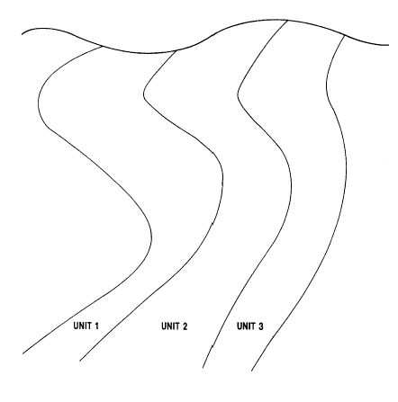](<javascript:void\(0\);>)

Figure 7: Multiple Stratified Units

### Data Outside the Unit (@TOLRNC and @UCSALIMT)

The linking method used here effectively defines a type of wireframe. It should be noted that in general it is not possible therefore to calculate the UCS coordinates of any point lying outside this wireframe. If the volume of influence of the first and last sections can be extrapolated geologically outside the wireframe, then the extent of the wireframe should be adjusted. In practice this means that the user should create two new sections before the first and after the last, which contain copies of all strings on the first and last respectively.

It is possible that a sample can be identified geologically as lying within a certain unit, yet it lies outside the hangingwall or footwall surface of the wireframe. This would happen if the actual unit varied non linearly between the interpreted sections. In these circumstances it is still possible to calculate UCS coordinates by use of the @**TOLRNC** parameter.

This defines a margin, expressed as a fraction of the hangingwall-footwall distance UCSA, within which a sample can lie and still be assigned UCS coordinates. In most cases, the value for @**TOLRNC** would not need to be more than a few percent, but if necessary, can be set to much larger value. For example if @**TOLRNC** is set to 0.05 (i.e. 5%) then the normalized value of UCSA may lie between -0.05 and 1.05. This tolerance value only applies to the UCSA hangingwall-footwall direction.

Note that if @**TOLRNC** is used when **UNFOLD** is processing several stratified units (ie, when a &**UNITDEF** is specified), a record from the &IN file may occur more than once in the &**OUT** file. For example, a sample lying near the 'unit 1'/'unit 2' boundary of figure 7 may be selected as being in unit 1 with a normalized UCSA coordinate of 0.99. If @**TOLRNC** =0.05, it may also be selected as being in unit 2 with a normalized UCSA coordinate of -- 0.01. It will therefore occur twice in the &OUT file. 

If the @**TOLRNC** parameters is used, each stratigraphic unit should be processed in **UNFOLD** separately, and only those samples belonging to the stratigraphic unit should be supplied.

The Parameter @UCSALIMT is used in conjunction with @**TOLRNC** to define the limits of the **UCSA** coordinate if **UCSAMODE** =1 or 2 and . This parameter provides additional control on normalized (@**UCSAMODE** =1) and adjusted (@**UCSAMODE** =2) coordinate values as follows:

  1. UCSA coordinates can be <0 and >1 as described above (This is the default).
  2. UCSA coordinates can be <0, but if they are calculated as >1, then will be reset to 1.

  3. UCSA coordinates can be >1, but if they are calculated as <0, then are reset to 0.

  4. UCSA coordinates that are calculated as <0 or >1 are reset to 0 and 1 respectively.

The above description is in terms of the normalized UCSA value (@**UCSAMODE** =1). If adjusted (@**UCSAMODE** =2) is selected then the coordinate is calculated as the normalized value multiplied by the average thickness in the direction of the UCSA axis.

### Direction of Axes

The UCSA coordinate values always increase from the hangingwall to the footwall of each unit. For instance, if the UCSA values are normalized they will vary from 0 on the hangingwall, to 1 on the footwall.

The UCSB coordinates increase in the same direction as the digitized boundary strings. In all the illustrations so far it is assumed that the strings go from top to bottom, and the UCSB coordinates therefore increase with depth. However, if the strings were digitized from bottom to top, then the origin of axis UCSB will be at the bottom of each section.

Another method of changing the origin for the UCSB axis is by using the @ORGTAG parameter. This selects the tag number which defines the origin position from which the UCSB coordinate is measured. UCSB coordinates are then measured as positive in the direction towards the last digitized point, and negative towards the first digitized point on the string.

The UCSC coordinates increase in the order in which the strings occur in the &STRING file. For example, with West East section strings sorted by increasing Northing, the UCSC coordinates increase with Northing. The UCSC axes direction could be reversed by changing the order of the &STRING file data by using a different *SECTION field.

### Non-Continuous Units

If one or both strings do not exist on an intermediate section, then there will be a break in the wireframe. For the purpose of calculating the along strike distance CLEN, the two sections either side of the break will be joined with a single line connection. This is illustrated in Figure 8. **BOUNDARY** 's 3 and 7 exist on sections 1, 2, 5 and 6, but not on sections 3 or 4. Therefore unit A only exists between sections 1 and 2, and between 5 and 6.

If a unit pinches out on a section then the user may represent this by defining coincident hangingwall and footwall strings on intermediate sections. This is illustrated in Figure 9, below.

[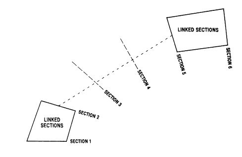](<javascript:void\(0\);>)

Figure 8: Break in Continuity of a Unit

[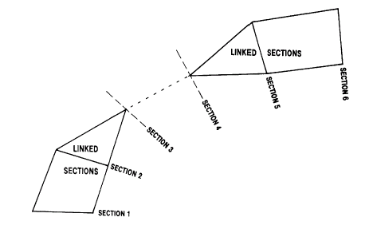](<javascript:void\(0\);>)

Figure 9: Pinching Out a Unit

### Input Files

Name |  Description |  I/O Status |  Required |  Type  
---|---|---|---|---  
IN |  Input file containing the X,Y and Z fields of points in the world coordinate system which are to be transformed to the UCS. |  Input |  Yes |  Undefined  
STRING |  Input string file holding the boundary strings which define the stratified unit[s]. 7 fields are compulsory: **SECTION , BOUNDARY , PVALUE,XP,YP,ZP** and **PTN**. 3 optional fields are **WSTAG , BSTAG** and **TAG**.  The file must be sorted on **SECTION , BOUNDARY PTN,** with **SECTION** being the primary keyfield. It is assumed that the section numbering system is such that sorting on **SECTION** will ensure that physically adjacent sections are adjacent in the **STRING** file. |  Input |  Yes |  String  
UNITDEF |  Optional input file containing the **BOUNDARY** value for the hangingwall and footwall of each stratified unit. It must contain the 3 fields: **UNITNAME** , **HANGWALL** and **FOOTWALL**.  If **UNITDEF** is not defined, the stratified unit must be defined by **UNITID** , **HANGID**. |  Input |  No |  Undefined  
  
## Output Files

Name |  I/O Status |  Required |  Type |  Description  
---|---|---|---|---  
OUT |  Output |  Yes |  Undefined |  The output file contains all the fields from the **IN** file plus the UCS coordinate fields **UCSA** , **UCSB** and **UCSC** , and the **UNITNAME** field. The **OUT** file must be different from the **IN** file.  
QUADS |  Output |  No |  Undefined |  Optional output file containing the quadrilaterals linking hangingwall and footwall points within and between sections. The file contains 8 fields: **PVALUE, PTN, XP, YP, ZP BLOCKTYP, SECTION** and **UNITNAME**.  
  
## Fields

Name |  Description |  Source |  Required |  Type |  Default  
---|---|---|---|---|---  
X |  The numeric field name in the IN file holding the data X co-ordinate, in world coordinates. The default field name is X. |  IN |  No |  Numeric |  Undefined  
Y |  The numeric field name in the IN file holding the data Y co-ordinate, in world coordinates. The default field name is Y. |  IN |  No |  Numeric |  Undefined  
Z |  The numeric field name in the IN file holding the data Z co-ordinate, in world coordinates. The default field name is Z. |  IN |  No |  Numeric |  Undefined  
SECTION |  The numeric field name in the **STRING** file holding the section identifier. The default field name is **SECTION**. |  STRING |  No |  Numeric |  Undefined  
BOUNDARY |  The numeric field name in the **STRING** file holding the boundary identifier. The default field name is **BOUNDARY**. |  STRING |  No |  Numeric |  Undefined  
WSTAG |  Within Section **TAG**. A numeric tag field in the **STRING** file, defining the stratigraphical links between hangingwall and footwall points on strings within the same section. A value of 0 or - means that the point is not linked. The default field name is **WSTAG**. |  STRING |  No |  Numeric |  Undefined  
BSTAG |  Between Section **TAG**. A numeric tag field in the **STRING** file, defining the stratigraphical links between 2 points on strings on adjacent sections with the same **BOUNDARY**. A value of 0 or - means that the point is not linked. The default field name is **BSTAG**. |  STRING |  No |  Numeric |  Undefined  
TAG |  A numeric tag field in the **STRING** file, defining both the stratigraphical links between points on strings within the same section, and between points on adjacent sections with the same **BOUNDARY**. A value of 0 or - means that the point is not linked. The default field name is **TAG**. |  STRING |  No |  Numeric |  Undefined  
UNITNAME |  An alpha or numeric field in the **UNITDEF** file defining the name or number of the unit. The default field name is **UNITNAME**. |  UNITDEF |  No |  Any |  Undefined  
HANGWALL |  A numeric field in the **UNITDEF** file which defines the **BOUNDARY** value of the hangingwall for each **UNITNAME**. The default field name is **HANGWALL**. |  UNITDEF |  No |  Any |  Undefined  
FOOTWALL |  A numeric field in the **UNITDEF** file which defines the **BOUNDARY** value of the footwall for each **UNITNAME**. The default field name is **FOOTWALL**. |  UNITDEF |  No |  Numeric |  Undefined  
UCSA |  The name of the A coordinate field in the UCS measured perpendicular to the strings within a section [across strike]. The field is created in the **OUT** file and has the default name of **UCSA**. |  OUT |  No |  Numeric |  Undefined  
UCSB |  The name of the B coordinate field in the UCS measured parallel to the boundary strings [down dip]. This field is created in the **OUT** file and has the default name of **UCSB**. |  OUT |  No |  Numeric |  Undefined  
UCSC |  The name of the C coordinate field in the UCS measured from section to section [along strike]. This field is created in the **OUT** file and has the default name of **UCSC**. |  OUT |  No |  Numeric |  Undefined  
  
## Parameters

Name |  Description |  Required |  Default |  Range |  Values  
---|---|---|---|---|---  
LINKMODE |  The method by which links between strings are created. |  Option |  Description  
---|---  
0 |  \- Within section links are defined by the **WSTAG** field, or by the **TAG** field if **WSTAG** does not exist. Between section links are defined by the **BSTAG** field, or by the **TAG** field if **BSTAG** does not exist.  
1 |  \- Within section links are defined automatically. Between section links are defined by the **BSTAG** field, or by the **TAG** field if **BSTAG** does not exist.  
2 |  \- Within section links are defined by the **WSTAG** field, or by the **TAG** field if **WSTAG** does not exist. Between section links are defined automatically.  
3 |  Within section links are defined automatically. Between section links are defined automatically. For simple structures it is not essential to define tag points on the strings; using the default value (3) ensures that automatic linking will be applied both within and between sections.  
No |  3 |  0,3 |  0,1,2,3  
UCSAMODE |  The type of UCSA coordinate written to the OUT file. Default (2). |  Option |  Description  
---|---  
1 |  \- coordinates are normalised.  
2 |  \- coordinates are adjusted.  
3 |  \- coordinates are true length.  
4 |  \- coordinates are world X value.  
5 |  \- coordinates are world Y value.  
6 |  \- coordinates are world Z value.  
No |  2 |  1,6 |  1,2,3,4,5,6  
UCSBMODE |  The type of UCSB coordinate written to the OUT file. Default (3). |  Option |  Description  
---|---  
1 |  \- coordinates are normalised.  
2 |  \- coordinates are adjusted.  
3 |  \- coordinates are true length.  
4 |  \- coordinates are world X value.  
5 |  \- coordinates are world Y value.  
6 |  \- coordinates are world Z value.  
No |  3 |  1,6 |  1,2,3,4,5,6  
UCSCMODE |  The type of UCSC coordinate written to the OUT file. Default (2). |  Option |  Description  
---|---  
1 |  \- coordinates are normalised.  
2 |  \- coordinates are adjusted.  
3 |  \- coordinates are true length.  
4 |  \- coordinates are world X value.  
5 |  \- coordinates are world Y value.  
6 |  \- coordinates are world Z value.  
No |  2 |  1,6 |  1,2,3,4,5,6  
PLANE |  The plane of the structural interpretations defined in the **STRING** file. Default (1). 1 - vertical sectional interpretation. 2 - interpretation in plan. | No | 1 | 1,2 | 1,2  
HANGID |  The value of the field **BOUNDARY** in the **STRING** file that defines the hangingwall of the unit. It will be used if the **UNITDEF** file is not defined. |  No |  Undefined |  Undefined |  Undefined  
FOOTID |  The value of the field **BOUNDARY** in the **STRING** file that defines the footwall of the unit. It will be used if the **UNITDEF** file is not defined. |  No |  Undefined |  Undefined |  Undefined  
UNITID |  If **HANGID** and **FOOTID** are used then the corresponding unit number is defined by parameter **UNITID**. |  No |  Undefined |  Undefined |  Undefined  
TOLRNC |  Tolerance in the calculation of the **UCSA** coordinate expressed as a proportion of the UCSA width. The default is (0). |  No |  0 |  Undefined |  Undefined  
UCSALIMT |  Flag to define the limits of the **UCSA** coordinate if **UCSAMODE** =1 or 2 and **TOLRNC** >0\. The options below are defined in terms of the Normalized mode [**UCSAMODE** =1]. Default (1) |  Option |  Description  
---|---  
1 |  UCSA values can be less than 0 and greater than 1  
2 |  UCSA values can be less than 0. Values calculated as greater than 1 are reset to 1  
3 |  UCSA values calculated as less than 0 are reset to 0. Values can be greater than 1  
4 |  UCSA values calculated as less than 0 are reset to 0. Values calculated as greater than 1 are reset to 1  
No |  1 |  1,4 |  1,2,3,4  
ORGTAG |  Tag number of points which define the origin surface from which the UCSB coordinate is measured. The default surface if **ORGTAG** is undefined (-) is created from the first points on each of the hangingwall and footwall strings. |  No |  - |  Undefined |  Undefined  
  
## Error and Warning Messages

Message |  Description  
---|---  
>>> &UNITDEF : Missing UNITNAME field <<< >>> &UNITDEF : Missing fields <<< |  Check that the &**UNITDEF** file contains the fields specified as * **UNITNAME** , * **HANGWALL** and * **FOOTWALL**.  
>>> Insufficient TAG fields specified <<< |  Check that the tag values held in the fields specified as * **WSTAG** , * **BSTAG** and/or * **TAG** are consistent with the @**LINKMODE** parameter.  
>>> Missing or invalid fields in &IN file <<< |  The &IN file must contain the fields specified as the *X,*Y,*Z fields. They must be numeric fields.  
>>> &UNITDEF not spe cified-parameters @HANGID,@FOOTID needed <<< |  If an &UNITDEF file is not specified, the strings to be used in the unfolding must be specified with the @**HANGID** and @**FOOTID** parameters.  
>>> Warning: on section mmmmmm.nn Hangingwall mmm.nn has iii points Footwall mmm.nn has jjj points >>> |  Either the hangingwall or footwall on this section has 0 or 1 point in it. The unit is not unfolded between this section and its adjacent sections. Check the &**STRING** file matches the &**UNITDEF** or @**HANGID** , @**FOOTID** data.  
>>> Warning: section s mmmmmm.nn and mmmmmm.nn are coincident <<< |  These sections are not used in the unfolding process. Check the &STRING file is correct, and sorted by * **SECTION** , * **BOUNDARY**.  
>>> Sections mmmmmm.nn & mmmmmm.nn both have >1 tag= mmm.n <<< |  The same tag value occurs at least twice on each of the 2 sections. Thus conflicting links have been defined, and these sections are not used in the unfolding process. Correct the tag values in the &STRING file.  
>>> Only 1 link between sections mmmmmm.nn & mmmmmm.nn <<< |  Only 1 link between the 2 sections has been defined by tag points. These sections are not unfolded. You must have at least 2 links between strings, or no links at all (in which case the first and last points on the strings will be linked automatically). Correct the tag values in the &**STRING** file.  
>>> H/w & f/w on section mmmmmm.nn both have >1 tag = mmm.n <<< |  The same tag value occurs at least twice on each of the hangingwall and footwall of this section. Thus conflicting links have been defined, and this section is not used in the unfolding process. Correct the tag values in the &**STRING** file.  
>>> Only 1 link between hangingwall & footwall. Se ction mm.nn <<< |  Only 1 link between the hangingwall and footwall on this section has been defined by tag points. This section is not used in the unfolding process. You must have at least 2 links between strings, or no links at all (in which case the first and last points on the strings will be linked automatically). Correct the tag values in the &**STRING** file.  
UNIT NAME H/W IDEN F/W IDEN UCSA LENGTH UCSB LENGTH UCSC LENGTH TOP 104.0000 105.0000 45.9524 517.6299 95.3935 MIDDLE 105.0000 106.0000 20.8832 500.3890 96.8432 BOTTOM 106.0000 107.0000 19.1225 491.0631 99.1167 |  For every stratified unit that processes **UNFOLD** , it reports the average length for each of the 3 UCS coordinates. This is the dimension **UNFOLD** has determined from the unfolding quadrilaterals and is used if adjusted coordinates are requested.  
  
Related topics and activities

  * [UNFOLD Wizard](<../STUDIO_RM/UnfoldWizard.md>)