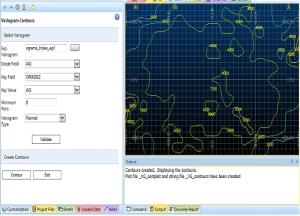

# VCONTOUR Process  
  
To access this process:

  * Enter "VCONTOUR" into the [Command Line](<../COMMON/Command_Toolbar.md>) and press <ENTER>.
  * Display the **[Find Command](<../COMMON/findcommand.md>)** screen, locate **VCONTOUR** and click **Run**.

See this process in the [Command Table](<../command_help/COMMAND%20TABLE_V.md#VCONTOUR>).

## Process Overview

**Note** : This is a _superprocess_ and running it may have an effect on other Datamine files in the project.

The **VCONTOUR** process creates a variogram contour plot and displays it in the **3D** window. This can be used to determine the major and minor axes of anisotropy in the defined plane.

The process is divided into two parts:

  * Select Variogram \- used to define and checks the data file and parameters; perform initial transformation of the data.

  * Create Contours \- creates contours using the defined parameters. The contouring process uses the inverse power of distance method to interpolate onto a regular grid, defined by the Grid Interval value, and uses a search radius defined by the Search Radius value. Changing the values of these two parameters can change the shape of the contours so it is often worth experimenting with different values of these parameters.

## Select Variogram

#### Experimental Variogram File

The input to the **VCONTOUR** process is an experimental variogram file, as created by [VGRAM](<vgram.md>). **VCONTOUR** will always contour in the local horizontal plane as defined by the [VGRAM](<vgram.md>) parameters **ANGLE1, AXIS1, ANGLE2, AXIS2, ANGLE3, AXIS3**. These parameters are stored as implicit fields in the data definition of the experimental variogram file created by [VGRAM](<vgram.md>). If the 3 angles are all zero (the default) then the plane is the horizontal plane; otherwise any rotated and dipping plane can be defined.

Variograms must have been created for a minimum of 2 azimuths.

#### Grade Field

Select the required grade field from the drop-down.

#### Key Field and Key Value

If a Key Field (eg rock type) were specified when running [VGRAM](<vgram.md>) then this value will appear in the **Key Field** drop down list. You must then select the required Key Value.

#### Minimum Pairs

It is often useful to be able to specify the minimum number of sample pairs to be used in the contouring. If the actual number is less than the minimum then the variogram value will not be used for contouring.

#### Variogram Type

Select the required variogram type from the drop-down.

## Create Contours

#### Contour Interval

A default **Contour Interval** is provided. This may not be appropriate in every case so you can change the value. The maximum contour value is usually a little larger than the variance of the original samples (the sill of the variogram), so dividing this value by say 20 would give a Contour Interval of an appropriate magnitude.

#### Number of Decimal Places

The contours are annotated with their values. You can specify the number of **Decimal Places** for this annotation.

#### Grid Interval

You can specify the **Grid Interval** to be used by the contouring algorithm. A value between one and five times the variogram lag distance is often appropriate.

#### Search Radius

You can specify the **Search Radius** to be used by the contouring algorithm for interpolating onto the grid points. A value a little larger than the Grid Interval is often appropriate.

#### Annotation

If you tick the **Annotation** check box, then all the variogram values is displayed on the plot.

## Input Files

Name |  Description |  I/O Status |  Required |  Type  
---|---|---|---|---  
IN |  File to be validated. |  Input |  Yes |  Table  
  
## Output Files

Name |  I/O Status |  Required |  Type |  Description  
---|---|---|---|---  
OUT |  Output |  Yes |  Table |  File containing validated records.