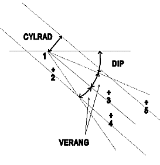
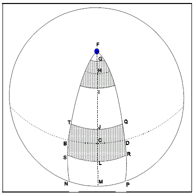

# VGRAM Process

To access this process:

  * **Estimate** ribbon **> > Variograms >> Calculate**.

  * Enter "VGRAM" into the [Command Line](<../COMMON/Command_Toolbar.md>) and press ENTER.
  * Display the **[Find Command](<../COMMON/findcommand.md>)** screen, locate **VGRAM** and click **Run**.

See this process in the [Command Table](<../command_help/COMMAND%20TABLE_V.md#VGRAM>).

## Process Overview

This process calculates variograms and/or cross variograms for a range of azimuth and dip directions.

The main benefits of **VGRAM** are:

  * variograms and/or cross variograms for up to 30 different variables, or one variable with 30 indicator values can be calculated in a single run.

  * automatic calculation of indicator values based on cut-offs.

  * key field options (two key fields are supported, (although three are technically achievable if * **BHID** is set and &**DOWNHOLE** = 0) allows variogram calculation to be restricted by the specified key fields e.g. rock type, or BHID to give downhole variograms.

  * key fields options also allows calculation of variograms excluding pairs with the same keyfield value.

  * optimization of sample search for fast calculation.

  * calculations includes normal, relative and lognormal variograms, and covariance.

  * variograms for different directions and the 'directionless' variogram are all calculated in a single run.

  * optional rotated coordinate system ensures flexibility in definition of directions.

  * smaller lag interval for smaller distances.

  * options include angles of regularization, cylindrical radius, lag tolerance, etc.

  * variograms are written to a database file, and/or the print file together with summary statistics.

A progress report is displayed during execution of the **VGRAM** process summarizing the percentage of the variogram calculation which has been completed. The progress report also shows the estimated time remaining and the estimated time of completion.

### Rotated Coordinate System

The usual way of defining a set of variogram directions is to define a base azimuth and dip and a set of incremental azimuth and dip angles. Variograms are then calculated for each combination of azimuth and dip. The azimuth is measured clockwise from North (the Y axis), and the dip is measured downwards from the horizontal plane. For example if the base azimuth and dip are both 0o and the horizontal increment is 45o and the vertical increment is 30o then variograms are calculated for azimuth/dip pairs of 0o/ 0o , 0o/ 30o , 0o/ 60o , 0o/ 90o , 45o/ 0o , 45o/ 30o , ..... 315o/ 90o.

Although this method gives variograms for a range of directions it does not allow variograms to be calculated at regular angles in a dipping and/or plunging plane. For example if the main structure of the orebody dips at 25o in the direction N35oE then it would be useful to calculate variograms in this dipping plane. This can be done using parameters **AXISn** , **ANGLEn** (n=1,3) to define a set of rotations of the coordinate system. Azimuths and dips are then defined relative to the rotated Y axis which lies in the rotated XY plane.

The **ANGLEn** and **AXISn** parameters are defined as follows. The first rotation is by angle **ANGLE1** around **AXIS1** , where **AXIS1** =1 for the X axis, 2 for the Y axis and 3 for the Z axis. The second and third rotations are defined in an identical manner.

The rotation angle is measured in a clockwise direction when viewed from the positive axis towards the origin. A negative rotation angle means an anticlockwise rotation.

The Y axis after rotation defines the base direction for variogram calculation. Variograms for other directions are all calculated as increments from this base. The azimuth and dip angles of each variogram are written to the results file in both the original (i.e. world) and rotated coordinate systems.

### Variogram Directions

Variograms are calculated for a range of directions as defined by six parameters. The initial direction is defined by @**AZI** and @**DIP** , which are the azimuth and dip measured relative to the rotated Y axis in the rotated plane. The increments (in degrees) between successive directions are defined by @**HORINC** and @**VERINC** , and the number of increments by @**NUMHOR** and @**NUMVER**. A variogram is calculated for each combination of azimuth and dip.

A variogram with an azimuth of Ao and a dip of 0o is the same as one with an azimuth of (A+180)o and a dip of 0o. Therefore only the variogram with an azimuth in the range 0o to 180o is output. Also a variogram with an azimuth of Ao and a dip of Do is the same as an azimuth of (A+180)o and a dip of -Do.

If the range of dip angles includes 90o (vertically downwards from the rotated plane) then this represents a special case which is independent of the azimuth. For this 90o dip case there is a single angle of regularization which is the average of the horizontal and vertical angles @**HORANG** and @**VERANG** respectively. This average angle is used to define a cone with a circular cross section. The azimuth for the 90o dip case is recorded in the output file as 0o.

As well as variograms for individual directions, a 'directionless' variogram is also calculated. This is independent of azimuth and dip, and depends only on distance. This is recorded in the output file with azimuth and dip fields both set to absent data (-).

### Keyfields

Single keyfield

If a *KEY field is specified then variograms are calculated for each **KEY** field value. The average variogram over all **KEY** field values is also calculated. It is NOT necessary for the input sample data file to be sorted on the **KEY** field.

Parameter @**ALLKEYS** controls whether the individual variograms are written or whether just the average is written:

=0  |  only the average over all **KEY** field values is written to the output file. This is the default.  
---|---  
=1 |  variograms for all **KEY** field values and the average variogram are written to the output file. In this case the output file will include the **KEY** field. If the KEY field is alpha, then the **KEY** value in the output file for the average variogram is blank; if numeric then it is -.  
  
Parameter @**KEYMETH** is also associated with the use of a **KEY** field:

=1  |  calculate variograms within each **KEY** field, as described above. This is the default.  
---|---  
=2 |  in the variogram calculation only use pairs of samples with different KEY values. If for example the **KEY** field is **BHID** , then only pairs of samples in different holes are included. The **KEY** value written to the output file is blank (alpha) or - (numeric).  
=3 |  calculate both the within **KEY** and different **KEY** variograms.  
  
The * **KEY** field is useful for calculating variograms within the same borehole. It can also be used for calculating variograms within the same rock type.

Where * **KEY** is specified and @**KEYMETH** = 2, the output &**PAIRSOUT** file will contain an attribute for each value of the key field using the format [KEY field Value]n, where n is a unique index. For example, if a keyfield "T" is specified, containing two distinct values throughout the recordset, two attributes are added to &**PAIRSOUT** , that is "T1" and "T2". In this case, T1 and T2 would contain different values to reflect the key values for each sample in a pair.

If @**KEYMETH** were set to 1, the attribute values would still be generated in &**PAIRSOUT** , but would contain identical values.

The @**DOWNHOLE** parameter is used to determine if downhole variograms are calculated. You can either set this to either:

  * 0 (zero) meaning the **BHID** field is treated as an additional **KEY** field value (effectively, treating the run as having two keyfields, even though only * **KEY** is specified)

  * 1, meaning the **BHID** field is used to append any variograms created in the same drillholes. As such, the output file will not include a **BHID** field. This is the default setting.

@**DOWNHOLE** is only effective if * **BHID** is specified.

Two keyfields

VGRAM supports up to two key fields for a single run. For example, you can create both an average variogram and a downhole, directionless variogram using both key fields.

This is achieved using the field specifications * **KEY2** and * **BHID**.

Essentially, if both * **KEY** and * **KEY2** are specified (* **KEY2** cannot be set in isolation), both are affected by the @**ALLKEYS** and @**KEYMETH** parameters, for the unique combinations of both specified keys.

As with the single key field scenario, the @**DOWNHOLE** parameter is used to determine whether downhole parameters are calculated. In a situation where both * **KEY** and * **KEY2** are defined and @**DOWNHOLE** is set to 0 (zero), this effectively treats the run as having three distinct key fields. However, in this case, if @**DOWNHOLE** = 1, @**ALLKEYS** and @**KEYMETH** will only work for * **KEY** and * **KEY2**.

Further notes on dual key field usage in VGRAM:

  * If *BHID is not set, @**DOWNHOLE** will be ignored (this is the same for single key field usage).

  * If *BHID is specified, downhole variograms are created in addition to direction and other variograms (as determined by other parameters). 

    * If @**DOWNHOLE** = 0 and * **BHID** is specified, the behaviour of @**ALLKEYS** and @**KEYMETH** is applied to * **BHID** (as well as * **KEY1** and * **KEY2**). The downhole variograms are appended to the file.

    * If @**DOWNHOLE** = 1 and * **BHID** is specified, an average downhole variogram (only) is appended to the file, using the fields * **KEY** = **BHID** (and assuming @**ALLKEYS** = 0 and @**KEYMETH** = 1). The average downhole variogram is created for all unique combinations of * **KEY** and * **KEY2**. The values of @**ALLKEYS** and @**KEYMETH** will apply to * **KEY** and * **KEY2** only.

### Lag Interval

There are 3 parameters associated with the definition of the lag:

@LAG |  Distance for one lag.  
---|---  
@LAGTOL* |  Tolerance to be used when selecting sample pairs. This is specified in user data units and must be between 0 and half of **LAG**. If it is not specified or zero then half of **LAG** is used (-).  
@NLAGS* |  Number of lags. The maximum number allowed is 100.  
  
In addition the initial lags can be divided into sublags. This allows closer definition of the variogram over smaller distances.

@NSUBLAG* |  The number of sublags per lag ie the sublag distance is @**LAG** /@**NSUBLAG**. Only the first @**NLAGS1** lags are divided.  
---|---  
@NLAGS1* |  The number of lags to be divided into sublags.  
  
If either @**NSUBLAG** or @**NLAGS1** are - or 0, then sublags are not used.

The maximum number of lags and sublags is 100. For example if @**NLAGS** =30, @**NSUBLAG** =4 and @**NLAGS** = 10, then the number of lags/sublags used iscalculated as:

Lags not divided into sublags = 30 \- 10 = 20  
10 lags each divided into 4 sublags = 10 * 4 = 40  
Lag 0 divided into 2 sublags = 2  
Total = 62

An example of sublags is given here using:

@**LAG** =10, @**NSUBLAG** =3, @**NLAGS1** =2, @**LAGTOL** = 0

Lag |  Lag |  Distance |  Sublag |  Sublag |  Distance  
---|---|---|---|---|---  
Number |  From |  To |  Number |  From |  To  
0 |  0 |  5 |  0 |  0 |  1.667  
0.333 |  1.667 |  5  
1 |  5 |  15 |  0.667 |  5 |  8.333  
1 |  8.333 |  11.667  
1.333 |  11.667 |  15  
2 |  15 |  25 |  1.667 |  15 |  18.333  
2 |  18.333 |  21.667  
2.333 | 21.677 | 25  
3 | 25 | 35 | 3 | 25 | 35  
4 | 35 | 45 | 4 | 35 | 45  
5 | 45 | 55 | 5 | 45 | 55  
  
The sublag number is written to field **LAG** in the output variogram file. Note that both the lag and sublag number multiplied by @**LAG** give the average distance within the lag or sublag except for lag or sublag 0.

### Cylindrical Search Constraint

As well as vertical and horizontal angles of regularization the user may define a cylindrical search volume. The cylinder is centered on the variogram direction vector with a user defined radius @**CYLRAD**. This constraint is in addition to the angles of regularization so that at the smallest lags the pyramid search volume will apply, whereas at larger lags the cylindrical constraint will apply. This is illustrated in Figure 1, below:

_VERTICAL SECTION_

Sample 1 is paired with samples 2, 3, 4 and 5 as follows:

SAMPLES PAIR |  VERANG Constraint |  CYLRAD Constraint |  Accept/Reject   
---|---|---|---  
1 and 2 |  Fail |  Pass |  Reject  
1 and 3 |  Pass |  Pass |  Accept  
1 and 4 |  Pass |  Pass |  Accept  
1 and 5 |  Pass |  Fail |  Reject  
  
similar tests are carried out on possible sample pairs, both in section (as shown above), and in plan (using **AZI** and **HORANG** instead of **DIP** and **VERANG**). The default value of the optional @**CYLRAD** parameter is zero, which means that the cylindrical constraint is not applied.

### Grade Fields

The grade fields are defined using fields * **F1** , * **F2** , ... ,* **F24**. Only * **F1** is compulsory. Up to 24 fields can be defined.

### Cross Variogram

Parameter @**CROSSVAR** is used to control whether variograms and/or cross variograms are to be calculated:

=0 only variograms.

=1 only cross variograms. All possible combinations of *Fi with *Fj (i>j) are calculated.

=2 both variograms and cross variograms are calculated.

If @**CROSSVAR** = 1 or 2 cross * values are calculated for the variogram, pairwise relative variogram and log variogram. They will not be calculated for covariance, correlogram or madogram.

### Layered Variograms

If the deposit is stratified, it is sometimes useful to calculate variograms within each layer, and also the average over all layers. The base layer plane is defined by the XY plane after the rotations ANGLEn, AXISn have been applied. Layers are defined by 2 parameters:

@SPACING |  The samples are assigned a layer number relative to the rotated XY plane. Layer 1 includes all samples between the rotated XY plane and a parallel plane whose rotated Z value is @**SPACING**. Layer 2 includes all samples between the plane at Z=@**SPACING** and Z=2*@**SPACING**. The sample with the minimum Z value (measured in the rotated plane) lies on the plane which is at the base of layer 1.  
---|---  
@LAYMETH |  The layer method:  
| =0 Layers are not used. This is the default.  
| =1 Layers are used, but only the average over all layers is written to the output file.  
| =2 Layers are used, and the variogram for each layer and the average over all layers are written to the output file. Field LAYER is included in the output file. It is set to - for the average over all layers.  
  
Layers and key fields cannot be used at the same time. If @**LAYMETH** >=1 and *KEY has been specified then the process terminates with an error message.

If layers are used then variograms will only be calculated for a dip of 0 . Therefore parameters 0o @**DIP** , @**VERINC** and @**NUMVER** which define the initial dip, the incremental angle between dips and the number of increments for the vertical plane are ignored. The vertical angle of regularization, @**VERANG** , will still apply.

### Indicator Variograms

The process will calculate indicator variograms for a single grade field (* **F1**) for a range of cutoff values. An indicator takes the value 0 if the grade is less than or equal to cutoff and 1 if it greater than cutoff. If the cutoff values are at regular intervals then the values can be defined by three parameters. If the cutoff values are at irregular intervals, then the cutoffs are defined in file &**CUTOFF**. If both parameters and file are specified then the &**CUTOFF** file takes priority. The three parameters are:

@INDSTEP |  The step size between successive indicator cutoffs:  
---|---  
| =0 Do not use indicators, unless a &CUTOFF file has been specified. This is the default.  
| >0 The step size between indicators.  
@INDMIN |  The lowest indicator cutoff value.  
@INDNUM |  The number of indicators to use; ie indicator variograms are calculated for cutoffs of @INDMIN, @INDMIN+ 1*@INDSTEP, @INDMIN+ 2*@INDSTEP, ....., @INDMIN+ (@INDNUM - 1)*@INDSTEP. A maximum of 24 cutoffs is allowed. If @INDNUM is greater than or equal to 1 then indicators are used.  
  
There are in fact two indicator methods. The first method has been described above and the second method is the Nested Indicator method. In the Nested method a sample is discarded once it has been used. Within the Nested method there are two versions - Bottom-Up and Top-Down. The definition of all three types is shown below.

Ci |  is cut-off number i, where 1 ≤ i ≤ n.  
---|---  
C0 |  is set to a very large negative number.  
Cn+1 |  is set to a very large positive number.  
n |  is the number of cut-offs (n<=24).  
Iil |  is the indicator value for cut-off i.  
g |  is the grade of a sample.  
  
Normal Indicator Method:

If g ≤ Ci then Ii = 0

If g >Ci then Ii = 1

Nested Method, Bottom Up:

If g ≤ Ci-1 then Ii = - (absent data)

If Ci-1 < g ≤ Ci then Ii = 0

If g >Ci then Ii = 1

Nested Method, Top Down:

If g ≤ Ci then Ii = 0

If Ci < g ≤ Ci+1 then Ii = 1

If g > Ci+1 then Ii = - (absent data)

These are illustrated in the following example:

Sample Grade|  Cut-Off|  Normal|  Method|  Cut-Off Bottom Up .|  Cut-Off Top Down  
---|---|---|---|---|---  
1.5 |  2.5 |  3.5 |  1.5 |  2.5 |  3.5 |  3.5 |  2.5 |  1.5  
7 |  1 |  1 |  1 |  1 |  1 |  1 |  1 |  \- |  -  
2.3 |  1 |  0 |  0 |  1 |  0 |  \- 0 |  0 |  1|   
0.5 |  0 |  0 |  0 |  0 |  \- |  \- |  0 |  0 |  0  
2.7 |  1 |  1 |  0 |  1 |  1 |  0 |  0 |  1 |  -  
4.2 |  1 |  1 |  1 |  1 |  1 |  1 |  1 |  \- |  -  
  
An indicator value of - means that the sample is not used in the variogram calculation for that cutoff.

The indicator method is controlled by parameter:

@NESTED | =0 |  The Normal Indicator method is used. This is the default.  
---|---|---  
| =1 |  Nested Method, Bottom Up.  
| =2 |  Nested Method, Top Down.  
  
If indicators are selected then only variograms, not cross variograms, are calculated.

### The Variogram Output File

The variogram output file includes the fields shown below. Fields without a * are always created. Fields followed by a * are only created under certain conditions as described.

GRADE |  The grade field for variograms, or the first grade field for cross variograms.  
---|---  
GRADE2* | The second grade field. This is only created if cross variograms are calculated. If both variograms and cross variograms are output, then for variograms the **GRADE** and **GRADE2** fields are the same.  
CUTOFF* | Cutoff grade for indicator variograms. This is only created if indicator variograms are calculated.  
[KEY]* | The key field value, alpha or numeric. This is only included if * **KEY** has been specified, and @**KEYMETH** & 2\. The [] brackets mean that the field name in the file is not **KEY** , but whatever field has been selected as the **KEY** field.  
KEYMETH* | A numeric flag field which is only created if * **KEY** has been specified and @**KEYMETH** = 3; ie both the same key and different key variograms are calculated. It is set to 1 for the same key variograms, and to 2 for the different key variograms.Notes about @KEYMETH and &PAIRSOUT

  * Where **KEYMETH** is set to 1 and * **KEY** is specified, the output &**PAIRSOUT** will include additional attributes representing each distinct keyfield value detected, with each attribute containing the same attribute values.
  * Where **KEYMETH** is set to 2 and * **KEY** is specified, the output &**PAIRSOUT** will include additional attributes representing each distinct keyfield value detected, with each attribute containing the key field value relevant to the sample pair. 
  * Where **KEYMETH** is set to 3 and * **KEY** is specified, the output &**PAIRSOUT** will include additional attributes representing each distinct keyfield value detected, with each attribute containing either different or the same attribute values.

  
LAYER* | The layer number. This is only included if @**LAYMETH** = 2 ie variograms are output for individual layers. The sample with the minimum Z value (measured in the rotated plane) lies on the plane which is at the base of layer 1. **AZI** The azimuth of the variogram measured clockwise from the Y axis in the rotated plane. **DIP** The dip of the variogram measured downwards from the rotated XY plane.  
WAZI* |  The azimuth of the variogram, in the world coordinate system. This is only included if one or more rotation angles (@**ANGLEn**) have been defined. If rotation angles are not defined, then **WAZI** and **AZI** would have the same value.  
WDIP* | The dip of the variogram, in the world coordinate system. This is only included if one or more rotation angles (@**ANGLEn**) have been defined. If rotation angles are not defined, then **WDIP** and **DIP** would have the same value.  
LAG | The lag, or sublag number.  
AVE.DIST|  The average distance between samples for the current lag.  
NO.PAIRS | The number of pairs of samples for the current lag.  
COVAR | The covariance between sample pairs. For a variogram this is calculated as: COVAR = ( ∑ xi xi+h \- ∑ xi ∑ xi+h / n ) / (n - 1) For a cross variogram COVAR is calculated as:  
| COVAR = ( ∑ (xi yi+h \+ xi+h yi)- (∑ (xi +xi+h ) ∑ (yi \+ yi+h ) / 2n )) / (2n - 1)  
VGRAM |  The variogram or cross variogram value. The variogram is defined as:  
| g(h) = ∑ (xi \- xi+h )2 / 2n  
| and the cross variogram is defined as:  
| g(h) = ∑ [(xi \- xi+h ) (yi \- yi+h )] / 2n  
| where xi is the value of one grade (eg AU) at location i, and yi is the value of the second grade field (eg AG) at location i.  
PWRVGRAM | The pairwise relative variogram or relative cross variogram. This is the same as the variogram or cross variogram, except that every term in the calculation is divided by the average value of the two samples contributing to that term. The pairwise relative variogram is calculated as:  
| g(h) =∑ [ (xi \- xi+h )2 / (0.5 (xi \+ xi+h ) )2 ] / 2n  
| The pairwise relative cross variogram is calculated as:  
| g(h) = ∑ [(xi \- xi+h ) (yi \- yi+h ) / (( 0.5 (xi \+ xi+h)) ( 0.5 (yi \+ yi+h ))) ] / 2n  
LOGVGRAM | The log variogram or cross variogram. This is calculated by taking the logs of the grade values before calculating the variogram or cross variogram. If a grade is less than @**LOGCON** then its value is replaced by @**LOGCON**.  
MADOGRAM| this is similar to the variogram; instead of squaring the difference between xi and xi+h the absolute difference is used:  
g(h) = ∑ abs(xi \- xi+h ) / 2n  
CRLOGRAM| the correlogram is the correlation coefficient calculated between pairs of samples a distance h apart  
NSAMPLE | The number of individual samples contributing to the variogram or cross variogram. This field remains constant for each variogram or cross variogram, and the same applies to the following 6 fields.  
AVGRADE | The average (ie mean) grade or average indicator value over all samples used for calculating the current variogram or cross variogram for field **GRADE**.  
AVGRADE2* | The average (ie mean) grade or average indicator value over all samples used for calculating the current cross variogram for field **GRADE2**.  
VRGRADE | The variance of the grade or indicator, over all samples used for calculating the current variogram. In the case of cross variograms **VRGRADE** is the covariance between the two variables.  
AVLGRADE* | The average (ie mean) grade of the logs over all samples used for calculating the current variogram or cross variogram for field **GRADE**. This field is not created if indicators are used.  
AVLGRAD2* | The average (ie mean) grade of the logs over all samples used for calculating the current cross variogram for field **GRADE2**. This field is not created if indicators are used.  
VRLGRADE* | The variance of the log of the grade, over all samples used for calculating the current variogram. In the case of cross variograms **VRLGRADE** is the covariance between the logs of the two variables. This field is not created if indicators are used.  
ANGLE1* | Rotation angle 1. Only included if one or more of the rotation angles are nonzero. This is an implicit field.  
AXIS1* | Rotation axis 1. Only included if one or more of the rotation angles are nonzero. This is an implicit field.  
ANGLE2* | Rotation angle 2. Only included if one or more of the rotation angles are nonzero. This is an implicit field.  
AXIS2* | Rotation axis 2. Only included if one or more of the rotation angles are nonzero. This is an implicit field.  
ANGLE3* | Rotation angle 3. Only included if one or more of the rotation angles are nonzero. This is an implicit field.  
AXIS3* | Rotation axis 3. Only included if one or more of the rotation angles are nonzero. This is an implicit field.  
  
### The Sample Pairs Output File

The sample pairs output file contains one record for each sample pair used to calculate a variogram or cross variogram. If specified it is created with the following fields:

VLAGDIST| Variogram lag value.  
---|---  
VDIP,VAZI | The dip and azimuth direction 'bin' for the current pair of samples in the rotated coordinate system. If a pair contributes to more than one variogram 'bin' then a record is output for each bin. The two angles are measured in the rotated coordinate system.  
WVDIP,WVAZI* | The same as **VDIP** and **VAZI** except in the world coordinate system. If all rotation angles are zero, then the values are the same as **VDIP** and **VAZI** and so the two fields **WVDIP** and **WVAZI** are not output.  
DISTANCE | Actual distance between samples.  
DIP,AZI | Actual angles between samples in the rotated coordinate system.  
WDIP, WAZI* | These are the same as **DIP** and **AZI** , except that they are measured in the world coordinate system. If all rotation angles are zero, then the values are the same as **DIP** and **AZI** and so the two fields **WDIP** and **WAZI** are not output.  
X1,Y1,Z1* | Coordinates of 1st sample point. If Z is not specified then only X and Y are included.  
X2,Y2,Z2* | Coordinates of 2nd sample point. If Z is not specified then only X and Y are included.  
GRADE1 | Grade field for variogram or first grade field for cross variogram.  
GRADE2* | Second grade field for cross variogram. Not used for a variogram.  
VALUE11 | Value of the 1st sample **GRADE1**.  
VALUE12| Value of the 2nd sample **GRADE1**.  
VALUE21| Value of the 1st sample **GRADE2**.  
VALUE22 | Value of the 2nd sample **GRADE2**.  
  
Note that care should be taken when specifying this output file as its size may be depending on the number of samples, variograms and lags.

### Displayed Output

The @**PRINT** parameter controls the amount of information sent to t he display. If it is set to 0 then there is just a summary of the input data. The variograms are written to the output file but are not displayed on the screen or sent to the print file.

If @**PRINT** =1 (the default) then each variogram is displayed on the screen. The number of lines per screen is controlled by the @**PROMPT** parameter. If @**ECHO** =1 then the same information is also sent to the print file. However the value of @**PROMPT** is not used for paging the print file. Each variogram is started on a new page.

The display of variogram tables on the screen can be terminated at any stage using '!'. This does not affect the variogram tables sent to the print file. A progress monitor shows the percentage of the total variogram calculations which have been completed. It also shows the estimated time to completion and the estimated completion time.

### Run Times

The main factor contributing to the run time of process **VGRAM** is the number of samples in the input sample data file. If the process has to pair eve ry sample with every other sample then there is a limited amount that can be done to reduce the run time. In this case the run time is approximately proportional to the number of samples. However if the maximum lag distance (@**NLAGS** *@**LAG**) is significantly less than the maximum separation between samples then the sample search optimizing method can reduce the run time substantially.

The optimizing method divides the area covered by the samples into a three dimensional grid and the samples are indexed accordingly. Sample pairs are only considered if they lie within blocks which are separated by less than the maximum lag distance. Therefore it is best to select the @**LAG** and @**NLAG** parameters so that the total distance is sufficient to cover the range of interest, but is not unnecessarily large.

### Compatibility With GSLIB

For some variogram programs, such as in GSLIB, the angles of regularization are measured in the horizontal and vertical directions respectively. This means that for the steeper dips the actual volume within the angles of regularization reduces as the dip increases. This is illustrated in the diagram which shows the intersection of the volume of regularization with the surface of a sphere.

_;>)_

Points B, C, and D all have zero dip, and so the broken line BCD lies on the equator. The broken line FM is a line of longitude (azimuth a), with point F being the North Pole. If point O (not shown in the diagram) is at the centre of the sphere then line OC is the vector of a variogram with zero dip and azimuth a. The lines of longitude FTBSN and FQDRP are the limits of the horizontal angle of regularization around OC. The lines of latitude TJQ and SLR are the upper and lower limits of the vertical angle of regularization.

The lower shaded area represents the intersection of the volume of regularization with the surface of the sphere. This volume is associated with vector OC, which has azmiuth " and zero dip. The upper shaded area represents a similar intersection, but for vector OH which also has azimuth ", but a large negative dip (about -75 in the diagram). It can be seen that the surface area of of intersection and hence the volume of regularization decreases as the dip gets further from zero (in either the positive or negative directions).

**VGRAM** has been designed so that the volume of regularization is constant, and is independent of the dip. This is done by transforming the data so that th e vector has a dip of zero in the rotated system. Hence the intersection of all volumes of regularization are equivalent to the lower shaded area. This means that there is an overlap between volumes of regularization. Some sample pairs are used for more than one variogram. The end result is that if there is a regular distribution of samples then using **VGRAM** the number of sample pairs for lag N are the same whatever the azimuth and dip of the variogram. This is not the case for GSLIB where the volume of regularization and hence the number of sample pairs decreases as the dip gets further from zero.

## Input Files

Name| Description| I/O Status| Required| Type  
---|---|---|---|---  
IN| Input sample data file. This must contain the fields X and Y , and at least one grade field F1. The Z field is optional. This file must also contain the **KEY** field, if it has been specified.| Input| Yes| Undefined  
CUTOFF| This contains the cut-off grades for indicator variograms. There is a single field **CUTOFF** , and up to 24 records, one per cut-off. The file does not have to be sorted on **CUTOFF**.| Input| No| Variogram - Model  
  
## Output Files

Name| I/O Status| Required| Type| Description  
---|---|---|---|---  
OUT| Output| Yes| Undefined| Variogram output file. This will contain the fields described previously. The name must not be the same as the input file.  
PAIRSOUT| OutputNotes about @KEYMETH and &PAIRSOUT

  * Where **KEYMETH** is set to 1 and * **KEY** is specified, the output &**PAIRSOUT** will include additional attributes representing each distinct keyfield value detected, with each attribute containing the same attribute values.
  * Where **KEYMETH** is set to 2 and * **KEY** is specified, the output &**PAIRSOUT** will include additional attributes representing each distinct keyfield value detected, with each attribute containing the key field value relevant to the sample pair. 
  * Where **KEYMETH** is set to 3 and * **KEY** is specified, the output &**PAIRSOUT** will include additional attributes representing each distinct keyfield value detected, with each attribute containing either different or the same attribute values.

| No| Undefined| The sample pairs output file containing one record for each sample pair used to calculate a variogram or cross variogram.  
  
## Fields

Name| Description| Source| Required| Type| Default  
---|---|---|---|---|---  
X| X coordinate of sample data. The default field name is X.| IN| No| Numeric| X  
Y| Y coordinate of sample data. The default field name is Y.| IN| No| Numeric| Y  
Z| Z coordinate of sample data. This field is optional, but if field Z exists in the sample data file it is used.| IN| No| Numeric| Z  
F1-30| Grade fields for variogram and/or cross variogram. At least one field must be specified. Up to 29 additional fields can be specified.| IN| Yes for F1, No for second and subsequent fields.| Numeric| Undefined  
KEY1-5| Key field. Variograms are calculated for each key field value.Notes about @KEYMETH and &PAIRSOUT

  * Where **KEYMETH** is set to 1 and * **KEY** is specified, the output &**PAIRSOUT** will include additional attributes representing each distinct keyfield value detected, with each attribute containing the same attribute values.
  * Where **KEYMETH** is set to 2 and * **KEY** is specified, the output &**PAIRSOUT** will include additional attributes representing each distinct keyfield value detected, with each attribute containing the key field value relevant to the sample pair. 
  * Where **KEYMETH** is set to 3 and * **KEY** is specified, the output &**PAIRSOUT** will include additional attributes representing each distinct keyfield value detected, with each attribute containing either different or the same attribute values.

| IN| No| Any| Undefined  
BHID| Borehole identification field. Used with:

  * **DOWNHOLE** =0, this provides an additional key field.
  * **DOWNHOLE** =1, additional variograms are calculated within each drill hole identifier to create a downhole variogram

| IN| No| Any| Undefined  
  
## Parameters

Name| Description| Required| Default| Range| Values  
---|---|---|---|---|---  
LAG| Distance for one lag.| Yes| Undefined| Undefined| Undefined  
LAGTOL| Tolerance to be used when selecting sample pairs. This is specified in user data units and should be between 0 and half of **LAG**. If not specified or not within this range then half of **LAG** is used (-). If sublags are used, then the tolerance for a sublag is **LAGTOL** / **NSUBLAG**.| No| -| Undefined| Undefined  
NLAGS| Number of lags. The maximum is 9999. The default is (25).| No| 25| 1,9999| Undefined  
NSUBLAG| The number of sublags per lag ie the sublag distance is **LAG** / **NSUBLAG**. Only the first **NLAGS1** lags are divided. (0).| No| 0| Undefined| Undefined  
NLAGS1| The number of lags to be divided into sublags. (0).| No| 0| Undefined| Undefined  
AZI| Azimuth of first variogram, measured in degrees from the Y axis in the rotated plane. 0 degrees is in the direction of the positive Y axis. 90 degrees is in the direction of the positive X axis. Default (0).| No| 0| 0,360| Undefined  
HORANG| Azimuth regularisation angle, measured in degrees. The angle range taken is **AZI** \+ or - **HORANG**. Default (90).| No| 90| Undefined| Undefined  
HORINC| Azimuth increment angle in degrees measured in the rotated plane. Variograms are calculated for azimuths **AZI** , **AZI** \+ **HORINC** , **AZI** \+ 2 **AZI** \+ [ **NUMHOR** -1]| No| 0| Undefined| Undefined  
NUMHOR| Number of azimuths. The maximum number of individual variograms calculated is **NUMHOR**|  No| 1| Undefined| Undefined  
DIP| Dip direction of first variogram, measured in degrees in direction of the negative Z axis in the rotated plane. A dip angle of 0 is in the rotated X-Y plane [usually horizontal], a dip of 90 is in the negative Z direction [vertically downwards] and a dip of -90 is in the positive Z direction [vertically upwards] (0).| No| 0| -90,90| Undefined  
VERANG| Dip regularisation angle, measured in degrees. The angle range is taken as **DIP** \+ or - **VERANG**. The default is (90).| No| 90| -90,90| Undefined  
VERINC| Dip increment angle in degrees measured in the rotated plane. Variograms are calculated for dips **DIP** , **DIP** \+ **VERINC** , **DIP** \+ 2 ......, **DIP** \+ [ **NUMVER** -1]| No| 0| Undefined| Undefined  
NUMVER| Number of dips. The maximum number of individual variograms calculated is **NUMHOR**|  No| 1| Undefined| Undefined  
CYLRAD| Cylindrical search radius (0). Zero means cylindrical search constraint not applied.| No| 0| Undefined| Undefined  
ALLKEYS| This parameter controls whether the individual variograms are written or whether just the average is written. (0).| Option| Description  
---|---  
0| only the average over all **KEY** field values is written to the output file. This is the default.  
1| variograms for all **KEY** field values and the average variogram are written to the output file. In this case the output file will include the **KEY** field.  
No| 0| 0,1| 0,1  
KEYMETH| Controls how keys are applied. (1).| Option| Description  
---|---  
1| calculate variograms within the same **KEY** field.  
2| calculate variograms using only pairs of samples with different **KEY** values.  
3| calculate both the within **KEY** and different **KEY** variograms.  
  
Notes about @KEYMETH and &PAIRSOUT

  * Where **KEYMETH** is set to 1 and * **KEY** is specified, the output &**PAIRSOUT** will include additional attributes representing each distinct keyfield value detected, with each attribute containing the same attribute values.
  * Where **KEYMETH** is set to 2 and * **KEY** is specified, the output &**PAIRSOUT** will include additional attributes representing each distinct keyfield value detected, with each attribute containing the key field value relevant to the sample pair. 

  * Where **KEYMETH** is set to 3 and * **KEY** is specified, the output &**PAIRSOUT** will include additional attributes representing each distinct keyfield value detected, with each attribute containing either different or the same attribute values.

No| 1| 1,3| 1,2,3  
DOWNHOLE| Controls whether the downhole variograms are calculated.

  * 0 : **BHID** field is treated as an additional KEY field value.. 
  * 1 : **BHID** field is used to append any variograms created in the same drill holes. In this case, the output file will not include BHID field. This is the default.. 

| No| 1| 0,1| 0,1  
KEYTOL| The tolerance used to test whether numeric keyfields are equal. This should be set to greater than or equal to zero. If a negative value is specified then zero is used. If explicitly set to absent (in a macro) then zero is used.| No| 0.00001| Undefined| Undefined  
CROSSVAR| Controls whether variograms and/or cross variograms are to be calculated. (0).

  * 0 : only variograms.. 
  * 1 : only cross variograms. All possible combinations of Fm/Fn are calculated.. 
  * 2 : both variograms and cross variograms are calculated

| No| 0| 0,2| 0,1,2  
INDSTEP| The step size between successive indicator cutoffs. (0). =0 Do not use indicators, unless a **CUTOFF** file has been specified. This is the default. >0 The step size between indicators.| No| 0| Undefined| Undefined  
INDMIN| The lowest indicator cutoff value. (0).| No| 0| Undefined| Undefined  
INDNUM| The number of indicators to use; ie indicator variograms are calculated for cutoffs of **INDMIN** , **INDMIN** \+ 1 **INDSTEP** , **INDMIN** \+ 2 **INDSTEP** , ..... , **INDMIN** \+ [ **INDNUM** \- 1]* **INDSTEP**. A maximum of 24 cutoffs is allowed. (0).| No| 0| Undefined| Undefined  
NESTED| Method for calculating indicators. (0).| Option| Description  
---|---  
0| The normal method is used; ie not nested.  
1| Nested method, Bottom Up.  
2| Nested Method, Top Down.  
No| 0| 0,2| 0,1,2  
ANGLE1| First rotation angle, in degrees. (0).| No| 0| Undefined| Undefined  
AXIS1| First rotation axis. 1=X, 2=Y, 3=Z. The first rotation is by **ANGLE1** degrees clockwise around axis **AXIS1** , when viewed along the axis from positive values towards the origin. An axis value of 0 means no rotation. (3).| No| 3| 1,3| 1,2,3  
ANGLE2| Second rotation angle, in degrees. (0).| No| 0| Undefined| Undefined  
AXIS2| Second rotation axis. 1=X, 2=Y, 3=Z. The second rotation is by **ANGLE2** degrees clockwise around axis **AXIS2** , when viewed along the axis from positive values towards the origin. An axis value of 0 means no rotation. (1).| No| 1| 1,3| 1,2,3  
ANGLE3| Third rotation angle, in degrees. (0).| No| 0| Undefined| Undefined  
AXIS3| Third rotation axis. 1=X, 2=Y, 3=Z. The first rotation is by **ANGLE3** degrees clockwise around axis **AXIS3** , when viewed along the axis from positive values towards the origin. An axis value of 0 means no rotation. (3).| No| 3| 1,3| 1,2,3  
LOGCON| If the sample value is less than **LOGCON** , then it is substituted by the value of **LOGCON** in the calculation of the logarithmic variogram (0.001).| No| 0.001| Undefined| Undefined  
ADDCON| Constant added to **VALUE** field before calculation of log variograms or log statistics (0).| No| 0| Undefined| Undefined  
LAYMETH| The layer method. If the deposit is stratified it is often useful to calculate variograms with in each layer, and also the average over all layers. The base layer plane is defined by the XY plane after the rotations **ANGLEn** , **AXISn** have been applied. Layers are defined by 2 parameters. (0). =0 Layers are not used. This is the default. =1 Layers are used, but only the average over all layers is written to the output file. =2 Layers are used, and the variogram for each layer and the average over all layers are written to the output file. Field **LAYER** is included in the output file. It is set to - for the average over all layers.| No| 0| 0,2| 0,1,2  
SPACING| The samples are assigned a layer number relative to the rotated XY plane.Layer 1 includes all samples between the rotated XY plane and a parallel plane whose rotated Z value is **SPACING**.Layer 2 includes all samples between the plane at Z= **SPACING** and Z=2 **SPACING**. The sample with the minimum Z value [measured in the rotated plane] lies on the plane which is at the base of layer 1.If **SPACING** = 0 then layers are not used.| No| 100| Undefined| Undefined  
  
## Example
    
    
    !VGRAM &IN(DATA0),&OUT(VGOUT1A),&PAIRSOUT(pairsout),          
  
---  
      
    
    *F1(AU),*F2(AG),*KEY(ZONE),@LAG=5.0,@NLAGS=10.0,  
      
    
    @NSUBLAG=2.0,@NLAGS1=1.0,@AZI=0.0,@HORANG=22.5,@DIP=0.0,  
      
    
    @VERANG=15.0,@CYLRAD=12.0,@NUMHOR=8.0,  
      
    
    @HORINC=30.0,@NUMVER=4.0,@VERINC=30.0,@ALLKEYS=0.0,@KEYMETH=1.0,  
      
    
    @CROSSVAR=0.0,@INDSTEP=0.0,@INDMIN=0.0,@INDNUM=0.0,@NESTED=0.0,  
      
    
    @PRINT=1.0,@ECHO=1.0,@ANGLE1=30.0,@AXIS1=3.0,@ANGLE2=25.0,  
      
    
    @AXIS2=1.0,@ANGLE3=0.0,@AXIS3=3.0,@LOGCON=0.001,  
      
    
    @ADDCON=0.0,@LAYMETH=0.0,@SPACING=20.0,@PROMPT=20.0  
  
## Error and Warning Messages

A comprehensive check of files, fields and parameters is carried out before the variogram calculation starts. Warning and error messages are displayed as appropriate during processing.