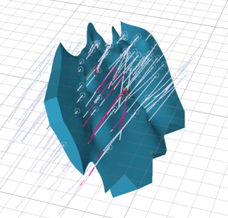
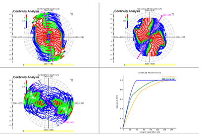
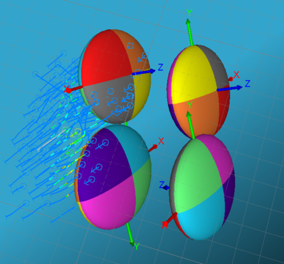
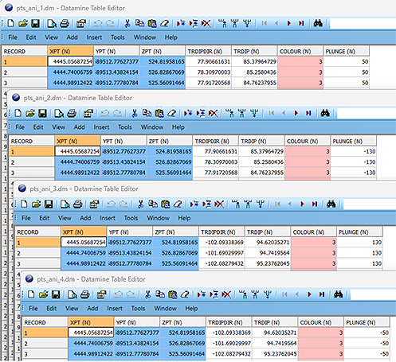
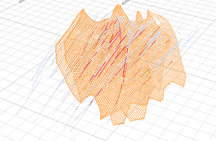
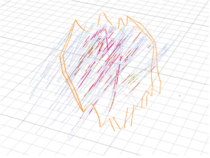

# ANISOANG - Worked Example

Consider a geological feature (CU in Shear_A) trending towards the north, dipping towards the east. The wireframe of the vein contains edges, which are generally unsuitable for **ANISOANG** , but are useful to demonstrate this example.

When modelling the anisotropy, there are multiple ways this could be done (all of which are valid):

  * This could be modelled in the horizontal as slightly to the west of north, or slightly to the east of south.

  * This could be modelled in the across strike to the north east or to the south west.

  * The dip plane could be modelled to the south east or the south west.

The result is eight combinations of variograms. Each of these is duplicated, so finally, results in four possible rotations. These rotations have different axes, although they are identical in orientation and magnitude.

_Anisotropy and variograms in Datamine Supervisor (1 of the possible 8 configurations of anisotropy)_

Taking a look at the variogram models as ellipsoids, you can see the four possible combinations:

These equivalent rotations can also be shown in a table as:

| Angle 1 | Angle 2 | Angle 3 | Axis 1 | Axis 2 | Axis 3  
---|---|---|---|---|---|---  
Rotation 1 | 80 | 60 | 50 | 3 | 1 | 3  
Rotation 2 | 80 | 60 | -130 | 3 | 1 | 3  
Rotation 3 | -100 | 120 | 130 | 3 | 1 | 3  
Rotation 4 | -100 | 120 | -50 | 3 | 1 | 3  
  
Depending on which rotation is used, the points from **ANISOANG** fall within a given threshold angles of the rotation. As you can see from some example values from the block model below, these values are similar (with a threshold) to the rotation angles supplied. Angles are converted to equivalent angles that orientate with the rotation, and angles that fall outside are excluded:

The valid points look like this, and run through the **DAELLIPS** process. For each case, these look like the points below, however, each output has different angle values at each point:

For any of the runs through Anisotropy, the rejected points look like the image below. These are points from the edge of the wireframe, which do not align with the variogram. It is expected that these points should not be included as they would push grade in the incorrect direction. There are some points that are excluded towards the middle which are also excluded. Its worth investigating these, and perhaps adjust the threshold if these should be included:

These points are estimated into the block model (using **IMETHOD** =8), and further estimated into the block model. Each of the resultant block models is identical.

Related topics and activities

  * [Dynamic Anisotropy with ESTIMA](<Dynamic%20Anisotropy%20-%20Introduction.md>)

  * [ANISOANG Process](<../Process_Help_XML/anisoang.md>)