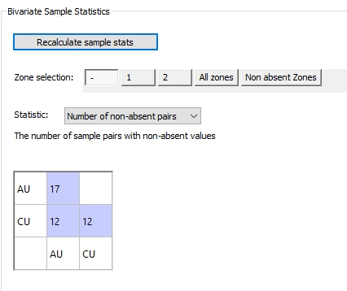
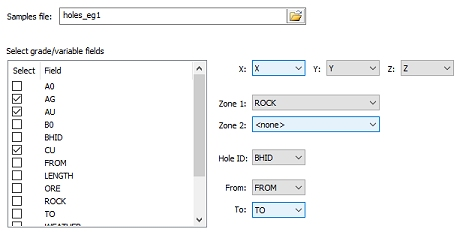
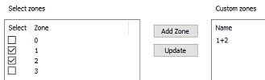
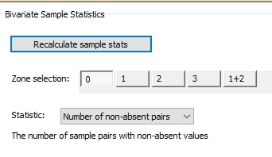
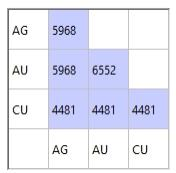
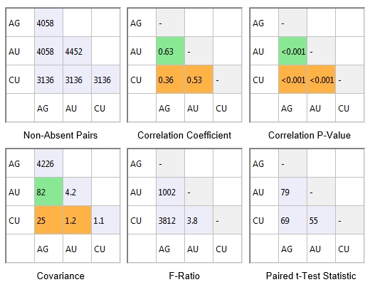
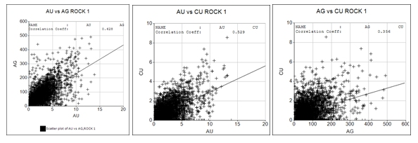
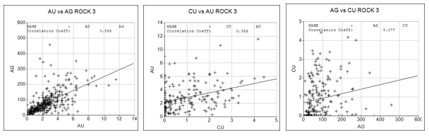
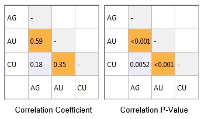

I

# Bivariate Statistics

To access this screen:

  * In the [**Advanced Estimation**](<Multivariate_Dialogs_Overview.md>) wizard, select **Bivariate Statistics**.

Calculate useful statistics regarding your input samples for estimation.

If no zonal control is being applied (that is, no zones are selected on the [Select Samples](<Multivariate_Select_Samples.md>) panel), you can generate statistics for the full sample set associated with your estimation [scenario](<Multivariate_Scenario_Setup.md>).

If zonal control is being applied, each zone or zone combination (if two zones have been defined) appear as a button along the top of the panel. You can generate summary statistics for any zone or zone combination.

[If custom zones have been defined](<Define_Zones.md>), these also appear as mutually-exclusive buttons. This lets you generate statistics relating to all zones or zone combinations assigned to the custom zone.

Statistics are shown in a 2-dimensional grid when Recalculate sample stats is selected. Samples are represented for the currently selected zone, custom zone or the full sample data, split into each [estimation variable](<Multivariate_Select_Samples.md>) being considered for estimation. 

Report correlations, correlation p-values, covariances-ratios and paired T-test statistics

**Note** : Calculating bivariate statistics can take some time, particularly with large sample inputs. You cancel the operation using <ESC>.

### Statistic Options

Once you have defined the scope and type of statistical information you want to view, the color-coded correlation table below updates to indicate the relationship between variables for that particular context.

What **Statistic** do you want to see? Choose from:

  * Number of pairsshow the total number of sample pairs (which must have non-absent values) for each of the selected variable/grade field combinations.

The following colour key is used for the cells in this table:

    * **Orange** no pairs found.

    * Blue1 or more pairs found (the number is shown in the cell).

  * **Correlation Coefficient** a measure of the relationship between the nominated sample variables.

The value of the coefficient lies between +1 and -1, where a positive value indicates a positive linear relationship (both variables increasing or both variables decreasing together) and a negative value indicates a negative linear relationship (one variable increasing as the other decreases). 

A coefficient close to +1 or -1 represents a very strong relationship and a coefficient close to zero a weak relationship (or in the case of zero, no discernible relationship at all).

Colour key:

    * GreyOn the main diagonal.

    * BlueThe correlation coefficient (cc) is <=0.3 and the p-value (p) is > 0.05.

    * Orangecc<=0.3 and p<=0.05.

    * Greencc>0.6 and p<=0.05.

  * Correlation P-valueThe p-value is the probability that you would have found the current result if the correlation coefficient were in fact zero (the _null hypothesis_). For example, you are trying to determine if the relationship between gold and silver is significant; then we start with the null hypothesis which, in this case is the statement that "gold and silver grade values are unrelated". The p-value is a number between 0 and 1 representing the probability that this data could have arisen if the null hypothesis were true. The probability is shown as value between 0 (0%) and 1 (100%).

Colour key:

    * GreyOn the main diagonal.
    * BlueThe correlation coefficient (cc) is <=0.3 and the p-value (p) is > 0.05.

    * Orangecc<=0.3 and p<=0.05.

    * Greencc>0.6 and p<=0.05.

  * CovarianceThe covariance provides a measure of how much two random variables change together.

If the greater values of one variable mainly correspond with the greater values of the other variable, and the same holds for the lesser values, that is, the variables tend to show similar behaviour, the covariance is positive. In the opposite case, when the greater values of one variable mainly correspond to the lesser values of the other, i.e., the variables tend to show opposite behaviour, the covariance is negative. The sign of the covariance therefore shows the tendency in the linear relationship between the variables.

The magnitude of the covariance is not easy to interpret. The normalized version of the covariance, the correlation coefficient, and the p-value, shows by their magnitude the strength of the linear relationship.

The covariance of a grade with itself is the variance of the grade.

Colour key:

    * GreyThe correlation coefficient (cc) is <=0.3 and the p-value (p) is > 0.05.
    * BlueOn the main diagonal.

    * Orangecc<=0.3 and p<=0.05.

    * Greencc>0.6 and p<=0.05.

  * **F-Ratio** The F-Ratio test can be used to help determine whether the variances of two sets of measured values with different numbers of samples are significantly different from each other. For example if a set of samples are analysed by two laboratories and you want to test whether there is a difference between them. 

Colour key:

    * GreyOn the main diagonal.

    * Otherwise blue.

  * Paired T-TestThe paired t test can be used to help determine whether the _means_ of two paired sets of measured values are significantly different from each other. For example if a set of samples are analyzed by two laboratories and you want to test whether there is a difference between them. 

Colour key:

    * GreyOn the main diagonal.

    * Bluep<=0.05.

    * Orangep>0.05.

### Bivariate Statistics Example

For example, in the image below, a single zone field has been defined, containing absent values, 1 and 2 only. 

Two custom zones have been created. 

The first (All zones) contains all 3 zone values, including absent. The second custom zone contains only zones 1 and 2 (no absent zone data). 

A multivariate estimation is being setup (AU, CU). The statistic being reported is [Number of non-absent pairs]:

  

### Example - Custom Zone Statistics

In this example, an input sample file (_holes_eg1_) is chosen. It contains 3 variables to be estimated, and multiple zones contained within a **ROCK** attribute. Estimation will be restricted to a single zone, but using samples from multiple zones. As such, a 'soft boundary' estimation is being performed.

A new scenario is created using the [Scenario Setup](<Multivariate_Scenario_Setup.md>) panel.

The input sample file is selected. Three grade fields: AG, AU and CU have been selected and the _Zone 1_ field is ROCK. This is done using the [Select Samples](<Multivariate_Select_Samples.md>) panel:

**ROCK** is the domain field for statistical and variogram analysis. Coordinate fields have been assigned automatically as have the fields BHID, FROM and TO.

**ROCK** contains 4 unique values: 0, 1, 2 and 3.

In this example, soft boundary analysis is desired; estimation will be performed within **ROCK** zone 1 but with estimates influenced by samples from both zones 1 and 2. This example aims to find out the number of non-absent sample pairs that will contribute to the multivariate estimation.

To generate statistics for multiples zones, a custom zone is required. This is set up using the Define Custom Zones panel, for example:  
  

Now that a custom zone has been defined, it appears on the Bivariate Statistics panel, alongside the unique zone values for **ROCK** :

Selecting [1+2] and the _Number of non-absent pairs_ **Statistic** means that generated statistics will represents both **ROCK** zones 1 and 2. Data is shown for each grade/variable combination, e.g.:

Other statistics are also available:

All three grade combinations have a p-value of less than 0.001. This means that there is less than 0.1% probability that this data would be created if the null hypothesis (no correlation) were true. In this example all three correlations are strong.

The correlation coefficient of 0.63 between AU and AG is the highest of the three grade combinations. This is shown in green as the value is above 0.6 and the p-value <0.05. The correlation coefficients for the other two lie between 0.3 and 0.6 and p-values are <0.05 so they are coloured orange.

The relationship between grades can be displayed graphically using the Point/Line Plot option on the Sample Analysis ribbon. The graphic below shows the relationship between AU, AG and CU for ROCK 1.

The correlation coefficients and the correlation p-values are shown in the Sample Statistics matrix on the Advanced Estimation dialog. It can be seen that the p-values are all zero showing that for ROCK 1 there is an extremely small probability that there is no correlation between any of the grades.

The corresponding scatterplots for ROCK 3 are shown below, and also the correlation coefficients and correlation p-values. The correlation coefficient for CU/AG (0.18) is coloured orange because the correlation p-value Is >0.05 (0.00519).

This shows that the CU/AG correlation is weaker for ROCK 3 than for ROCK 1\. 

Related topics and activities

  * [Advanced Estimation Introduction](<Multivariate_Introduction.md>)

  * [Scenario Setup](<Multivariate_Scenario_Setup.md>)

  * [Select Samples](<Multivariate_Select_Samples.md>)

  * [Define Custom Zones](<Define_Zones.md>)

  * [Investigate Anisotropy](<Multivariate_Investigate_Anisotropy.md>)

  * [Create Variograms](<Multivariate_Create_Variograms.md>)

  * [Fit Models](<Multivariate_Fit_Models.md>)

  * [KNA: Select Locations](<Multivariate_KNA_SelectLocations.md>)

  * [KNA: Optimize](<Multivariate_KNA_Optimize.md>)

  * [Select Prototype](<Multivariate_Select_Prototype.md>)

  * [Parameters](<Multivariate_Import_Parameters.md>)

  * [Define an Estimation](<Multivariate_Define_Estimations.md>)

  * [Review Variograms](<Multivariate_Confirm_Variograms.md>)

  * [Define Search Volumes](<Multivariate_Select_Search_Volumes.md>)

  * [Run Estimations](<Multivariate_Run_Estimation.md>)