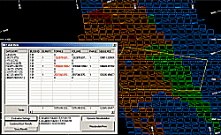

# Block Model Evaluation

The evaluation of block model data is an integral step in calculating mineral resources, reserves and the long or short term scheduling of mining blocks. Studio has a variety of evaluation functions which can be used to evaluate model according to block model (cell evaluation) and in some cases, also drillhole data.

Evaluation is the process whereby block models or drillholes are evaluated to determine summary volumes, tonnes and grades (any numeric field) within a defined volume or area. The volume or area can be defined by perimeters (closed strings) or wireframes. 

The evaluation is typically done for specific grade ranges, ore types or within mineral resource or mine planning limits. Evaluations are always carried out using an 'evaluation legend' which form part of the standard legends which are used to format the appearance of the data in any given view. 

Each legend has one or more categories or legend Items which can be defined using a data range (e.g. `AU>1 and AU<2`), a data value (for example, `LITHO=GRANITE`) or a filter expression (say, `ZONE=3 AND LITHO =GREYWACKE OR GRADE>5`).

Evaluation of a block model (or drillholes) is often done within an area or volume(s) of interest which is defined by perimeters (strings) or wireframe surfaces which represent geological, ore body, mine design or mine planning features.

Block model evaluation is performed using a range of tools supported by the 3D window.

Note: Evaluation settings can be accessed using the **[Project Settings: Mine Design](<../COMMON/Project%20Settings_Mine%20Design.md>)** screen (evaluation control group).

## Evaluation Methods

Evaluations of block models (or drillholes) can be performed interactively with objects loaded in the 3D window using the following commands:

  * Inside String Evaluate within the limits of a single string e.g. a farm's boundaries. See [evaluate-1-string ("ev1")](<../command_help/evaluate-1-string.md>).

  * Between Two Strings Evaluate within pairs of strings e.g. open pit bench crest and toe string pairs. See [evaluate-2-strings ("ev2")](<../command_help/evaluate-2-strings.md>).

  * All Strings Evaluate within the limits of a set of single strings e.g. underground cut-and-fill limits. See [evaluate-all-strings ("eva")](<../command_help/evaluate-all-strings.md>).

  * Wireframes Evaluate within wireframe volumes e.g. ore body volumes, underground open stoping volumes. See [evaluate-current-wireframe](<../command_help/evaluate-current-wireframe.md>)

Alternatively, you can use block model files and the following processes:

  * TONGRAD Calculate the volume, tonnage and grade for up to 10 specified grade fields, classified by up to three key fields. See [TONGRAD Process](<../Process_Help_XML/tongrad.md>).

  * MODRES Calculate volume, tonnage and grades by bench or within perimeters by material category or grade ranges. See [MODRES Process](<../Process_Help_XML/modres.md>).

## Dynamic Evaluation

The Dynamic Evaluation screen

In addition to the above commands and processes, which produce a definitive output outlining the calculated values for a particular entity in full, or a defined zone, your application also supports a dynamic evaluation option, where a block model can be evaluated according to a string projected in the Z direction to define a volume to be evaluated. Using this function, you can update the size/shape of the evaluation zone, recording the results instantly in a dynamic table.

See [Dynamic Evaluation Reports](<../COMMON/Dynamic%20Evaluation%20Report%20Introduction.md>).

## Block Model Size Limits

The size of a model that can be created in Studio is limited by the _maximum IJK value_. 

The IJK field is an index value giving the location of the parent cell for each cell or subcell. Therefore all subcells in a parent cell have the same IJK value. The minimum IJK value is 0 and the maximum potential IJK value for a model is calculated as `NX*NY*NZ-1` where `NX` is the maximum number of parent cells in the X direction, and so on.

The maximum IJK value is 2,147,748,647. This means you can create a model with, for example, `1465*1465*1000` parent cells positions. 

See [Block Model Size Limits](<../COMMON/Block_Models_Size_Limits.md>)

## Partial or Full Cell Evaluation

Evaluation against a block model can be further controlled by specifying if partial or full cell evaluation is to be performed. When using the latter, if a cell has more volume inside (a perimeter or wireframe) rather than outside, that cell is included in full for evaluation purposes. Depending on the geometry of the area or volume being evaluated, the results may be an over or under evaluated. Using the partial cell evaluation option will deliver more accurate results but will also take longer to calculate. 

Related topics and activities:

  * [Dynamic Evaluation Report Introduction](<../COMMON/Dynamic%20Evaluation%20Report%20Introduction.md>)

  * [Block Model - Default Density](<Block_Models_Default_Density.md>)

  * [Creation, Combination and Manipulation of Block Models](<Block_Models_CreationAndManipulation.md>)

  * [Block Model Size Limits](<../COMMON/Block_Models_Size_Limits.md>)