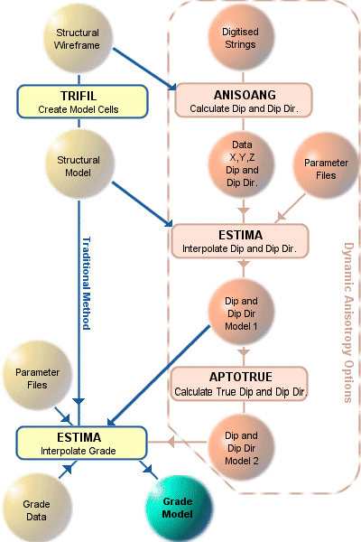

# Defining a Dynamic Anisotropy Study with ESTIMA

**Note** : **[COKRIG](<../Process_Help_XML/cokrig.md>)** also provides Dynamic Anisotropy support. See [Dynamic Anisotropy with COKRIG](<Dynamic%20Anisotropy-COKRIG-Guidelines.md>)

The components of a grade estimation study using dynamic anisotropy are shown in the figure below. The lower half represents the traditional method of grade estimation whereby a structural wireframe is created, filled with cells and subcells (**[TRIFIL](<../Process_Help_XML/trifil.md>)**) and then grade is interpolated into the block model (in the case described below, in [ESTIMA](<../Process_Help_XML/estima.md>)). The upper half shows the new options for processing the dip and dip direction data.

Traditional and Dynamic Anisotropy Grade Estimation Workflow

## Defining Orientation Data

Dip and dip direction data are required to define the orientation of the mineralization. The two main sources for this data are:

digitise strings in plan to define the strike and set the dip direction perpendicular to strike. Digitise strings in section to define the apparent or true dip.

calculate dip and dip direction from the orientation of the triangles of the structural wireframe.

One or both of the above options can be selected. The data for both methods are processed by command **[ANISOANG](<../Process_Help_XML/anisoang.md>)** which outputs a points file that contains both the XYZ coordinates of each point and the dip and dip direction data. Alternatively process COGTRI creates dip and dip direction data for just a wireframe.

## Interpolating Angles into a Block Model

When the dip and dip direction data has been created, the next stage is to interpolate the two sets of angles into the block model. However it is not possible to use the standard interpolation methods in **ESTIMA** as angular data is circular for example the average of 340 degrees and 30 degrees is 5 degrees. A new method (IMETHOD=8) has been added to **ESTIMA** that has all the functionality of inverse power of distance (IMETHOD=2) but can be used with angular data. The circular IPD method is then used to interpolate the dip and dip direction data into the block model.

## Converting Apparent Dip to True Dip

If the initial orientation data is from digitised sections and the sections are aligned in the dip direction, then the dip angle calculated from the string data will be the true dip. However, if the sections are not aligned in the dip direction, then the apparent dip will be calculated by **ANISOANG**. In this case there is a restriction that all sections must be parallel to each other.

If the true dip has been calculated then the dip and dip direction model, Model 1, can be input directly to the ESTIMA process to interpolate the grades. However if the apparent dip has been calculated then the true dip must be calculated first. This is done by process **[APTOTRUE](<../Process_Help_XML/aptotrue.md>)** , and the resulting model is shown as Model 2 in the flow diagram.

## Interpolating Grades using Dynamic Anisotropy

The previous step ensures that the search volume rotation angles are now stored in the input model file the first rotation angle is the dip direction, the second rotation angle is the true dip and the third rotation angle is set to zero. In order to use these angles the names of the angle fields in the input model file must be specified in the search volume parameter file using the fields SANGL1_F and SANGL2_F. A third rotation angle, SANGL3_F, can be specified if required, but there is no specific provision for this to be calculated by any of the Studio 3 commands.

The default angles for the search volume are defined by fields SANGLE1, SANGLE2, SANGLE3. If one or more dynamic fields SANGLn_F (n=1,2,3) are specified then they are used instead of the default values.

If nearest neighbour or inverse power of distance are used to estimate grade then the dynamic angles may be used when calculating the transformed distances and therefore the sample weights. 

The variogram rotation angles can also be defined dynamically. They can be the same as the search volume angles, or a different set of angles can be defined.

Related topics and activities

  * [Dynamic Anisotropy with ESTIMA](<Dynamic%20Anisotropy%20-%20Introduction.md>)

  * [Dynamic Anisotropy with COKRIG](<Dynamic%20Anisotropy-COKRIG-Guidelines.md>)