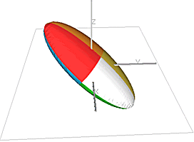

# Dynamic Anisotropy: Ellipsoids

The continuity of mineralization often varies with direction. This is usually represented by a 3D ellipsoid where the lengths and direction of the three orthogonal axes of the ellipsoid describe the continuity and orientation of the mineralization. The example below shows an ellipsoid with the major (longest) axis dipping by 40 degrees with the dip direction (azimuth) being 20 degrees (N20E). The minor axis dips by 50 with an azimuth of 200, and the intermediate axis is horizontal (dip 0) with an azimuth of 110.

The two main areas in the grade estimation processes [ESTIMA](<../Process_Help_XML/estima.md>) and **[COKRIG](<../Process_Help_XML/cokrig.md>)** in which an ellipsoid is used are:

  * Defining the search volume to select the subset of samples to be used for estimating the grade of a block.

  * Calculating the weights to be assigned to each selected sample in order to make the estimate.

Normally the same ellipsoid is used for both purposes, but both processes permit different ellipses to be defined, if required.

## Modeling Changes in Orientation

### Approximate Solution

If the orientation of mineralization is constant, then a single ellipsoid can be defined for the whole orebody. However, this is often not the case as the orientation changes over the orebody. One way of taking this into account is to divide the orebody into areas of similar orientation, and to define an ellipsoid with a different orientation for each area. This sometimes provides a satisfactory solution, although there can be problems when estimating model cells at the boundary between different areas.

### Exact Solution

The best solution is to use Studios **Unfold** system which unfolds the mineralization in three dimensions to create a new orthogonal, unfolded coordinate system. Structural analysis and grade estimation are then carried out in the unfolded system before estimates are assigned to a standard block model. This requires variograms to be calculated and analysed in the unfolded system, and usually requires detailed tag strings to be created to define the unfolding mechanism. Although this is the optimal solution, it can be quite time consuming and requires a good understanding of the structure of the orebody. 

### Dynamic Anisotropy Solution

The dynamic anisotropy option allows the orientation of the ellipsoid to be defined individually for each block in the model. However this does require that the angles are first interpolated into the model before they can be used for the estimation. The angles can be derived from the orientation of wireframe triangles and/or from strings digitised in plan and section. The **[ANISOANG](<../Process_Help_XML/anisoang.md>)** process is provided to calculate dip and dip direction angles from string and wireframe data, and these angles can be interpolated into the block model using ESTIMA. If the dip angle is the apparent dip, then another process, **[APTOTRUE](<../Process_Help_XML/aptotrue.md>)** , is provided to convert from apparent dip angle to true dip angle.

Although the orientation of the ellipsoid can be defined individually for each model cell, it is assumed that the dimensions of the ellipsoid, the lengths of the three axes, remain constant. They can either be constant over the whole orebody, or the orebody can be divided into areas within which the axes are constant.

The standard method of estimating the lengths of the axes of the ellipsoid is to use the ranges of the variogram model, although it must be recognized that the ranges will be somewhat distorted if the orebody is folded. However, if the folding is not too severe, then the variogram ranges calculated from the untransformed data will usually give a good enough approximation of the true values. It can be shown that a grade estimate is more sensitive to changes in the orientation of an ellipsoid than to changes in the length of the axes. A misalignment of only a few degrees can cause the extrapolation of ore into waste and waste into ore, so it is very important to ensure that the ellipsoid is correctly aligned.

Related topics and activities

  * [Dynamic Anisotropy with ESTIMA](<Dynamic%20Anisotropy%20-%20Introduction.md>)

  * [Dynamic Anisotropy with COKRIG](<Dynamic%20Anisotropy-COKRIG-Guidelines.md>)