# Dynamic Anisotropy (ESTIMA) Example 1

**Note** : **[COKRIG](<../Process_Help_XML/cokrig.md>)** also provides Dynamic Anisotropy support. See [Dynamic Anisotropy with COKRIG](<Dynamic%20Anisotropy-COKRIG-Guidelines.md>)

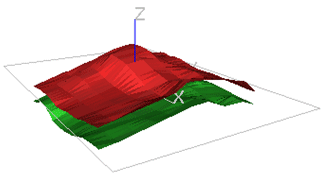

This example illustrates how true dip and dip direction data can be derived the hangingwall and footwall DTM wireframes, and used to interpolate grade using the dynamic anisotropy option in [ESTIMA](<../Process_Help_XML/estima.md>).

The hangingwall and footwall Digital Terrain Models (DTMs) are shown in the graphic above. The two DTMs (wireframe ORETR, OREPT) have approximately the same profile with a central ridge running east-west and dipping gently to the north and south.

The full macro to recreate this example is given [here](<Dynamic%20Anisotropy%20-%20Example%201%20Macro%201.md>).

## Dip and Dip Direction Angles

The first step is to calculate the dip and dip direction angles which can be done using either the **ANISOANG** or **COGTRI** processes, as shown below in macro format:
    
    
    !COGTRI   &WTRIN(ORETR),&WPTIN(OREPT),&PTNOUT(POINTS1),            
  
---  
      
    
    @VERTEX=0,@SYMBOL=216,@SYMSIZE=2  
      
    
    !ANISOANG &WIRETR(ORETR),&WIREPT(OREPT),&POINTS(POINTS1),  
      
    
    @TRIPTS=1.0,@ADDSYMB=1.0,@WFSYMB=216.0,@WFCOL=3.0,@SYMSIZE=2.0  
  
Using **ANISOANG** with @ADDSYMB=1 gives the additional symbol display fields. The full set of fields in the output points file is:

[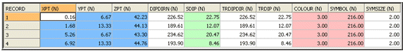](<javascript:void\(0\);>)

As the angles are calculated from a wireframe, the dip will be the true dip value. The points file, POINTS1, can be displayed in a 3D window to check the data is correct. In the graphics below only the hangingwall points are displayed:

[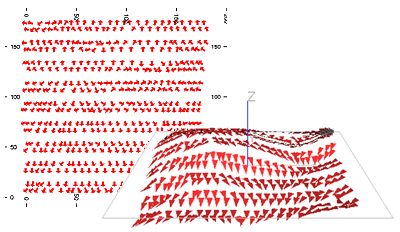](<javascript:void\(0\);>)

## Interpolating Angles into the Block Model

The second step is to interpolate the dip and dip direction angles into the block model. This must be done using the **ESTIMA** process, or using the [ESTIMATE](<EstimateDialog.md>) menu, so that the angle interpolation method (IMETHOD=8) can be selected. In this example the input search volume parameter file, SPAR1, defines a spherical search volume with a radius of 25m.

[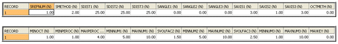](<javascript:void\(0\);>)

The estimation parameter file, EPAR1, has a record for each angle to be interpolated, DIPDIRN and SDIP, and uses the angular IPD method, IMETHOD 8.

[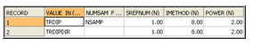](<javascript:void\(0\);>)

The input model file has been created by filling the volume between the hangingwall and footwall with cells using the **TRIFIL** process. The cells are all 5x5x2.5m in size.

The files, fields and parameters used to run ESTIMA are shown below:
    
    
     !ESTIMA   &PROTO(OREMOD1),&IN(POINTS1),&SRCPARM(SPAR1),  
  
---  
      
    
    &ESTPARM(EPAR1),&MODEL(OREMOD2),*X(XPT),*Y(YPT),*Z(ZPT),  
      
    
    @DISCMETH=1.0,@XPOINTS=3,@YPOINTS=3,@ZPOINTS=3,@PARENT=0.0  
  
The output model file, OREMOD2, includes fields TRDIPDIR, TRDIP and NSAMP. The angles in the model can be displayed in a 3D window using rotated symbols as for the input angle data. However an alternative way of representing the TRDIPDIR and TRDIP values in model OREMOD2 is shown in the graphics below. A subset of model cells (not shown) has been selected on a west-east section and search ellipsoids with axes 10x10x2m are displayed. The lengths of the axes are not quite the same as the lengths used for grade estimation, as described in the next section, but have been chosen to illustrate the orientation of the ellipsoids.

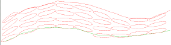

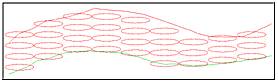

The ellipsoids in the top graphic are oriented according to the TRDIPDIR and TRDIP angles, as used with dynamic anisotropy, whereas the ellipsoids in the bottom graphic are oriented horizontally, as would be used without dynamic anisotropy.

## Estimating Grade Using Dynamic Anisotropy

As the dip field, TRDIP, in model OREMOD2 is a true dip value, then the final step is to interpolate the grade using the dynamic anisotropy option. However, as well as interpolating grade using the dynamic anisotropy option, grade is also estimated without the option. This enables the two methods to be compared.

### Search Volume Parameter File

The dynamic anisotropy option requires the [search volume parameter file](<Grade%20Estimation%20Search%20Volume%20Parameter%20File.md>), **SPAR2** , to include the fields **SANGL1_F** and **SANGL2_F** to nominate fields TRDIPDIR and TRDIP in the model file. Two search volumes are defined search volume 1 is horizontal whereas volume 2 uses the dynamic anisotropy fields.

[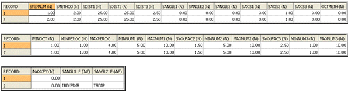](<javascript:void\(0\);>)

The **SANGLE1** and **SANGLE2** values are set to zero. These are the default values which are used if TRDIPDIR or TRDIP in the OREMOD2 model file are absent data. The SANGLE3 value, also zero, is used as the third rotation angle because **SANGL3_F** is not specified. 

### Estimation Parameter File

The [estimation parameter file](<Grade%20Estimation%20Parameter%20File.md>), **EPAR2** , includes one record for each estimation:

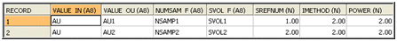

Note that this file does not explicitly show which estimates use dynamic anisotropy. That is a function of the search volume definition. Search volume 2 includes dynamic anisotropy, and this is used to estimate **AU2**.

The estimation parameter file may include the optional field ANISO which controls how the anisotropic weighting for IPD and NN is defined. ANISO takes one of the following values:

  * 0: no anisotropy i.e. isotropic. Distances are calculated from the coordinate system used in the sample data file and model.

  * 1: distances are transformed according to the orientation and axes of the search volume. (The default)

  * 2: distances are transformed according to the orientation and axes of the anisotropy ellipsoid defined by optional fields in the estimation parameter file.

In order to select dynamic anisotropy when using IPD or NN then ANISO must be set to 1. This is the default value which is used if field ANISO is not included in the estimation parameter file.

### Sample File

The sample data file, DAHOLES, is a desurveyed drillhole file with vertical holes on a 40m grid with 2.5m samples. In order to illustrate the results of dynamic anisotropy most effectively, the **AU** grades have been created so that the sample adjacent to the hangingwall has a grade of 10g/t and the sample adjacent to the footwall has a grade of 0 g/t, with a linear gradation in between. 

### Grade Estimation

The files, fields and parameters used for running the **ESTIMA** process are as follows:
    
    
    !ESTIMA   &PROTO(OREMOD2),&IN(DAHOLES),&SRCPARM(SPAR2),            
  
---  
      
    
    &ESTPARM(EPAR2),&MODEL(OREMOD3),@DISCMETH=1.0,  
      
    
    @XPOINTS=3.0,@YPOINTS=3.0,@ZPOINTS=3.0,@PARENT=0.0  
  
### The Grade Model

A west-east section through the output model, OREMOD3, coloured by **AU** is shown below: 

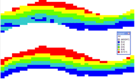

The upper section is for **AU1** , using a horizontal search ellipsoid, and the lower section for **AU2** , using dynamic anisotropy. 

The effectiveness of dynamic anisotropy is immediately apparent, with the grade closely following the hangingwall and footwall contacts.

The next graphic is a south-north section which shows similar results:

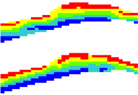

### Kriging

In this example IPD has been used for the grade estimate. If a different method such as [kriging](<Grade%20Estimation%20Kriging.md>) is required, then the only change is in the IMETHOD field in the estimation parameter file 3 for ordinary kriging or 4 for simple kriging.

By default, the value of parameter DYANKR is 1 which means that if the search volume uses dynamic anisotropy, then the variogram model will use the same set of angles. Other options for DYANKR are described in [Dynamic Anisotropy - Estimating Grade](<Dynamic%20Anisotropy%20-%20Estimating%20Grade.md>).

Related topics and activities

  * [Dynamic Anisotropy with ESTIMA](<Dynamic%20Anisotropy%20-%20Introduction.md>)

  * [Dynamic Anisotropy with COKRIG](<Dynamic%20Anisotropy-COKRIG-Guidelines.md>)

  * [Dynamic Anisotropy - Estimating Grade](<Dynamic%20Anisotropy%20-%20Estimating%20Grade.md>)

  * [Dynamic Anisotropy - Example 1 Macro 1](<Dynamic%20Anisotropy%20-%20Example%201%20Macro%201.md>)