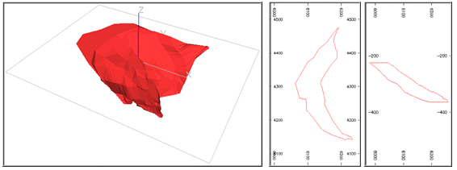
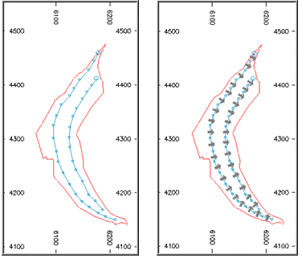
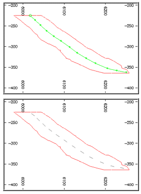
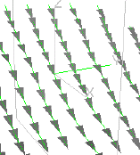
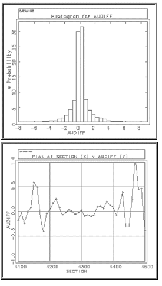
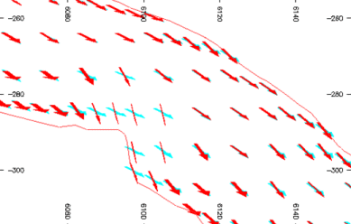

# Dynamic Anisotropy (ESTIMA): Example 2

**Note** : **[COKRIG](<../Process_Help_XML/cokrig.md>)** also provides Dynamic Anisotropy support. See [Dynamic Anisotropy with COKRIG](<Dynamic%20Anisotropy-COKRIG-Guidelines.md>)

This example illustrates the use of both plan and section strings and a solid wireframe model to define the dip direction and dip. The study is divided into two parts:

  1. Calculate anisotropic angles from plan and section strings, and use these to estimates grades using dynamic anisotropy option in [ESTIMA](<../Process_Help_XML/estima.md>). Compare the results with the estimates from using a single average set of angles.

  2. Same as 1 except that the anisotropic angles are derived from the orebody wireframe.

The processing for each part has been recorded in a macro which are included as Appendices B and C. The input data is taken from the underground tutorial data set which is installed in folder Database\DMTutorials\Data\VBUG\Datamine. The following files are used:

  * **Block Model** : _vsbmgeo

  * **Drillholes** : _vsldhz

  * **Plan Strings** : _vsplnst

  * **Section Strings** : _vssecst

  * **Wireframe** : _vsoretr, _vsorept

The example uses the zone 1 orebody which is illustrated in the following 3D, plan and west-east section views. The orebody dips to the east with an average dip of about 32. The downdip distance is about 250m and strike length 450m. The average thickness is 25m with a maximum true thickness of almost 50m.

;>)

The block model has a parent cell size of 10x10x10m. It is split into subcells at the boundary with the subcell size being 10x10m in plan and variable in the Z direction. There are 8,838 records in the model.

## Anisotropic Angles from Strings

Plan strings have been digitised on 20m benches, from -335m to -235m elevation. Two strings were digitised from north to south for each bench with the average length of the chords being 18m. The strings were input to the **ANISOANG** command to create the POINTS1 file. Parameter PLANMODE was set to 2 so that the strike direction was calculated as 270 clockwise from strike.

;>)

The figure on the left shows the strings for bench -295m. The strings were then processed by **ANISOANG** to create the POINTS1 file. The figure on the right shows the points as arrows oriented in the dip direction.

Dip strings were digitised from top to bottom on west-east sections at 30m intervals with an average chord length of 12m and one string per section.

;>)

The top figure above shows the string for section 4295N, and the bottom figure the points as line segments after processing by **ANISOANG**. The strings and point symbols can also be displayed in the 3D window:  
  

As can be seen from the [complete macro](<Dynamic%20Anisotropy%20-%20Example%202%20Macro%201.md>), the apparent dip (APDIP) and true dip direction (TRDIPDIR) fields in _POINTS1_ are interpolated into MODEL2 using the **ESTIMA** command. The interpolation method (IMETHOD) is set to 8 so that inverse power of distance method is used to estimate the angle data. MODEL2 is then input to the **APTOTRUE** command in order to calculate the true dip field (TRDIP) which is output to model MODEL3.

The AU grade can then be estimated using the dynamic anisotropy option in **ESTIMA**. This is selected by including the fields SANGL1_F and SANGL2_F in the search volume parameter file, and setting them to TRDIPDIR and TRDIP respectively. MODEL4 then includes the estimated grades

Grades are then estimated using a search volume with fixed angles of 91 degrees for the true dip direction and 36 degrees for the dip. MODEL5 then includes both sets of grade estimates. The difference between the two estimates is calculated into MODEL6 which is then evaluated.

A histogram of the difference between the dynamic anisotropy AU estimate and the fixed angle AU estimate for each block in the model is shown in the figure below. It can be seen that the differences are normally distributed and that 75% of the differences are between -1 and +1. The average grade for the model was 2.83 g/t for the dynamic anisotropy estimate and 2.80 g/t for the fixed angle estimate.

;>)

The figure at the top shows the mean AU difference averaged over 10m east-west sections. For the central sections between about 4230N and 4370N the differences are less than 0.1 g/t. However for the outside sections the difference is much higher with the difference for section 4470N being over 1.0 g/t. This is because for the sections at the north and south ends of the deposit the dip direction is no longer close to 91 and so the estimates are based on less accurate parameters. This difference demonstrates the errors that are made by using average orientation angles and the effectiveness of using dynamic anisotropy.

## Anisotropy Angles from Wireframe Triangles

It can be seen from the [full macro](<Dynamic%20Anisotropy%20-%20Example%202%20Macro%202.md>) that the procedure for processing the anisotropy angles derived from wireframe triangles is very similar to that for processing the angles derived from plan and section strings. The main difference is that true dip (TRDIP) and true dip direction (TRDIPDIR) angles are created from the wireframe triangles, so command **APTOTRUE** is not required.

The average grade over the total model was 2.83 g/t, the same as using angles from strings, and a visual comparison of the histogram and line plots showed that they were similar. The figure below shows rotated arrows for model cells on section 4243N. The red arrows are for the orientation from wireframe triangles and the cyan arrows from strings. 

It can be seen that where the orientation of the wireframe changes quite rapidly over a small area, then the orientation of the neighbouring blocks based on triangles also changes significantly. The orientation based on strings is much smoother and in general provides a better description of the mineralization. Therefore if the wireframe is not smooth, and does include rapid local changes in the orientation of triangles, then using string data for the orientation data is the better method.

Related topics and activities

  * [Dynamic Anisotropy - Example 2 Macro 1](<Dynamic%20Anisotropy%20-%20Example%202%20Macro%201.md>)

  * [Dynamic Anisotropy - Example 2 Macro 2](<Dynamic%20Anisotropy%20-%20Example%202%20Macro%202.md>)

  * [Dynamic Anisotropy with ESTIMA](<Dynamic%20Anisotropy%20-%20Introduction.md>)

  * [Dynamic Anisotropy with COKRIG](<Dynamic%20Anisotropy-COKRIG-Guidelines.md>)