# Dynamic Anisotropy with COKRIG

**Note** : whilst **ESTIMA** also offers Dynamic Anisotropy (DA) support, is a more capable estimation process and is recommended over the legacy **ESTIMA** process in this regard.

The following topic describes a typical workflow for running an estimate of Dynamic Anisotropy (DA) with grade estimation in Advanced Estimation (**COKRIG**), using a wireframe model which represents local changes orientation of the grade distribution. During estimation, these local orientation variations are used to orient search volume parameters and/or variogram models to achieve a better grade estimate.

Using with string inputs (&**PLANSTR** or &**SECTSTR**) gives full control of the orientation when using DA with grade estimation. A different approach is to use the wireframe input (&**WIRETR** /&**WIREPT**) and use these in conjunction with the rotation from a variogram model or search volume parameter to determine the full orientation for local anisotropy rotation.

In **COKRIG** , the variogram model or search volume parameters automatically align the supplied angles to the correct orientation for grade estimation.

Additionally, this workflow describes optional steps for validation using ellipsoids.

## The Dynamic Anisotropy Surface

Any wireframe surface can be used, provided it follows the trend of mineralization. This wireframe could be a varying fault plane, vein model, trend model (Created in using vein modelling) or explicit surface created in the orientation of mineralization, for example.

If a is used, be careful of the edges where the orientation of the surface does not align with the direction of mineralization. If the Vein tool is used, these could be filtered out (by removing all **SurfaceType** values set to _Connection_ , for example, as shown in teal in the image further below).

[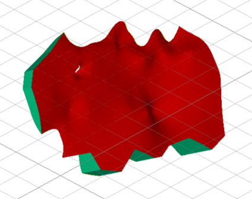](<javascript:void\(0\);>)

Undesirable angles on the edge can also be filtered out in the **ANISOANG** process using parameters &**MINDIP** , &**MAXDIP** , &**MINDIRN** , &**MAXDIRN**.

## Creating Variograms and Search Model Parameters

Creating variograms or search parameters is a subject in itself, so isnt covered here in any detail, however, this is an important step in the workflow.

For this workflow, the following should be true of the variogram models:

  1. Variograms and search should be modelled using the Datamine rotation convention Z-X-Z or 3-1-3.

  2. The primary direction should align with the direction of greatest continuity i.e. the first variogram length, meaning:

Sum of variogram ranges in the first direction

>=

Sum of variogram ranges in the second direction

>=

Sum of variogram ranges in the third direction

The following should be true of the search parameters.

  * Variograms and search should be modelled using the Datamine rotation convention Z-X-Z or 3-1-3.

  * Typically, search parameter rotations can be taken directly from variogram modelling (if this has been done previously).

  * The primary direction should align with the direction of greatest continuity i.e. the first variogram length, meaning:

Search ranges in direction 1 (SDIST1)

>=

Search ranges in direction 2 (SDIST2)

>=

Search ranges in direction 3 (SDIST3).

## Viewing Ellipsoids

When running DA, you can view the search volume and variogram model as an ellipsoid. This is useful to validate the orientation of the search aligns with the orientation of the surface for DA.

Creating an ellipsoid of a search or variogram may be done in several ways, but in the workflow described here, it is performed manually using the **New Ellipsoid** (command = ) or using the process . This can also be achieved interactively using **Advanced Estimation** with the **Display Ellipsoid** tool (**Define Search Vol.** panel). 

The following image shows how to convert search parameters into an ellipsoid using the process:

  1. Pick a point for the ellipsoid centroid position.

  2. Enter the values for the size, rotation and axes, as found in the **Search Parameters** file.

**Note** : be sure to enter the rotation axis as Z-X-Z for 3-1-3.

  3. **Add** the ellipsoid to review it.

[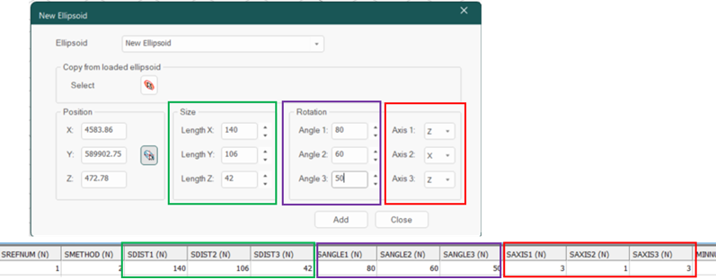](<javascript:void\(0\);>)

The New Ellipsoid tool in Studio RM, with Search Parameters below

Running **ELLIPSE** from a macro is another option, using the following example parameters:
    
    
    !ELLIPSE &SRCPARM(search),&ELLIPSE(ellipse),
    
    
    @SREFNUM=100,@VREFNUM=1.0,@SANGLE1=0.0,
    
    
    @SANGLE2=0.0,@SANGLE3=0.0,@SAXIS1=3.0,@SAXIS2=1.0,
    
    
    @SAXIS3=3.0,@XCENTRE=4580,@YCENTRE=589902,@ZCENTRE=470

In the image below, a search ellipse is displayed with a surface (in this case, a vein model). This shows the overall orientation of the search, to be locally aligned with DA during grade estimation.

[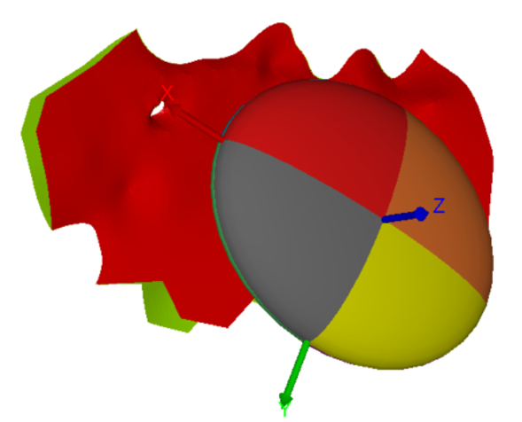](<javascript:void\(0\);>)

## Conventions for Rotations

Variogram and search volume models which are identical can be presented in multiple combinations of angles. When viewed as ellipsoids, these variograms or search volume models have the same shape and orientation, although the colours are inverted representing the difference of angles.

When used for an estimation without DA, these variograms or search volume models produce identical estimates. Similarly, when used for DA, it does not matter which convention is used for the variogram parameter or search model parameter.

[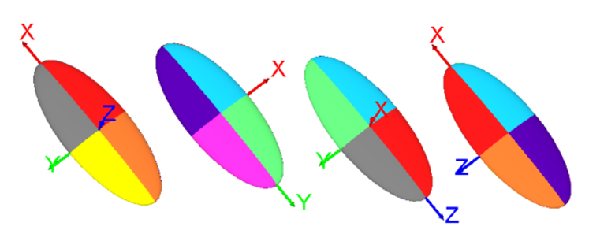](<javascript:void\(0\);>)

**Note** : for DA, confirm that the major direction of the search volume parameter or variogram model is pointing in the direction of the major mineralisation. This is the first variogram range or search distance. It should align with the visible mineralisation in the samples and the orientation of the dipping structure used for dynamic anisotropy.

## Creating Angles from Wireframe Data using ANISOANG

**ANISOANG** is used for calculating the local orientation of a dipping surface.

When using **ANISOANG** from a wireframe surface, the process creates two angles: **TRDIPDIRN** and **TRDIP**. When used with a Z-X-Z rotation, these angles represent the first and second angles of rotation for dipping ore bodies.

The &**PLANSTR** and &**SECTSTR** consider the pitch of the mineralization. Using a search volume or variogram model rotation, Pitch (ANGLE 3) can be determined representing the direction of mineralization in the dip plane.

For this workflow, you only need to use two angles from **ANISOANG**. The third rotation angle (**PITCH**) is determined during estimation in **COKRIG**.

#### Creating an Optional 3rd Angle (**PITCH**) with **ANISOANG**

Commonly, the third rotation angle (referred to geologically as **PITCH** for a dipping ore body) is taken from the **SANGLE3** or **VANGLE3** in the search/variogram model, although this may lead to erroneous results if it isnt checked.

When using a Z-X-Z (3-1-3) rotation :

ANGLE1 | TRDIPDIR | Direction of the dip plane from North.  
---|---|---  
ANGLE 2 | TRDIP | Angle of dip from horizontal plane.  
ANGLE 3 | PITCH | Angle of anisotropy on the dip plane.  
  
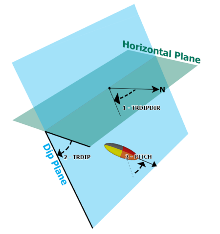

_Nomenclature and conventions for a Z-X-Z rotation_

**ANISOANG** calculates **PITCH** by taking the a variograms **VANGLE3** or search volume parameter (**SANGLE3**) and using this as the **PITCH**. Depending on the rotation convention and the orientation of the surface, this angle may or may not be flipped.

### How is PITCH calculated?

Checking the third angle required confirming if the dip direction of the wireframe triangle differed by more than 90 degrees in either direction from **ANGLE1** of the variogram. However, if **ANGLE2** of the variogram/search volume is negative or greater than 180 (i.e. **ANGLE2** <0 or **ANGLE2** >180), the behaviour is flipped, with the ellipsoid being correct only when the dip direction of the triangle differs from **ANGLE1** by more than 90 degrees (i.e. between **ANGLE1** -90 and **ANGLE1** +90). This type of check and flip is done automatically using **ANISOANG**.

The 3rd angle can be added by **ANISOANG** as an optional validation step. Using Advanced Estimations **COKRIG** automatically determines **PITCH** when using Dynamic Anisotropy using two angles.

Here are some example parameters for running **ANISOANG** to create an output including **PITCH**.
    
    
    !ANISOANG &WIRETR(wireframetr),
    
    
    &WIREPT(wireframept),
    
    
    &SRCPARM(search),
    
    
    &POINTS(anipoints),
    
    
    *ANGLE3_F(PITCH),
    
    
    @TRIPTS=1.0,@PLANMODE=1.0,@SECTMODE=1.0,
    
    
    @MINDIP=-90.0,@MAXDIP=90.0,@ADDSYMB=0.0,@PLANSYMB=216.0,
    
    
    @SECTSYMB=216.0,@WFSYMB=224.0,@PLANCOL=1.0,@SECTCOL=2.0,
    
    
    @WFCOL=3.0,@SYMSIZE=2.0,@SREFNUM=100

## Validating ANISOANG points with Ellipsoids using DAELLIPS

For easier validation of points from **ANISOANG** or block models containing angles to be used with Dynamic Anisotropy, an update to **DAELLIPS** has been made.

This update lets a user input fields &**ANGLE1** , &**ANGLE2** and &**ANGLE3**. If the fields are not provided, the parameter values @**ANGLE1** , @**ANGLE2** , @**ANGLE3** can be used in place to show static values.

View these as ellipsoids, either as the raw points (@**DECLUST** =0) or declustered points on a grid (@**DECLUST** =3). Set @**RAD1** , @**RAD2** , @**RAD3** to appropriate sizes to reflect the anisotropy (i.e. in descending order).

The ellipsoids displayed by **DAELLIPS** match the ellipsoid orientation used by **ESTIMA** and **COKRIG**. By incorporating **DAELLIPS** in the workflow, you can quickly validate the orientation of the searches used in the estimation with dynamic anisotropy.

Here is an example of the **DAELLIPS** macro syntax:
    
    
    !DAELLIPS &POINTS(anipoints),
    
    
    &ELLIPSES(checkellipsoid),
    
    
    *ANGLE1(TRDIPDIR),*ANGLE2(TRDIP),*ANGLE3(ANGLE3),
    
    
    @DECLUST=0.0,@RAD1=2.0,@RAD2=1.0,@RAD3=0.2,@FACTOR=1.0,
    
    
    @ANGLE1=0.0,@ANGLE2=0.0,@ANGLE3=0,@AXIS1=3.0,
    
    
    @AXIS2=1.0,@AXIS3=3.0,@XGRID=20.0,@YGRID=20.0,@ZGRID=20.0,
    
    
    @XORIG=0.0,@YORIG=0.0,@ZORIG=0.0,@CENTRE=0.0

[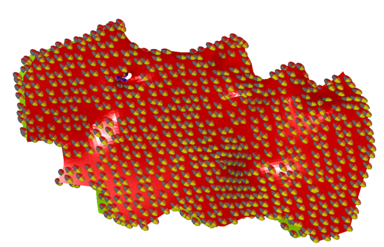](<javascript:void\(0\);>)

## Estimating ANGLES into the Block Model

**COKRIG** is used for estimating **TRDIPDIR** and **TRDIP** into a block model. **COKRIG** offers two estimation methods for estimating angles:

  * Circular inverse power of distance (Using **IMETHOD** =8 in **COKRIG**)

  * Circular nearest neighbour (set **METHOD** =12 in **COKRIG**).

Both can be accessed using the **Advanced Estimation** tool.

**Tip** : the **Advanced Estimation** tool can be run whilst macro recording is active. This captures all process behaviour, including **COKRIG**.

The images below show the in Advanced Estimations **Estimate Angles** panel and the **Select Prototype** panel where **TRDIPDIR** and **TRDIP** data (from **ANISOANG**) will be estimated into the Input Model to create the output Model with Angles.

Click **Estimate Angles** to run the angular estimation.

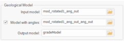

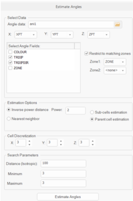

Once these fields are estimated, ensure that the fields shown below are selected in the **Dynamic Anisotropy Fields** panel. This makes them accessible in the **Define Estimation** panel:

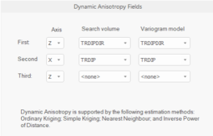

This sets two angles (**SANGL1_F** , **SANGL2_F** for search volume rotation and **VANGL1_F** , **VANGL2_F** for variogram rotation). These angles define the rotation of the anisotropy ellipsoid in 3D and override the angles in the variogram model and search volume model parameter files.

## Estimating Grade using Dynamic Anisotropy

Once **TRDIPDIR** and **TRDIP** are interpolated into the block model, two angles can be passed into **COKRIG** for grade estimation. In the case where only two angles are used, the third angle (**PITCH**) is automatically determined from the search volume or variogram model parameter.

**COKRIG** supports dynamic anisotropy with _Ordinary Kriging_ , _Simple Kriging_ , _Nearest Neighbour_ (NN) or _Inverse Power of Distance_ (IPD).

The _Kriging_ methods support local orientation of the search volume parameters and variogram model. For these estimation types, either or both check boxes may be applied to enable or disable DA for each estimate:

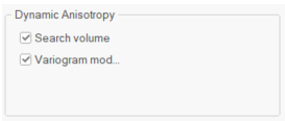

Non-kriging (linear) methods (NN and IPD) only support local orientation of the search volume parameters.

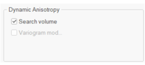

IPD also supports search distance anisotropy, where sample weighting relative to search distances is applied.

**PITCH** may be written as an optional output value to the block model in Field Names. An optional field output is provided, when DA is used, for variogram **PITCH** and for search **PITCH** , depending on the estimation type.

If the same orientation is used for the search volume parameters and variogram model, the outputs are identical.

[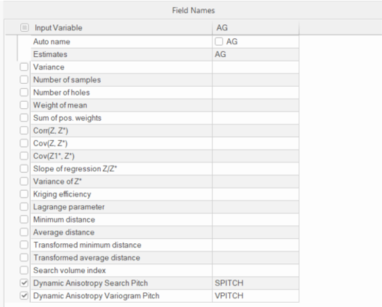](<javascript:void\(0\);>)

## Validating Block Model orientations using DAELLIPS

An optional validation step involves writing the third angle to block model. This can be done to validate the DA rotation using **DAELLIPS** and is similar to validating **ANISOANG** points, however it uses a block model (unrotated or rotated) as the input.

Here is an example of the **DAELLIPS** macro syntax:
    
    
    !DAELLIPS &MODEL(grademodel),
    
    
    &ELLIPSES(checkellipsoid),
    
    
    *ANGLE1(TRDIPDIR),*ANGLE2(TRDIP),*ANGLE3(SPITCH),
    
    
    @DECLUST=0.0,@RAD1=2.0,@RAD2=1.0,@RAD3=0.2,@FACTOR=1.0,
    
    
    @ANGLE1=0.0,@ANGLE2=0.0,@ANGLE3=0,@AXIS1=3.0,
    
    
    @AXIS2=1.0,@AXIS3=3.0,@XGRID=20.0,@YGRID=20.0,@ZGRID=20.0,
    
    
    @XORIG=0.0,@YORIG=0.0,@ZORIG=0.0,@CENTRE=0.0