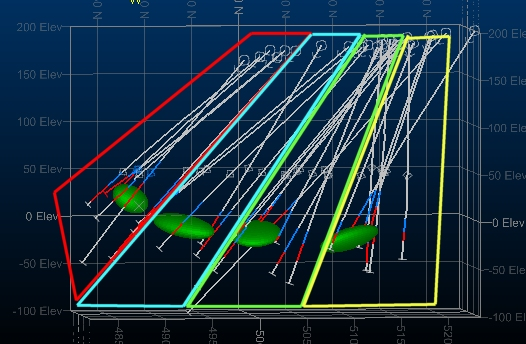
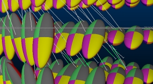
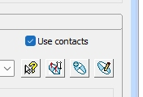
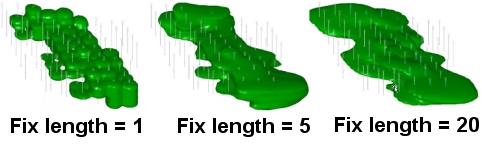

# Ellipsoids and Implicit Modelling

Ellipsoid object displayed in the 3D window amongst drillholes

Ellipsoids are used in implicit modelling to control how surfaces are produced to represent a modelled attribute value that originates from input drillhole data.

The overall goal of implicit modelling is to generate structural wireframes representing a given product, geological category or grade cut-off, and to do so automatically. In the case of potentially non-linear deposits (those containing one or more structures, with potentially multiple trends), it is important for the surface to be generated with due respect to the relative positions of other 'positive' intercepts within the data. A search ellipsoid is an ideal mechanism for this.

Ellipsoids are represented by an enhanced point-type data object. Each 'point' in the collection is supported by attributes describing the length and orientation of each axis (major, minor, semi-major) and are rendered as a 3-dimensional ellipsoid when viewed in any 3D window.

**Note** : The **[ELLIPSE](<../Process_Help_XML/ellipse.md>)** superprocess can generate both ellipsoid wireframe (tr/pt) data files and the more modern point-type ellipsoid file.

For structures with a single obvious trend and where the orebody is supported by a near-regular sampling grid, a single ellipsoid could suffice, generating an output structure with a constant trend and high continuity. For more complex cases, for example where sampling isn't regular (say, due to infill and production drilling) it may be more appropriate to use multiple ellipsoid structures within the body of data so that the multiple directional trends apparent in the data can be modelled more accurately.

Your product features a range of implicit modelling commands, however, the [Categorical](<Implicit_Surface_From_Drillholes_Categorical.md>) and [Grade Shell](<Implicit_Surface_From_Drillholes_Continuous.md>) modelling commands, due to the potentially multiform nature of output volumes, are the ones supported by a trend definition. These trends are represented by ellipsoids that you can design for each particular scenario, with tools on hand to automatically produce the best-fitting ellipsoids from selected sample data.

During implicit modelling, where multiple ellipsoids have been created, a 3-dimensional grid of ellipsoids is produced through interpolation. You can preview a representation of this grid of ellipsoids in both Categorical and Grade Shell commands to get an idea of how the inter-ellipsoid space will be treated. 

   
A 5x5x5 preview of an interpolated ellipsoids grid

## Custom Ellipsoid Generation from Drillhole Data

How custom ellipsoids are generated with respect to selected drillhole data is up to you. You can either:

  * generate ellipsoids from drillhole data according to the location of the positive intercept positions of the holes (the intercepts of the modelled attribute), or;

  * generate ellipsoids based on the relative location of positive intervals within drillholes in the set, sampling at regular intervals down the hole

This is controlled using the Use contacts option in the Create Trends group of each command:  
  

[More about using contacts for ellipsoid generation...](<Ellipsoids_UseContacts.md>)

## How are Ellipsoids Used in Implicit Modelling?

To calculate an appropriate 3D surface that matches the attribute value and parameters you have set, your application will either:

  * Use a general ellipsoid, based on the entire input sample set and use this ellipsoid to determine, at specific points in 3D space (determined by your trend and surface generation settings), how to construct a surface honouring all positive intercept positions within the search ellipsoid or;

  * Use an interpolated set of ellipsoids in the same manner, based on the presence of one or more custom ellipsoids that you have designed in advance.

How an ellipsoid (default, custom or interpolated) is positioned within the sample space in order to determine the optimal surface in that area (if any) is customizable. 

By default, sample positioning will be calculated automatically; the ellipsoid will be assessed at evenly-spaced positions down the hole in order to generate a surface. The distance between these ellipsoid locations (the Compositing length) will differ from data to data. 

You can choose to fix the compositing length to your own value if you wish, which may produce a more expected result. Have a look at the following examples, showing the affect the Subdivide parameter can have on the resulting surface for differing compositing lengths:

The left-most image, with a short compositing length has caused the ellipsoid (a default one in this case - identical for the whole sample space) to be positioned at many positions down each hole (every meter). Whilst the resulting shape is mathematically correct and sample intercept positions have been honoured, the actual shape isn't realistic. A more natureform shape, and a more suitable compositing length for this data, is shown in the middle image. In this case, all sample intercept positions are honoured but there is a sensible continuity between intercept points within the data. The other extreme is represented by the right-hand image, where the compositing length invokes a low frequency of ellipsoid positions and a larger distance between them, making it difficult to sample effectively and (in this case at least) causing sample intercept positions to be missed.

There's no strict rule as to which compositing length will be right for your data; it will depend on the relative location, depth and frequency of positive intercept positions plus the specification of your ellipsoids (default or custom).

Related topics and activities

  * [Implicit Modelling Overview](<Implicit_Modelling_Overview.md>)

  * [Modelling Method](<../COMMON/Delauney%20Tesselation%20Method%20Overview.md>)

  * [Categorical Modelling](<Implicit_Surface_From_Drillholes_Categorical.md>)

  * [Grade Shell Modelling](<Implicit_Surface_From_Drillholes_Continuous.md>)