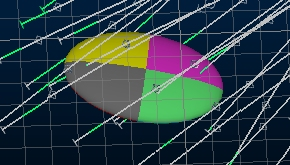
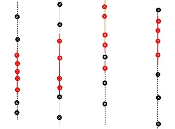
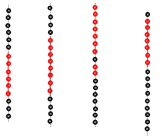
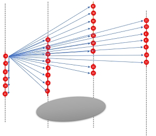
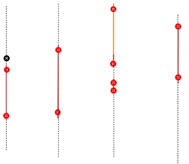
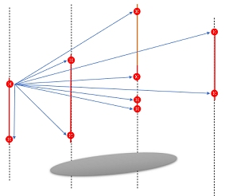

# Use Contacts

This topic explains how the [Create Categorical Surfaces](<Implicit_Surface_From_Drillholes_Categorical.md>) and [Create Grade Shells](<Implicit_Surface_From_Drillholes_Continuous.md>) commands automatically calculate ellipsoids for surface generation based on selected drillhole data.

If you intend to define a trend to impart a guiding direction or directions throughout your structure, you can either use the global ellipsoid (Default trend) or a loaded ellipsoids data object (Custom trend) containing one or more oriented ellipsoids to control the trend of the volume. See [Ellipsoids](<Ellipsoids_Overview.md>).

An example of an ellipsoid amongst drillhole data prior to categorical modelling

Consider the following example, showing the sample centres of the drillholes with the natural breaks (the input samples). There might be an over representation of samples in the area of interest and samples might be not be equally spaced around contacts. Sample breaks occur because of changes in rock type, the chosen compositing size, changes in downhole survey or grade sample intervals.

Use Contacts determines the method adopted for ellipsoid generation by each implicit modelling command and is found in the Create Trends group of controls.

Option 1: Equal-distance Method

For the default method of ellipsoid generation (where Use Contacts is uncheckd), the algorithm inserts a regular extra samples at a regular spacing within each unit:

The distance is calculated between every pair of points, and the average of these determines the ellipsoid:

Option 2: Contacts-based Method

When Use Contacts is checked, only the points around the contacts are used for ellipsoid generation:

For this method of ellipsoid generation, the algorithm inserts points at the contact points of each unit. The distance is calculated between every pair of points, and the average of these determines the ellipsoid. This method uses less points calculate the ellipsoid:

Related topics and activities:

  * [Implicit Modelling Overview](<Implicit_Modelling_Overview.md>)

  * [Ellipsoids in Implicit Modelling](<Ellipsoids_Overview.md>)

  * [Categorical Modelling](<Implicit_Surface_From_Drillholes_Categorical.md>)

  * [Grade Shell Modelling](<Implicit_Surface_From_Drillholes_Continuous.md>)