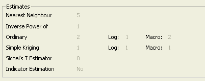

# ESTIMATE: Preview

To access this screen:

  * Display the [ESTIMATE](<EstimateDialog.md>) wizard and click through to the **Preview** screen.

Review a summary of all defined parameters made on previous screens of the [Estimate](<EstimateDialog.md>) wizard. Information is split into the following areas:

  * Settings General grade estimation settings that will be used to process the data displayed on the Summary tab.

  * Summary An 'at a glance' view of the parameters associated with the current grade estimation, split into **Files** , **Fields** and Parameters sections.

When all settings have been checked and, if necessary, edited on this screen, click Run to start the grade estimation calculation, and to display a grade estimation report in the Command window.

### Settings Tab

The Settings tab contains the following read-only fields:

  * Files Shows a summary of the input and output files specified on the [Files](<Estimate_Files.md>) screen.

  * Estimates Shows the total number of estimation types defined for each method (_Nearest Neighbour_ , _Inverse Power of Distance_ and so on), and whether Indicator Kriging is to be performed.

In the case of ordinary and simple kriging estimation types, the preview screen will show a further breakdown showing the split between log and macro kriging methods:

  * Options A summary of the general estimation controls and options can be found in this section, such as whether zonal control is being used, discretisation methods, parent cell estimation parameters and so on.

### Summary Tab

The Summary tab shows the **Files** , **Fields** and **Parameters** that will be applied when Estimate (and subsequently, [ESTIMA](<../Process_Help_XML/estima.md>)) is run. These settings relate to the same settings found in the [ESTIMA](<../Process_Help_XML/estima.md>) process screen, and is broken down into the following main sections:

Files Define the files to be used in grade estimation, indexed according to the parameter file definition used in the [ESTIMA](<../Process_Help_XML/estima.md>) process:

  * PROTO: the input prototype model file.

  * IN: the input sample data file.

  * SRCPARM: the search volume parameter file.

  * ESTPARM: the estimation parameter file.

  * MODEL: the output model file.

  * VMODPARM: the variogram model file.

  * STRING: the input string file containing the boundary limits for unfolding.

  * SAMPOUT: the sample output file.

For more information on these file parameters, refer to your [ESTIMA](<../Process_Help_XML/estima.md>) process help.

Fields A summary of the field details to be used in grade estimation purposes.

Parameters A summary of the parameters to be used.

You can also:

  * Restore Restore the settings added prior to the last Run of the screen. This will restore all settings on all screens.

  * Clear Reset all fields on all screens to their default values.

  * Previous/Next Move backwards or forwards one screen in the order of Estimate screens

  * Run Run the current grade estimation.

  * Cancel Cancel the ESTIMATE process without running an estimation.

Related topics and activities

  * [Estimate: Files](<Estimate_Files.md>)

  * [Estimate: Unfolding](<Estimate_Unfolding.md>)

  * [Estimate: Variogram Models](<Estimate_Variogram.md>)

  * [Estimate: Estimation Types](<Estimate_Estimation.md>)

  * [Estimate: Controls](<estimate_controls.md>)

  * [ESTIMATE: Search Volumes](<Estimate_Search.md>)

  * [Grade Estimation Introduction](<Grade%20Estimate%20Overview.md>)

  * [Grade Estimation Search Volume Introduction](<Grade%20Estimation%20Search%20Volume%20Introduction.md>)

  * [Grade Estimation Search Volume Parameter File](<Grade%20Estimation%20Search%20Volume%20Parameter%20File.md>)

  * [Grade Estimation Octants](<Grade%20Estimation%20Octants.md>)