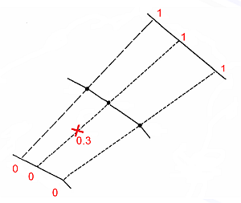
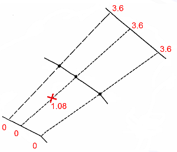
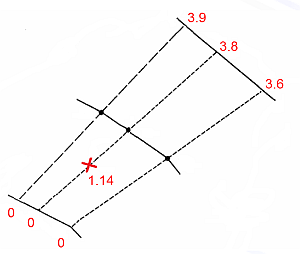

# ESTIMATE: Unfolding

To access this screen:

  * Display the **ESTIMATE** screen and select the **Unfolding** tab.

ESTIMATE is an interactive version of the [ESTIMA](<../Process_Help_XML/estima.md>) process, with additional functions provided by **[INDEST](<../Process_Help_XML/indest.md>)**.

Define sample coordinate unfolding parameters for grade estimation using **ESTIMATE** here. Typically, unfold parameters have been defined using the [Unfold Wizard](<UnfoldWizard.md>) beforehand.

All settings on this screen are optional. If you don't need to unfold input data, click **Next** to move to the **[Search Volumes](<Estimate_Search.md>)** screen.

To define data unfolding settings:

  1. Display the **ESTIMATE** screen.

  2. Select the **Unfolding** tab.

  3. Define the Unfold Strings File produced by the **[Unfold Wizard](<UnfoldWizard.md>)** operation. This contains validated hangingwall and footwall strings. 

  4. In the **Fields** section, pick the fields of the **Unfold Strings File** (see above) that identify key data and data switches:

     * SECTIONthe field containing the section identifier. This is a numeric value identifying each section.

     * BOUNDARYthe field containing the boundary (HW/FW) identifier. This is a numeric value that identifies the hangingwall and footwall strings. A value of '1' represents the hangingwall strings, and a value of '2' represents the footwall strings.

     * WSTAGthe field containing the _within section_ tag identifier. This is a numeric value identifying each tag.

     * BSTAGthe field containing the _between section_ tag identifier. This is a numeric value identifying each between section tag.

  5. In the **Parameters** section, the values set in the [Unfold Wizard](<UnfoldWizard.md>) display. This includes the Link Mode that determines whether within section or _between section_ tag strings are used:

     * Choose **Use Within Section and Between Section tags** to utilize the tags of the input Unfold strings file during estimation.

     * Choose **Do not use any tags** to ignore tag information in the input strings file during estimation.

  6. Choose the **Unfolded Coordinate Type** to define the scaling applied to each axis in the Unfolded Coordinate System (UCS). This defines the relative position of the associated unfolded data for each UCS axis (**UCSA** , **UCSB** and UCSC).

     * Normalised (between 0 and 1)a normalised coordinate uses a value between '0' and '1' to represent a position on the applicable axis. This is the distance as a proportion of the total distance along the axis, for example:

     * _Adjusted (normalised * av. length)_ the normalised coordinate value multiplied by the average length of the applicable axis, based on data from all sections. This is shown in the example below:

     * True Lengththe true length coordinate is the distance from the origin of the applicable axis in the Unfolded Coordinate System, measured in standard World Coordinate System units, as shown in the example below.
       * For **UCSA** , this provides a measure of width, or true width.
       * For **UCSB** , this is the distance along the dip-direction of the strata.
       * For **UCSC** , `adjusted' units are used by default. This is generally satisfactory as the UCSC coordinate should correspond to the direction of the fold axis.

       * World X / World Y / World Z Coordinatethe value on an axis in the Unfolded Coordinate System corresponds to one of the standard (X,Y,Z) axes in the World Coordinate System.

  7. Pick the **Plane** in which sections were defined. By default, this is perpendicular to the plane of the strike string:

     * If the strike string is defined using a _horizontal_ plane, choose Vertical section.

     * If the strike string is defined using a _vertical_ plane, choose Horizontal plane.

  8. Set a **Tolerance** value, defined as a proportion of the UCSA width, which allows samples which are just outside the hangingwall or footwall to be unfolded.

     1. If a Tolerance value greater than 0 is set, then one of the following conditions is applied to the UCSA value. These options are defined in terms of the _Normalised_ mode:

        * 1: No restriction on UCSAvalues can be less than 0, or greater than 1.

        * 2: UCSA <= 1values calculated as greater than 1 are reset to '1'.

        * 3: UCSA >= 0values calculated as less than '0' are reset to '0'.

        * 4: UCSA >= 0 and UCSA <=1values calculated as less than '0' are reset to '0', and values calculated as greater than '1' are reset to '1'.

  9. Pick a UCSB Origin Tag Number. This allows you to specify the origin for the UCSB coordinate by selecting a Between Section string.

  10. Choose the numeric value that defines the hangwall and footwall strings:

     * Hangingwall BOUNDARY valuespecify the numeric value that identifies the hangingwall string.

     * Footwall BOUNDARY valuespecify the numeric value that identifies the footwall string.

  11. Click **Next** to proceed to the **[Search Volumes](<Estimate_Search.md>)** screen.

Related topics and activities

  * [ESTIMATE: Files](<Estimate_Files.md>)

  * [ESTIMATE: Search Volumes](<Estimate_Search.md>)

  * [ESTIMATE: Variogram Models](<Estimate_Variogram.md>)

  * [ESTIMATE: Estimation](<Estimate_Estimation.md>)

  * [ESTIMATE: Controls](<estimate_controls.md>)

  * [ESTIMATE: Preview](<Estimate_Preview.md>)

  * [Introduction to Grade Estimation and Interpolation](<Advanced%20Estimation%20Validation.md>)

  * [Grade Estimation Methods](<Grade%20Estimation%20Methods.md>)

  * [ Grade Estimation Key Fields](<Grade%20Estimation%20Key%20Fields.md>)

  * [Grade Estimation Methods](<Grade%20Estimation%20Methods.md>)

  * [Grade Estimation Output and Results](<Grade%20Estimation%20Output%20and%20Results.md>)