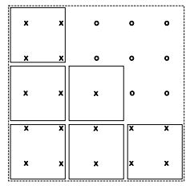

# Grade Estimation - Additional Features

This topic is part of the [Grade Estimation](<Grade%20Estimate%20Overview.md>) range of topics.

## Parent Cell Estimation

When creating the geological block model cell splitting is generally applied so that the cells give a good volumetric representation of the geological boundaries. It is then common practice to estimate a separate grade for each cell, so that grades differ between cells in the same parent cell.

This is sometimes an unnecessary refinement, particularly if the grade data is sparse. It is also unnecessarily time consuming to estimate several cells, if a parent cell estimation would suffice.

This is especially true in the early stages of grade estimation when you are not too concerned with the finest detail.

ESTIMA includes an option which allows the grade of the parent cell to be estimated, and then for that value to be assigned to all cells inside the parent. Zonal control is still applicable, so that if for example the parent cell contains 4 cells of rock A and 5 cells of rock B then the parent cell would first be estimated using rock A samples and this value applied to the 4 cells. Then the parent would be estimated for rock B in an identical manner.

## Discretisation Options

The discretised points in the parent cell can be calculated by one of two methods. If @PARENT = 1, then the parent cell is represented by a full set of discretised points covering the entire parent cell. If however @PARENT = 2, then the full set of discretisation points is still calculated, but only those points which lie within one of the corresponding cells are selected and used.

In the 2D example there are 6 subcells within a parent cell, and a set of 5 x 5 discretisation points has been superimposed. If @PARENT=1 then all 25 points (X and O) are used to represent the cell, whereas if @PARENT=2 then only the points annotated with a X are used.

## Minimum Number of Points

In the second case (@PARENT = 2) it would be possible to have very few or even no discretisation points lying in the cells. In order to allow for this you can specify a minimum acceptable number of discretisation points using the parameter @MINDISC. If this minimum is not reached, then the number of points in all three directions is doubled and the points are recalculated.

The advantage of the second method is that it provides a better representation of the cells, but the disadvantage is that the calculation takes a little longer. If @PARENT = 0, then the parent cell feature will not be used.

## Copying Field Values

If the Input Prototype Model has cells and already includes the field being estimated, and there is insufficient data within the search volume to estimate a cell, a choice of actions is available controlled by the value of the parameter @COPYVAL. If @COPYVAL = 0, then an absent data grade value is assigned to the Output Model. If @COPYVAL = 1, then the existing value in the Input Prototype Model is copied to the Output Model.

## Update Volume

In certain circumstances it may be necessary to update the grades in one part of the block model. One method is to copy the part of the model which requires updating into a separate submodel, run ESTIMA on the sub-model and then add the models back together using ADDMOD.

Alternatively if the part of the model to be updated can be defined as a cuboid, then it is possible to use parameters @XMIN, @XMAX, @YMIN, @YMAX, @ZMIN, @ZMAX and do the updating in place. Note that @COPYVAL = 1. Only cells which overlap this update volume will be estimated, although samples from outside the update volume will be used.

Whatever values of @XMIN, @XMAX etc. are provided, they will be adjusted by ESTIMA to the nearest parent cell boundary before updating begins. Minimum values will be adjusted down and maximum values will be adjusted up. If one or more of the parameters are not specified or are absent data (the default), then the minimum or maximum coordinates of the model are used.

## In-place Operation

If all grade fields (as defined by VALUE_OU in the [Estimation Parameter file](<Grade%20Estimation%20Parameter%20File.md>)) and their corresponding secondary fields (as defined by NUMSAM_F, SVOL_F, VAR_F and MINDIS_F) already exist in the Input Prototype Model file, then in-place operation is allowed. This means that the Input Prototype Model and the Output Model files can be the same file. For example:

&PROTO (MODEL1), &MODEL (MODEL1)

If the Input Prototype File and the Model File have the same file name then the process checks to make sure that the file includes all the necessary fields, and terminates with an error message if this is not the case.

An in-place operation allows you to use retrieval criteria on fields in the Input Prototype Model file. Records which do not satisfy the retrieval criteria will remain unaltered in the Output Model file. This can therefore be used for doing a selective update of the model.

Remember that if different Input Prototype Model and Output Model files names are specified and retrieval criteria is used, then only those records that satisfy the criteria will be copied to the Output Model file.

If a grade value cannot be estimated due to insufficient data in the search volume, then the parameter @COPYVAL dictates whether an absent data value or the previous value should be assigned.

## Pseudo Estimation Methods

The main estimation methods ([Inverse Power Distance](<Grade%20Estimation%20Inverse%20Power%20of%20Distance.md>), [Ordinary Kriging](<Grade%20Estimation%20Kriging.md>), etc) are described in previous sections. However, there are two additional options which are specified using the IMETHOD field in the [Estimation Parameter file](<Grade%20Estimation%20Parameter%20File.md>), but which are not actually grade estimates.

If IMETHOD=101, then the value written to the VALUE_OU field in the Output Model is the geostatistical [F value](<Grade%20Estimation%20F%20Value.md>) i.e. the average value of the variogram in the cell. If IMETHOD=102, then the value is the [Lagrange multiplier](<Grade%20Estimation%20Lagrange%20Multiplier.md>) calculated when solving the Ordinary Kriging matrix.

In order to use either of these options you should set all other fields and parameters as if you were selecting Ordinary Kriging.

[Proceed to the next section](<Grade%20Estimation%20Variograms.md>) (Variograms)