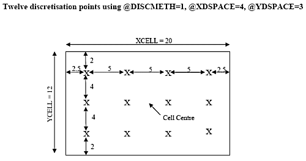
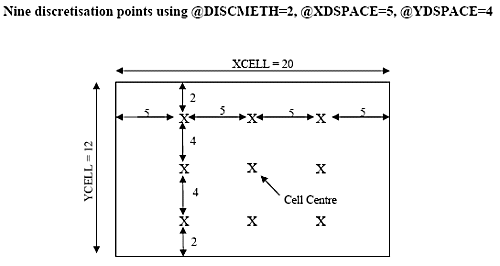

# Cell Discretisation

This topic is part of the [Grade Estimation](<Grade%20Estimate%20Overview.md>) range of topics.

In the Input Model Prototype file, the coordinates of the cell centre are held in fields XC, YC and ZC and the cell dimensions in fields XINC, YINC and ZINC. For an estimation method such as [Inverse Power Distance](<Grade%20Estimation%20Inverse%20Power%20of%20Distance.md>) it would be possible to use just the cell centre coordinates and make the estimate as a function of the distance of each sample from the cell centre. However, this means the dimensions of the cell are ignored and so the resultant estimate is the value of a point at the cell centre. The average value of the grade over the whole cell should be estimated.

Rather than represent a cell by just a single point, [ESTIMA](<../Process_Help_XML/estima.md>) allows you to simulate the cell by a three dimensional array of points, distributed regularly within the cell. For Inverse Power Distance, the value at each discretised point is estimated, and then the arithmetic mean of all points calculated. For [kriged](<Grade%20Estimation%20Kriging.md>) estimates, the discretised points are used for calculating the covariance of the cell with each of the surrounding samples. This is then used in calculating the kriging weights.

Neither the [Nearest Neighbor](<Grade%20Estimation%20Nearest%20Neighbour.md>) estimation method nor [Sichel's t estimator](<Grade%20Estimation%20Sichels%20T%20Estimator.md>) use discretisation points. Nearest Neighbor is based on the distance to the cell centre, and Sichel's t is a function of the lognormal distribution.

## Method 1 Define Points

There are two ways of defining discretisation points, depending on the parameter @**DISCMETH**. If @**DISCMETH** =1, then the parameters @**XPOINTS** , @**YPOINTS** and @**ZPOINTS** are used to define the number of discretisation points in the X, Y and Z directions respectively.

If an even number of points in a direction are defined, then the points will be spaced around the centre line. If an odd number of points are defined then there will be a point on the centre line and the others will be spaced regularly towards the edges. This is illustrated, in two dimensions, in the following diagram.

## Method 2 Define Spacing

If @**DISCMETH** = 2, then the distance between discretisation points is defined rather than the number of points. This is achieved using parameters @**XDSPACE** , @**YDSPACE** and @ZDSPACE. Using this method there is always one point at the cell centre and all other points are located at the specified distance from it.

The previous diagram illustrates the location of discretisation points using @**DISCMETH** = 2 with @**XDSPACE** = 5 and @**YDSPACE** = 4. If a point is calculated to lie exactly on a cell boundary, then it will not be created.

The advantage of the first method is that the same number of discretisation points will occur in every cell, irrespective of the cell dimensions. However, the disadvantage is that the spacing in one direction may be very much larger than in another direction, depending on the relative dimensions of the cell.

The advantage of the second method is that by setting @**XDSPACE** , @**YDSPACE** and @**ZDSPACE** equal to each other a completely regular set of points over a cell are created. However, the disadvantage is that for small cells there may be very few and possibly only one discretisation point.

[Go to the next topic](<Grade%20Estimation%20Methods.md>) (Estimation Methods Overview)