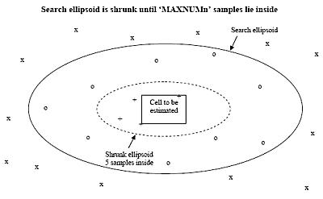
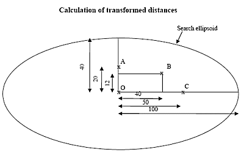

# Dynamic Search Volumes

This topic is part of the [Grade Estimation](<Grade%20Estimate%20Overview.md>) range of topics. For more information on Search Volumes in general, see [Grade Estimation Search Volume Introduction](<Grade%20Estimation%20Search%20Volume%20Introduction.md>).

It is often useful to be able to categorize reserves based on the number of samples within a search volume. For example:

  * Measured \- at least 6 samples within 20m

  * Indicated \- at least 4 samples within 40m

  * Inferred \- at least 2 samples within 60m

You can do this in a single run of [ESTIMA](<../Process_Help_XML/estima.md>) by defining three concentric search volumes, and a minimum and maximum number of samples for each volume. The first search volume (which must be the smallest volume) is defined using the search axes SDIST1, SDIST2 and SDIST3 as described previously. The second search volume is defined by multiplying these search axes by SVOLFAC2. The value of SVOLFAC2 must be either 0 or >=1. If it is set to zero then neither the second or third search volumes are used.

If **SVOLFAC2** =1 then the second search volume will have the same dimensions as the first search volume. In this case, the minimum number of samples for the second volume should be less than the minimum number for the first volume in order for the second volume to be of any practical use.

SVOLFAC3 is the multiplying factor for search volume 3. It must be either zero, or >= **SVOLFAC2**.

For each search volume, a minimum and maximum number of samples can be defined; MINNUM1 and MAXNUM1 apply to the first search volume; MINNUM2 and MAXNUM2 apply to the second, and MINNUM3 and **MAXNUM3** to the third. If there are more than MAXNUMn samples within search volume n, then the 'nearest' MAXNUMn samples will be selected. Nearest is defined in terms of a transformed distance, depending on the search volume.

The search ellipse is shrunk concentrically, until only MAXNUMn samples lie within it. This is illustrated in the following diagram:

The samples shown annotated with x lie outside the search ellipsoid. There are 13 samples inside the ellipsoid, annotated with o and +. If MAXNUM1 is set to 4, then the ellipsoid is shrunk until only the 4 samples annotated with + lie inside it. These 4 samples are then used for estimating the cell value.

Search volume 1 is applied first. If there are less than MINNUM1 samples then search volume 2 is applied. If there are still less than MINNUM2 samples search volume 3 is applied. If there are less than MINNUM3 samples, then the grade value for that cell is set to absent data.

You can record which search volume has been used for each cell by defining the SVOL_F field in the Estimation Parameter file. This is a numeric field which is added to the Output Model file and has a value of 1, 2 or 3 depending on the search volume.

## Transformed distance

If there are more than MAXNUMn samples in the search volume then the search ellipsoid shrinks until only MAXNUMn remain. Within **ESTIMA** , this is achieved by calculating a transformed distance for each sample, and then sorting the samples on the transformed distance.

In order to calculate the transformed distance, the sample data is first rotated into the coordinate system of the search ellipsoid. In the rotated system if the origin of the ellipsoid is at point (0, 0, 0) and a sample is at (X, Y, Z) then its transformed distance D is defined by:

D = √ [ (X/SAXIS1)2 + (Y/SAXIS2)2 + (Z/SAXIS3)2 ]

A sample lying on the search ellipsoid will therefore have a transformed distance of 1, and all samples inside the ellipsoid will have transformed distances of less than 1.

The calculation of the transformed distance is illustrated below with a simple example:

The diagram shows the samples at A, B and C rotated into the coordinate system of the search ellipsoid. The axes of the search ellipsoid are **SAXIS1** =100 and **SAXIS2** =40. This example is in two dimensions, and so the value of SAXIS3 is not relevant. The transformed distances of points A, B and C from origin O are calculated as:

  * Point A at X = 0, Y = 20:  
  
DA = √ [( 0 / 100 )2 + ( 20 / 40 )2 ] = 0.5

  * Point B at X = 40, Y = 12:  
  
DB = √ [( 40 / 100 )2 + ( 12 / 40 )2 ] = 0.5

  * Point C at X = 50, Y = 0:  
  
DC = √ [( 50 / 100 )2 + ( 0 / 40 )2 ] = 0.5

Therefore, in this example all three points are at the same distance from the centre.

[Go to the next topic](<Grade%20Estimation%20Octants.md>) (Using Octants)