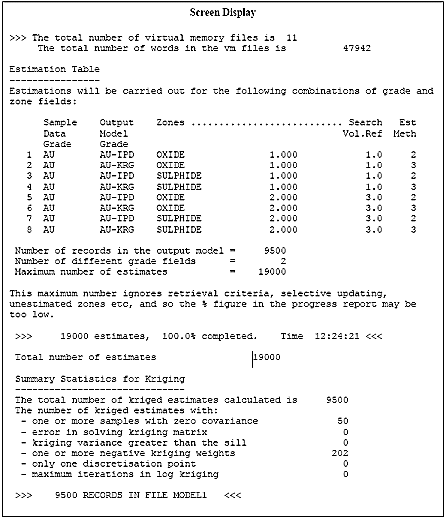

# Output and Results

This topic is part of the [Grade Estimation](<Grade%20Estimate%20Overview.md>) range of topics.

The two output files ESTIMA creates are the Output Model file and the Sample Output file. The former is simply a copy of the Input Prototype Model file with the estimated grade and secondary field(s). If retrieval criteria have been specified then only a subset of the cells will be copied to the Output Model file, unless ESTIMA is running an in-place operation.

## Sample Output File

The Sample Output file is optional, and records the weight of each sample for each cell for each grade which is estimated. Each weight is a separate record and so the file could become very large. In normal circumstances this output is generally not required. However, the Sample Output file does provide useful data if you want to find out how the estimated value for any cell was calculated. The fields created in the Sample Output file are:

Search Volume Parameters File  
---  
Field Name |  Description  
XC |  X coordinate of centre of cell being estimated  
YC |  Y coordinate of centre of cell being estimated  
ZC |  Z coordinate of centre of cell being estimated  
X |  X coordinate of the sample  
Y |  Y coordinate of the sample  
Z |  Z coordinate of the sample  
ACTDIST |  The actual distance of the sample from the cell centre  
TRANDIST |  The transformed distance of the sample from the cell centre, using the search volume transformation  
FIELD |  The name of the grade field being estimated  
GRADE |  The name of the sample grade  
WEIGHT |  The weight assigned to the sample  
OCTANT |  The octant number; only if octant search is used  
{ZONE1_F} |  The actual field name in the file be whatever you have specified as *ZONE1_F, e.g. 'ROCK'. The value recorded will then be the value of the rock field.  
{ZONE2_F} |  As for {ZONE1_F}  
AV-VGRAM |  Average value of the variogram between the cell and the sample. Only recorded if kriging is used.  
  
### Sample Output Example

An example of part of a Sample Output file is shown below:

XC |  YC |  ZC |  X |  Y |  Z |  ACT DIST |  TRAN DIST |  FIELD |  GRDE |  WGT |  OCT |  ROCK |  AV-VGRM  
---|---|---|---|---|---|---|---|---|---|---|---|---|---  
350 |  250 |  150 |  321 |  222 |  131 |  44.6 |  0.374 |  AU |  3.51 |  0.284 |  7 |  A |  6.128  
350 |  250 |  150 |  351 |  301 |  174 |  56.4 |  0.350 |  AU |  5.78 |  0.237 |  1 |  A |  6.912  
350 |  250 |  150 |  248 |  248 |  153 |  0.044 |  0.044 |  AU |  9.14 |  0.324 |  2 |  A |  4.730  
350 |  250 |  150 |  245 |  245 |  117 |  0.792 |  0.792 |  AU |  2.79 |  0.155 |  6 |  A |  8.636  
  
### Screen Display

An example of the information displayed on the screen during processing is shown here. The first item gives information on the use of virtual memory, and is displayed if @**PRINT** ≥1.

The Estimation Table provides a summary of each estimate to be calculated. If Zonal Control is used then the corresponding zone values are shown. In this example there are two zone fields one alphanumeric and one numeric.

If, in the [Estimation Parameter file](<Grade%20Estimation%20Parameter%20File.md>) a single set of parameters have been applied to all zones then a record will be shown in the Estimation Table for each possible combination of zones. It may therefore appear that there are more combinations of zones than have been specified.

The estimates are carried out in the order shown in the table. This is not necessarily the same as the order you specified in the Estimation Parameter file, because the order has been arranged to minimize run-time.

The maximum number of estimates is calculated as the number of records in the **Output Model** multiplied by the number of different grade fields to be created. There are several situations where the actual number of estimates may be less than this number:

  * Zonal control is used, but only certain combinations of zone fields have been specified, and a default set of estimation parameters have not been specified.

  * The estimation is in-place and you have specified retrieval criteria.

  * If the selective update parameters @**XMIN** , @**XMAX** etc are being used.

The progress report shows the number of estimates completed, both as an absolute figure and as a percentage of the maximum number of estimates. For the reasons described previously it is possible that the percentage figure is too low.

It is also possible that the percentage figure in the progress report may exceed 100%. This would happen if, in the [Estimation Parameter file](<Grade%20Estimation%20Parameter%20File.md>), two or more VALUE_OU fields had been incorrectly defined and had the same field name. For example in the Screen Display table, if the Output Model Grade were AU for all 8 records then there would only be one different grade, and so the number of estimates would be 9500, even though 19000 estimates would be calculated.

The Output Model file would only include the kriged estimate, because although the IPD estimate would be calculated, it would be overwritten by the kriged estimate. Therefore if the progress report exceeds 100%, check the VALUE_OU fields in your [Estimation Parameter file](<Grade%20Estimation%20Parameter%20File.md>).

The table entitled 'Summary Statistics for Kriging' (in the image shown above) is only displayed if Simple Kriging or Ordinary Kriging have been specified as one of the estimation methods. The information included in this table is:

  * One or more samples with zero covariance: This shows the number of estimates which included one or more samples whose distance from the cell exceeded the range of the variogram. This is not an error, or even a problem, but just gives an indication that for some cells it may be possible to reduce the maximum number of samples without significantly affecting the kriged variance.

  * Error in solving the kriging matrix: If an error has occurred while trying to solve the kriging matrix the kriged estimate will be set to absent data (-). If @PRINT>_1 is used, then the cell coordinates will be displayed and saved in the print file if @ECHO=1. The probable may be caused by very high anisotropy on the variogram ranges, so check the variogram model. Also make sure that lognormal kriging with a normal variogram model is not being used.

  * Kriging variance greater than sill: This is simply for information, and is not a problem. The treatment of variances greater than the variogram sill is described in the topic on [Kriging](<Grade%20Estimation%20Key%20Fields.md>).

  * One or more negative kriging weights: This is also for information, and is not a problem. The treatment of negative kriging weights is described in the section on [Kriging](<Grade%20Estimation%20Kriging.md>).

  * Only one discretisation point: This situation only occurs with parent cell estimation if @**PARENT** =2. The number of discretisation points in each direction is doubled until the number exceeds @**MINDISC**.

  * Maximum iterations in log kriging: The General Case option for lognormal kriging is an iterative procedure. This item records the number of times an iteration is terminated because the maximum number of iterations has been reached. If this happens very frequently consider increasing the maximum number allowable - field MAXITER in the [Estimation Parameter file](<Grade%20Estimation%20Parameter%20File.md>).

[Go to the next topic](<Grade%20Estimation%20Examples.md>) (Grade Estimation Examples)