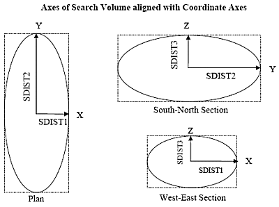
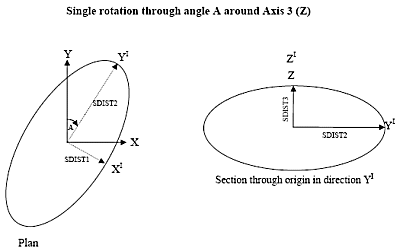
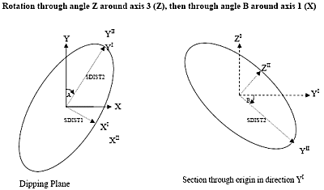

# Search Volumes

This topic is part of the [Grade Estimation](<Grade%20Estimate%20Overview.md>) range of topics.

One or more search volumes are defined using the Search Volume Parameter file (&**SRCPARAM**). Each record in the file defines a separate search volume and each search volume has a unique Search Volume Reference Number (field SREFNUM). This means that a search volume may be unique to an individual grade or can be shared by two or more grades.

The search volume method is defined using field SMETHOD. Setting SMETHOD to 1 gives a three dimensional rectangle and setting it to 2 gives an ellipsoid. The only difference is that the rectangular method will select samples in the corners of the search volume as illustrated in the diagram. The default value for SMETHOD is 2 (ellipsoid).

The lengths of the axes of the ellipsoid are defined using fields SDIST1, SDIST2 and SDIST3. Initially SDIST1 is along the X-axis, SDIST2 along the Y-axis and **SDIST3** along the Z-axis:

One, two or three rotations may then be defined. For each rotation, it is necessary to define both the rotation angle and the axis about which the rotation is applied. For this purpose, the X-axis is denoted as axis 1, the Y-axis as axis 2, and the Z-axis as axis 3.

The rotation angle is measured in a clockwise direction when viewed along the positive axis towards the origin. A negative rotation angle means an anticlockwise rotation.

For example if the first rotation is through A degrees around axis 3 (Z) then the search ellipse is oriented as shown below:

If the search ellipsoid is then rotated through B degrees around the new XI axis the result is as shown below:

This example illustrates a conventional rotation of azimuth and dip. However, any rotation method can be used by defining both the angles and axes for up to three rotations.

### Simulate with left hand

It can sometimes be helpful to use the fingers of your left hand to simulate the rotations. Point your index finger straight out in front of you, your thumb up in the air, and your second finger to the right across your body. Write the number 1 on your second finger, 2 on your index finger and 3 on your thumb. Your second finger is the X-axis, pointing East, your index finger is the Y-axis pointing North and your thumb is the Z-axis pointing up.

To simulate the two rotations in the previous example first hold your left thumb with your right hand and rotate the other two fingers clockwise. Then hold your second finger and rotate your index finger and thumb clockwise in a vertical plane. Your fingers are now pointing along the axes of your rotated search ellipsoid.

## SANGLE and SAXIS fields

The fields in the Search Volume Parameter file that define the first rotation are SANGLE1 and SAXIS1. Using the previous example SANGLE1 is angle A, and SAXIS1 is 3 (Z). The second rotation is then defined by putting SANGLE2 to B and SAXIS2 to 1 (X). Setting SANGLE3 and SAXIS3 to - (absent data) or 0 means rotation 3 is not used.

[Go to the next topic](<Grade%20Estimation%20Dynamic%20Search%20Volumes.md>) (Dynamic Search Volumes)