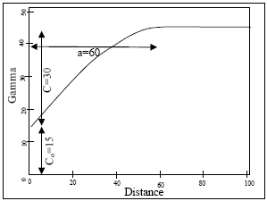
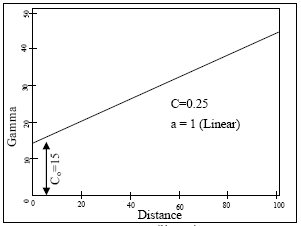
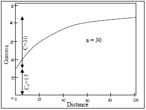
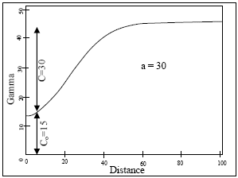
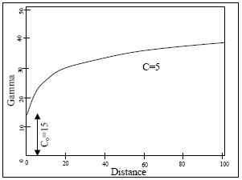
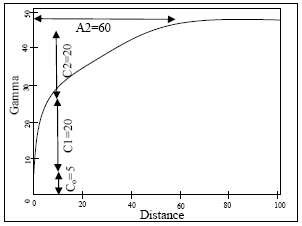
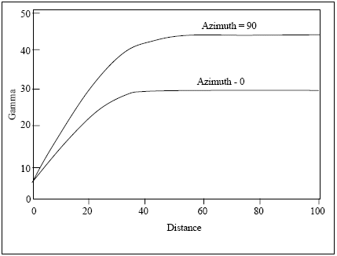

# Variograms

This topic is part of the [Grade Estimation](<Grade%20Estimate%20Overview.md>) range of topics.

## Variogram Model Parameter File

A variogram model consists of a nugget variance, Co, and up to 9 individual structures, γi(h). The combined model, γ(h), is of the form:
    
    
    γ(h) = Co + γ1(h) + γ2(h) + γ3(h) + ...... + γ9(h)

The individual models γi(h) can be spherical, power, exponential, gaussian or De Wijsian. If [kriging](<Grade%20Estimation%20Kriging.md>) is selected as an estimation method, then it is necessary to specify the variogram parameters using the Variogram Model Parameter file. The required fields are shown in the table below:

Field |  Default |  Description  
---|---|---  
VREFNUM |  1 |  Variogram reference number (pointer from [Estimation Parameter file](<Grade%20Estimation%20Parameter%20File.md>))  
VANGLE1 |  0 |  Rotation angle 1, defining orientation of range ellipsoid  
VANGLE2 |  0 |  Rotation angle 2, defining orientation of range ellipsoid  
VANGLE3 |  0 |  Rotation angle 3, defining orientation of range ellipsoid  
VAXIS1 |  3 |  First rotation axis (1=x, 2=y, 3=z)  
VAXIS2 |  1 |  Second rotation axis (1=x, 2=y, 3=z)  
VAXIS3 |  3 |  Third rotation axis (1=x, 2=y, 3=z)  
NUGGET |  0 |  Nugget variance  
ST1 |  1 |  Variogram model type for structure 1  
ST1PAR1 |  - |  First parameter of structure 1  
ST1PAR2 |  - |  Second parameter of structure 1  
ST1PAR3 |  - |  Third parameter of structure 1  
ST1PAR4 |  - |  Fourth parameter of structure 1  
(ST2 to ST8) |  |   
ST9 |  - |  Variogram model type for structure 9  
ST9PAR1 |  - |  First parameter of structure 9  
ST9PAR2 |  - |  Second parameter of structure 9  
ST9PAR3 |  - |  Third parameter of structure 9  
ST9PAR4 |  - |  Fourth parameter of structure 9  
  
All fields are numeric and are optional except for the variogram reference number. If a field is not included in the file, then its default value will be used.

The variogram reference number is a pointer from the **Estimation Parameter file**. Any numeric value may be used for this field.

### Variogram Ellipsoid

The variogram ellipsoid is used to define any parameter which is not isotropic, the most common example being the range of the spherical model. The variogram ellipsoid is defined using fields VANGLE1, VAXIS1, etc in an identical manner to the search ellipsoid, described in the Search Volume section. An example using these rotation fields is given further on in this section.

The default values specify no rotation. Therefore if the variogram ellipsoid is to have the same orientation as the search ellipsoid the fields SANGLE1, SAXIS1, etc in the [Search Volume Parameter file](<Grade%20Estimation%20Search%20Volume%20Parameter%20File.md>) must be the same as fields VANGLE1, VAXIS1, etc in the Variogram Model Parameter file.

## Variogram Model Types

Field STs defines the model type for structure s. The options for STs are:

  1. spherical

  2. power (eg linear)

  3. exponential

  4. gaussian

  5. De Wijsian

Examples of the 5 model types are shown in the diagrams below. The diagrams also include a two-structure spherical model:

Spherical Model Type 1  |  The spherical model is defined by the range a, and the spatial variance C:
    
    
    γi(h) = C [1.5 x h / a - 0.5 x (h / a)3 ] if h≤a = C if h>a

The five fields required are:

  * STs =1 for a spherical model
  * STsPAR1 range in direction 1 (X axis after rotation)
  * STsPAR2 range in direction 2 (Y axis after rotation)
  * STsPAR3 range in direction 3 (Z axis after rotation)
  * STsPAR4 spatial variance C.

  
---|---  
Power Model Type 2  |  The power model is defined by a power a (0 < a < 2) and a positive slope C:
    
    
    γi(h) = C x ha

The five fields required are:

  * STs =2 for a power model
  * STsPAR1 power in direction 1 (X axis after rotation)
  * STsPAR2 power in direction 2 (Y axis after rotation)
  * STsPAR3 power in direction 3 (Z axis after rotation)
  * STsPAR4 slope C

  
Exponential Model Type 3  |  The exponential model is defined by parameter a and spatial variance C:
    
    
    γi(h) = C[1 - exp(-h/a)]

The five fields required are:

  * STs =3 for a exponential model
  * STsPAR1 parameter a in direction 1 (X axis after rotation)
  * STsPAR2 parameter a in direction 2 (Y axis after rotation)
  * STsPAR3 parameter a in direction 3 (Z axis after rotation)
  * STsPAR4 spatial variance C

The parameter a is often referred to as 1/3 range. In the graphic a=30, so the range is 90m. At a distance of 90m the Gamma value has reached 95% of the sill (nugget variance + spatial variance).  
  
Gaussian Model Type 4  |  The Gaussian model is defined by parameter a and spatial variance C:
    
    
    γi(h) = C [1  exp(-h2 / a2)]

The five fields required are:

  * STs =4 for a gaussian model
  * STsPAR1 parameter a in direction 1 (X axis after rotation)
  * STsPAR2 parameter a in direction 2 (Y axis after rotation)
  * STsPAR3 parameter a in direction 3 (Z axis after rotation)
  * STsPAR4 spatial variance C

  
De Wijsian Model Type 5  |  The De Wijsian Model is defined by parameter c:
    
    
    γi(h) = C x loge(h) h>1 = 0 h≤1

The four fields required are:

  * STs =5 for a De Wijsian model
  * STsPAR1 parameter C in direction 1 (X axis after rotation)
  * STsPAR2 parameter C in direction 2 (Y axis after rotation)
  * STsPAR3 parameter C in direction 3 (Z axis after rotation)

  
Two-structure spherical model type  |  Two-structure Spherical model type graph shown for comparison  
  
## Rotation Example

This example illustrates the case where three rotations are required to describe the anisotropy.

The first rotation is a conventional azimuth rotation of 20 degrees around the Z-axis, the second rotation is a dip of 40 degrees around the new X-axis, and the final rotation is 60 degrees around the new Y-axis. Ranges for structure 1 are 100m, 200m and 300m in the new X, Y and Z directions. The fields are:

Field |  Value  
---|---  
VANGLE1 |  20  
VANGLE2 |  40  
VANGLE3 |  60  
VAXIS1 |  3  
VAXIS2 |  1  
VAXIS3 |  2  
ST1PAR1 |  100  
ST1PAR2 |  200  
ST1PAR3 |  300  
  
## Zonal Anisotropy

The definition of the variogram model in ESTIMA does not allow anisotropic Co or C values for model types 1 to 4. An anisoptopic C value for the De Wijsian model (type 5) is acceptable because the model equation does not have any other anisotropic variables.

In ESTIMA zonal anisotropy can be represented by a multi-structure model. The following example shows a two structure spherical model with a sill of 30 for an azimuth of 0 degrees and a sill of 45 for the 90 degrees direction.

The nugget variance Co is 5, and all the rotation angles (**VANGLEn**) are zero. Setting range 2 in direction 0o to a large distance (10000m) has the effect of creating a lower sill over the part of the variogram model that is of interest. Of course if the distance axis were plotted up to 10000m, the variogram for 0o would eventually reach a sill of 45.

The full set of field values for this model as stored in the Variogram Model Parameter file is as follows:

Field Name |  Value  
---|---  
VREFNUM |  1  
VANGLE1 |  0  
VANGLE2 |  0  
VANGLE3 |  0  
VAXIS1 |  3  
VAXIS2 |  1  
VAXIS3 |  3  
NUGGET |  5  
ST1 |  1  
ST1PAR1 |  40  
ST1PAR2 |  40  
ST1PAR3 |  40  
ST1PAR4 |  25  
ST2 |  1  
ST2PAR1 |  60  
ST2PAR2 |  10000  
ST2PAR3 |  60  
ST2PAR4 |  15  
  
Note that in this example the anisotropy is orthogonal to the coordinate system, and so all angles are zero. In this case the axis values are irrelevant.

[Go to the next topic](<Grade%20Estimation%20Run%20Time%20Optimization.md>) (Run Time Optimization)