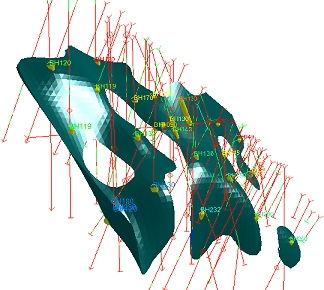
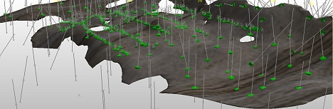
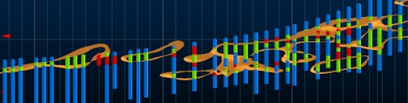

# Implicit Modelling

Note: A Datamine [eLearning course](<https://datamine.learnupon.com/>) is available that covers functions described in this topic. Contact your local Datamine office for more details.

## Structural Modelling

Structural modelling is used to define surfaces that represent the shape and spatial extents of geological features such as lithological contacts, mineralized veins, weathering surfaces, geotechnical domains, mineralization shells and intrusions. These surfaces are used to define domain boundaries and constrain the estimation of grade when building a mineral resource model. 

Traditional surface modelling in part relied on linking together adjacent manually defined sectional interpretations to create 3D solids. The drawbacks of this approach are the time and effort involved, the difficulty of updating the model in response to new data an its inherent subjectivity. 

Today, the common approach to modelling structural surfaces is to use mathematical techniques to automatically generate surfaces. Inputs are the location of samples, parameters which are adjustable by the user and sometimes explicit guidance provided as a result of prior geological knowledge. The advantages of this approach are its speed, reproducibility and increase in objectivity. Automatic parametrically controlled modelling is easier to reapply when new data becomes available and overall allows more time for the user to apply their geological knowledge which should result in a more reliable and robust model with reduced risk.

## Implicit vs. Explicit Modelling

The term Implicit Modelling has become common within the mining industry to describe the methods used to automatically model geological structures. This phrase is accurate in that the precise shape of the structure being modelled is suggested by the location of the input samples though is not directly or completely described by them. 

A key advantage of implicit modelling is a reduction in geological risk; by allowing you to experiment with more (and more appropriate) controls to quickly build a valid geological model. Rather than spending time on rudimentary, traditional sectional interpretations and wireframe linking, a geologist can focus their attention on understanding the geology, getting the geological interpretation right and quickly experiment with alternative models that satisfy geological constraints.

**Tip** : fault wireframes can be modelled using the **[Model Faults](<ModelFaults.md>)** managed task.

Another key advantage is ensuring that your model is always up to date with the latest drilling data. Updating your geological model with additional drilling or sampling data has never been easier, meaning that there is less work required to update a resource model or grade control model with new information.

In comparison, _explicit_ modelling refers to the typically more laborious method of structural modelling by creating cross sections and joining them together via the optional use of tag strings. This method is also referred to as 'sectional interpretation' amongst other, more local, terms.

In a domain where auditability is of paramount importance, stage results are supported more reliably by reproducible data that represent a known set of input parameters and not the intuition and manual skills of geologists adopting a more hands-on approach of section analysis and editing.

For more information on the above commands and dialogs, please refer to the appropriate context-sensitive help page, or use Related Topics, below.  

## Implicit Modelling Metadata

All implicit modelling commands generate or utilize input data. Data generated by animplicit modelling command is automatically appended with a range of fields that act as metadata. This metadata is used to ensure the 'heritage' of the modelled data is known, and it can be interpreted by other application functions to allow settings to be configured automatically, based on previous parameters.

#### _SOURCECOMMAND & _USED_BY

The _**SOURCECOMMAND** attribute denotes the tool used previously to create the data. It one of the following valid values:

  * **FaultModelling** \- Fault traces (strings) were generated using the [Model Faults](<ModelFaults.md>) task.

  * **VeinFromSamples** \- The data was created using the [Vein Modelling](<../COMMON/Create_Vein_Surfaces_Overview.md>) task. Boundary strings, additional points and fault wireframes can all contain this metadata.

  * **ContactSurface** \- Data was generated using the [Create Contact Surface](<Surface_From_Samples.md>) task. Boundary strings, additional points and fault wireframes can include this metadata.

  * **GradeShell** \- Grade shell data generated by the [Create Grade Shells](<Implicit_Surface_From_Drillholes_Continuous.md>) task. Ellipsoid data is updated.

  * **Categorical** \- Data was generated using the Ellipsoid data and additional points are updated.

When data is used by a command to generate its output, for example, fault traces used to model faults or fault wireframes used to create fault blocks in the Create Vein Surfaces command, a value is automatically added to a _**USED_BY** attribute. Again, this is automatically appended to the data objects used within the implicit modelling function. The following codes are used:

  * **1** \- The data has been used by the [**Create Vein Surfaces**](<../COMMON/Create_Vein_Surfaces_Overview.md>) tool most recently. 

  * **2** \- The data has been used by the [Create Contact Surface](<Surface_From_Samples.md>) tool.

  * **4** \- The data has been used by the [Create Grade Shells](<Implicit_Surface_From_Drillholes_Continuous.md>) tool.

  * **8** \- The data has been used by the [Create Categorical Surfaces](<Implicit_Surface_From_Drillholes_Categorical.md>) tool.

  * **16** \- The data has been used by the [Model Faults](<ModelFaults.md>) tool.

## Trend control using Ellipsoids

The [implicit-surface-categorical-drillholes](<../command_help/create-categorical-surfaces.md>) and [implicit-surface-continuous-drillholes](<../command_help/create-grade-shells.md>) commands support trend control using ellipsoid data. The orientation of the ellipsoid can be used to define a known trend, or you can use multiple ellipsoids in the same operation I the trend varies across input the data set (e.g. to be used where anisotropy is complex).

Surfaces are modelled around distinct sample interval boundaries (hangingwall/footwall for vein modelling, a single surface volume for rock type modelling). Structures can also be modelled to represent grade shells up to a given cut-off grade.

## Structural Modelling Commands

Studio provides a range of structural modelling functions. These are accessible from the **Geology** ribbon but also as commands entered into the **[Command Line](<../COMMON/Command_Toolbar.md>)** :

  * [vein-from-samples](<../command_help/vein-from-samples.md>): model vein and vein-like structures, including faults, based on the continuity of hangingwall/footwall surfaces between known drillhole sample inputs. Surfaces are modelled around a unique key field value. This command delivers its functionality using the [Create Vein Surfaces](<../COMMON/Create_Vein_Surface.md>) screen.
  * [surfaces-from-samples](<../command_help/surface-from-samples.md>): model contact surfaces between lithological domains. You choose the values above and below the surface and you can decide which values, if any, to ignore (say, an intrusion).
  * [implicit-surface-categorical-drillholes](<../command_help/create-categorical-surfaces.md>): This command is aimed at rock type modelling of a cut-off value for a given numerical attribute, and presents its functionality using the [Implicit Surface from Drillholes - Categorical](<Implicit_Surface_From_Drillholes_Categorical.md>) screen.
  * [implicit-surface-continuous-drillholes](<../command_help/create-grade-shells.md>): a variant of the above, used for modelling of more continuous rock type structures or intrusions, again based on input sample points. This command uses the [Implicit Surface from Drillholes - Continuous](<Implicit_Surface_From_Drillholes_Continuous.md>) screen.

### Implicit Modelling and Assign Lithologies

Implicit modelling tasks automatically format the view of loaded drillholes to highlight intercept positions such as hangingwall or footwall locations. For example, as red and green symbols below:

If you are using any implicit modelling task and are simultaneously coding drillhole data with the **Assign Lithologies** task, the intercept position indicators update automatically as changes are made to the underlying drillhole object. This lets you quickly see the impact of your assignment decisions.