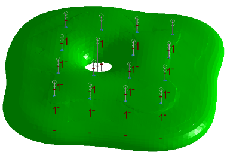
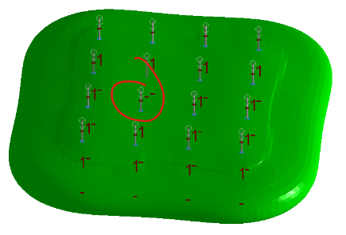

# Create Grade Shells

To access this screen:

  * **Implicit** ribbon **> > Surface >> Grade Shells**.
  * View the **[Find Command](<../COMMON/findcommand.md>)** screen, select **create-grade-shells** and click **Run**.
  * Enter "create-grade-shells" into the [Command Line](<../COMMON/Command_Toolbar.md>) and press <ENTER>.

**Create Grade Shells** is a tool for interpolating grade iso-shells of a set value from input data. These are soft boundary shells representing a predicted boundary at the modelled value. This command uses the [create-grade-shells](<../command_help/create-grade-shells.md>) command to (typically) create grade shells representing volumes above a nominated cut-off grade. It can be used to model volumes around any numeric input, however.

Note: The command is also accessible [using an automation script](<Implicit_Modelling_Command_Automation.md>).

The input to this command is a loaded desurveyed drillholes file, containing at least one numeric attribute. 

The volume is generated according to various input parameters that allow you to express; 

  * your confidence in individual sample records and/or the sample database generally.
  * a directional data trend, either globally (using an aligned ellipsoid) or as multiple ellipsoid definitions for structures with complex anisotropy.
  * the density of your output wireframe.

### Implicit Modelling Metadata

Implicit modelling tools store metadata to allow previous settings to be reinstated automatically, and for downstream commands to understand the 'legacy' of input data. See [Implicit Modelling Metadata](<../COMMON/Implicit-Modelling-Metadata.md>).

## Categorical vs. Grade Shell Command

[create-categorical-surfaces](<../command_help/create-categorical-surfaces.md>) differs from [create-grade-shells](<../command_help/create-grade-shells.md>) in that the categorical version of the command models a distinct key field value. 

The continuous version of the command models grade shells denoting a specific cut-off grade. 

The user interface for both commands is similar in other respects.

Both commands differ from vein structure modelling in that vein modelling produces a continuous surface representing one HW and one FW surface per structure. Categorical and continuous structural modelling commands produce shells that envelop positive intervals (one or more per sample). This approach is more suitable for modelling non-linear or bifurcating domains.

## Uncertainty - Sample Confidence

For more information on managing data uncertainty, see [Snapping to Contacts](<Implicit_Surface_From_Drillholes_Snap.md>)

Activity steps:

A typical approach for using this command is:

  1. Load a desurveyed drillholes file.
  2. Launch the command.
  3. Define the scope of your modelling; select the loaded Drillholes object and the Column containing grade values to be modelled.
  4. Define the cut-off gradeValue to be modelled.
  5. Choose how absent data values affect the generated grade shell, using **Ignore absents** :
     * If **checked** , absent grade values are treated as if they aren't there, so won't affect the generation of grade shells representing a cutoff.
     * If **unchecked** , absent grade values are considered to be zero grade, influencing the shape of the grade shell.

For example, in the following image, **Ignore absents** is unchecked, and one of the holes contains only absent data as a result of a sample desurveying error:

For the same scenario, if **Ignore absents** is checked, the drillhole is ignored entirely, and the surface is interpolated throughout the absent data:

  6. Specify your confidence in the accuracy of input sample data and associated contact points using **Uncertainty**. This can be set at a **Default** (meaning global) level, or read from a data attribute in the loaded **Drillholes** object. See [Data Uncertainty](<../COMMON/Implicit_Modelling_4_Uncertainty.md>).

  7. Data can be modelled only if it is **Selected** and/or **Visible** , using a combination of settings. 

     * If **Selected** is **checked** :

       * If no data is selected, everything is modelled.

       * If data is selected, only selected holes are modelled.

If selected is unchecked, all data is modelled regardless of data selection.

     * If Visible is **checked** , only drillhole data that is visible is used for modelling, otherwise data is modelled even if it is filtered from the view.

  8. You can add points to your data to encourage a particular shape or trend. Such points are added onto the current 3D section. You can edit the current section using **Section Controls**.

     * Interactively position the plane used to generate surface data by enabling the **Section Editor** control. See [3D Section Widgets](<../COMMON/Section_Widgets.md>).
     * Alternatively, modify the section using one of the controls in this section. These are replicated on the **3D View** ribbon and **[Navigation toolbar](<../COMMON/Navigation_Toolbar.md>)**.
     * Automatically align the view to be directly at the 'best-fit' plane through the data by enabling **Auto look**. This doesn't affect the definition of a modelling section - only the view is adjusted.
     * **Align** the view with a custom section.
     * **Reset** the modelling section to the automatically-calculated best-fit plane.
  9. To define a trend to impart a guiding direction or directions throughout your structure:

     * Choose **Default from holes** to let Studio calculate the most appropriate trend for your data, using a consistent directional trend throughout your data. In effect, this makes use of a single, global **[search ellipsoid](<Ellipsoids_Overview.md>)** to interpolate a surface between contact points.
     * Choose **Custom** to define one or more ellipsoids that will be used to govern uni- or multi-directional trends throughout your data.
       1. Choose an existing ellipsoids data object, if one exists (if not, one will be created for you).
       2. If appropriate, select **Pick Drillhole Samples** and select one or more drillholes that will be used to automatically create an ellipsoid. This is usually a set of holes within which a single trend is obvious. Once selected, choose **Create Ellipsoid from Selected Data**.

The generated ellipsoid displays at the centre of the selected drillhole set.

       3. To manually position and define the axis dimensions of an ellipsoid, choose **Create Ellipsoid**. See [New Ellipsoid](<../COMMON/New_Ellipsoid.md>).
       4. Edit any previously-created ellipsoid by clicking **Edit Ellipsoid**. See [Edit Ellipsoid](<../COMMON/Edit_Ellipsoid.md>).
     * Ellipsoids are interpolated throughout the sample data in a uniform 3D grid, gradually morphing between defined ellipsoid shapes.

**Preview** this grid by first selecting how detailed your preview will be (for example, 3 x 3 x 3 shows a grid of 27 ellipsoids, each in their interpolated shapes and orientations). Then, click **View** to render a temporary preview of ellipsoids on the screen, for example:

From here, you can see how each part of the data is likely to connect to neighbouring parts.

  10. Implicit surface modelling is an interpolative process where surface data is fitted (as closely as trends and other modelling parameters permit) to contact points. 

Enabled by default, the **Snap to contacts** section can enforce a secondary deformation of the generated surface to enforce a closer relationship between the output surface and its contact points. 

For more information, see [Snapping to Contacts](<Implicit_Surface_From_Drillholes_Snap.md>).

  11. Define **Surface Generation Controls** :
     * The categorical modelling command needs to subdivide positive samples into smaller units to ensure ellipsoid centroids are positioned at suitable positions within the data set. You can choose to **Subdivide** automatically (**Auto**) or by choosing your own **Fixed** subdivision distance, where smaller values tend towards increased processing, but potentially a more representative result.
  12. Define the Resolution of your output wireframe using the drop-down list (high values = small triangles = longer processing). For more precise control, select `<custom>` and enter your own value.
  13. Choose how far beyond the hull of sample data categorical models can extend. You do this by entering a Percentage extra value, where 50% will allow models to extend beyond the cuboid hull of loaded sample data by up to 50% more, for example. As a worked example, if the bounding cuboid of data is 10 x 20 x 30 meters, the permissible 'space' for categorical modelling is within a cuboid 15 x 30 x 45 meters.
  14. Decide if you want to constrain values that terminate at the collar (**First**), end-of-hole (_Last_), **Both** ends or **Neither** , using the Constrain ends drop-down list.

  15. Define an **Output** **Surface** name. This is the name of the object to be created. If an object of the same name exists, a unique numeric suffix is applied.
  16. Choose to either generate a new data object, or update an existing one:
     * Click New Surface to create a new output wireframe object with default formatting.
     * Click **Update surface** to replace a target object (of the same **Surface** name) with new data. 
       * If **Retain output formatting** is **checked** , any previous overlay customizations to the existing model will be retained. That is, only the shape of the target object can change, not its visual formatting.
       * If **Retain output formatting** is **unchecked** , default wireframe model formatting is reapplied to the target object and any prior overlay customizations are lost. This cannot be undone.
  17. Review your output volume.

**Tip** : Restore the settings from the last modelling run using **Reset**.