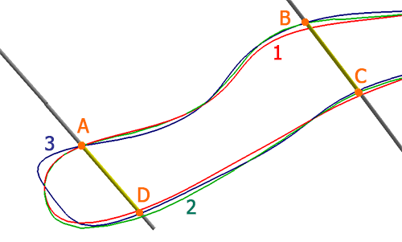

# Snapping to Contacts

The Create Categorical Surfaces and [Create Grade Shells](<Implicit_Surface_From_Drillholes_Continuous.md>) tasks model surface shapes in relation to input sample parameters, removing the need to manually interpret cross-sections of data and construct constraining surfaces for grade estimation later on.

These 'contact positions', during the first pass of the surface calculator, will influence surface shape and orientation bug, even with zero uncertainty value specified, the resulting surface won't necessarily adhere tightly to these contacts due to the influence of other contacts in the surround area. 

Optionally (although performed by default), once a surface has been created, a further deformation of the output data can be performed to adhere to target positions on the input drillhole data. This 'contact snapping' phase reviews the relationship between the generated surface(s) and the known contact positions of the input samples for the attribute being modelled, and dynamically deforms the surface to assume a closer fit with the target positions. Again, there may be situations where absolute adherence is impossible, even after secondary deformation.

So, by default, the **Enable snap to contacts** option is enabled when modelling with either the categorical or grade shell modelling functions. You can then choose to either deform surface data to all contact positions (the default) or choose a subset of contacts from those displayed, disabling the ones where rigid contact position adherence isn't required or desirable (say, to allow a surface to deform only in a particular area).

**Note** : Snapping to contacts is performed after the initial volume is generated, and works by deforming the mesh so that points within a tolerance distance of a contact position are moved towards that position, affecting neighbouring mesh points to maintain the integrity of the output shape. This is a very intensive operation and, where there are many contact positions to consider (say, the input drillhole file is large, with lots of positive intervals), this can extend processing time significantly.

## How does contact snapping work?

Consider a latticework of patches throughout the hull of the data to be modelled (the 'positive points'), subdivided to a particular size. The surface within each patch is checked to see how close it is to contact points and, if a deformation is possible (and meets other contact snapping parameters) it is deformed, whilst attempting to maintain the overall surface shape.

An example may help here. The following image shows a cross section between three categorically-modelled volumes, all modelling the same attribute, with the same uncertainty and other parameters. The only difference between the three cross-sectional strings is the application (or not) of contact snapping after the initial surface was calculated.

In the above example, the **red** outline is the cross section of the modelling volume where contact snapping is disabled (i.e. not performed). Contact A has close adherence, but B, C and D aren't precisely coincident with the surface. The **blue** outline (3) is where contact snapping is enabled for all contacts in the set. Note the closer alignment at all four contact points. The **green** outline (2) is produced when contact snapping is enabled, but only for points A, B and C.

How extensive this post-processing deformation step, if enabled, is will depend on other parameters. 

Activity steps:

  1. Launch the [Create Categorical Surfaces](<Implicit_Surface_From_Drillholes_Categorical.md>) task.

  2. Define the input **Drillholes** , **Column** and **Value** to be modelled.

  3. Define your modelling parameters. See [Create Categorical Surfaces](<Implicit_Surface_From_Drillholes_Categorical.md>) for more information.

  4. Expand the **Snap to Contacts** command group.

  5. Choose if contact snapping is required:

     * If **Enable snap to contacts** is **checked** , surface deformation will occur after the initial surface is created.

     * If **Enable snap to contacts** is **unchecked** , no mesh deformation is performed.

  6. If you are snapping to contacts, choose which contact positions will be used for snapping:

     * If snapping to all contacts, go to the next step.

     * To include or exclude a contact from contact snapping:

       1. Select **Pick contacts**.

       2. In the **3D** view, select a visible contact (intercept) position.

       3. If the contact is enabled, **Use contact** is **checked** and it will be considered as a snapping point when deforming the surface after creation. **Uncheck** to disable this contact. Unused contacts are shown as a hollow circle symbol.

       4. If **Use contact** is unchecked, it will not be considered during surface deformation. **Check** to enable this contact. Used contacts are shown with a filled circle symbol.

  7. Choose how 'aggressive' contact snapping will be by setting the **Patch size** :

     * To automatically decide the most appropriate patch size for your data, choose the **Dynamic** option and use the drop down menu to pick one of the following options:

       * **High** : Use a relatively large patch size (compared to the **Medium** setting) when deforming the initial surface, where deformations affect a larger surface area

       * **Medium** : Based on the density and arrangement of positive contact points, surface patch size is calculated to produce a realistic natureform surface shape. If deformations are too 'bumpy' or localized, try the **Low** setting or, if a more erratic surface is expected, try the **High** setting.

       * **Low** : A relatively small surface patch size will be calculated (compared to the **Medium** setting), which will tend to produce more localized deformations when snapping. This is better suited to smaller data extents.

     * Alternatively, choose a **Fixed** patch size and enter a value in world measurement units. Smaller values will tend to produce more localized deformations and larger values will produce a more general deformation, potentially impacting the contact adherence in surrounding areas.

  8. You can set a maximum distance over which snapping will occur using the **Maximum snap distance** setting. This distance (again, in world measurement units) will be the greatest 2D limit over which a surface vertex can be deformed. Surface data that is over this distance away from a neighbouring contact point will not be deformed. If deformation is adversely affecting the resulting shape, reducing this value can ensure a more realistic output shape.

**Tip** : The number of points located beyond the maximum snapping distance is reported in the Output window after surface generation. If there are an unexpectedly high number of points (meaning several points may not intercept the generated wireframe, you may consider increasing the distance to include them.

Related topics and activities

  * [Create Categorical Surfaces](<Implicit_Surface_From_Drillholes_Categorical.md>)

  * [Create Grade Shells](<Implicit_Surface_From_Drillholes_Continuous.md>)

  * [Data Uncertainty](<../COMMON/Implicit_Modelling_4_Uncertainty.md>)