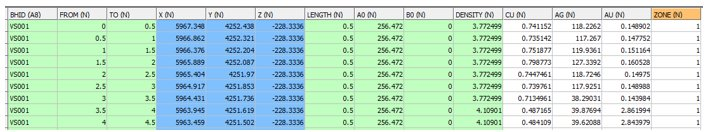
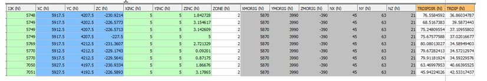
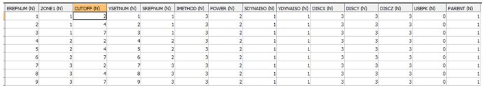
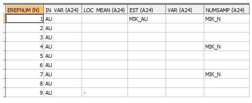
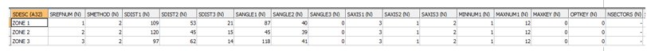
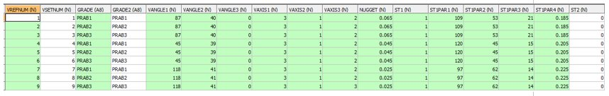
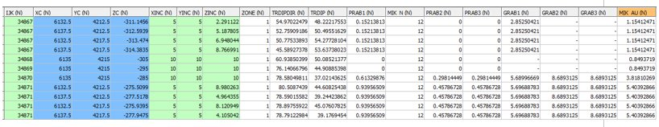
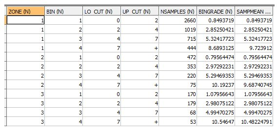
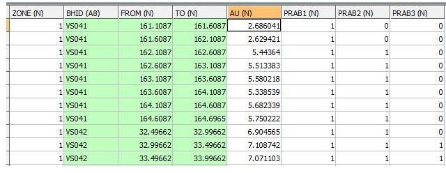
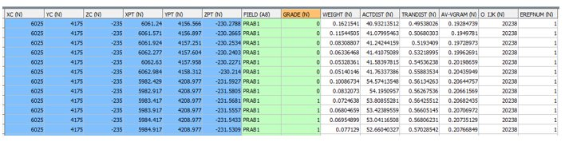

# MIKEST Process Example

To access MIKEST: 

  * **Estimate** ribbon **> > Non-Linear >> MIK**.

  * Enter "MIKEST" into the [Command Line](<../COMMON/Command_Toolbar.md>) and press <ENTER>.
  * Display the **[Find Command](<../COMMON/findcommand.md>)** screen, locate **MIKEST** and click **Run**.

The MIKEST process uses the Indicator Estimation (IE) method to estimate grades into a block model using the cumulative distribution function (CDF) of indicator transformed sample grades. It is similar to the [INDEST](<../Process_Help_XML/indest.md>) process except it is based on the Advanced Estimation [COKRIG](<../Process_Help_XML/cokrig.md>) process rather than the [ESTIMA](<../Process_Help_XML/estima.md>) process. 

Note: The main advantage of **MIKEST** over **INDEST** is processing speed.

This topic describes a worked example of using dynamic anisotropy within the **MIKEST** process.

## MIKEST Example

This example is designed to show the files, fields and parameters that are used by the **MIKEST** process when using the **Dynamic Anisotropy** option. In order to keep file listings small only 3 cutoffs have been used whereas in practice around 12 cutoffs would be more usual. The example uses 1 zone control fields, ZONE, with 3 zone values, 1, 2 and 3. 

The files used in this example are based on files available in this folder, installed with your application:

  * C:\Database\DMTutorials\Data\VBUG\Datamine

The above folder includes macro file `DYNAM_ANISO_UG_TUTORIAL.MAC`. 

  * Macro M1 uses digitised plan and section strings to create `MODEL3` which includes TRDIPDIR and TRDIP fields. 
  * Alternatively, macro M2 uses wireframe data to create the `MODEL3 `file. 

Either of these `MODEL3 `files can be used instead of `EG1_MODEL1` in the macro shown in the Files, Fields and Parameters section below. 

**SAMPLES** file `_VSLDHZ.DM` in the above tutorials folder can be used instead of `EG1_HOLES1.DM`. The results will be similar to (but not the same as) the example files shown below.  

### Files, Fields and Parameters
    
    
    !MIKEST &SAMPLES(EG1_HOLES1),&PROTO(EG1_MODEL1),  
  
---  
      
    
    &EPAR(EG1_EPAR1),  
      
    
    &FIELDS(EG1_FPAR1),  
      
    
    &SPAR(EG1_SPAR1),  
      
    
    &VMODEL(EG1_VPAR1),  
      
    
    &OUTMODEL(EG1_OUTMODEL1),  
      
    
    &AVGRADES(EG1_AVGRADES),  
      
    
    &INDICATE(EG1_INDICATE),  
      
    
    &SAMPOUT(EG1_SAMPOUT),  
      
    
    *XPT(X), *YPT(Y),  *ZPT(Z),  *ZONE1_F(ZONE),  
      
    
    @PGFIELDS=1, @ORDER=3,  @GRMETHOD=3,  
      
    
    @DA_AXIS1=3.0, @DA_AXIS2=1.0,  @DA_AXIS3=2.0,  
      
    
    *SANGL1_F(TRDIPDIR), *SANGL2_F(TRDIP),  
      
    
    *VANGL1_F(TRDIPDIR), *VANGL2_F(TRDIP)  
  
#### INPUT: SAMPLES FILE - EG1_HOLES1 - 6946 records

;>)

The field **ZONE** in the Samples file is used for zone control. The same field name is required in the model **PROTO** file. The field name **ZONE** is defined using the field assignment * **ZONE1_F(ZONE)** in the Files, Fields and Parameters section above.

#### INPUT: PROTO FILE - EG1_MODEL1 \- 15066 records

;>)

  * The parent cell size is 10 x 10 x 10
  * The ZONE field is required for zone control
  * TRDIPDIR and TRDIP fields are required for Dynamic Anisotropy

#### INPUT: ESTIMATION PARAMETER FILE - EG1_EPAR1 \- 9 records

;>)

  * The first zone control field in this file must be named **ZONE1**. It must be the same type (numeric or alpha) as the field defined by the symbolic field name * **ZONE1_F**() in the Files, Fields, Parameters section above. Currently only numeric zone fields are allowed.
  * The **CUTOFF** field defines the cutoff grade for indicator calculation. Each zone must have the same number of **CUTOFFs**. However the **CUTOFF** values may differ between zones,
  * The **SDYNAISO** field defines whether the **Dynamic Anisotropy** option is to be used for defining the search volume rotation angles. 0=No. 1=Yes.
  * The **VDYNAISO** field defines whether the **Dynamic Anisotropy** option is to be used for defining the variogram model rotation angles. 0=No. 1=Yes.
  * In this example the **Search Volume Reference Number** (**SREFNUM**) is the same for all **CUTOFFs** in the same zone. This is compulsory if the **Dynamic Anisotropy** option has been selected as only one set of dynamic search angles are stored in the input model file. It is also recommended practice if the **Dynamic Anisotropy** option is not selected as it helps to keep the order relation correction to a minimum. 

#### INPUT: FIELDS PARAMETER FILE \- EG1_FPAR1 - 9 records

;>)

  * The Estimation Parameter Reference Numbers (**EREFNUM**) links the field data with the **EREFNUMs** in the Estimation Parameter file.
  * The **IN_VAR** field defines the grade field for which the MIK estimate is to be calculated. It must be the same for each **EREFNUM**.
  * The **EST** field defines the name of the field in the output model which is to be created to define the MIK estimate. Only the name in the first record of the file is used. **EST** names in other records are ignored.
  * The full range of optional output fields in a Fields Parameter file is available. However in this example only the **NUMSAMP** field has been defined to record the number of samples selected for each estimate. As the same search volume is used for all estimates within a zone it is only necessary to define it once for each zone.

#### INPUT: SEARCH VOLUME PARAMETER FILE - EG1_SPAR1 - 3 records

  * As the Dynamic Anisotropy option is being used in this example only 3 search volumes are defined, one for each zone. The values in the **SANGLE**[1,2,3] fields in this file will be ignored as the dynamic search angles are defined by the * **SANGL**[1,2,3]_F() symbolic fields shown in the Files, Fields, Parameters section. These values will be read from the input PROTO model. Also the values for the **SAXIS**[1,2,3] fields shown above will be ignored as they are defined by parameters @**DA_AXIS**[1,2,3] instead. 
  * The other fields in this file are the standard search volume parameter fields.

#### INPUT: VARIOGRAM MODEL PARAMETER FILE - EG1_VPAR1 - 9 records

;>)

  * Even though the first three variogram models are identical (same zone) they must each have a separate record as the **GRADE** and **GRADE2** field names change. Both the **GRADE** and **GRADE2** fields must be named **PRAB1** for the first cutoff, **PRAB2** for the second cutoff and **PRAB3** for the third. **PRABi** represents the PRobability ABove cutoff i which is the name of the indicator field being estimated.
  * As for the search volume parameter file the fields **VANGLE**[1,2,3] are ignored as the dynamic variogram model angles are defined by the * **VANGLE**[1,2,3]_F() symbolic fields. The variogram rotation axes are defined by the @**DA_AXIS**[1,2,3] parameter values.
  * This example uses a single structure spherical model. Multiple structures can be used as for [COKRIG](<../Process_Help_XML/cokrig.md>).

#### OUTPUT: MODEL FILE - EG1_OUTMODEL1 - 15066 records

;>)

  * The output model is a copy of the input **PROTO** model plus the last 8 fields shown above. The MIK estimate is the final field MIK_AU. As parent cell estimation has been selected all subcells within the same parent cell have the same values. 
  * Parameter @**PGFIELDS** was set to 1 so all the intermediate probability **PRAB**[1,2,3] fields and grade **GRAB**[1,2,3] fields are shown for each indicator. The first 4 subcells (IJK=34867) show that 15.21% [PRAB1] of the cells are estimated to be above cutoff 1 (2 g/t AU) but that 0% is above cutoff 2 (4 g/t). The MIK estimated grade is 1.154 g/t.
  * If parameter @**PGFIELDS** were set to zero then the **PRAB**[1,2,3] and GRAB[1,2,3] fields would not be included in the **OUTMODEL** file.

####  OUTPUT: AVGRADE FILE \- EG1_AVGRADES - 12 records

;>)

The samples are divided into 4 bins for each ZONE corresponding to the 3 cutoff grades with the 4th bin being above the top cutoff. The sample statistics are:

  * **NSAMPLES** the number of samples in each bin
  * **BINGRADE** the average grade of the samples within each bin
  * **SAMPMEAN** the grade used for calculation of the MIK estimate. In this example the parameter @**GRMETHOD** is set to 3. Therefore for the first 3 bins **SAMPMEAN** is equal to **BINGRADE** but for the top bin (bin 4) **SAMPMEAN** is equal to the median of the samples in the bin. 

A description of all 4 values of @GRMETHOD is given in the PARAMETERS table above.

#### OUTPUT: INDICATE FILE - EG1_INDICATE - 6428 records

;>)

  * The INDICATE file is a copy of the SAMPLES files but with a PRAB[1,2,3] value for each sample. The exception is that samples with an absent data ZONE or AU are not included. In this example 518 samples are excluded. The above table shows a subset of fields and records.
  * The PRAB values depend on whether the sample is below or equal to cutoff (0) or above each cutoff (1). 

#### OUTPUT: SAMPOUT FILE - EG1_SAMPOUT - 213480 records

;>)

  * The **SAMPOUT** file includes all samples used for each **PRAB** and each parent cell. The above subset is for the parent cell with an IJK value of 20238 (O_IJK) located at **XC** , **YC** , **ZC**. The **FIELD** name is PRAB1 so the **GRADE** field shows whether each sample is below (0) or above (1) the first AU cutoff (2 g/t). Other fields include:
    * **WEIGHT** \- the kriged weight
    * **ACTDIST** the actual (Euclidean) distance of the sample from the cell centre
    * **TRANDIST** the transformed distance of the sample from the cell centre based on the search ellipsoid
    * **AV-VGRAM** the average variogram value for the vectors connecting the sample to each discretisation point within the parent cell.
    * **EREFNUM** the estimation reference number as defined in the Estimation Parameter file.

Warning: The **SAMPOUT** file can include a large number of records. Do not select a **SAMPOUT** file unless you want to use it!

Related topics and activities

  * [MIKEST Process](<../Process_Help_XML/mikest.md>)