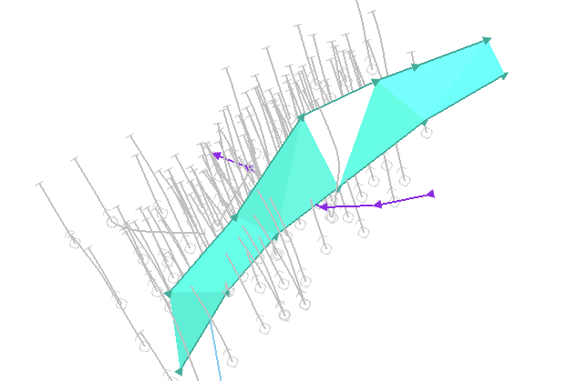
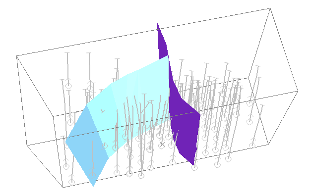
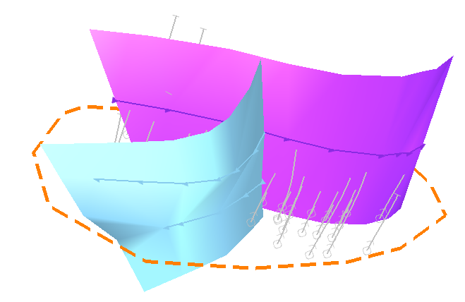

# Define Fault Boundaries

The **[Model Faults](<ModelFaults.md>)** tool automatically generates fault wireframes from loaded fault _trace_ data.

A fault trace is a string that represents the profile of a fault at a landmark position. Faults can be constructed using one or more traces. Higher trace numbers tend to produce more convoluted wireframe fault data. Digitize fault traces directly into an active **3D** window, and modify existing traces by extension and/or reversal.

The tool utilizes loaded trace data to form wireframe sheets through extrusion. This extrusion can be controlled either as a general value for all fault traces, or individually per fault trace, or a combination whereby individual fault trace dip and dip direction can set, whilst falling back to the default fault-level orientation if not specified.

Once fault data has been generated, edits to precursor fault traces can either be performed as a batch, then applied to regenerate all affected fault wireframe data, or wireframes will update in real time as traces are edited. 

Commonly, you will want to constrain the extents of your faults to a particular area of interest. For example, if generating fault planes from which to produce faulted output in the **[Create Vein Surfaces](<../COMMON/Create_Vein_Surface.md>)** function, it may make sense to constrain the fault sheets to fall within the confines of a structural model prototype. You may also want to constrain your fault data to a specific perimeter, and in this case, it may be useful to specify how much to project a fault upwards or downwards to ensure a clean fault intersection with the hull implicitly modelled sample data.

The **Model Faults** task lets you choose one of the following boundary options:

  * **None** \- In this situation, at least two fault traces must exist before a fault can be calculated. With no boundary to constrain any data projection, a single fault trace has insufficient information to describe the fault wireframe. For example, in the image below, the unconstrained fault has been modelled between two fault traces; the fault terminates on the terminal vertices of each trace (no other faults exist):

  * **Proto** : The 3D cuboid hull of a prototype model can constrain fault data. In this case, even a single fault trace can be projected upwards or downwards to the extents of the prototype, and also in the trace direction (either from the start or end). You can also project data beyond the prototype hull using the **Extension distance** option (which must be greater than zero). This may be useful, say, to ensure a clean intersection between the model and fault planes when zoning a block model.

  * **Custom** : Define a boundary string on the currently active section and set an upper and lower fault height extension limit. A custom boundary can be any closed perimeter string (you can even edit the string afterwards to trigger an automatic update of existing fault data):

To use a prototype model to constrain fault generation:

  1. Load a block model or model prototype to be used to constrain fault generation.

  2. Display the **Model Faults** task.

  3. Define or create a **Fault traces** object.

  4. If required, define **Field Mappings**. See [Map Trace Fields](<ModelFaultsTraceFieldsMappings.md>).

  5. Enable the **Proto** boundary option.

  6. Select the loaded model or model prototype from the drop-down list.

  7. To allow faults to extend beyond the model prototype by a set distance, enter an **Extension distance**. This must be a positive numeric value.

  8. Define and edit faults and fault traces. See [Edit Fault Traces](<ModelFaults-Edit-Fault-Traces.md>).

  9. Define fault relationships if required. See [Manage Fault Dependencies](<ModelFaults-Manage-Fault-Dependencies.md>).

  10. If **Automatically update** (Output command group) is **checked** , save your Fault surface object for use in other tasks. If **unchecked** , click **Recreate** to update the current faults object, then save it.

To use an open string to constrain fault generation:

  1. Load a block model or model prototype to be used to constrain fault generation.

  2. Display the **Model Faults** task.

  3. Define or create a **Fault traces** object.

  4. If required, define **Field Mappings**. See [Map Trace Fields](<ModelFaultsTraceFieldsMappings.md>).

  5. Enable the **Custom** boundary option.

  6. If one is loaded, select the loaded perimeter string object from the drop-down list.

     * Alternatively, click **Pick boundary string** and choose any loaded and displayed perimeter string in a **3D** window.

     * Alternatively, click **Draw a new boundary string** and digitize a closed string in the **3D** window. 

  7. To define how far above the uppermost or below the lowermost fault that wireframe data is generated, enter a **Min z** and **Max z** value. This can be a positive or negative numeric value.

**Tip** : Interactively increase or decrease either the **Min Z** or **Max Z** values by clicking into the field and dragging the mouse up or down. Release the mouse button to update the 3D fault data.

  8. Define and edit faults and fault traces. See [Edit Fault Traces](<ModelFaults-Edit-Fault-Traces.md>).

  9. Define fault relationships if required. See [Manage Fault Dependencies](<ModelFaults-Manage-Fault-Dependencies.md>).

  10. If **Automatically update** (**Output** command group) is **checked** , save your Fault surface object for use in other tasks. If **unchecked** , click **Recreate** to update the current faults object, then save it.

Related topics and activities

  * [Model Faults](<ModelFaults.md>)

  * [Prepare Fault Data](<ModelFaults-Prepare-Fault-Data.md>)

  * [Edit Fault Traces](<ModelFaults-Edit-Fault-Traces.md>)

  * [Manage Fault Dependencies](<ModelFaults-Manage-Fault-Dependencies.md>)

  * [Map Trace Fields](<ModelFaultsTraceFieldsMappings.md>)