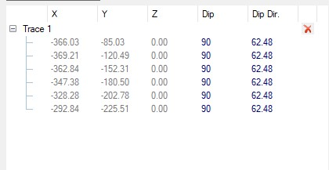
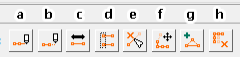

# Edit Fault Traces

The **[Model Faults](<ModelFaults.md>)** tool automatically generates fault wireframes from loaded fault _trace_ data.

A fault trace is a string that represents the profile of a fault at a landmark position. Faults can be constructed using one or more traces. Higher trace numbers tend to produce more convoluted wireframe fault data. Digitize fault traces directly into an active **3D** window, and modify existing traces by extension and/or reversal.

The tool utilizes loaded trace data to form wireframe sheets through extrusion. This extrusion can be controlled either as a general value for all fault traces, or individually per fault trace, or a combination whereby individual fault trace dip and dip direction can set, whilst falling back to the default fault-level orientation if not specified.

Once fault data has been generated, edits to precursor fault traces can either be performed as a batch, then applied to regenerate all affected fault wireframe data, or wireframes will update in real time as traces are edited. 

Fault data is generated automatically, on selection of a **Fault traces** object. Fault data can be added or removed at any time, as can trace data.

Any fault, empty or otherwise, can be expanded with additional traces, or simplified by removing traces. 

Traces appear in the **Traces** table when a fault is selected above, in the **Faults** table. Once a trace has been added to a fault, it will appear as a series of coordinate records, each representing a vertex of the trace and its current orientation, e.g.:

You can also draw a trace directly into a 3D window, updating the current traces object and automatically associating the trace with the selected fault. 

Each trace has a direction. Traces will be listed from the start of the trace to the end by default (the arrows in the 3D window describe the direction of each trace). You can also reverse a trace if you need to.

Fault wireframes can either be generated after a batch of traces have been added, or generated as each trace is added, i.e. the wireframe fault system will update dynamically as the underlying fault traces are added.

To edit the traces of an existing faults object: 

  1. In a **3D** window, select string data that represents one or more fault traces that will share the same fault ID. This can be string data from any or multiple string objects.

     * Alternatively (or in addition), use **Draw trace** to digitize a trace in a **3D** window.

  2. Once a trace has been selected or digitized, the trace table displays all coordinate records for each vertex of the trace along with corresponding **Dip** and **DipDirn** values.

  3. Edit your traces using the toolset provided:

     1. Digitize a **new** trace in any **3D** window.

     2. **Extend** an existing trace either at the start or end.

     3. **Reverse** the direction of a trace.

     4. **Connect** two traces together to form a single trace.

     5. **Break** a trace into two or more independent traces.

     6. **Move** trace points in 3D. If fault data is displayed, it will update dynamically if **Automatically update** is checked.

     7. **Add** one or more points to a trace to increase its complexity or encourage a specific extension shape.

     8. **Remove** points from a trace, simplifying it.

  4. Review the dip (**Dip**) and dip direction (**Dip Dir.**) values for each vertex of each trace, and update the **Traces** table, if required, to use a custom dip or dip direction. 

**Tip** : Use any string editing tool to adjust a trace; just select the fault trace to be modified, then launch an editing command (e.g. move-points-mode). Both trace and corresponding fault wireframe will be adjusted in real time.

To delete a trace from a faults object:

  1. Select the fault in the **Faults** table containing the trace data to be removed.

Traces associated with the selected fault display in the **Traces** table below.

  2. Select the trace to be removed by selecting it in the **Traces** table.

The trace will be highlighted in the table and the **3D** window.

  3. Select the red "**X** " to the right of the trace description in the table.

The trace is removed from the table and the **3D** view. If fault data is set to automatically update, all associated fault wireframe data will also be removed from the view.

**Note** : this doesn't delete the original string data, which can be used to reinstate the string, if required.