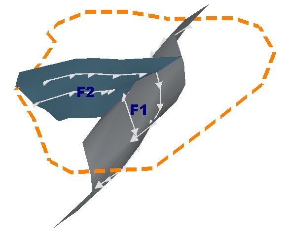
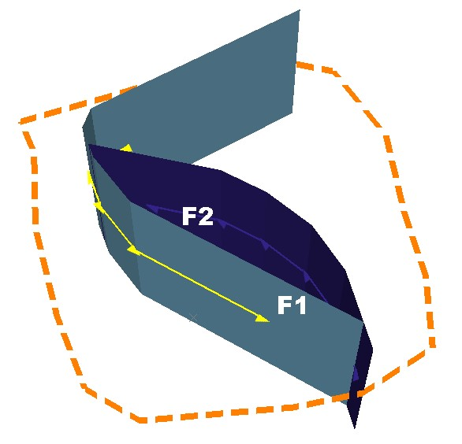

# Manage Fault Dependencies

The **[Model Faults](<ModelFaults.md>)** tool automatically generates fault wireframes from loaded fault _trace_ data.

A fault trace is a string that represents the profile of a fault at a landmark position. Faults can be constructed using one or more traces. Higher trace numbers tend to produce more convoluted wireframe fault data. Digitize fault traces directly into an active **3D** window, and modify existing traces by extension and/or reversal.

The tool utilizes loaded trace data to form wireframe sheets through extrusion. This extrusion can be controlled either as a general value for all fault traces, or individually per fault trace, or a combination whereby individual fault trace dip and dip direction can set, whilst falling back to the default fault-level orientation if not specified.

Once fault data has been generated, edits to precursor fault traces can either be performed as a batch, then applied to regenerate all affected fault wireframe data, or wireframes will update in real time as traces are edited. 

Faults will terminate at some point. You can control how this happens in your model. For faults that relate to each other, such as one that terminates on another, you can define which fault to stop or start on, or both (if a fault bridges two others).

How a fault extends beyond its trace is also configurable. For example, it may be necessary to extend all faults beyond the current boundary to ensure they fully intersect other data, such as a resource block model, or implicitly modelled structural wireframe.

#### Fault and Boundary Data Relationships

Fault systems can be complex, including multiple dependent structures. Thrust and shear events from one fault domain can affect other domains. Modelling these interrelationships is achieved by defining **Starts on** and **Stops on** parameters.

Faults can either be fully constrained to the length and shape of the underlying fault traces or can be projected to a boundary (as defined by either a custom boundary string or a block model prototype hull). The start and end of fault traces are configured independently and fault data can be defined by two or more dependent faults, and a fault can even interact with itself (say, to represent a sigmoidal result).

You can also extend faults beyond a nominated boundary by a set distance. This could be useful, say, to enforce a full and clean intersection of fault data and a modelled vein, categorical/grade model or contact surface.

For example, in the image below, fault F2 **Starts on** the boundary (as indicated by the orange custom boundary string). It **Stops on** fault F1. The fault traces for each fault are drawn with direction indicators:

As another example, the fault system below represents two faults that represent a sigmoidal arrangement. Fault F1 **Stops on** Fault F2, and Fault F2 Stops on Fault F1. Both faults extend to a custom boundary:

To configure the boundary behaviour of fault data:

  1. In the **Boundary** command group, choose which boundary type to use:
     * Choose _None_ if a boundary is unimportant (say, fault traces will be used to control fault shapes and no extension to a boundary is needed).
     * Choose _Proto_ to select a loaded block model or model prototype. The cuboid outer hull of the selected model will be used to constrain fault extensions if they have an _< extend to boundary>_ relationship applied (at either the start or end position of the trace - see below).
       1. Select a loaded model object using the **Proto** menu.
       2. If required, choose an **Extension distance**. Faults will extend the specified distance beyond the cuboid hull. Useful for ensuring clean intersections with faults and other data (e.g. a vein model).
     * Choose _Custom_ to constrain fault extensions to a hull formed by the extrusion of string data.
       * If a loaded string object already exists with the expected boundary data, select it using the drop-down listed. 
       * To pick any loaded/visible closed string to act as a boundary, click **Pick boundary string** and select the string in any 3D view.
       * To digitize a new boundary string in the 3D view (or add more data to the selected boundary string) click **Draw a new boundary string** and digitize a closed string in any 3D view.
  2. Choose the extent to which fault data will be extruded upwards or downwards from the first and last trace strings of a fault.
     * Enter a **Min z** distance to set a lower limit for extrusion to lower elevations. A value of zero will mean no extrusion is applied (and that the lowest trace string represents the downwards limit.
     * Enter a **Max z** distance to set an upper limit for fault trace extrusion.

To configure fault-fault and fault-boundary relationships in your fault model:

  1. Select the fault to be managed by selecting it in the table.

The **Traces** table updates to show trace information for the selected fault. Ensure the fault trace(s) of the selected fault have the expected direction. This is important to ensure fault extension is applied correctly in the next steps. See [Edit Fault Traces](<ModelFaults-Edit-Fault-Traces.md>).

  2. Choose how fault data is updated when changes are made to the fault relationships:

     * To make all changes and then update the existing fault data as a batch, uncheck **Automatically update** (**Output** command group).

     * To update fault data instantly as fault relationship and extension edits are made, check **Automatically update**.

  3. In the **Extents** command group, choose where you want your fault wireframe to start using the **Starts on** menu:

     * Choose _< None>_ to generate fault data shaped solely by the associated traces. Faults will not extend beyond the initial vertex of the trace data. 

     * Choose _< Boundary>_ to extend the start of the trace to the selected **Boundary** , if one is defined.

     * Choose a fault reference to extend the start of the selected trace, if possible so that it intersects with the selected fault wireframe. If no intersection is possible (say, the fault traces are diverging or parallel), extension won't be applied and the message "Extension to fault failed" displays.

**Note** : You cannot add a fault trace to a boundary string data object.