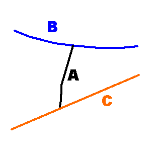

# Prepare Fault Data

The **[Model Faults](<ModelFaults.md>)** tool automatically generates fault wireframes from loaded fault _trace_ data.

A fault trace is a string that represents the profile of a fault at a landmark position. Faults can be constructed using one or more traces. Higher trace numbers tend to produce more convoluted wireframe fault data. Digitize fault traces directly into an active **3D** window, and modify existing traces by extension and/or reversal.

The tool utilizes loaded trace data to form wireframe sheets through extrusion. This extrusion can be controlled either as a general value for all fault traces, or individually per fault trace, or a combination whereby individual fault trace dip and dip direction can set, whilst falling back to the default fault-level orientation if not specified.

Once fault data has been generated, edits to precursor fault traces can either be performed as a batch, then applied to regenerate all affected fault wireframe data, or wireframes will update in real time as traces are edited. 

To prepare string data for fault modelling:

  1. Load or create a strings object representing the _Fault traces_ that will eventually become fault wireframe sheets.

Each fault trace is assigned a unique fault identifier value. By default, a _FaultID_ attribute is added to the **Fault traces** object. A _DIP_ and  _DIPDIRN_ attribute are also added.

  2. To map fault system attributes to other fields already present in the **Fault traces** object, click the **Map Trace Fields** button to display the [Map Trace Fields](<ModelFaultsTraceFieldsMappings.md>) screen. 

For example, if your trace data contains attribute values defining dip and dip direction, you can use them in preference to the system default fault attributes.

  3. At this stage, give your _Fault surface_ an output name at the bottom of the screen. This is the name of the object that will contain your fault wireframe data.

**To create an empty fault container:**

Alternatively, create an empty fault object to be populated with trace data later.

  1. Click Create empty fault.

A fault item is added to the faults table below. This will have a unique FaultID value in the format "F" followed by the next available index number. For example, "F3".

  2. Initially, where no fault traces have been picked, the average dip (**Dip**) and dip direction (**Dip DIrn**) fields for each fault are absent ("-"). 

  3. Choose a _Colour_ to be adopted by your generated fault (your fault trace will also adopt this colour, once selected).

  4. Create as many independent faults as you need. Generally, where a fault surface needs its own dip and dip direction, it should be an independent fault. Also, if you need one fault to terminate on another, you will need to create independent faults to either "start on" and/or "stop on".  
  
For example, consider the following fault arrangement where fault A bridges between faults B and C:  
  

In this situation, 3 distinct fault surfaces are required, each containing a single trace. 

Related Topics and Activities

  * [Model Faults](<ModelFaults.md>)
  * [Map Trace Fields](<ModelFaultsTraceFieldsMappings.md>)
  * [Edit Fault Traces](<ModelFaults-Edit-Fault-Traces.md>)
  * [Manage Fault Dependencies](<ModelFaults-Manage-Fault-Dependencies.md>)